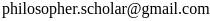

**Hello!** 

This website is the open notebook of Elliott Collin Ploutz. I am a philosopher, computer scientist, [YouTuber](https://www.youtube.com/channel/UCn8hh0YbCJQFZl1GGhNdiKQ/featured?view_as=subscriber) and aspiring influencer. These pages are my public notes on various topics I investigate. If you’re interested in living a good life, optimizing productivity, philosophy, computer science, artificial intelligence, and making sense of this absurd universe we live in, I hope something on this site saves you time and energy.

Please feel free to contact me at:

{:refdef: style="text-align: center;"}
 
{: refdef}

---

{:refdef: style="text-align: center;"}
 
 
 
 
 
 
{: refdef}

{:refdef: style="text-align: center;"}
## Hey! Give me money.
{: refdef}

If you send me money, I promise it will probably go to important uses like funding my projects, charities, or my extravagant lifestyle.

Please consider becoming a patron on [Patreon](https://www.patreon.com/philosopherscholar).

<a href="https://www.patreon.com/bePatron?u=12450094" data-patreon-widget-type="become-patron-button">Become a Patron!</a>

{:refdef: style="text-align: center;"}

{: refdef}

You can also use [Paypal](https://www.paypal.me/ploutze) for one-time donations. (Buy me a burrito?)

{:refdef: style="text-align: center;"}

{: refdef}
