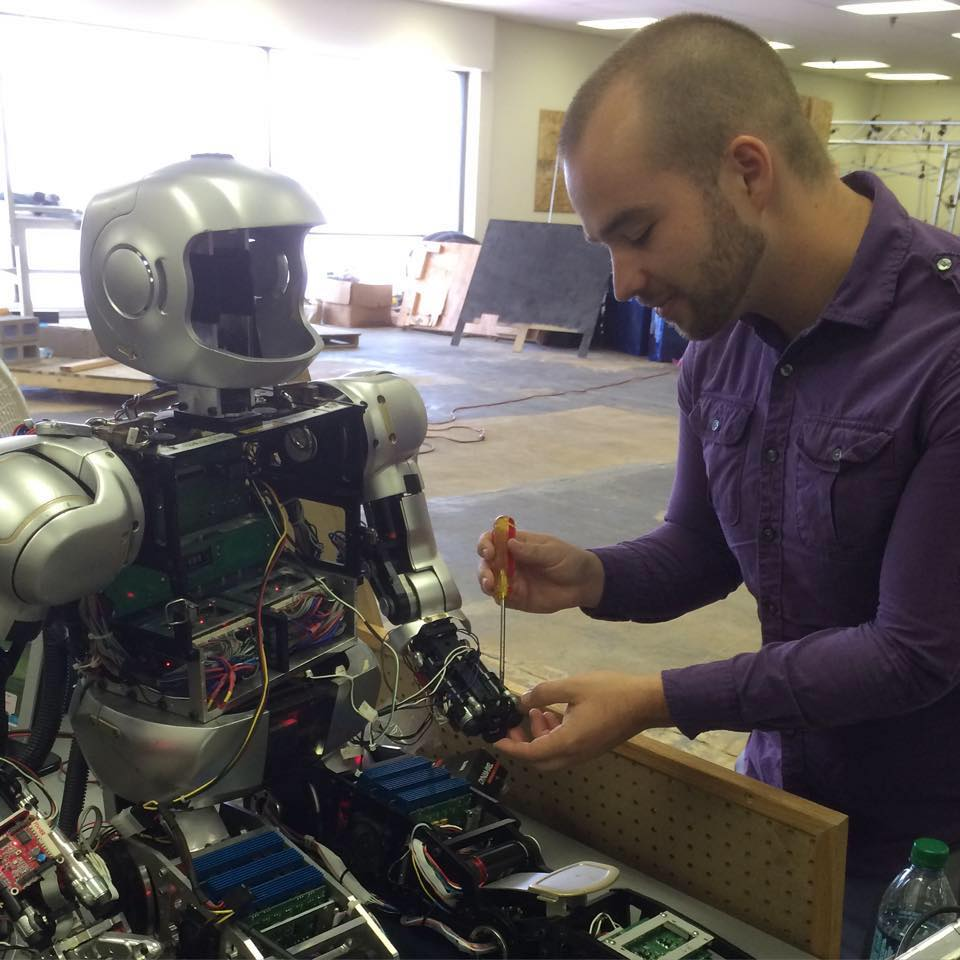
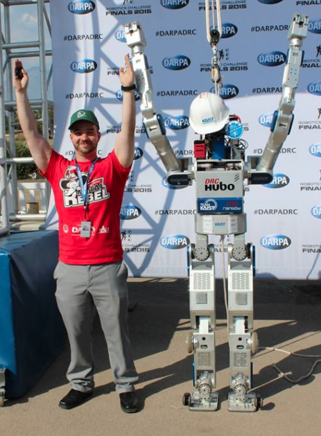
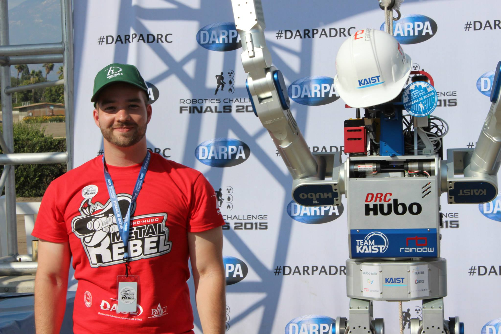
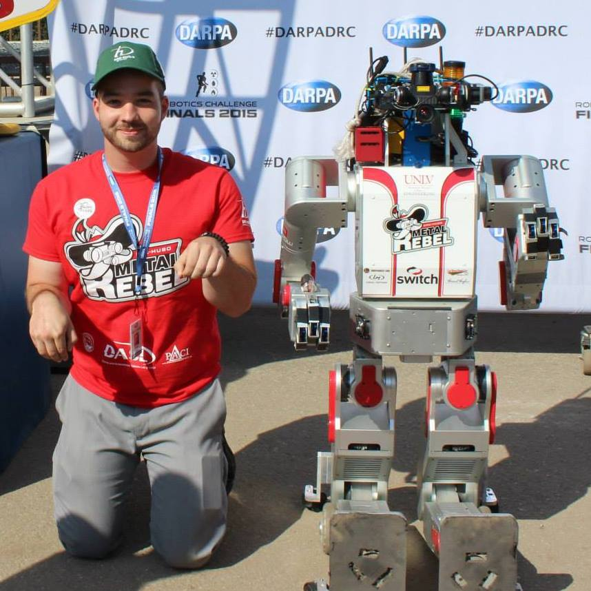
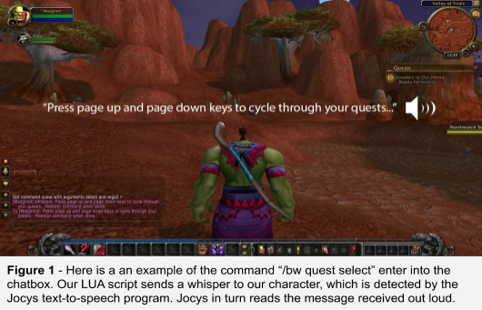
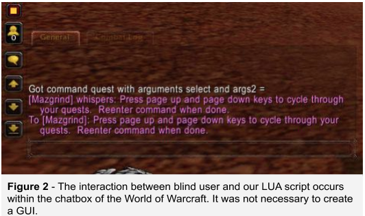
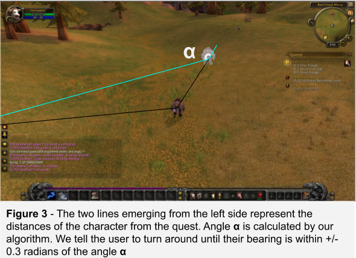
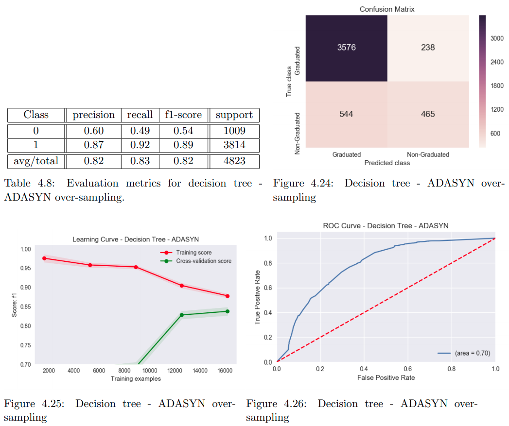
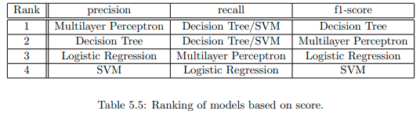

## "If it has science in the name, it's not a science." - Anonymous

I'm currently reading selected parts of **Algorithms to Live By - The Computer Science of Human Decisions** by Brian Christian and Tom Griffiths. The book is awesome so far. The only downside is they don't explicitly list their references in their work. It's just a long bibliography in the back. I'm breaking down chapter 5 of their book on [scheduling](./schedulingHumans/) (time management).

---

I started studying computer science in 2013 at the age of 22. I earned my bachelors degree in computer science with a minor in math (2016) and a masters in computer science (2018) both from the University of Nevada, Las Vegas.

---

# A list of some of my projects

From oldest to newest.

---

#### [Jaemi signing "Hello, world"](https://github.com/auxsophia/Jaemi-DRC) (C++)

A forked project for a humanoid robot. The UNLV robotics lab in which I studied from the fall of 2014 to summer 2015 participated in the 2015 DARPA Robotics Challenge obtaining 8th place in the finals in an international competition. I watched over our booth and worked with an older model humanoid, Jaemi. I trained in the maintenance, operation, and coding of Jaemi. For the challenge, I programmed Jaemi to perform "hello, world" in sign language. Unfortunately, Jaemi's fingers were broken for the challenge (probably from a bad night of gambling at Las Vegas casinos), and I was never able to execute my code.

{:refdef: style="text-align: center;"}

 The undergraduate robot, Hubo-Jaemi. What am I doing in this photo? Posing for Tinder. Women love roboticists. Hubo doesn't even have a screw on its wrist (I think). 

{: refdef}

---

#### [Fall 2015 Blind Warcraft](https://github.com/auxsophia/Fall-2015-Blind-Warcraft) (Lua) - Team Project

#### Introduction

Our intention is to design a suite of tools that can be installed onto the World of Warcraft video game allowing visually impaired and blind users to play the game independently. The team is using the game’s front facing API and add-on support to adjust the interface to better accommodate players who cannot use the traditional interface system to receive information. We plan to create and modify existing programs to allow for an expansive text to speech program that presents as much information as possible through audio cues, an improved interface system, and scripts which allow for independent movement and combat without outside help.

For more details, please refer to the [design document](https://github.com/auxsophia/Fall-2015-Blind-Warcraft/blob/master/designDocument.pdf).

I helped design the overall system and interface. I implemented the in-game inventory interface and expanded the chat interface. Additionally, I kept track of our weekly meeting minutes and provided research resources to the team.

<iframe width="760" height="500" src="https://www.youtube.com/embed/YddksRc9IkM" frameborder="0" allow="accelerometer; autoplay; encrypted-media; gyroscope; picture-in-picture" allowfullscreen></iframe>

{:refdef: style="text-align: center;"}

{: refdef}

---

#### [Synesthesia](https://github.com/auxsophia/Synesthesia) (C#)

Created in fulfillment of the fall 2015 senior design course. My project won me 1st place in computer science with a $1,500 prize. Details in the poster below.

---

#### [Heroes and Villains](https://github.com/auxsophia/heroes-and-villains) (HTML/CSS/Javascript - Meteor framework)

A team project to fulfill the requirements of CS 620: a graduate level course in human-computer interaction. Heroes and Villains is a social deduction game similar to [Mafia or Werewolves](https://en.wikipedia.org/wiki/Werewolf_(social_deduction_game)), except with superpowers and way cooler! We chose the Meteor framework for ease of development and to handle asynchronous user input, users interacting with the game and voting at the same time.

---

#### [My Master's Thesis: Machine Learning Applications in Graduation Prediction at the University of Nevada, Las Vegas](https://digitalscholarship.unlv.edu/thesesdissertations/3309/) (Python)

#### Abstract
> Graduation rates of four-year institutions are an increasingly important metric to incoming students and for ranking universities. To increase completion rates, universities must analyze available student data to understand trends and factors leading to graduation. Using predictive modeling, incoming students can be assessed as to their likelihood of completing a degree. If students are predicted to be most likely to drop out, interventions can be enacted to increase retention and completion rates.

> At the University of Nevada, Las Vegas (UNLV), four-year graduation rates are 15% and six-year graduation rates are 39%. To improve these rates, we have gathered seven years worth of data on UNLV students who began in the fall 2010 semester or later up to the summer of 2017 which includes information from admissions applications, financial aid, and first year academic performance. The student group which is reported federally are first-time, full-time freshmen beginning in the summer or fall. Our data set includes all freshmen and transfer students within the time frame who meet our criteria. We applied data analysis and visualization techniques to understand and interpret this data set of 16,074 student profiles for actionable results by higher education staff and faculty. Predictive modeling such as logistic regression, decision trees, support vector machines, and neural networks are applied to predict whether a student will graduate. In this analysis, decision trees give the best performance.

In my thesis, I wrote the queries to return the student data from UNLV's SQL relational databases. I cleaned the data and used multiple methods of imputation for missing values. Using the Chi-squared data test, recursive feature elimination, and feature importances from decision trees, I selected the most predictive attributes. For class balancing, I used ADASYN and SMOTE over-sampling alongside no over-sampling. I implemented the machine learning models using [scikit-learn](https://scikit-learn.org/stable/), performing model specific hyper-parameter grid searches for best performance. I analyzed the models' performance using accuracy, recall, precision, F1 score, and area under curve. I used 10-fold cross-validation for training, testing and validation.

{:refdef: style="text-align: center;"}

  ---  

{: refdef}

---

#### Osteoporosis Prediction

In the summer of 2018, I developed deep learning models for osteoporosis classification and regression as a paid researcher. I performed feature selection and hyper-parameter searching in Jupyter notebooks through Google Colaboratory. With [Keras](https://keras.io/) and scikit-learn, I trained deep learning and other machine learning models to predict osteoporosis diagnosis and bone mineral density based on medical and genetic data.

---
