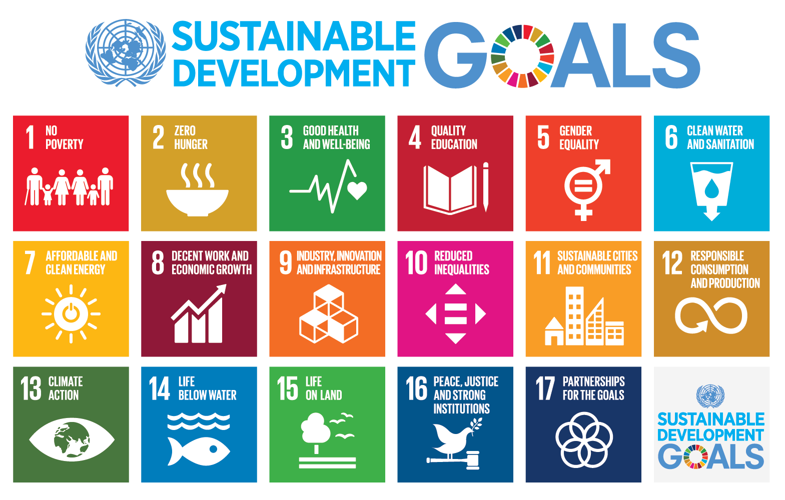

# Society 3.0

This work is a natural continuation of [the meaning of life](/meaningOfLife/). Many conclusions will not make sense without first reading the foundation. All of humanity should work towards the ultimate goal of artificial general intelligence capable of surpassing us in every way possible. AI can be conscious. We can make an AI entity with the ideals of humanity and incapable of our evils. What is more important than creating a superior being and ushering the next stage of evolution and consciousness?

But the answer is not to move to Silicon Valley in California or join a tech startup.

I hope to show you what I believe humanity's best path forward and what led me to these conclusions.

## Climate Change

If you wanted to create a threat to destroy humans, you would create climate change.

Imagine an asteroid heading towards Earth. In the night sky you can see with your naked eyes a bright, twinkling object. People start to realize this asteroid is heading towards on a direct path. If the world's scientists all agreed the asteroid was big enough to destroy the planet by 2035, if there was absolutely nothing we could do to change that, would you live your life any different?

If you **knew** the world would be completely annihilated by 2035, would you still go into work tomorrow?

What would you do?

I like this analogy because an asteroid is a simple idea. It's a big rock hurtling through space at high speeds. You can see it. We've made movies about blowing them up before they hit Earth. That would be awesome, but we can't even nuke this huge asteroid. The governments can't really deny the asteroid if it's so huge you could see it getting bigger year after year.

Hey, do you think the elites of our society would hide information about the asteroid if they knew?

I imagine most people would want to live their lives to the fullest in the final remaining years. People likely wouldn't do the soul crushing work needed to sustain our current pace of life, at least for the elite. In 2024 who will be spending the next 10 years studying to get a highly specialized skill right before the world ends? Who will work when there is no return?

The climate crisis we face is an existential threat which could end all life on Earth. The threat we face will be far slower and more cruel than an asteroid collision. We will suffer.

Our world's changing climate will bring about social collapse, civilizational collapse, food shortages and famines, extreme weather events never before seen in __history__, war, diseases and pandemics, and more.

Climate change is a fact. As a young person I believed we would find some way to combat climate change. If nothing else, we could invent some technology. If the world will really get so bad, wouldn't the smart, caring people of the world turn all of their attention to the issue? In 2018 I took a much deeper look at climate change. So many of my previous beliefs were challenged, and I wanted to turn away. I couldn't believe what I was seeing and reading. As I felt my mind shift I catalogued my mental descent: [Global Warming](/globalWarming/) and [Global Warming in the News](/globalWarmingNews/). I kept tracking headlines and studies until I gave up. The stream of warnings is endless. I became convinced this was happening, is happening, and getting worse. Others are tracking. Once you learn more, you realize there are older people who have followed climate science **for decades**. The wisdom and knowledge they have of trends and efforts is yet another blow that I am ignorant and would need as many years as they have to grasp the full gravity of the situation.

There's little hope.

### There's one measurement about the environment you should follow: atmospheric carbon dioxide.

[Measured in CO_2 parts per million (ppm)](https://www.climate.gov/news-features/understanding-climate/climate-change-atmospheric-carbon-dioxide), this one objective number gives us a comparison to the past. For the last 800,000 years the CO_2 ppm hasn't exceeded 300. In the last 10,000 years the CO_2 ppm fluctuated around 280. As of April 2021 we are at the highest levels in [14 **MILLION** years](https://en.wikipedia.org/wiki/Carbon_dioxide_in_Earth%27s_atmosphere) at over 400.

The [previous 5 mass extinctions](https://en.wikipedia.org/wiki/Peter_Ward_(paleontologist)) on Earth occurred when the CO_2 ppm reached 1,000.

We are likely on track to reach 1,000 ppm by the year 2100.

This is only one measure. The complexity and inter-relatedness of the whole planet make this issue hard to grasp. There are many [tipping points](https://en.wikipedia.org/wiki/Tipping_points_in_the_climate_system) to consider which would throw the Earth out of a stable state. We're currently at 1 degree of warming above preindustrial levels. If we reach 2 degrees of warming, we will see catastrophes across the world. The [Paris Agreement](https://en.wikipedia.org/wiki/Paris_Agreement) aims to keep warming from reaching 2 degrees with the goal of 1.5 degrees warming (just half a degree more from where we are). However, the goals set by the agreement _assume technology will be developed which doesn't exist_.

They hoped we would develop carbon negative tech: something that will capture and store atmospheric carbon dioxide.

So far we haven't come up with anything at scale, and the tech we have developed still adds more carbon in the creation of it. We would still be net negative.

While we have talked of carbon dioxide, there's another gas which traps heat even worse, methane. There's one other tipping point to look out for: arctic sea ice. Even during summer the arctic always had ice in human history. What was once permafrost is now melting. [Methane trapped in the ice](https://en.wikipedia.org/wiki/Arctic_methane_emissions) will release into the atmosphere adding to warming. Additionally, the white ice reflected a significant amount of the Sun's energy back into space. In its place, we now have a dark blue ocean to absorb the Sun's heat. Just these factors alone add 2-3 degrees of warming on top of what we have, not accounting for the cascading and accelerating effects this will have on other tipping points.

I hope you can see we are facing a literal existential crisis. We may end all multicellular life on this planet. We are living through a mass extinction now, the anthropocene era, which will likely cause humans to go extinct. People like Roger Hallam are one of the few trying to enact real change, [Advice to Young People as they face Annihilation - Roger Hallam - 2021](https://www.youtube.com/watch?v=dnpOnO71wno). This is why Greta Thunberg won't take any shit from politicians.

## Society is Fucked

What should you do? Read [_Sapiens: A Brief History of Humankind_](https://en.wikipedia.org/wiki/Sapiens:_A_Brief_History_of_Humankind) as soon as you can! That book is amazing. It's important to understand what human beings are. We are the only species we know of that can cooperate flexibly in large numbers. We do this mainly with the help of myths and stories.

As professor Yuval Noah Harari writes in his work, capitalism and communism were opposing economic systems with different sets of problems. How do we decide prices for items? How much is a loaf of bread worth? Under communism a central government tries to control the price for everyone; they can say a loaf is $1 and anyone caught selling differently is punished. Development of bread is regulated by central factories. Capitalism is distributed. There is no central entity determining prices, instead 'the market' decides. By having a shared currency, people set prices around supply and demand of goods and services. The price of bread fluctuates because if there isn't enough it becomes expensive. If there's too much it becomes cheap. Every baker is in competition with others unless they can specialize to a niche area with less competition.

Both share the same issue but have different rates of collapse. Communism aims at structured control to provide for the needs of everyone. Under communism, human ego manipulated information to the central government. At each layer of administration the subordinate exaggerated production to the superior in order to appear more effective than the reality. The compounded effect to the center led to distorted reasoning eventually causing a failure to set pricing of goods and services. The collapse was quick, and communism was labeled a failure by (often capitalist) critics.

Capitalism is the opposite of communism in the sense of distributed means of production. While distributed production allows for great freedom and prosperity, that prosperity is masked by far distribution. Capitalism creates a situation of constant competition. With unchecked price setting companies want to produce as efficiently as possible to give the greatest net return as profit. Humanitarian laws and bills of rights are necessary to stop capitalism from creating slavery conditions. Slavery is the natural progression of capitalism, a slave is a worker who has no power to negotiate and produces work at minimum cost. Your employer always wants to pay you the minimum if it wants to maximize its profits. Ask yourself if your place of business wants to maximize profits as a main concern. Even if there are bills of rights or other laws in some countries, international labor gives access to workers with less rights and power. These workers are exploited to some degree of slavery out of any view by the customers they serve. Capitalism creates all kinds of incentives to continue for short term profit gain at any expense. Workers are in a constant war for liberty and fairness.

[The dirty secret of capitalism -- and a new way forward | Nick Hanauer](https://www.youtube.com/watch?v=th3KE_H27bs)

Capitalism is based on the irrational belief that we can expand and grow forever. Our planet and resources are finite. When is a short sighted goal of maximum return as soon as possible the best choice? Capitalism did offer a way out of poverty based on merit. If you could perform a valuable service you could earn money. For the first generation, your pay was close to the value you produced. Once that generation succeeds, they realize how hard competition truly is. They give their children any advantage they can to help them achieve. Each generation after does the same, but this breaks the original system of merit, your value matching your pay. We end with huge inequality where the rich stay rich and the poor stay poor. Even merit based capitalism slides into oligarchy.

[Our democracy no longer represents the people. Here's how we fix it | Larry Lessig | TEDxMidAtlantic](https://www.youtube.com/watch?v=PJy8vTu66tE)

Pretty much a summary of my views on American politics. We live under Tweedism by the wealthiest 0.02%. The elites of our society control our choices then follow up by rigging our elections. We should all know about [manufacturing consent](https://en.wikipedia.org/wiki/Manufacturing_Consent).

The word _person_ almost always means one's own group. When [the U.S. constitution](https://en.wikipedia.org/wiki/Constitution_of_the_United_States) says "We the people..." what they meant at the time was land-owning, white, man; that was the definition of a person. We label people outside our groups with a metaphor. Over the centuries as we expanded our definition of person to include the non-white, women, and landless, we have the appearance of inclusivity. I think the truth was we were never given anymore power without ensuring the dilution of that power hid the interests of the elites. The people who took the place of the most wealthy Americans manufacture our consent and give us meaningless options.

Are the elites going to solve climate change once it effects them? No. Rather than a conspiracy theory of supreme power, these people who are in the position of elites are just as enslaved as the poorest among us. While the poor struggle to survive, the elites are seduced by the opposite. In a competitive world created by capitalism, who wouldn't listen to the whispers of billions of dollars: _you and anyone you care about will never have a material worry again_, _do anything you want_, _you deserve this_, _you're better than anyone else_. Few of us could turn away given the opportunity. If the elites actually tried to solve a real problem, such as climate change, poverty, or proper education, they would fail miserably. They will never try because the solutions to these problems often involves change to the current system, which jeopardizes their elite position, which they are too enthralled to give up. Really the elites are slaves to maintaining the rigged system no matter what they once believed. The capitalist system itself is an exploitative pyramid. The best choice is to be near the top where the exploitation of the masses funnels upward.

Elites have the power to say _no_ to change, not the power to create change.

Under communism the best choice is to get close to the central government, the central processing core, to capture the excess leaking energy. To get a promotion the lower class lies about their productiveness. The problem is pushed to the next person to run things who will in turn continue lying. The higher ups are seduced by wealth and disconnected from the suffering masses. Almost everyone takes just a little more, an extra ration here and there for themsevles and families. Would you? A small percentage will be truly corrupt, taking as much as they can. The masses don't have the option to take, they are taxed. The accumulating error to the center and the limited processing power causes the system to collapse.

Under capitalism the collapse is opposite. Communism implodes but capitalism explodes. Communists lie up to the government and the people want as much as they can get. Capitalism spreads out commodifying everything it can. As the competition between people increases for basic needs they become further desperate. Instead of just lying to the central government we lie to each other to extract as much profit from each transaction. We push further out and disrupt other countries to sustain ourselves. When some succeed and others fail whether due to luck or ability the inequality grows massively over time. The rich want to maintain the order to retain their wealth while the poor clamor to survive, and the system as a whole is maintained at the cost of everything else.

Humans can behave flexibly in large numbers. Humans believe in stories, true or false, which shape behavior and social networks.

On an individual level we are capable of feeling good and bad, empathizing, and changing. When we are on an equal level we can speak and be heard. In a hierarchy we are not seen on the same level, and the only way for the higher levels to handle decisions is to simplify the lower levels. Typically this means reducing to "metrics," measurable numbers. In this reduction we lose much of our individual humanity.

Once we're in a hierarchy of numbers we have left behind what makes us human and are in the inter-subjective realm of ideas. As human systems we need an ideology, a system of ideas, to direct our behavior. If we're not careful, the ideology entraps us and takes a life of its own. The purpose of ideologies is to make thoughts reoccur. When the ideology emphasizes some value, like profit maximization, the system as a whole takes on this goal. At that point all we as individuals need to do is our small part.

Yuval Noah Harari's question is important here: who or what is suffering?

The ideology doesn't suffer, people do. The ideology is like a computer program running a calculation. We as individuals are the computing nodes in the ideology network. We are people who suffer when the system acts. When the individuals are too stressed to continue, the systems that survive adapt the work so the role is fulfilled. The job function is split up between people so no one part is so obviously wrong people will refuse to do the work.

Just like in an ecosystem where every living thing adapts to become dependent on the whole, so too do we adapt to our societies. We have lost our independence and need the systems we live in.

We're too powerful and we're a greedy algorithm.

A greedy algorithm is like a fire burning the closest fuel as soon as it can. It's like how single celled life in a petri dish will eat and grow as long as food is available before dying in its accumulated shit.

AI as corporations.

### AI has already taken over

### Corporations as AI

Some argue corporations are already an example of artificial general intelligence (AGI).

[AI Has Already Taken Over. It’s Called the Corporation.](https://www.commondreams.org/views/2017/12/03/ai-has-already-taken-over-its-called-corporation)

---

> When corporations were first formed back in the seventeenth century, their inventors—just like modern software engineers—acted with what they believed were good intentions. The first corporate charters were simply designed to limit an investor’s liability to the amount of their investment, thus encouraging them to finance risky expeditions to India and Southeast Asia. However, an unintended consequence soon emerged, known as moral hazard: with the potential upside greater than the downside, reckless behavior ensued, leading to a series of spectacular frauds and a market crash that resulted in corporations being temporarily banned in England in 1720.

> "This is a government of the people, by the people, and for the people no longer. It is a government of corporations, by corporations, and for corporations,” lamented Rutherford Hayes who became President in 1877.

> Corporations took full advantage of their new-found dominance, influencing state legislatures to issue charters in perpetuity giving them the right to do anything not explicitly prohibited by law. The tipping point in their path to domination came in 1886 when the Supreme Court designated corporations as “persons” entitled to the protections of the Fourteenth Amendment, which had been passed to give equal rights to former slaves enfranchised after the Civil War. Since then, corporate dominance has only been further enhanced by law, culminating in the notorious Citizen United case of 2010, which lifted restrictions on political spending by corporations in elections.

> Corporations, just like a potential runaway AI, have no intrinsic interest in human welfare. They are legal constructions: abstract entities designed with the ultimate goal of maximizing financial returns for their investors above all else. If corporations were in fact real persons, they would be sociopaths, completely lacking the ability for empathy that is a crucial element of normal human behavior. Unlike humans, however, corporations are theoretically immortal, cannot be put in prison, and the larger multinationals are not constrained by the laws of any individual country.

> With the incalculable advantage of their superhuman powers, corporations have literally taken over the world. They have grown so massive that an astonishing sixty-nine of the largest hundred economies in the world are not nation states but corporate entities.

> Corporations have been able to use their transnational powers to dictate their own terms to virtually any country in the world. As a result of decades of globalization, corporations can exploit the free movement of capital to build factories in nations with the weakest labor unions, or locate polluting plants in countries with lax environmental laws, basing their decisions solely on maximizing returns for their shareholders. Governments compete with each other to make their nations the most attractive for corporate investment.

> Corporations wield their vast powers to control the minds of consumers, enthralling them into a state of perpetual consumption. In the early twentieth century, Paul Bernays, a mastermind of corporate empowerment, boldly stated his game plan as “the conscious and intelligent manipulation of the organized habits and opinions of the masses.” He declared ominously that “those who manipulate this unseen mechanism of society constitute an invisible government that is the true ruling power of this country.” The sinister words of Wayne Chilicki, chief executive of General Mills, show how Bernays’ vision has been perpetuated: “When it comes to targeting kid consumers, we at General Mills… believe in getting them early and having them for life.”

> The result of this corporate takeover of humanity is a world careening out of control, where nature is mercilessly ransacked to extract the raw materials required to increase shareholder value in a vortex of perpetual economic growth, without regard to the quality of human life and with no concern for the welfare of future generations.

> Instead of being pilloried for their vast destruction, those who dedicate themselves to their corporate overlords are richly rewarded and elevated to positions of even greater power and prestige. ExxonMobil, for example, has been exposed as having lied shamelessly about climate change, knowing for decades about its consequences and yet deliberately concealing the facts, thus condemning present and future generations to havoc. Instead of facing jail time, the CEO during much of this period, Rex Tillerson, is now the U.S. Secretary of State, overseeing the global relationships of the most powerful country in the world.

> In fact, the current U.S. cabinet represents the most complete takeover yet of the U.S. government by corporations, with nearly 70% of top administration jobs filled by corporate executives. In the words of Robert Weissman, president of Public Citizen, “In the Trump administration, auto industry lobbyists are setting transportation policy, Boeing has a top perch at the Department of Defense, Wall Street is in control of financial policy and regulatory agencies, and corporate defense lawyers staff the key positions in the Justice Department.”

> Corporations are inserting themselves into international agreements, so they can further their interests even more effectively. At the 2015 World Economic Forum in Davos, a new Global Redesign Initiative set out an agenda for multinational corporations to engage directly in global governance. The UN’s Sustainable Development Goals, proudly announced in 2015 as a vision to reduce poverty, adopted their approach by inviting corporations to a seat at its table to impact UN policy, while calling for further globalization. Fossil fuel companies have infiltrated the annual global COP meetings on climate change, ensuring they can compromise any actions that might hurt them, even as the world faces the threat of climate catastrophe.

> The takeover of global governance by multinational corporations has permitted them to undermine human welfare everywhere in the pursuit of profit. Nestlé remorselessly buys control of rural communities’ groundwater reservoirs to sell as bottled water, leaving them to foot the bill for environmental cleanup, with the result that in countries such as Columbia sugary bottled drinks are frequently cheaper than plain water. As a result of the chemicals sold by global agribusiness companies such as Cargill and Monsanto, it’s been estimated by UN officials that the world’s topsoil can only support about sixty more years of harvests. In these cases, and countless others like them, humans and the earth alike are mere fodder for the insatiable appetite of an amoral, inhuman intelligence run amok.

> The corporate takeover of humanity is so all-encompassing that it’s difficult to visualize any other possible global system. Alternatives do, however, exist. Around the world, worker-owned cooperatives have demonstrated that they can be as effective as corporations—or more so—without pursuing shareholder wealth as their primary consideration. The Mondragon cooperative in Spain, with revenues exceeding €12 billion, shows how this form of organization can efficiently scale.

> There are also structural changes that can be made to corporations to realign their values system with human welfare. Corporate charters can be amended to optimize for a triple bottom line of social, environmental, and financial outcomes (the so-called “triple Ps” of people, planet, and profit.) A “beneficial” or B-Corp certification, which holds companies to social and environmental performance standards, is becoming more widely adopted and is now held by over 2,000 corporations in over fifty countries around the world.

> Ultimately, if we are stop this force from completely taking over humanity, these alternative approaches need to be codified into our national and international governance. Imagine a world where corporate charters were only granted if they adopted a triple bottom line, and where shareholder lawsuits threatened every time a company broke one of its own social and environmental standards. Until that happens, it may be that the “worst event in the history of our civilization” is not the future development of modern AI, but the decision by a group of 17th century politicians to unleash the power of the Corporation on an unsuspecting humanity.

AI commentator Robert Miles has this to say about [AI as corporations](https://www.youtube.com/watch?v=L5pUA3LsEaw).

---

# iAi Community

What are your answers to these 5 questions?

Do you love the American ideal of merit, equality, and freedom, but find yourself trapped in our current dystopia with no alternative?

Have you accepted collapse, on the scale of ecological, social, global collapse is possible and imminent in the next 10 to 80 years?

Do you believe we cannot go back to full connection with the Earth, but must reconnect to sustainable living while maintaining beneficial technology?

Do you believe the study and development of good AI is the best path for our species?

Do you accept humans are deeply flawed, greed is rarely good, and we should be constrained?

## A New Framework - Opensource Society

We need to attack all problems at once. Many problems are connected in linear and non-linear ways. Some progress in all areas could give a greater return than the investment.

Our current society is setup to enable us all to make the wrong choices. We need to change our environment to make the easiest choice the right choice. These ideas will appear "radical," likely more radical than any non-fictional society proposed to you before. However, given climate change, the looming threat of the genuine extinction of our species, the coming collapse of society on a global scale, and the egregious misuse of power by every country and authority, I hope you see why these changes are necessary.

Humans should form into distinct, self-sustainable communities of no more than 10,000 people. Each community should be a non-profit following the [triple bottom line](https://en.wikipedia.org/wiki/Triple_bottom_line), evaluating the corporation by its impact on the planet, people, and profit in that order.

Sustainability simply means we can meet our present needs while allowing future generations to meet their needs.

[Social sustainability: Satisfying human needs](https://www.youtube.com/watch?v=FyT9TMlzC6s)

The economist [Manfred Max-Neef](https://en.wikipedia.org/wiki/Manfred_Max-Neef) argued for 9 human needs which are satisfied by societies in different ways. The lack of satisfying these needs cause a pathology.

* Subsistence
* Protection
* Participation
* Understanding
* Affection
* Idleness
* Creation
* Identity
* Freedom

See pages 32-33 of Max-Neef's work, [Human Scale Development](http://www.wtf.tw/ref/max-neef.pdf).

The goal of our community is to maximize [adaptive capacity](https://www.youtube.com/watch?v=o6lSuwJw0pk). What makes a social group adaptive is based upon:

* Trust
* Diversity
* Capacity for learning
* Capacity for self-organization
* Common meaning

Any impediments to the above will make us less adaptable.

I propose a system alternative to current options. A disconnected community economy maintained by a central processing core. Our central AI will govern as far as we can develop. We can see live updates to community needs and what work should be done. The community-core provides guidance and governance on the trades of goods and services. The design of the system should at every possible point minimize human corruption. By constraining goods and services to local production we minimize our contribution to the net harm of the global system.

Our community can be a beacon of hope and rationality for a future of synergistic technology and nature. The realized ideal of what America presented to be, a great experiment in expanding and sustaining human liberty within the furthest moral reaches.

* Humans should gather in organizations no greater than 10,000.

Since the time of Aristotle, humans believed we could not maintain democracy beyond a city of 10,000 because that is the limit at which people have any sense of actually knowing who they're voting for. Additionally, we see that the aggregate power of a society needs to be tied to some human sense of self. By keeping a small number we set a limit on our power thus limiting the corrupt use of that power. Our community will be resilient to deep fakes because a deep fake of a community member can hopefully be sorted out by walking over and knocking on the door of the member to discuss.

* Automation for all.

Every human activity deemed not intrinsically worth doing should be automated as much as possible. If people don't like doing it, automate it!

Much of our food production should be automated with [Farm Bot](https://farm.bot/). Farm bot is opensource. While we can buy a kit, it's also possible to download the code and schematics online to build ourselves. We can have a farm bot for every community household. Distributing food production will make us more secure and resilient.

An ever growing amount of medical care can be automated. From [diagnosing skin conditions almost as well as a dermatologist](https://ai.googleblog.com/2019/09/using-deep-learning-to-inform.html) to [estimating cardiovascular risks based on retinal scans](https://ai.googleblog.com/2018/02/assessing-cardiovascular-risk-factors.html), AI can be the first step in the medical care process. Search engines are AI which help diagnose. Where our medical automation fails and the scope of treatment is beyond the scope of the community medical team, we will work with established hospitals for treatment, trading their money for service.

We see that automation currently favors the wealthiest among us and serves their whims. Whoever has the most access to hardware and computation owns automation. This is the digital version of land. The point of automation is for _all of us_. No small group should be the main benefactors or hold unequal power. Humans should be involved where ever humanity is needed.

I am not an economist, but that's entirely my point. I'm not a brainwashed economist who thinks capitalism can still work. Communism doesn't work and self destructs faster than capitalism. However capitalism degrades us until the whole world could die! We need to find a hybrid that reigns humans in. I believe the economy and politics should be automated by central AI. The governing AI would host voting for community member decisions and ground debates in shared facts. Our economy would have the best benefits of capitalism and communism. Through work community members have incentive to earn more up to a limit. With aggregate information on the needs of all community members connected to a network, we can regulate goods in open fairness.  

* Shelter, sleep, nutrition, and exercise are basic human rights.

I feel like I'm taking crazy pills! Is this not obvious? Why are we socialists when it comes to our family and capitalists with everything else? I hope you don't charge your children rent and taxes for living with you. No one in our community should live in poverty. Not one person should go without health needs. If you are a member of the community, you have a place to stay, your sleep is a priority, food is free and nutritious, and you should have time to exercise. All of this should be free. You shouldn't lose your job and worry about shelter or food.

Internal (community-based) nutritious food should be free while unhealthy food should come at a cost. You should be **paid** to exercise! You should complete a workout and earn money. Staying fit saves the community medical expenses while keeping the individual well. Fitness helps in nearly every aspect of life.

We need to focus on sustainable housing. Everyone should have access to an [Earthship](https://en.wikipedia.org/wiki/Earthship).

---

> An Earthship is a brand of passive solar earth shelter that is made of both natural and upcycled materials such as earth-packed tires, pioneered by architect Michael Reynolds.

> Earthships are predicated upon the idea that there are six human needs which can be addressed through environmentally sustainable building design:

> - Energy: Thermal and/or solar heating and cooling, solar and wind electricity
- Garbage Management: Reuse and recycling built into construction and daily living
- Sewage Treatment: Self-contained sewage treatment and water recycling
- Shelter: Building with natural and recycled materials
- Clean Water: Water harvesting and long term storage
- Food: In-home organic food production capability

> Earthship structures are intended to be "off-the-grid-ready" homes, with minimal reliance on public utilities and fossil fuels. They are constructed to use available natural resources, especially energy from the sun and rain water. They are designed with thermal mass construction and natural cross-ventilation to regulate indoor temperature, and the designs are intentionally uncomplicated and mainly single-story, so that people with little building knowledge can construct them.

---

* Medical care is a basic human right.

If someone is ill, take care of them.

* Local currency and the economy.

Each community should have its own local currency. Most high school computer science students can create their own version of digital cryptocurrency. The point is internal trade only. The value of a community currency outside of the community should be zero! When we create a collective currency between countries, we _will_ have wealth and tax evasion. People will store their assets outside of the community and become separate.

No one should assume they are better.

The wealthiest people of our countries hide their wealth in offshore accounts to avoid taxes. You should assume if you achieved the same level of wealth your priorities would change with it. You would be the person who could pay for a new hospital for everyone in a city but instead choose to store the money in a hidden bank account. We should do everything in our collective power to make these options as close to impossibility as possible.

Yet another reason to have our own digital cryptocurrency, the cryptocurrency automatically tracks every transaction and validates on the shared blockchain. Our currency cannot be counterfeit or traded illegally. To trade with our currency would mean having a wallet which would only be granted after community membership.

Here is where I would like the input of economists and others with a fresh perspective: running a circular, [degrowth](https://en.wikipedia.org/wiki/Degrowth) economy. To make this generalized, communities should interact with the society they're in trading for needed goods and service in the established currency. The eventual goal of every community should be to disconnect as much as possible from the establishment currency and gradually grow local wealth.

Local currency should only be generated internally by work; never traded for established or other currency. No one should be able to "buy in." Every community member's immediate physical and emotional needs should be provided for. Money beyond that is the motivation to work more than necessary. Once generated, our local currency can be given back to the community bank. The community bank exchanges the local currency for the established currency which trades the good or service. Established currency should be generated by the entire community and held in a collective pool. From the pool, needs (and wants) which can only be obtained outside of the community can be exchanged. No established currency should be traded among community members for community owned goods and services.

With the blockchain, we can immediately know the total wealth and other statistics of every member. We can choose to make this anonymous or tied directly to each member. Importantly, we can create _diminishing returns_. We can set a wealth cap based on each community where earning more doesn't generate money for the individual but is sent to the community bank. This creates a dis-incentive for people to hoard wealth and an incentive for members to continue spending, circulating currency through the community.

Rather than economic measures like the GDP, we should have multiple and distinct measures in balance. An alternative to GDP could be ecological-complexity per capita which is a measure of the complexity in an ecosystem. We can measure growth as a flourishing of the web of life around us.

* Sustainable Jobs -- Stewards of the Earth

Many of our jobs should be based solely in redeveloping symbiosis with nature. We should disrupt the ecosystem as little as possible while making it robust to the coming climate changes. We should have a section of our population planting trees and growing [food forests](https://en.wikipedia.org/wiki/Forest_gardening). You should be paid to plant trees.

Alongside our necessities, we need sustainability engineers to redesign our modern lives. We need to decide as a community what we can give up and what we can keep in a post-fossil fuel world. We should fill the gaps with indigenous knowledge as much as possible while generating our own indigenous knowledge through connection to our land. Necessary appliances to maintain our standard of living should be as sustainable as possible and the schematics freely shared with the world.

* Information exchange.

As an open source community, we should exchange information openly. Every person should benefit from sustainability and AI research. When we develop a new technology to filter water, grow better food, make a medical advancement, or any development which increases human well being, we only make the world better by sharing it. We aren't going to work or provide materials for other groups, but we can provide knowledge and schematics so they can implement the technology for themselves. In a similar exchange, when other communities make advancements we can benefit as well. Mutual information exchange is a path towards peace.

* Indigenous Rights

## Indigenous rights are human rights

A sovereign community should respect the sovereignty of other communities. Indigenous people represent the accumulated wisdom of generations of sapiens living on the same land. They have a connection to their ecosystems which all human beings should seek to have, seamless integration. Indigenous people living traditionally have no carbon footprints; they are in harmony with nature. The forefront defenders of the environment are often indigenous activists who fight for their land, their lifestyle, and even us. When the Amazon forests burn the lungs of the world burn. The interconnectedness of the worldwide life-web is a fact. We must work to rejuvenate the ecosystems we are a part of that we will die without. The fight of indigenous people is the fight of the survival of the human race. Indigenous defenders are the last white blood cells of the human race attempting to protect us from our own suicidal foolishness. Truly, a threat to justice anywhere is a threat to justice everywhere.

---

# Globally Opensourced

If we all individually lived a zero-waste lifestyle the impact would be small while coming at a great personal cost. We need a global solution to the challenges we collectively face. Humans need to organize and adapt where they are unless that is impossible. The current system should be replicated the world over in almost every country.

Like a nation is an organism, these communities should be a mitochondrion in the cell.

The communities should exchange fairly and equally with the existing nation. We can benefit everyone. The communities can be carbon negative, soaking up excess emissions. They can take your nation's weird and undesireable people. Send us your diverse, your strange! The end result is for communities to be seamless with their societies while needing little attention or care.

Unfortunately disruptions to existing power structures are rarely tolerated. If people have an alternative they aren't trapped in the system they're in. Worse yet, we're running out of time. Developing a community like this, even as easy as we can make it, will likely take years, assuming everyone is ready and in agreement to make massive change.

***

## [Sustainable Development Goals #Envision2030](https://sustainabledevelopment.un.org/sdgs)

[Wikipedia](https://en.wikipedia.org/wiki/Sustainable_Development_Goals)

{:refdef: style="text-align: center;"}

{: refdef}

The Sustainable Development Goals are:

1. No Poverty
2. Zero Hunger
3. Good Health and Well-being
4. Quality Education
5. Gender Equality
6. Clean Water and Sanitation
7. Affordable and Clean Energy
8. Decent Work and Economic Growth
9. Industry, Innovation, and Infrastructure
10. Reducing Inequality
11. Sustainable Cities and Communities
12. Responsible Consumption and Production
13. Climate Action
14. Life with Water
15. Life On Land
16. Peace, Justice, and Strong Institutions
17. Partnerships for the Goals

---

[First-ever compendium of indigenous technologies provides a powerful toolkit for climate-resilient design](https://www.gsd.harvard.edu/2020/02/first-ever-compendium-of-indigenous-technologies-provides-a-powerful-toolkit-for-climate-resilient-design/?fbclid=IwAR3pSSnJmXAUfbdzIffobCPOt_x0-7dZT-ql5z8LvGNKTqrdIhBDiJxdB4U)

Lo—TEK: Design by Radical Indigenism by Julia Watson

---
