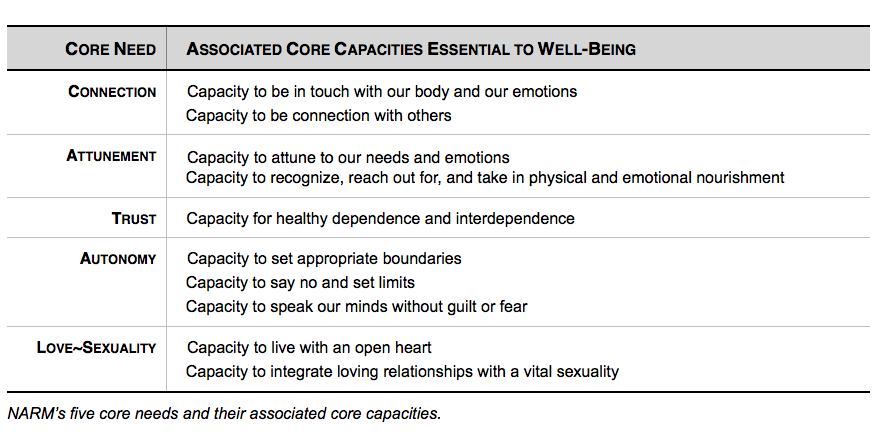

## You can watch my video on this text [here on YouTube](https://www.youtube.com/watch?v=NDcZqvrugtk)

I'll just tell you the best way to start healing: meditation, yoga, therapy. They do wonders. Get started on meditation and yoga today.

The next most important thing: keep trying stuff until it starts working. Don’t ever give up, keep going.

What I'm getting into here is not about my personal trauma. Around August 2021 I started learning a lot about trauma. I've listened to quite a few audiobooks, the first being The Body Keeps the Score which is highly recommended in the field of trauma therapy. That led me to other researchers, more books, and YouTube videos. What follows is a list of resources and my notes on each. I'll be reading my notes to get across accurate information.

Obviously, this is not my field. I’m a layman. This is not medical advice. Please seek out a licensed practitioner.

---

# The Body Keeps the Score - Bessel van der Kolk

- Grew up with family traumatized by war
- Worked with US war veterans
- Trauma as dislodged memory
  - Episodic memory has a beginning, middle, and end
  - Traumatic memory is "stuck"
- The two most important phrases in trauma therapy
  - Notice that...(thought, feeling, sensation)
  - What happens next? (Continue the story)
- 3 parts of the brain
  - Reptilian, limbic, neocortex
  - Neocortex shuts down with intense reptilian or limbic activity (unable to integrate experience, trauma replays over and over)
  - Trauma can make the brain function like it's had a leisure or stroke
  - Top down regulation: meditation and yoga
  - Bottom up: breath, movement, touch, recalibrate ANS
- Trauma is the ultimate feeling of "this will last forever"
- 3 levels of safety determines response: focused if we have social engagement, then comes fight/flight, overwhelm causes freezing

We see the development of these responses from studying animals. When organisms evolved bones they had a freezing response. At the reptilian level is the sympathetic nervous system response of fight or flight. At the mammalian level we have social engagement with the vagal nerve going to cranial nerves effecting facial expression and voice, the parasympathetic nervous system.

- Under normal conditions the rational and emotional brain work together to integrate experiences into memory
  - Critical factor is level of arousal; when we are highly aroused by horror and shock this memory system breaks down
  - The emotional brain takes over and the rational brain shuts down (hippocampus and thalamus don't function properly)
  - Dissociation of traumatic memory increases negative symptoms
  - Traumatic memory needs to be associated, integrated into autobiographical memory ("that was then, this is now")
- Healing: breathe, chant, move
  - Learn to recognize and tolerate sensations before revisiting the past (Danger! Can get retraumatized if unable to handle sensations!)
  - Mind, brain, and body need to feel safe to let go of trauma
  - Best resilience to trauma is a safe social network
  - Can heal with movements like fighting and theater
- Trauma from caregivers and intimate partners is extra difficult
  - Managing negative feelings by yourself gives rise to other common problems, dissociation, despair, addictions, chronic panic, alienation
- Symptoms of PTSD: statements like - "I feel dead inside", "I will never be able to feel normal emotions again," "I've permanently changed for the worse," "I feel like an object, not a person," "I have no future," "I feel like I don't know myself anymore"
- Chronic dissociation from our bodies can make us feel like nobody or somebody else
- There's an entire chapter on yoga
  - Tolerate your sensations for what they are in the moment with a beginning, middle, and end
  - Traumatized people have sympathetic (fight/flight) and parasympathetic (calm) nervous systems out of sync

- Gives an excellent overview of trauma and so many treatments
- Exposes you to a lot traumatic stories but also recoveries

---

# Yoga

Yoga! It's really helped me so much. Yoga helps you get back in touch with your body while increasing your tolerance of bodily sensations.

If you have any mental blocks stopping you from doing yoga, get over it. I've felt better after every yoga session so far.

Get started for free right now by following Yoga with Adrienne. She has millions of followers for her free yoga sessions.

There's yoga for any physical ability including people who are disabled. Even if you're in a chair or bed you can do yoga nidra.

## Teaching Trauma Sensitive Yoga: A Practical Guide by Brendon Abram

Even after listening to quite a few books on trauma, I found the description of trauma and the path to healing in this book particularly concise and well explained. Plus, this book is free! Even if you have no money, this is a good place to start.

Brendon Abram is a 30 year veteran of the Canadian Forces and recovering alcoholic. He helped to treat other veterans with trauma.

"it is the basic principles of yoga that bring power to the practice. Breath, mindful movement, focused awareness, and acceptance of the present moment experience are the foundation of any yoga offering."

No perfect yoga style for everyone at all times, each have benefits.

Trauma is a stressor or crisis which moves us away from homeostasis, a state of physiological, emotional, or cognitive balance.

Trauma is about a perceived life-threatening or life-altering event. It is not the objective event that is traumatizing but our subjective experience of the event.

Trauma is dysregulating. The two systems of the nervous system which generate energy and calm us to rest and digest are sending mixed and clashing signals.

A standard model of healing trauma is in 3 stages:

Stage 1: Safety and stabilization; Overcoming dysregulation
Understanding trauma and symptoms
Finding safety in one's body and environment
Finding stability emotionally and being grounded in the present (yoga is particularly helpful at this stage)

Stage 2: Recalling traumatic memories
Yoga is helpful in building acceptance of the present sensations

Stage 3: Reconnection, integration, and moving on

If trauma is stored in the limbic brain, the rational brain will have less access to simply thinking through the trauma. It's part of why we can unemotionally describe what happened but not move on. This is the basis for healing through the body, bottom up regulation.

TSY criteria:
- a bottom-up approach,
- be consistent with the accepted stages of trauma recovery,
- be needs-based,
- be adaptive versus prescriptive,
- maintain a physical focus,
- employ appropriate styles and poses,
- and place special importance on breath.

TSY approach to any pose
- Start simple, small steps
- Explore
- Experience
- Accept (don't expect)

It's important you feel you have a choice in each movement.

---

# Dr. Peter Levine - Somatic Experiencing

Levine systematized a bottom up body based approach to healing trauma. Rooted in biology and ethology, the healing process is based on what animals go through in the wild. Animals routinely face life and death situations yet are able to return to functionality.

I ended up listening to three books by Dr. Levine, Waking the Tiger, Trauma and Memory, and In an Unspoken Voice, the final book being a summary of his decades of practice.

Many of us never want to re-experience the trauma we went through. We don't want to relive it or ever have to work through it consciously. Somatic experiencing offers some hope in that we work directly with sensations in the present moment.

Levine gives the Greek myth of Medusa. Medusa had snakes for hair with a look that would turn a person to stone. The hero Perseus had to defeat Medusa without directly looking at her. He used a shield to see her through the reflection and slay her.

The analogy is that Medusa is the trauma which causes us to freeze in terror. We don't have to face our trauma directly, we can use the mirror of our bodily sensations in the present and release our trauma.

Unlike the 3 healing stages of most therapies, Levine offers 9 stages of healing.

[From Paralysis to Transformation – excerpted from In An Unspoken Voice, Chapter 5, Page 74](http://we-q.net/ses/nine-steps/)

Peter Levine writes:

When working with traumatic reactions, such as states of intense fear, Somatic Experiencing® provides therapists with nine building blocks. These basic tools for “renegotiating” and transforming trauma are not linear, rigid or unidirectional. Instead, in therapy sessions, these steps are intertwined and dependent upon one another and may be accessed repeatedly and in any order.

However, if this psychobiological process is to be built on firm ground, Steps 1, 2 and 3 must occur first and must follow sequentially. Thus, the therapist needs to:

1. Establish an environment of relative safety.
1. Support initial exploration and acceptance of sensation.
1. Establish “pendulation” and containment: the innate power of rhythm.
1. Use titration to create increasing stability, resilience and organization. Titration is about carefully touching into the smallest “drop” of survival-based arousal, and other difficult sensations, to prevent retraumatization.
1. Provide a corrective experience by supplanting the passive responses of collapse and helplessness with active, empowered, defensive responses.
1. Separate or “uncouple” the conditioned association of fear and helplessness from the (normally time-limited but now maladaptive) biological immobility response.
1. Resolve hyperarousal states by gently guiding the “discharge” and redistribution of the vast survival energy mobilized for life-preserving action while freeing that energy to support higher-level brain functioning.
1. Engage self-regulation to restore “dynamic equilibrium” and relaxed alertness.
1. Orient to the here and now, contact the environment and reestablish the capacity for social engagement.

-

Critical to healing is the idea of "felt sense" which is the totality of sensation. Felt sense blends information to tell us where and how we are. A sensation is like a pixel on a screen, but the image is like our overall felt sense. Or like how we appreciate a song but don't focus on each note. In healing we switch from individual sensations to the felt sense in a kind of gestalt of foreground and background. Developing the felt sense is the first step in healing trauma. It's the source of well being and creativity; what the organism has to say.

Trauma is often encapsulated in our minds by rage and terror. Rage is overwhelming anger. Terror is overwhelming fear. We can become immobilized, frozen by these powerful feelings. This is part of why we get stuck in trauma. We associate freezing with rage or terror. We don't like these feelings and as we tap into them again they can overwhelm us causing us to further freeze and fall further into rage and terror. To avoid this we can dissociate or disconnect from those feelings, but to heal we need to go through the immobility to complete the natural process and release our stored up energy.

As we face a life threatening event our bodies generate as much energy as it can to survive. We fight or run for our lives. If we feel overwhelmed or trapped, our bodies do the opposite and tell us to freeze. It might not seem like the best survival strategy, but freezing has helped us and our ancestors survive. Freezing goes back to when animals evolved bones. However, freezing creates a turbulent tornado of energy.

Think about driving. We teach people to drive with one foot for a reason. You could use one foot for the gas and one for breaks, but what happens when you're faced with a sudden accident? People who drive with both feet stomp on the gas and the breaks. The breaks now have to stop the momentum of the car and work against the engine which is trying to go at full throttle.

When you're stuck in freeze it's like driving with your emergency break engaged, you have to work harder to go at the same speed. When you're stuck in fight or flight it's like you have worn breaks, you go too fast and having trouble slowing down.

That's it for the car analogy. I hope you can see why these competing energies stop each other and can impede release. If we can move through immobility, complete the defensive response our body readied, then we can return to dynamic equilibrium which is orienting to the environment with inquiry and reaction.

4 components to trauma reactions:
- Hyperarousal
- Constriction
- Dissociation
- Freezing/immobility/helplessness

Traumatic symptoms develop from these 4 reactions. Our symptoms are like a release valve that lets out just enough energy for us to continue to function. Freeze is like a circuit breaker that shuts us down before we explode with too much energy.

The human mind is a double edged sword for trauma and pain. Our neocortex can reach back and communicate with our reptilian brain. We can rationally understand we are not in danger and quiet our instincts, but it is this control which causes so much trauma. Our rational brain can stop our instinctual release of life saving energy preventing us from fully exiting the trauma process and entering stages of healing.

## Trauma and Memory

Traumatic memory is not reconstructed like normal memory. Finding a source for trauma, even fictional memories, provides a cocktail of powerful neurotransmitters, adrenaline and opioids.

Two major types of memory, explicit and implicit. Explicit is conscious and implicit unconscious. They have distinct brain structures and functions. They each have two subcategories.

Explicit memory: declarative and episodic

Declarative, memories you can say, facts, discrete pieces of memory, rarely therapeutically relevant

Episodic, about your life, warm and textured, feeling, positive/negative valence, coherent narratives and stories, autobiographical, spontaneous

Implicit memory: emotional and procedural

Implicit memory can't be called up deliberately, arise as a collage of sensations, emotions, and procedures. These memories occur outside conscious awareness.

Emotional instincts shared by all mammals are surprise, fear, anger, disgust, and joy. The function of emotional memory are meant to flag a memory with emotional value. Emotions experienced as physical sensations.

Procedures, also called action patterns, have 3 categories,
- Learned motor actions, skills
- Fixed action patterns which are hardwired instincts - bracing, contraction, fight, flight, freezing, territory
- Fundamental organismic response tendencies of approach/avoidance, attraction/repulsion

We have a biological drive to search our procedural memory for actions that helped neutralize threats.

Basic steps of renegotiating trauma memory
1. Here and now experience of relative calm presence, power, grounding
2. Gradually shift back and forth between positive grounding sensations and negative traumatic sensations
3. Through sensate tracking the traumatic procedural memory appears in its truncated, thwarted form (check if over or under activated, if so return to steps 1 & 2)
4. Having accessed snapshot of thwarted defensive procedure, explore sensation to its intended and meaningful completion
5. Resetting of core regulatory system, restoring balance, equilibrium and relaxed alertness
6. Procedural memories are linked to emotional, episodic, and narrative memory, takes rightful place in the past, the traumatic procedural memories are no longer being reactivated in their incomplete and maladaptive form, are now transformed as empowered healthy agency and triumph. The entire procedure has been changed and allows for updated emotional and episodic memory.

Key feature is visit procedural memory incrementally, most recent first.

Timing of renegotiation is key. Possible to reinforce traumatic memory and be retraumatized. When done correctly we embody triumph and weave the traumatic memory back into the tapestry of our lives in its proper place.

## In An Unspoken Voice: How the Body Releases Trauma and Restores Goodness

This is Dr. Levine's ultimate book after decades of practice.

Trauma is not an incurable disorder or disease but dis-ease.

Shaking, quivering, trembling and deep spontaneous breathing is key to recovering from trauma. Trembling can be unobserved and result in temperature changes, this is gamma movement. Resets the nervous system.

Freezing isn't bad, but immobility with great fear or negative emotion leads to trauma and traumatic symptoms. Decoupling negative emotionality with freezing is key to breaking free and moving through immobility. We must be able to tolerate intense emotionality which allows us to reach self-paced termination of immobility.

Our bodies tell threat both internally and externally. Much of hypervigilance, constantly searching for threats, comes from an internal lack of safety. Our feelings, especially trauma, are often visceral. We feel it in our guts. Anxiety can come from the constricted blood vessels in our guts. From our guts to our brain there’s a 9:1 communication.

Voo

Something I found very interesting in Dr. Levine’s findings was a sound which can bring us back to our bodies. The sound is “voo.” Breathe in deeply and with the exhale sound “voooooo” all the way out like a fog horn, like a ship coming to shore. Voo un-knots the gut and effects the afferent nerve for socializing and being in the here and now.

4 channels of sensation (interoception) in increasing depth:
1. Kinesthetic - tension of the muscles, stretch receptors
2. Proprioception - position of joints, where we are and velocity
3. Vestibular - microscopic hairs in the ear canal, balance and velocity
4. Visceral - viscera and blood vessels

Trauma creates narrow fixed (constricted) fixed meanings and beliefs. SIBAM model is used to update meaning.

Sensations - interoception from the 4 channels
Image - sensory impressions from sight, sound, taste, touch
Behavior - observable actions and noticeable nervous system changes
Affect - emotions and felt experience
Meaning - the words we use to describe the above SIBA

Triggers can occur at each level of SIBAM. During a traumatic event some sensations or emotions can be over emphasized while others are under emphasized. A Somatic Experiencing therapist guides the client through the SIBAM model to follow their sensations and complete the trauma response, the action pattern, their body wanted to follow to release the energy.

Instinct energy goes to thought but can cause fantasy, delusion, rumination, and excessive worry. The solution is to be fully present. Intuition is the joining of bodily sensation with thinking and pictures.

The best way to handle a trigger is to stop it at the start. A trigger initiates a maladaptive instinct. Once we begin the procedural memory we are in the expressive phase. We need to extinguish the spark before the flame, the preconscious initiation of action, become aware of the pre-movement before it becomes a movement sequence.

---

We see that Somatic Experiencing therapy is promising in many ways, but it is dangerous to do on our own at risk of retraumatizing ourselves. It greatly helps to have a SE healer who can recognize our bodily states and guide us through stages of healing.

Of course so much of this depends on growing our interoception, noticing and tolerating the feelings of our bodies. Meditation and yoga of course help, but Dr. Levine offers many exercises throughout his books. One of the most effective has to do with a pulsating shower head. A common sign of trauma is loss of sensitivity in the skin. We can reconnect with our bodies by having the pulsing water on an area like the neck and saying “this is my neck” while feeling the sensation. Repeat for each body part. Something you can do everyday is to clench and release your fist while being closely mindful for 10 minutes. A funner one is to go through a picture book or images and pause to see how an image makes you feel in your body.

---

https://traumaprevention.com/

Something else you can look into is Tension & Trauma Releasing Exercises by Dr. David Berceli. They have books and an app. I don’t think this is endorsed by Dr. Levine, but it’s a similar somatic release therapy that’s supposed to get you shaking off the trauma. I haven’t tried this myself, but I find it worth including.

---

# Trauma and Recovery

Bessel van der Kolk, Peter Levine, and Judith Herman are the 3 big names in trauma. Judith Herman coined the term and wrote the book on complex trauma called Trauma and Recovery: The Aftermath of Violence - From Domestic Abuse to Political Terror.

Dr. Herman goes into the history of trauma. Interestingly there isn’t much medical work talking about trauma or traumatic symptoms in history. PTSD became official in the 80s. The work gave me an entirely new respect for the sexism women have faced throughout history, as women suffered violence and PTSD similar to combat soldiers. Society silenced women who often dealt with sexual assault. Rape is perceived by women as life threatening while fearing mutilation and death. The initial feminist movement was just trying to get us all to agree that rape is really bad. Feminists redefined rape as atrocious violence. This led to the investigation of domestic battery, intimate partner rape, child sexual abuse, and other private coercion.

Trauma generally involves threats to life or bodily integrity, or a close personal encounter with violence and death. Common denominator is feelings of intense fear, helplessness, and threat of annihilation. Likelihood of trauma increases with being trapped, taken by surprise, or taken to the point of exhaustion. Trauma causes an overwhelm and dysfunction of normal reactions. A trauma victim may not remember the details of the event but have powerful emotions. Conversely a victim may remember everything in detail but without emotion.

PTSD has 3 categories, hyperarousal, intrusion, and constriction.

Traumatic symptoms take on a life of their own and disconnect from the original event.

- Hyperarousal - easily startled, irritable, trouble sleeping
- Intrusion - reliving the event as if it’s continually recurring in the present, abnormal form of memory, triggers, recurring dreams
- Constriction - Freeze, state of surrender, numbing

Victims alternate between amnesia and flashbacks.

Traumatic events have primary effects on attachment to self and meaning. Traumatized people struggle to connect with others and their community while struggling to find meaning and purpose. A secure sense of connection with caring people is the foundation of personality development. We lose connection with self when this is broken. That sense can only be rebuilt as it was formed through relationships of safety and protection. Recognition and restitution important for sense of order and justice.

Trauma is different for everyone, dependent on factors such as childhood development, emotional conflicts, and adaptive style.

Resiliency traits: alert-active temperament, sociability, unusual skill in communicating, and belief in effecting one’s destiny (internal locus of control) - during stressful events they find any opportunity for purposeful action.

There’s a chapter devoted to captivity, not only prisoners of war but domestic battery. People in captivity experience prolonged and multiple traumatic events. Chronic trauma leads to terrible symptoms such as flashbacks, insomnia, nightmares, and an autonomic nervous system that has forgotten a baseline of calm. Severe trauma symptoms make the person believe their body has turned against them. Trauma causes a sense of “I am a different person,” but the severely traumatized believe “I am not a person.” Interestingly, pair bonding seems to be the basic unit of survival.

There’s an entire chapter on child abuse. Childrens’ reactions are to maintain attachment to parents. Defense mechanisms can include denial, amnesia, dissociation, minimization, rationalization, and excuses. Dissociation can become an automatic reaction and affect personality formation resulting in a fragmented self. This is where alters or other personalities can come from. When dissociation fails children can believe they are bad and deserving of punishment to give meaning to the abuse. An inner view of a malignant bad core continues to adulthood. There’s a gender difference in violence. Men are more likely to fight and harm. Women are more likely to be victimized and self harm.

Defensive strategies often break down in the third or fourth decade of life. Brilliant strategies of survival in childhood unravel in freedom and adulthood. The fragmentation becomes manifest.

“The phoenix goes down into the fire with the best intention of rising then falters on the upswing.”

The major contribution of Dr. Herman’s work is in a proposed diagnosis of complex PTSD for sufferers of prolonged or repeated traumas. The ongoing nature of the trauma results in different symptoms than a single event PTSD. CPTSD sufferers are often misdiagnosed within the mental healthcare system for quite some time before getting to underlying trauma.

PTSD: they fear they’ve lost their minds.

CPTSD: they fear they’ve lost themselves.

Part 2 of the book describes the 4 stages of recovery.

A Healing Relationship, typically with a therapist.

Safety: Trauma robs us of power and control. First task is to establish safety in self then the environment. Self destructive behaviors take many forms and are a serious danger. A common error is the belief that to retell the trauma story in full detail will bring a cathartic cure. The traumatic memory uncovering often takes place in smaller pieces after establishing safety. Numerous risks in the therapy relationship.

Remembrance and Mourning: Must reconstruct traumatic event in time and historical context. As the narrative comes to the most unbearable moments, the person may use nonverbal communication. Remembrance comes down to one question, why? Then, why me? The traumatized person is challenged to construct a belief system that makes sense of the undeserved suffering. Must develop tolerance for uncertainty and ambiguity.

Often the memories and sensations are so traumatic they are put behind an amnesia wall. There are many techniques for recovering memories, the simplest is exploring memories already conscious. Breaking through the amnesia wall is far less difficult than integrating what’s on the other side into a life narrative.

Resistance to mourning and grief is the biggest cause of stagnation in stage 2. Held up by thoughts of revenge, forgiveness, or compensation.

The revenge fantasy is often a mirror image of the traumatic event, the victim taking the place of the perpetrator. Revenge is a wish for catharsis, that the person can get rid of the terror, rage, and pain by retaliating against the perpetrator. Also arises out of complete helplessness, in humiliated fury victim imagines revenge is the only way to restore sense of power and to force the perpetrator to acknowledge the harm done. Repetitive revenge fantasies often increase symptoms and are as violent, arousing, and intrusive as the traumatic memories. Make victim feel like a monster. Highly frustrating as revenge can never make up for what was done. People who actually commit revenge often have the worst chronic PTSD symptoms. The solution is righteous indignation.

Polar opposite is a fantasy of forgiveness which is an attempt to regain power. Wish to ascend from rage and trauma through a willed and defiant act of love. Not possible to undo trauma with hatred or love of perpetrator. True forgiveness cannot be granted until the perpetrator has sought and earned it through confession, repentance, and restitution which is a rare miracle.

Compensation may be a defense against facing the full reality of what was lost. Mourning is the best way to face loss, there is no adequate compensation for this loss. Compensation is fueled by desire to erase humiliation of trauma and have victory over perpetrator. Major issue is that this ties the fate of recovery to the perpetrator. Can be liberated if we don’t rely on hope of compensation. Demand for compensation can be from perpetrator, bystanders, or society.

Survivor is not responsible for traumatic event but is responsible for recovery. This is the beginning of empowerment. Must find way to mourn in the present. Mourning does not last forever and eventually trauma will fade with other memories. Trauma loses central place in your life. Time begins to move again.

Reconnection: Having come to terms with trauma and loss of self, the survivor must build a new self and new relationships. Reestablish agenda, aspirations, ambitions. Helplessness and isolation are the core experiences of psychological trauma. Empowerment and reconnection are the core experiences of recovery. Particularly powerful recovery involves a survivor mission and social action like being an advocate for other victims. Resolution is never final, recovery is never complete, trauma can reverberate throughout the survivor’s life cycle.

Mary Harvey defines seven criteria for the resolution of trauma:

1. The psychological symptoms of PTSD have been brought within manageable limits.
2. The person is able to bear the feelings associated with traumatic memories.
3. The person has authority over their memories: They can elect both to remember the trauma and put those memories aside.
4. The memory of the traumatic event is a coherent narrative, linked with the feeling.
5. The person's damaged self esteem has been restored.
6. The person's important relationships have been reestablished.
7. The person has reconstructed a coherent system of meaning and belief that encompasses the story of the trauma.

The course of recovery does not follow a simple progression but often detours and doubles back, reviewing issues that have already been addressed many times, in order to deepen and expand the survivor's integration of the meaning of their experience.

-

I have a question, why aren’t trauma and healing more well known? Why isn’t this taught in school or common knowledge? Dr. Herman’s answer blew me away. There’s trauma we can relate to which are often natural disasters, weather events, a car accident, etc. But there’s a much more difficult trauma in person to person and institutional harm. Trauma is often associated with oppressed people, so it is politicized. The oppressors causing trauma want to minimize and deny the harm done. All they ask is you see, hear, and speak no evil. However the oppressed ask for empathy, compassion, and understanding. It’s much easier on the rest of us to not connect. The study of trauma will continually be hidden and rediscovered.

---

# [Tim Fletcher - Complex Trauma and Addiction](https://www.youtube.com/c/TimFletcher)

Tim Fletcher is a Canadian pastor who runs a program treating complex trauma and addiction. I found his channel recommended in some comments on other trauma videos. His series really opened my mind.

There’s a distinction made in the trauma field about big T Trauma and little t trauma.

Big T Trauma is associated with PTSD, it is an event outside of normal experience which causes an extreme sense of danger (lack of safety).

However, little t trauma can be any event which causes a lack of safety. Chronic little t trauma can develop into complex trauma. A lot of this relates to our development and relationship to caregivers. Our parents may have taken care of us physically and educationally but neglected or even threatened our emotional needs. Complex trauma can add up even if we don’t recognize it.

Tim is big on re-parenting ourselves to heal trauma and taking care of our 12 needs. His videos help to identify and understand complex trauma.

#### Healing CPTSD

Phase 1 - tools to deescalate dysregulated emotions (grounding)

  - Rhythms - music, walking, tapping (EFT), drawing, counting, breathing
  - Cortex is not available initially

Phase 2 - Once regulated and the cortex is back online, reprocess the event, what was triggered. Learn from it.

Phase 3 - tools for an increasingly healthy stress response system

  - Yoga, running, pet therapy, art therapy
  - Learning to meet 12 needs
  - Connect to healthy people

Phase 4 - Healing deep trauma wounds

  - Trigger = unhealed trauma wound being poked

Phase 5 - Mindfulness

  - Interoception of emotions/mental state. How can you improve if not good?
  - Curiosity - don't judge yourself, be curious what wound was triggered

He gives talks and has powerpoints. There’s something about the presentation that draws me in. Maybe I miss pastors? Something I really appreciate is he splits up the information on complex trauma with the sermon on how it relates to something in the bible. I almost always stop watching. He runs some recovery program you can buy into, but there’s so much helpful information.

## Dr. Gabor Maté

In particular for addiction, Dr. Gabor Maté is well known for trauma and addiction. I watched an interesting lecture by Dr. Maté on the relationship between stress, inflammation, and disease. Stress and trauma cause chronic inflammation which leads to disease. So experiencing psychological trauma can lead to disease.

---

# Complex PTSD by Pete Walker (and the Tao of Fully Feeling)

You can read more about Pete Walker on his website which has quite a few articles freely available at http://www.pete-walker.com/. I’m certain there are mind blowers for almost everyone in this book. I recommend finding the contents and reading through.

Walker defines CPTSD as a more severe form of PTSD and draws on the work of Judith Herman.
- Emotional flashbacks
- Toxic shame
- Self abandonment
- Vicious inner critic
- Social anxiety

Emotional flashbacks are most notable of CPTSD. Flashbacks are the inner child crying for help. Walker calls these feelings the abandonment mélange, the depressive and other negative feelings from early childhood abandonment and abuse. Walker has the [13 steps to manage emotional flashbacks](http://www.pete-walker.com/13StepsManageFlashbacks.htm) on his website at http://www.pete-walker.com/13StepsManageFlashbacks.htm.

Toxic shame is blame unfairly directed at the self. Shame at a very young age can be toxic and result in something called soul murder, where we deeply repress essential parts of ourselves.

Shrinking the inner critic is on the cognitive level.

How we are mothered relates to our self-compassion. How we are fathered relates to our self-protection. Babies are entitled to unconditional love in the first 2 years of life. A lack of this can result in CPTSD. Up to us as individuals to supply our inner childs with unconditional love (reparenting). Self-mothering helps to heal the wounds of neglect. Self-fathering helps in assertiveness against abuse both internally and externally.

Walker points out the importance of our relationship to food. Eating is one of the first ways we learn to soothe ourselves. Food activates the parasympathetic NS (rest and digest) to counter the sympathetic NS (fight or flight). We can rely on this too much. People with CPTSD can focus too much on diet believing if they just had the right diet their unpleasant symptoms would go away. Walker recommends focusing on diet later and instead working on core issues related to trauma. Finding the perfect diet is a salvation fantasy (but I think I’m really close to the perfect diet, wink).

I didn’t like to hear it, but Walker says we need to give up the idea of ideal salvation, that we can be quickly or 100% cured of CPTSD. We need to accept that recovery is a lifelong progression. There are many temporary regressions. However the silver lining is survivors of CPTSD can develop emotional intelligence beyond the norm with greater intimacy.

While we’ve seen the 4 F’s of survival before, I didn’t know how they played out as entrenched defensive structures in personality development. We gravitate to one or more of these defenses to survive.

Fight -> Narcissism

Flight -> Obsessive-compulsive

Freeze -> Dissociation

Fawn -> Codependent

Each response has a healthy use, and we should be able to employ all of them flexibly. However over reliance on one or two responses plays out in a number of ways. They effect our attachment style.

Fight -> control to connect, rage to be safe

Flight -> perfect to connect, perfect to be safe

Freeze -> no way out to connect, hide to be safe

Fawn -> merge to connect, grovel to be safe

Walker offers paths for recovery from each type. Particularly interesting to me was the relation between fight and flight types of dissociation, left-brain and right-brain dissociation. Flight types flee their feelings by constantly doing and thinking. Freeze types can disconnect by fantasizing and often fall into daydreaming, online browsing, and video games. Walker has a whole chapter on fawn-codependency type as that is his personal experience and specialty.

The 4 types are on a continuum from mild to extreme. There are also hybrid trauma types, fight-fawn, fight-freeze, flight-freeze, etc. The descriptions of some of these were so accurate my jaw was dropping. Forget astrology and horoscopes, what’s your trauma response?

Another critical aspect of CPTSD is the critic, both inner and outer. A vicious or sadistic inner critic destroys our self esteem, punishes us, and is the inner projection of our parents. The outer critic attacks our relationships as an attempt to protect us from the pain of abandonment and danger we expect from our early relationships. Each 4F type has different ratios for inner/outer critics.

Triggering the inner critic can trigger fear and shame which triggers the 4Fs.

Grieving is essential to healing, there are 4 steps: angering, crying, verbal ventilating, and feeling. Grieving expands insight and understanding. Must lovingly care for self when in emotional flashback. Must grieve the death of early attachment needs. Grieving ameliorates flashbacks. Inner critic can stop grieving, so need to shrink inner critic. Can defuel the inner critic by grieving.

- Angering: diminishes fear and shame, help deconstruct repetition compulsion.
- Crying helps to soothe fear, crying and anger can go together. Best to anger and cry during a flashback to release. We can see gender stereotypes stop this: men are allowed to be angry but not cry, women are allowed to cry but not express anger.
- Verbal ventilation is speaking while focusing on feelings. Keeps our cognitive perspective while experiencing emotion, develops new neural pathways for thinking and feeling. Heals crucial developmental arrest.
- Feeling: be present with our feelings and energetic affects. We gently absorb and metabolize feelings into our experience. Different from emoting which is acting on emotions in the previous 3 steps.

The keys we see are anger, self-assertiveness and setting boundaries, grief, deep sorrow over recognition of loss, and feeling with mindful awareness.

---

# Internal Family Systems Therapy by Richard Schwartz

Out of all the things I’ve read, I felt like I was missing something. I have to say that IFS provided a framework that gave me major breakthroughs. At first I was distrusting because it can get weird, but it’s an interesting alternative perspective on trauma and healing.

You can watch videos of Dr. Schwartz explaining the discovery of IFS by working with insightful patients. Originally family systems therapy worked with a family as a system and each member of the family was a part playing roles. The change was seeing each individual had an internal family in their mind. The essential nature of our mind is a plurality of parts. It’s like multiple personality disorder with alter egos; those people are just an extreme case as will be explained. A healthy person has open communication between parts. We hear this language in people especially when there’s a conflict like “a part of me wants to go, a part of me wants to stay.” Here’s the framework:

A central idea is that everyone has a core sense of self, which they call a capital ‘S’ Self. This Self is similar to the Buddha nature seen in Buddhism. The Self is supposed to be the leader in the hierarchy of our IFS. When the other parts “step back” the Self reveals its essential nature of 8 C’s and 5 P’s. When this happens the Self can automatically heal and harmonize. The role of the IFS therapist is to help along this natural process by embodying "Self-energy."

8 C's:

- Calm
- Curiosity
- Confidence
- Compassion
- Clarity
- Creativtiy
- Courage
- Connectedness

5 P's:

- Presence
- Perspective
- Patience
- Playfulness
- Persistence

Our Self can lose leadership if the other parts lose trust. A part besides the Self in leadership is a pathology, but each is important in its role.

Managers and Firefighters are protectors. Managers are proactive. Firefighters are reactive. Exiles are analogous to Carl Jung’s shadow; they’re the parts of us which we don’t want to feel in consciousness. Exiles hold the hurt trauma burdened us with, extreme emotions or beliefs.

Managers are responsible for running the show in the day to day. They manage time, plan ahead, and want to control. They are the inner and outer critic. They suppress exiles.

When the managers’ defenses fail and exiles break through, the firefighters react. Think of actual firefighters who hose away a raging fire. Exiles get triggered and want to be seen, heard, and healed, but firefighters are afraid their strong emotions or beliefs will destabilize the system. Firefighters think in the short term, put out the fire now using whatever means necessary. They can use substances, distractions, or whatever works to hold the system in check. When all else fails, the last defense is suicide to stop the suffering.

6 F's for working with protectors

- Find
- Focus
- Flesh out
- Feel towards
- BeFriend
- Fears

Unburdening process with exiles:

- Witness
- Reparent
- Retrieve
- Unburden
- Integrate

The goals of IFS are to restore Self leadership and unburden exiles. Over time they developed an unburdening process. To find a protector part, focus on it, flesh out, feel towards, befriend, ask about fears, then ask the protector for access to the part it’s protecting. This typically leads to another burdened protector or an exile. Once we find the exile, we witness what happened, reparent, retrieve that part, unburden it, and integrate with our whole self. Retrieval can mean finding a new role for the part, inviting good qualities, or it can be kept in the past in a safer, renegotiated setting. The unburdening is the release of the life saving energy from trauma.

What’s so interesting about IFS are the similarities and differences to other trauma therapies. IFS is non-pathologizing. Listen to this: there is no bad part of you. Every part is working towards the health of the whole, but they can be misguided. The substance abuse, the self harm, the suicidal ideation, the overeating, they’re all trying to protect you. You can unburden those parts and bring them back to a healthier and truly protective role. This is a totally different perspective from when we feel we are at war with ourselves, like there’s a part of us we need to cut out or dominate.

In other therapies when we feel traumatic symptoms coming on we might start with grounding techniques like stomping our feet. In IFS this is really telling an exile you don’t want it around or to witness it. Instead IFS believes that if we embody Self energy we can fully experience any emotion without being overwhelmed.

Additionally IFS cautions against use of EMDR and psychedelics because they can allow us to access exiled parts without protectors’ permission. This throws off the delicate balance we have of our inner system.

This style of thinking brought me a lot more peace and understanding. I highly recommend Dr. Tori Olds explanations as they made even more sense to me than listening to the book or watching the videos by Dr. Schwarz. You can also look into schema therapy.

[Dr. Tori Olds](https://www.youtube.com/c/DrToriOlds) - https://www.youtube.com/c/DrToriOlds

Also [Lucas Forstmeyer](https://www.youtube.com/c/LucasForstmeyer) - https://www.youtube.com/c/LucasForstmeyer

---

# Polyvagal Theory by Stephen Porges

This isn’t a book I’ve read, but the literature points to this work a lot. The idea is to stimulate the higher mammalian brain structure of the vagus nerve. Evolutionarily more recent than fight or flight, the vagus is a cranial nerve that allows for social engagement and a pathway for both attentive arousal and calm. You can find lots of videos on how to directly stimulate the vagus nerve through pressure points and postures. You’ll know it’s working when you sigh, swallow, or yawn.

---

# EFT: Emotional Freedom Technique

This is a technique you can do daily to release some stored energy. There’s a whole therapy around tapping which has roots in somatic therapy and indigenous healing. Dr. Levine noted that a common symptom of trauma is loss in skin sensitivity. In tapping we reestablish feeling in the body, in the present, and the boundaries between ourselves and the external world. When we tap alternately we increase bilateral communication between the two halves of our brain, improving integration.

The best video I’ve seen on EFT comes from [Therapy in a Nutshell](https://www.youtube.com/c/TherapyinaNutshell) - https://www.youtube.com/c/TherapyinaNutshell. Emma McAdam has a ton of great videos on all kinds of topics. Another great one is building cognitive diffusion, getting distance from our thoughts. It can be as simple as “I am thinking that…” instead of immediately being swept up in our thoughts.

---

# EMDR: Eye Movement Desensitization Reintegration, adjunct therapy

I mentioned EMDR early. The results of EMDR really impressed Bessel van der Kolk. EMDR helps to calm the nervous system and see traumatic events clearly with perspective. At a basic level you move your eyes from left to right while recalling the trauma and work your way through it. Of course it can be more complicated with alternating lights, tapping, and vibrations.

It sounds simple, why is it so powerful? Well during REM sleep, rapid eye movement, your eyes are moving left to right while your brain consolidates the memories of the day. We are consciously invoking this consolidation when we copy the eye movement pattern while awake. Remember trauma is a dissociated or disconnected memory which we want to integrate in our mind.

Additionally while walking our eyes are moving across the environment slowly from left to right. When we speed up this eye movement our brain could be getting the signal that we are moving forward. In trauma we often feel stuck in a moment, but this signal allows us to move forward past the trauma. We’re able to experience what happens next.

This therapy is most useful for PTSD or one traumatic event. CPTSD tends to be more difficult.

---

# Healing Developmental Trauma, By Laurence Heller, Aline Lapierre

This work focuses specifically on developmental trauma and makes a distinction between shock trauma from a single traumatic event and relational trauma from relationships (caregivers).

{:refdef: style="text-align: center;"}

{:refdef}

{:refdef: style="text-align: center;"}

{:refdef}

When a need isn't met we develop anger, but anger towards the caregiver is experienced as life threatening. We need the caregiver to survive. The Neuro-Affective Relational Model (NARM) approach identifies five survival styles based on the time of trauma in development:

- Connection (to self, body, others)
- Attunement (to needs)
- Trust
- Autonomy
- Love and Sexuality

{:refdef: style="text-align: center;"}

{:refdef}

I recommend [Dr. Jennifer May's explanation](https://www.youtube.com/watch?v=Zz3YJIk9LGQ) of the survival styles.

Children who feel bad think they are bad. They become identified with badness. Anger at the caregiver causes internal splitting between bad and good. Identifying with good typically means feeling powerless. Identifying with the bad is acting out and powerful.

NARM healing cycle

- Increasing capacity for somatic awareness
- Somatic Mindfulness
- Discharge of shock states
- Increasing regulation and presence
- Greater capacity for self regulation
- Increasing awareness of adaptive survival styles
- Inquiry into identity
- Disidentification from shame/pride based identifications
- Self-hatred, self-rejection and judgements diminish
- Reconnection with core needs and capacities
- Restoration of connection and aliveness

Each step builds on the previous and self reinforces.

"The search for meaning is the primary coping mechanism of both connection types to handle disconnection." NARM holds the key to meaning is first best found by bodily regulation and connection. In NARM dissociation is primary physiological. To not dissociate is functionally to be present in the body in the moment. NARM defines dissociation scale from numbing, splitting, and fragmenting. Transforming anger into healthy aggression is key to reconnecting and exiting dissociation.

Trying to change stops change. Fully accepting ourselves enables change.

4 primary organizing principles:

- Support connection and organization
- Explore identity
- Work in present time
- Regulate the nervous system

These are sequential but often intermesh and occur organically.

Each of the five survival styles also have two subtypes with different strategies. They're all interesting and the NARM approach requires being mindfully aware of our own style.

---

# Conclusion and Summary

Trauma is a hurt we carry in the present. Trauma is a memory not in its proper place in the past. Trauma is an event we perceive as overwhelming. We must change and expand our perception to process the trauma.

Every trauma is valid. Dangerous experiences are potentially traumatic. We can go through an experience with someone right next to us, and they won’t be traumatized. That doesn’t make our traumatic reaction any less justified. Trauma is highly personal based on our bodies and previous experiences.

We see similarities among methods of healing. The common thread is that we must be in tune with our bodies. We cannot disconnect and heal at the same time.

Healing typically has three stages:

Establishing safety both internally and externally. You need to tolerate your bodily sensations. Feel both the ease and dis-ease in your body. Your environment should be relatively safe so your body and mind can relax. With safety you can have regulation which is key to having your body and mind functioning normally to heal.

Live through the traumatic memory. You must relive the trauma while fully experiencing and releasing your feelings and bodily sensations. You must cognitively process what happened with a beginning, middle, and end. Recognize that you survived. This is the most dangerous part because we are at risk of becoming overwhelmed again and retraumatized. Sometimes the energy of our feelings are so intense we will need to do this stage multiple times and in parts, steadily increasing our level of tolerance as we process. The most common feelings of trauma are terror and rage. Terror is thwarted fear, rage is thwarted anger. We need to bring down those levels to expressible fear and anger. Sometimes there are parts of us that decide “never again.” Never again will I feel that way, whether in memory or in the future. A part of healing is to have a healthy defense against what you experienced. Healing from trauma means more awareness of and being better able to defend against those threats. We don’t always have to relive the trauma as it was. Often there is a kind of renegotiation. When we relive the trauma, we live through it, meaning we decide and act through it. We do what we wanted and needed during the trauma that we were prevented or unable to do. This is not a denial of what happened but a release of the overwhelming life saving energy we had stored. We can recognize this is the path to healing the present and the future.

Finally there is reintegration and reconnection. We are embodied. We are present. We are able to respond to stress in healthy ways. We are reconnected to ourselves and the environment. The traumatic memory doesn’t have the hold over us it used to; it has taken its proper place in the past.

Unfortunately it’s easier for children to become traumatized. Kids can more easily be overwhelmed. Especially before the age of 2.5 years our minds are more like a traumatized state, wordless, formless. How can we cognitively place a traumatic event during those times? Developmental trauma leads to complex PTSD which is more difficult to heal. We need to be our own good parent and nurture the hurt inner child in us.

Healing is very difficult, but so is living with trauma. Trauma can be an open wound or a neglected scar. The more we heal the more resilient and fully alive we can be. I expected to hear more about [post-traumatic growth theory](https://en.wikipedia.org/wiki/Post-traumatic_growth) in these books. Some researchers described four possibilities of adversity: “succumbing to adversity, surviving with diminished quality of life, resiliency (returning to baseline quality of life), and thriving” - where thriving is enhanced quality of life. As unbelievable as it may sound, I hope you can strive for thriving.

---

Other interesting YouTube channels on trauma and healing:

[Crappy Childhood Fairy](https://www.youtube.com/channel/UCCZlDCbFTqHkzV_rUP4V5bg) - https://www.youtube.com/channel/UCCZlDCbFTqHkzV_rUP4V5bg

[Kati Morton](https://www.youtube.com/c/Katimorton) - https://www.youtube.com/c/Katimorton

[Erasing Fears & Traumas Based on the Modern Neuroscience of Fear - Huberman Lab Podcast #49](https://www.youtube.com/watch?v=31wjVhCcI5Y) - https://www.youtube.com/watch?v=31wjVhCcI5Y
