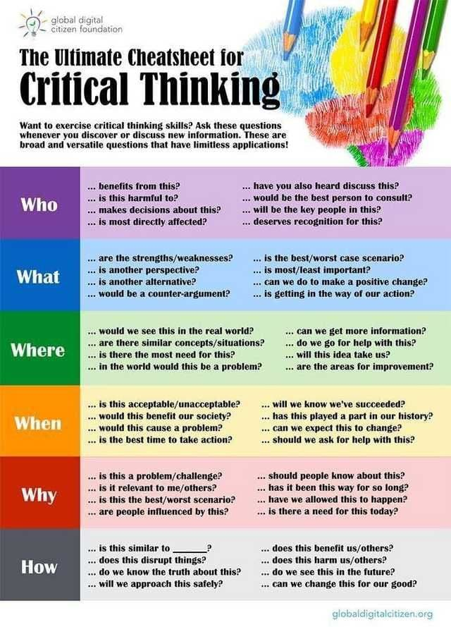

---
## Resources

{:refdef: style="text-align: center;"}

{:refdef }

[Critical Reasoning for Beginners](https://podcasts.ox.ac.uk/series/critical-reasoning-beginners)
Released 2010 by Marianne Talbot, Director of Studies in Philosophy in Continuing Education at Oxford University, a 6-week course.
Available on YouTube and podcast.

---

[Why your brain never runs out of problems to find](https://theconversation.com/why-your-brain-never-runs-out-of-problems-to-find-98990)
June 28, 2018 2.00pm EDT

"To study how concepts change when they become less common, we brought volunteers into  our laboratory and gave them a simple task – to look at a series of computer-generated faces and decide which ones seem “threatening.” The faces had been carefully designed by researchers to range from very intimidating to very harmless.

As we showed people fewer and fewer threatening faces over time, we found that they expanded their definition of “threatening” to include a wider range of faces. In other words, when they ran out of threatening faces to find, they started calling faces threatening that they used to call harmless. Rather than being a consistent category, what people considered “threats” depended on how many threats they had seen lately.

This kind of inconsistency isn’t limited to judgments about threat. In another experiment, we asked people to make an even simpler decision: whether colored dots on a screen were blue or purple.

As blue dots became rare, people started calling slightly purple dots blue. They even did this when we told them blue dots were going to become rare, or offered them cash prizes to stay consistent over time. These results suggest that this behavior isn’t entirely under conscious control – otherwise, people would have been able to be consistent to earn a cash prize.

After looking at the results of our experiments on facial threat and color judgments, our research group wondered if maybe this was just a funny property of the visual system. Would this kind of concept change also happen with non-visual judgments?

To test this, we ran a final experiment in which we asked volunteers to read about different scientific studies, and decide which were ethical and which were unethical. We were skeptical that we would find the same inconsistencies in these kind of judgments that we did with colors and threat.

Why? Because moral judgments, we suspected, would be more consistent across time than other kinds of judgments. After all, if you think violence is wrong today, you should still think it is wrong tomorrow, regardless of how much or how little violence you see that day.

But surprisingly, we found the same pattern. As we showed people fewer and fewer unethical studies over time, they started calling a wider range of studies unethical. In other words, just because they were reading about fewer unethical studies, they became harsher judges of what counted as ethical.

Why can’t people help but expand what they call threatening when threats become rare? Research from cognitive psychology and neuroscience suggests that this kind of behavior is a consequence of the basic way that our brains process information – we are constantly comparing what is front of us to its recent context.

Instead of carefully deciding how threatening a face is compared to all other faces, the brain can just store how threatening it is compared to other faces it has seen recently, or compare it to some average of recently seen faces, or the most and least threatening faces it has seen. This kind of comparison could lead directly to the pattern my research group saw in our experiments, because when threatening faces are rare, new faces would be judged relative to mostly harmless faces. In a sea of mild faces, even slightly threatening faces might seem scary.

It turns out that for your brain, relative comparisons often [use less energy than absolute measurements](https://www.sciencedirect.com/science/article/abs/pii/S0959438800002373?via%3Dihub). To get a sense for why this is, just think about how it’s easier to remember which of your cousins is the tallest than exactly how tall each cousin is. Human brains have likely [evolved to use relative comparisons in many situations](https://jeb.biologists.org/content/211/11/1792), because these comparisons often provide enough information to safely navigate our environments and make decisions, all while expending as little effort as possible."

> How can people make more consistent decisions when necessary? My research group is currently doing follow-up research in the lab to develop more effective interventions to help counter the strange consequences of relative judgment.
One potential strategy: When you’re making decisions where consistency is important, define your categories as clearly as you can. So if you do join a neighborhood watch, think about writing down a list of what kinds of transgressions to worry about when you start. Otherwise, before you know it, you may find yourself calling the cops on dogs being walked without leashes.

This linked to two really cool studies on energy use and information processing in biological systems:

[Energy as a constraint on the coding and processing of sensory information](https://www.sciencedirect.com/science/article/abs/pii/S0959438800002373?via%3Dihub)
1 August 2001

> Neurons use significant amounts of energy to generate signals. Recent studies of retina and brain connect this energy usage to the ability to transmit information. The identification of energy-efficient neural circuits and codes suggests new ways of understanding the function, design and evolution of nervous systems.

[Energy limitation as a selective pressure on the evolution of sensory systems](https://jeb.biologists.org/content/211/11/1792)
2008

SUMMARY
Evolution of animal morphology, physiology and behaviour is shaped by the selective pressures to which they are subject. Some selective pressures act to increase the benefits accrued whilst others act to reduce the costs incurred, affecting the cost/benefit ratio. Selective pressures therefore produce a trade-off between costs and benefits that ultimately influences the fitness of the whole organism. The nervous system has a unique position as the interface between morphology, physiology and behaviour; the final output of the nervous system is the behaviour of the animal, which is a product of both its morphology and physiology. The nervous system is under selective pressure to generate adaptive behaviour, but at the same time is subject to costs related to the amount of energy that it consumes. Characterising this trade-off between costs and benefits is essential to understanding the evolution of nervous systems, including our own. Within the nervous system, sensory systems are the most amenable to analysing costs and benefits, not only because their function can be more readily defined than that of many central brain regions and their benefits quantified in terms of their performance, but also because recent studies of sensory systems have begun to directly assess their energetic costs. Our review focuses on the visual system in particular, although the principles we discuss are equally applicable throughout the nervous system. Examples are taken from a wide range of sensory modalities in both vertebrates and invertebrates. We aim to place the studies we review into an evolutionary framework. We combine experimentally determined measures of energy consumption from whole retinas of rabbits and flies with intracellular measurements of energy consumption from single fly photoreceptors and recently constructed energy budgets for neural processing in rats to assess the contributions of various components to neuronal energy consumption. Taken together, these studies emphasize the high costs of maintaining neurons at rest and whilst signalling. A substantial proportion of neuronal energy consumption is related to the movements of ions across the neuronal cell membrane through ion channels, though other processes such as vesicle loading and transmitter recycling also consume energy. Many of the energetic costs within neurons are linked to 3Na+/2K+ ATPase activity, which consumes energy to pump Na+ and K+ ions across the cell membrane and is essential for the maintenance of the resting potential and its restoration following signalling. Furthermore, recent studies in fly photoreceptors show that energetic costs can be related, via basic biophysical relationships, to their function. These findings emphasize that neurons are subject to a law of diminishing returns that severely penalizes excess functional capacity with increased energetic costs. The high energetic costs associated with neural tissue favour energy efficient coding and wiring schemes, which have been found in numerous sensory systems. We discuss the role of these efficient schemes in reducing the costs of information processing. Assessing evidence from a wide range of vertebrate and invertebrate examples, we show that reducing energy expenditure can account for many of the morphological features of sensory systems and has played a key role in their evolution.

---
