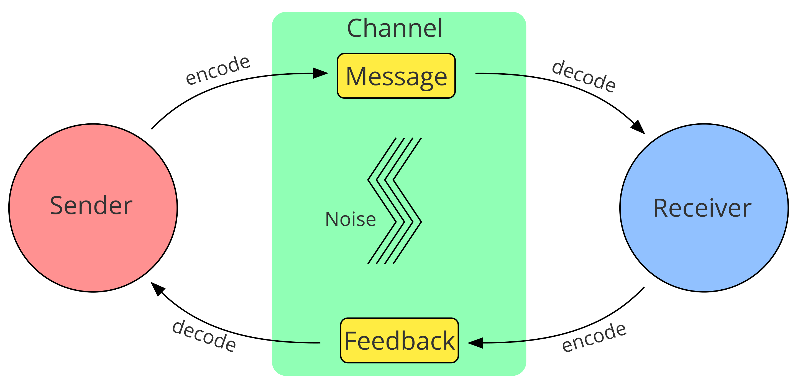

# Epilogue 

What else is there to say? Quite a bit, I'm sure. 

## Reframing Nihilism, Existentialism, and Absurdism in Information Theory

### Information Theory

“Information theory is the mathematical study of the quantification, storage, and communication of information…Information theory studies the transmission, processing, extraction, and utilization of information. Abstractly, information can be thought of as the resolution of uncertainty.”[1](https://en.wikipedia.org/wiki/Information_theory)

“Many basic concepts reappear in the different [communication] models, like "sender", "receiver", "message", "channel", "signal", "encoding", "decoding", "noise", "feedback", and "context".” [2](https://en.wikipedia.org/wiki/Models_of_communication)

“In signal processing, a signal is a function that conveys information about a phenomenon. Any quantity that can vary over space or time can be used as a signal to share messages between observers.” [3](https://en.wikipedia.org/wiki/Signal)

“Language isn’t about hardwired grammars but about near-total freedom, something like a game of charades, with the only requirement being a desire to understand and be understood.” - from The Language Game. [4 - The Language Game: How Improvisation Created Language and Changed the World](https://www.goodreads.com/book/show/57941478-the-language-game)

## Pre-Nihilism

“Essence precedes existence,” born with meaning and purpose. We are a part of God’s plan with a beginning, middle, and end. 

God is the sender of all signals, and we are the receiver. 

Some assumptions:

- God is all-good
- Wants us to understand signals (external world)
- God is the conscious, intentional message sender behind signals
- God created our decoding process which is accurate enough to fulfill our purpose

## Nihilism

There are many different types of nihilism, but we are dealing with existential nihilism, the universe is devoid of meaning. Breakdown of communication assumptions. No intentional consciousness behind messages. Distrustful of the entire process. 

## Existentialism

“Existence precedes essence,” Sartre. Emphasis placed on the decoding process which creates meaning. 
Absurdism (Albert Camus)
Absurdity is exposed in our decoding trying to make sense of a noisy universe. Regularly run into computational reducibility (can find pattern) versus irreducibility (no pattern).[5](https://en.wikipedia.org/wiki/Rule_30) We’re trying to make sense of a stochastic parrot.[6](https://en.wikipedia.org/wiki/Stochastic_parrot)

Camus gives three options:
- Suicide
- Religion (philosophical suicide)
- Embrace absurdity

--- 

There’s also a buddhist answer to meaning which is to not hold the question. If you don’t create a receiver with an open question then there is no pain in being uncertain of an answer. This can be difficult to do if as Absurdism says we are doomed to search for meaning.

The difference I observe in eastern versus western views of meaning is like that of peripheral versus focused vision. In peripheral vision we are taking in the whole of what we see. In focused vision we are looking sharply at a precise target and missing much else. 

Meditation takes us down to a peripheral view. We are swimming in meaning all the time. There’s meaning in signals constantly. Hunger, thirst, socializing, all of our needs and urges propel us forward in a search for feedback from the environment. If you sit long enough meaning will find you. That’s living. 

However, the western mindset is like focusing on the conclusion of a long argument. When we say, “the meaning of life is X.” We run into problems of support for this conclusion. The conclusion appears dissociated from life and living. Many people will not hold the premises or have conflicts of information or values. 

## Flow states

I’m curious what all of these thinkers on meaning would say about flow states which are defined as intrinsically meaningful. In flow states we have the sending and receiving of signals. Taking drawing as an example, there is a feedback between the artist and their drawing. They attempt to encode an image on paper, and the paper sends signals back to the artist on their accuracy in encoding. There’s an error message we are honing. Once the focus of the task is established, to produce an image in mind, each stroke and action falls into place with purpose. 

On an objective level flow states are meaningful in and of themselves as information processing to an intelligent agent. 

I don’t think a younger me would find this answer satisfying. It would feel like there’s something missing as how would we decide which flow activity to engage with? 

## Decision Policies

In AI there’s the study of decision theory which is probability theory + utility theory. Ideally this combination leads to rational actions, what an agent should choose to do. Utility theory is about desires and values. 
If we look at the flow state as discussed previously:

1. Knowing what to do
1. Knowing how to do it
1. Knowing how well you are doing

Steps 1 and 3, knowing what to do and knowing how well you are doing are really about utility theory as well. These are values. 

Essentially I’ve really struggled with this due to early childhood trauma. I’ve also had late childhood trauma, and adult trauma. A lot of varieties. I’m up to my eyeballs in traumaI think our parents and caregivers play an important psychological role in shaping our internal utility theory which shapes our decision policies for actions. So key components of the flow state for living were empty for me. Much of my work has been a long search for objective values I feel safe and assured in trusting.

It’s a weird experience to realize the majority of my personality is a reaction to trauma. There’s something called the Neuro-Affective Relational Model (NARM) approach which identifies five survival styles based on the time of trauma in development:

- Connection (to self, body, others)
- Attunement (to needs)
- Trust
- Autonomy
- Love and Sexuality

There are subtypes to each survival style. At the connection level there is spiritual and logical. Both types search for meaning. I think meaning is about understanding and value. Meaning is a story we tell ourselves. Understanding is explanation and prediction, how we understand our past to predict ourselves into the future. Meaning is like a glue or structure formed in our minds that enables us to find a state of flow. I wonder if neurotypical people with secure attachment are in flow with life. 

What I want from the meaning of life is to understand myself, my place, and my direction. With meaning I feel I can move forward. For the most part I believe I’ve found it with a strong, objective base. 

All of this to say thank you for joining me on my journey. It’s time for me to live life in a present way. It’s likely you have some trauma if like me meaning is such a serious concern for you. I hope this has helped you and you can build from it. I hope you can heal.

May you be happy. May you be free from suffering. 

