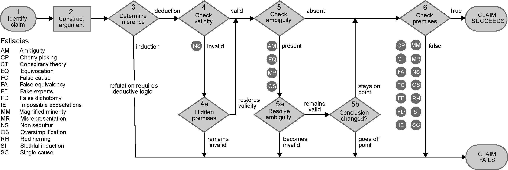

Here's [interesting work on climate denialism](https://www.researchgate.net/publication/322955211_Deconstructing_climate_misinformation_to_identify_reasoning_errors) by John Cook, Peter Ellerton and David Kinkead.

{:refdef: style="text-align: center;"}

February 2018 | [DOI: 10.1088/1748-9326/aaa49f](https://www.researchgate.net/publication/322955211_Deconstructing_climate_misinformation_to_identify_reasoning_errors) | CC BY 4.0
{: refdef}

### Abstract

> Misinformation can have significant societal consequences. For example, misinformation about climate change has confused the public and stalled support for mitigation policies. When people lack the expertise and skill to evaluate the science behind a claim, they typically rely on heuristics such as substituting judgment about something complex (i.e. climate science) with judgment about something simple (i.e. the character of people who speak about climate science) and are therefore vulnerable to misleading information. Inoculation theory offers one approach to effectively neutralize the influence of misinformation. Typically, inoculations convey resistance by providing people with information that counters misinformation. In contrast, we propose inoculating against misinformation by explaining the fallacious reasoning within misleading denialist claims. We offer a strategy based on critical thinking methods to analyse and detect poor reasoning within denialist claims. This strategy includes detailing argument structure, determining the truth of the premises, and checking for validity, hidden premises, or ambiguous language. Focusing on argument structure also facilitates the identification of reasoning fallacies by locating them in the reasoning process. Because this reason-based form of inoculation is based on general critical thinking methods, it offers the distinct advantage of being accessible to those who lack expertise in climate science. We applied this approach to 42 common denialist claims and find that they all demonstrate fallacious reasoning and fail to refute the scientific consensus regarding anthropogenic global warming. This comprehensive deconstruction and refutation of the most common denialist claims about climate change is designed to act as a resource for communicators and educators who teach climate science and/or critical thinking.

---

[5 Types of Climate Denial](https://www.philosophytalk.org/blog/five-types-climate-change-deniers ) - from philosophytalk.org
1. The Deceiver
1. The Deceived
1. The Self-Deceived
1. The Skeptic
1. The Truly Ignorant

---

Jem Bendell wrote on the [forms of denial](https://jembendell.com/2018/08/20/barriers-to-dialogue-on-deep-adaptation/) he faced in his discussions. Though he admits "...I will instead share a purely layman’s perspective of the attitudes and responses I have encountered," rather than rigorously addressing logical flaws.

---
