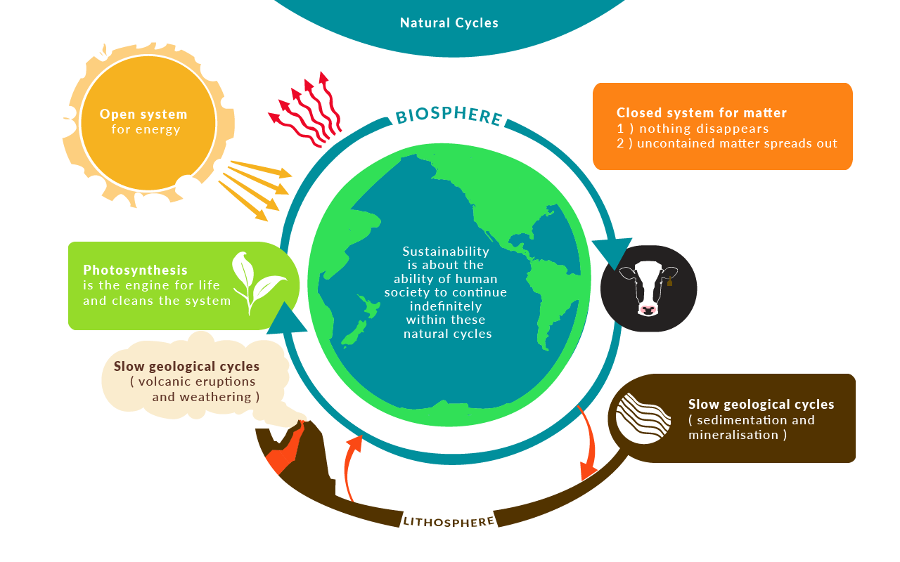
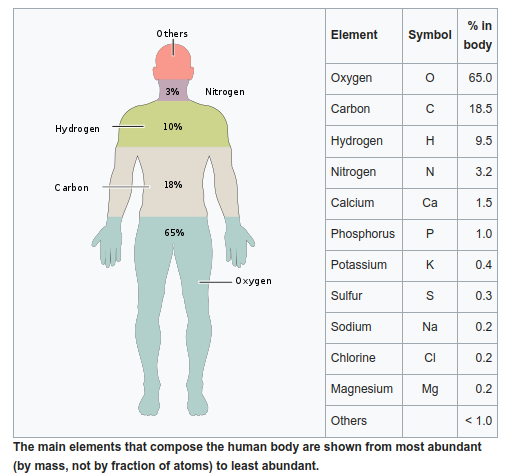
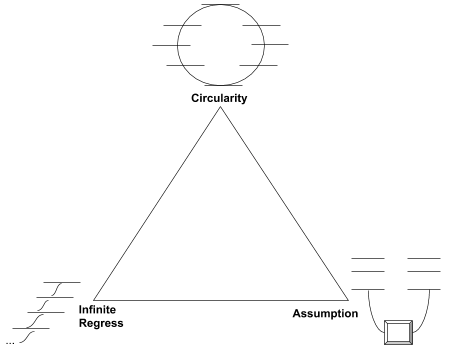
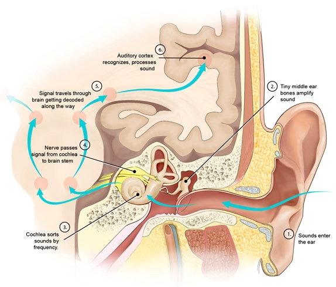
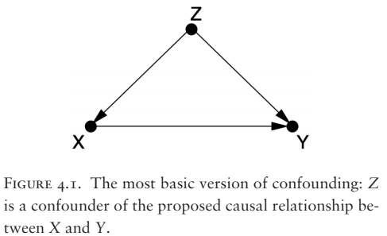
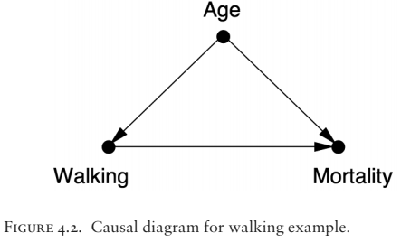

Here is my attempt to answer the question of the meaning of life.

I'm a person who's had a lot of time to think and reflect on life and my experience. I've searched for meaning my whole life. Any talk of meaning has focused my attention.

If you think the answer will bring you peace, tranquility, or happiness, then I will tell you this:

Love. Love yourself, love other people, love your work.

I strongly recommend the book [The Happiness Hypothesis](https://en.wikipedia.org/wiki/The_Happiness_Hypothesis) by Jonathan Haidt. The author compares the findings of modern science with the wisdom of ancient philosophies and cultures.

Accept that you are a human being with needs. Humans are driven by a lack of needs on different levels. [Maslow's hierarchy of needs](https://en.wikipedia.org/wiki/Maslow%27s_hierarchy_of_needs) provides a list.

Which needs dominate our lives depends on our development over the life span.

Reflect on what need is missing from your life and work to satisfy it.

The level beyond a lack of needs is a state of flow.

Haidt proposes the equation for happiness as: H = S + C + V

H = Happiness
S = your biological set point of emotions
C = circumstances
V = voluntary actions

We mostly need to invest work and energy into our voluntary actions to make ourselves as happy as we desire.

The work of [Shaolin Master Shi Heng Yi](https://www.youtube.com/watch?v=4-079YIasck) provides a guide on self-mastery:

### 5 Hindrances to Self-Mastery

1. Sensual desire (sight/touch/taste/smell/hearing) = Am I addicted?
2. Ill will / aversion = Am I feeling a negative emotion?
3. Dullness / heaviness = Am I unmotivated?
4. Restlessness = Is my mind jumping from thought to thought?
5. Sceptical doubt = Am I indecisive?

### Rain

Recognize which hindrance you're experiencing
Accept what you're experiencing
Investigate why you're experiencing the hindrance
Non-identify with the experience: 'I am not the body, I am not the mind, I am not my emotion'

If you find this answer satisfying, I suggest you stop now. I wish you a good life.

---

As for the truest, most objective, most accurate description of reality and the meaning of life, before I get into it I would sincerely like you to consider that it may shake you to your core. As I will explain, the average person is full of delusions and lives on the basis of ignorance and lies. They are productive lies, but inaccurate to the most faithful description of reality.

When I speak of reality, I divide our experience into three parts, objective, subjective, and inter-subjective. To explain the divisions, imagine an island in the ocean, small and big enough for one person. However, there are no humans or animals on the island. We can describe and talk about what is there even though we can imagine no humans there to use language to describe it. We can talk of grains of sand, the ocean waves, the plants. Whatever we can discuss without involving a human being existing there is objective reality. I believe the world and universe continues to exist even if we aren't around to experience it. Now the subjective experience is when a human being appears on the island.

Let's imagine one person. One person on the island is another part of objective reality. We are a part of objective reality, a complex part. We also have feelings, memories, thoughts, and all kinds of phenomena when we're awake. There's something it's like to see the color of a ripe mango. There's something it's like to lay on the sand and feel the warmth of the sun. Whatever we imagine and talk about that requires at least one person, that's subjective reality on top of objective reality. However, subjective experience is in the space of minds which apparently have different qualities than most of objective reality. The space of ideas is as diverse as we can feel and communicate.

Whatever phenomena requires two or more people, that is inter-subjective reality. What phenomena are inter-subjective? Well, perhaps if only one human were on an island, that person wouldn't need language. Cats, dogs, and many other animals don't talk to themselves. It seems most of language is about communicating on a complex level about objective and subjective reality with other similarly complex creatures. We talk about what we experience (objective) and what we're feeling (subjective). So complex communication creates a pattern of behavior. A pattern of behavior being an event we experience and predict with regularity. Two people can agree on an idea, like money. Even on an island, two people can agree blue sea shells are equal in value to one mango. If one gives the other a blue shell, the other agrees to give a mango.

Consider the standard currency of America, the $1 bill. Imagine this bill alone on an island with no people. Does it possess any value or effect on its own? What is the objective description of the money? It is a rectangular piece of rare paper with ink designs bonded to the surface. After sometime it will disintegrate like all wood and paper. What about with the bill and one person on the island? Now something else is happening, the person is perceiving the bill. There's subjective phenomena occurring with whatever the person experiences. Now think of the phenomena when two people on the island exchange the bill for other things. We live in a world where millions and billions of humans agree on a shared experience and perception of reality. Now the rectangular piece of paper with special ink designs can cause so many events, freedom, food, shelter, violence, destruction, and everything money involves. Money is a part of reality, but it is almost a life separate from objective reality. The value of money is in our minds and carried out in our behavior.

As we have described money on an analysis of three levels of reality, we can split our memories and experience into an analysis by three parts. Investigations into the three parts of experience in science are described by:

- Objective reality
  - Physics giving rise to chemistry giving rise to biology

- Subjective reality
  - Psychology arising from biology.

- Inter-subjective
  - Psychology giving rise to mass psychology, sociology, and the social sciences

So we can analyze experience on each level of reality. With gender, there is an objective level at which we can categorize creatures. Let's discuss human beings. Men and women have differently shaped bodies and expressions. Our DNA can be categorized as XX and XY. Many things are independent of what we individually and collectively think or feel. There is also a subjective sense of gender, what we believe we should or should not do. The brain reacts and operates differently depending on the hormone balance in the body, causing a change in its function. How our subjective sense expresses itself is often a function of the social level, inter-subjectivity. There are patterns of behavior accepted as masculine or feminine, and these change across time and cultures. Notice that if we were to compare a woman from 10,000 years ago with a woman of modern times, biologically we will see many similarities in hormone profile, shape, etc. However, the culture has changed dramatically. Even in modern times, one country to another can have great dissimilarity. However, biological sex exists on the objective level, sexual and gender identity exists on the subjective level (on top of the objective level), and gender norms exist on the inter-subjective level.

Looking at money, much of what money is and how it effects change in the world is not on the objective level. The value of money tracks in the beliefs and behaviors of humans.

---

How did objective reality come to be? How did life start? These are difficult questions. For an individual, we are limited by our personal experience and subjectivity. We experience the world through our own senses. If the average human lifetime is 50 years, how can we soundly infer what has happened before us and what will happen after?

To simplify the question, let's start with very basic rules for a "universe."

Imagine the above grid spread out in all directions. Each square represents either a living cell or a dead spot. Let's say the white parts are dead, and the black parts are living cells. The way the grid starts at moment zero, the beginning of the universe, is randomly assigned. Some cells will be alive and some will be dead. Now, [here are the rules of this basic universe](https://en.wikipedia.org/wiki/Conway%27s_Game_of_Life):

1. Any live cell with two or three neighbors survives.
2. Any dead cell with three live neighbors becomes a live cell.
3. All other live cells die in the next generation. Similarly, all other dead cells stay dead.

With every "tick," every moment after the start, the rules are applied to each cell on the grid at the current moment. Please take a moment to apply these rules to the grid above.

Of course, we can get a computer to calculate these rules on a much larger grid. From these three rules, what do you expect to see? Really try to imagine the possibilities. How much will the living cells spread and move? With there be something like groups of cells moving across the grid? Can we make a stable formation that will never change or die? What's a weird looking group that could pop up? Will the grid just be flashing lights of cells popping in and out with no forms?

The answer isn't obvious to me. The easier way to know what will happen is to run the simulation and see what we get. Some people have let the simulation run for days on a vast grid and cataloged what happens.

[Patterns](https://en.wikipedia.org/wiki/Conway%27s_Game_of_Life#Examples_of_patterns)

There was never a specific design for any of these patterns. They occur from the initial state and the rules on that state. The results are fascinating as "creatures," groups of connected cells, interact with each other. There are self-replicating creatures which create new groups of cells which are sent off.

{:refdef: style="text-align: center;"}

 A pattern called Gosper's glider gun.
{: refdef}

Do you think a computer could arise from these three simple rules? In fact, a computer can arise without intervention or design, a Turing machine. Conway's game of life is Turing complete, and can simulate any Turing machine. This means any algorithm can be carried out by a complex enough group of cells in the game. So groups of cells can self-replicate and carry out programs, processing information, all from three simple rules.

A large part of this demonstration is to show what properties can arise from simple operations. I didn't expect to see so many incredible patterns. Consider the universe we inhabit. What are the basic rules that govern this universe? [Here's a list of fundamental physics formulas.](https://en.wikiversity.org/wiki/Fundamental_Physics/Formulas)

Instead of a few basic rules, humans have discovered many laws governing the transfer of energy, heat, motion, etc. We could hardly predict what would come about from three simple rules, so what can we expect from hundreds of laws interacting? Our ideas of cells were extremely simple, alive or dead. Physics gives rise to all the elements on the periodic table with their interactions.

---

To gain an understanding of life and the world, we need an understanding of [thermodynamics](https://en.wikipedia.org/wiki/Thermodynamics). "Thermodynamics is a branch of physics that deals with heat and temperature, and their relation to energy, work, radiation, and properties of matter. The behavior of these quantities is governed by the four laws of thermodynamics which convey a quantitative description using measurable macroscopic physical quantities, but may be explained in terms of microscopic constituents by statistical mechanics," ([https://en.wikipedia.org/wiki/Thermodynamics](https://en.wikipedia.org/wiki/Thermodynamics)).

"The three [laws of thermodynamics](https://en.wikipedia.org/wiki/Laws_of_thermodynamics) define physical quantities (temperature, energy, and entropy) that characterize thermodynamic systems at thermodynamic equilibrium. The laws describe how these quantities behave under various circumstances, and preclude the possibility of certain phenomena (such as perpetual motion)."

"The **first law of thermodynamics** is a version of the law of conservation of energy, adapted for thermodynamic systems.

The law of conservation of energy states that the total energy of an isolated system is constant; energy can be transformed from one form to another, but can be neither created nor destroyed...

The First Law encompasses several principles:

- The law of conservation of energy.
- The concept of internal energy and its relationship to temperature.
- Work is a process of transferring energy to or from a system in ways that can be described by macroscopic mechanical forces exerted by factors in the surroundings, outside the system.
- When matter is transferred into a system, that masses' associated internal energy and potential energy are transferred with it.
- The flow of heat is a form of energy transfer. Heating is a natural process of moving energy to or from a system other than by work or the transfer of matter. Direct passage of heat is only from a hotter to a colder system.

Combining these principles leads to one traditional statement of the first law of thermodynamics: it is not possible to construct a machine which will perpetually output work without an equal amount of energy input to that machine. Or more briefly, a perpetual motion machine of the first kind is impossible."

"The **second law of thermodynamics** indicates the irreversibility of natural processes, and, in many cases, the tendency of natural processes to lead towards spatial homogeneity of matter and energy, and especially of temperature. It can be formulated in a variety of interesting and important ways.

It implies the existence of a quantity called the entropy of a thermodynamic system. In terms of this quantity it implies that

_When two initially isolated systems in separate but nearby regions of space, each in thermodynamic equilibrium with itself but not necessarily with each other, are then allowed to interact, they will eventually reach a mutual thermodynamic equilibrium. The sum of the entropies of the initially isolated systems is less than or equal to the total entropy of the final combination. Equality occurs just when the two original systems have all their respective intensive variables (temperature, pressure) equal; then the final system also has the same values._

The second law is applicable to a wide variety of processes, reversible and irreversible. All natural processes are irreversible. Reversible processes are a useful and convenient theoretical fiction, but do not occur in nature...

Entropy may also be viewed as a physical measure of the lack of physical information about the microscopic details of the motion and configuration of a system, when only the macroscopic states are known. This lack of information is often described as disorder on a microscopic or molecular scale. The law asserts that for two given macroscopically specified states of a system, there is a quantity called the difference of information entropy between them. This information entropy difference defines how much additional microscopic physical information is needed to specify one of the macroscopically specified states, given the macroscopic specification of the other – often a conveniently chosen reference state which may be presupposed to exist rather than explicitly stated. A final condition of a natural process always contains microscopically specifiable effects which are not fully and exactly predictable from the macroscopic specification of the initial condition of the process. This is why entropy increases in natural processes – the increase tells how much extra microscopic information is needed to distinguish the final macroscopically specified state from the initial macroscopically specified state."

"The **third law of thermodynamics** is sometimes stated as follows:

_The entropy of a perfect crystal of any pure substance approaches zero as the temperature approaches absolute zero._

At zero temperature the system must be in a state with the minimum thermal energy. This statement holds true if the perfect crystal has only one state with minimum energy...

_The entropy of a system approaches a constant value as the temperature approaches zero._"

"The zeroth law of thermodynamics may be stated in the following form:

_If two systems are both in thermal equilibrium with a third system then they are in thermal equilibrium with each other._

The law is intended to allow the existence of an empirical parameter, the temperature, as a property of a system such that systems in thermal equilibrium with each other have the same temperature."

Life can be extensively explained from the implications of these laws.

---

I am strongly influenced by Professor Sid Smith's lecture, [How to Enjoy the End of the World](https://www.youtube.com/watch?v=5WPB2u8EzL8&t=745s) published on Apr 23, 2019.

This lecture had a profound effect on me because of the mathematical and intuitive explanation. He analyzes organisms, societies, and planets based on physics models of energy.

Understanding [entropy](https://en.wikipedia.org/wiki/Entropy) is critical to understanding the world.

"In statistical mechanics, entropy is an extensive property of a thermodynamic system. It is closely related to the number Ω of microscopic configurations (known as microstates) that are consistent with the macroscopic quantities that characterize the system (such as its volume, pressure and temperature). Entropy expresses the number Ω of different configurations that a system defined by macroscopic variables could assume...

The second law of thermodynamics states that the entropy of an isolated system never decreases over time. Isolated systems spontaneously evolve towards thermodynamic equilibrium, the state with maximum entropy. Non-isolated systems, like organisms, may lose entropy, provided their environment's entropy increases by at least that amount so that the total entropy either increases or remains constant. Therefore, total entropy in the Universe does increase. Entropy is a function of the state of the system, so the change in entropy of a system is determined by its initial and final states. In the idealization that a process is reversible, the entropy does not change, while irreversible processes always increase the total entropy.

Because it is determined by the number of random microstates, entropy is related to the amount of additional information needed to specify the exact physical state of a system, given its macroscopic specification. For this reason, it is often said that entropy is an expression of the disorder, or randomness of a system, or of the lack of information about it."

A dissipative structure is embodied energy that takes in exergy (low entropy energy) and expels heat (high entropy energy), according to the arrow of time (tending towards entropy). For instance, a fire is a dissipative structure. The fire uses fuel (exergy) to maintain and grow until the fuel is used. Once the fuel is gone, all exergy has been released as heat. The energy is the same, but the exergy is gone. "One can view the entire universe as a dissipative structure. The big bang released exergy, creating time and space. The feature that is perhaps most characteristic of dissipative structure, including the universe itself, is complexity."

Complexity appears to defy the second law of physics, which is in a closed system entropy will always increase. "Order is never spontaneously produced from disorder. Once a glass breaks, you can't un-break it." Every dissipative structure converts exergy to heat, but it does so based on the rules of energy transfer and the dissipative structure itself.

### We are like fire.

Living creatures are dissipative structures. We are not unlike a fire which consumes all available fuel to expand and maintain itself until there is no more fuel. The fuel needed for life is simply more complex. We require many different kinds of fuel, food, typically other complex dissipative structures like plants and animals, to maintain and grow our own structures, our bodies. The way heat and energy are dissipated from our body is governed by physics and biology, where biology is the study of living dissipative structures. Fire doesn't appear to consciously direct itself just like we don't decide how to sweat or where our blood vessels should grow. Our bodies emerged from a long evolutionary process. Evolutionary processes selected for the rules which govern our bodies, and we need an understanding of evolution to understand life.

Just like how complex patterns emerged in Conway's game of life, so too did life emerge as a complex pattern from an initial state. Do the patterns we see moving across the grid decide which way they go? No, it's clearly an outcome determined by the rules of the game. The story of our life is similar.

### Properties of Dissipative Structures

- All dissipative structures consume exergy, transforming useful energy into less useful energy.

- All dissipative structures give rise to complexity (i.e., they are self-organizing) as an emergent property of the way their inherent rules channel their energy flows.

- No dissipative structure is immortal

Crises can disrupt homeostasis. The more complex a system is the more possibility of a crisis occurring as well a crisis causing a cascade of further crises ultimately unraveling homeostasis.

Assuming a dissipative structure has access to unlimited exergy and no crises, can it go on forever?

"In general no, because they are never static and never go backwards. No natural process is reversible in itself, because entropy always increases, never spontaneously decreases. The same processes that brought a dissipative structure must continue, because energy must continue to flow, increasing complexity. Each increase in complexity has a metabolic cost. As these costs accumulate, eventually the system becomes unsustainable on its energy base and increasingly fragile. At some point, a crisis occurs and there's a complexity collapse. If exergy is still available post-collapse, new dissipative structures will arise anew, typically with significant differences from the old structure."

The biologist [Eugene Odom](https://en.wikipedia.org/wiki/Eugene_Odum) describes this process in ecosystems called ecological succession. Ecosystem means a biological community of interacting organisms and their physical environment. An ecosystem begins on pure rock with small and simple dissipative structures. Eventually the entire ecosystem collapses and ends. A new ecosystem is built on a previous ecosystem. Each community of organisms in the ecosystem alters the environment. "It culminates in a homeostatic ecosystem in which biomass and symbiotic function between organisms are maintained. Maximum that is per unit of energy flow. Nature always optimizes. To repeat, self-organization is directed towards achieving as large and diverse a dissipative structure within the limits set by the available energy input and the prevailing physical conditions. Once homeostasis is achieved, the ecosystem is mature. However, eventually the ecosystem succumbs to its own fragility. A small perturbation in climate, or a fire, or an evolution of a disruptive, invasive, or parasitic species, and all the intricate specializations that lead to the optimization of the structure become in turn the cause of the system's failures. In the long view, this is not a tragedy, but an essential component of the evolutionary process. It's precisely the story of life on this planet with its breathtaking diversity not only across continents, but across time."

Eventually, every organism relies on the whole system to survive. Once the system dies, the individuals die as well. In a similar way to how a fire will burn available fuel, organisms and ecosystems adapt to consume available fuel (exergy), specializing in the process of transforming that useful energy into less useful energy.

---

The below timeline is taken from [Sapiens: A Brief History of Humankind](https://www.ynharari.com/book/sapiens/) by Professor Yuval Noah Harari.

### Timeline of History

Years Before the Present

---
13.5 billion

Matter and energy appear. Beginning of physics. Atoms and molecules appear. Beginning of chemistry.

---
4.5 billion

Formation of planet Earth.

---
3.8 billion

Emergence of organisms. Beginning of biology.

---
6 million

Last common grandmother of humans and chimpanzees.

---
2.5 million

Evolution of the genus Homo in Africa. First stone tools.

---
2 million

Humans spread from Africa to Eurasia. Evolution of different human species.

---
500,000

Neanderthals evolve in Europe and the Middle East.

---
300,000

Daily usage of fire.

---
200,000

Homo sapiens evolves in East Africa.

---
70,000

The Cognitive Revolution. Emergence of fictive language.
Beginning of history. Sapiens spread out of Africa.

---
45,000

Sapiens settle Australia. Extinction of Australian megafauna.

---
30,000

Extinction of Neanderthals.

---
16,000

Sapiens settle America. Extinction of American megafauna.

---
13,000

Extinction of Homo floresiensis. Homo sapiens the only surviving human species.

---
12,000

The Agricultural Revolution. Domestication of plants and animals. Permanent settlements.

---
5,000

First kingdoms, script and money. Polytheistic religions.

---
4,250

First empire – the Akkadian Empire of Sargon.

---
2,500

Invention of coinage – a universal money.
The Persian Empire – a universal political order ‘for the benefit of all humans’.
Buddhism in India – a universal truth ‘to liberate all beings from suffering’.

---
2,000

Han Empire in China. Roman Empire in the Mediterranean. Christianity.

---
1,400

Islam.

---
500

The Scientific Revolution. Humankind admits its ignorance and begins to acquire unprecedented power. Europeans begin to conquer America and the oceans. The entire planet becomes a single historical arena. The rise of capitalism.

---
200

The Industrial Revolution. Family and community are replaced by state and market. Massive extinction of plants and animals.

---
The Present

Humans transcend the boundaries of planet Earth. Nuclear weapons threaten the survival of humankind. Organisms are increasingly shaped by intelligent design rather than natural selection.

---
The Future

Intelligent design becomes the basic principle of life? Homo sapiens is replaced by superhumans?

---

Sapiens begins at the big bang and fast forwards through time to about 2.5 million years ago where it traces homo erectus and the many cousin-species of homo sapiens. What is so impactful to me about this book is how it breaks down the long held hubris of humankind. **"They [humans] were insignificant animals, whose ecological impact was less than that of fireflies or jellyfish."** With homo sapiens appearing just 0.2 million years ago, we likely held a niche spot in the ecosystem similar to the woodpecker. Just like the woodpecker evolved to eat grubs by hammering through dense bark, we might have evolved to eat bone marrow. When an apex predator such as a tiger killed a giraffe, early humans watched as the tiger and pride ate most of the giraffe. Then the hyenas came to eat the remaining parts. Finally, early humans, after looking all around for predators, slunk towards the carcass to eat any remaining tissue and use stone tools to break bones and eat the marrow. That was our niche.

However, for 2 million years from homo erectus to homo sapiens, our brains just kept growing. We are still unsure as the reason why. With the domestication of fire, humans could scare away beasts, keep themselves warm, cook food, and control their environment. One human could easily burn down a forest in a matter of 20 minutes. How did humans control themselves not to destroy everything? Humans learned to do controlled burning which allowed them to pick through charred meat and other foods in the aftermath of a fire.

Of course, cooking food allowed our bodies to absorb the nutrients better. This hints at what was to come, humans getting more resources from the same amount of food or land when compared to other species.

What makes humans so unique is our ability to cooperate flexibly in large numbers. Other swarm and hive creatures cooperate in large numbers, but they all follow simple rules. Humans can learn new rules and collectively change their behaviors. The accumulation of knowledge in various subjects and the depths explored lead me to believe we can give a more detailed and accurate answer to the meaning of life than ever before.

---

Returning to Professor Smith's lecture:

### What about civilization as dissipative structures?

Energy Return on Investment (EROI)

EROI = (total energy acquired) / energy spent to acquire energy

EROI for most creatures is between 1 and 2. An EROI less than 1 is starvation. An EROI towards 2 means growth.

The EROI of hunter-gatherer societies is roughly 1.5. Just enough to form kinship groups, reproduction, and the fastening of a few tools and decorations. The cultural complexity can be impressive, but the social connections are necessarily limited.

Social connections tend to track closely with EROI. Agricultural settlements tend to have an EROI of 4, allowing specializations within the societies not directly related to energy gathering. Complex tools could be developed. Stored food also helps to preserve energy.

Communities tended to over-exploit an agricultural area resulting in reduced yields over time, reducing EROI. Second, successful communities were an inviting target for raiders. This contributed to a second leap in complexity to agriculture-based empires. These empires tend to have an EROI of 6. Empires tend to have a boost in EROI after conquering other settlements, either over-exploiting them or continuing to slowly extract resources. This created highly complex hierarchies and specializations.

However, after all surrounding settlements are conquered they must be administered and garrisoned, taking energy. Diminishing returns set in with settlements being further apart and EROI declines. To combat a declining EROI, taxes tend to increase on agricultural outputs and inexorably leads to resource depletion. Finally, the weakened empire is conquered or falls to pieces.

Example, Rome. The Ancient Roman Empire was especially good at running an empire. Conquest temporarily increased EROI by a factor of 2, but each attempt they made to maintain increased the cost of homeostasis. Only excessive taxation could maintain the metabolic cost of empire. Resource depletion (including human resources) eventually led to permanently declining EROI and complexity (including economic, social, and political/administrative) collapse.

---

Humans occupy a strange place in the ecosystem. We are creatures that have multiplied our EROI's beyond the standard range of [0,2]. Fossil fuels are like batteries which have been slowly charged by the sun over thousands of years.

### We are like water.

Water is an excellent heat conductor. Since we are a slow but dynamic burning fire, we need a way for our body to expel heat (thermal energy) less we burn up too quickly and lose homeostasis to maintain our form in working order. Water saps the heat away from our bodies by changing its state. Water can leave our body through sweating. The sweat beads on our skin and eventually absorbs enough thermal energy that the sweat changes from a liquid state into a gaseous state, evaporating on the skin. Water is how we measure temperature in Celsius. [Under normal atmospheric conditions, water is solid (ice) at 0 degrees Celsius, water vapor at 100 degrees Celsius, and liquid in between](https://www.grc.nasa.gov/WWW/K-12/rocket/state.html).

"In physics, a state of matter is one of the distinct forms in which matter can exist. Four states of matter are observable in everyday life: solid, liquid, gas, and plasma. Many intermediate states are known to exist, such as liquid crystal, and some states only exist under extreme conditions, such as Bose–Einstein condensates, neutron-degenerate matter, and quark–gluon plasma, which only occur, respectively, in situations of extreme cold, extreme density, and extremely high energy. For a complete list of all exotic states of matter, see the list of states of matter.

Historically, the distinction is made based on qualitative differences in properties. Matter in the solid state maintains a fixed volume and shape, with component particles (atoms, molecules or ions) close together and fixed into place. Matter in the liquid state maintains a fixed volume, but has a variable shape that adapts to fit its container. Its particles are still close together but move freely. Matter in the gaseous state has both variable volume and shape, adapting both to fit its container. Its particles are neither close together nor fixed in place. Matter in the plasma state has variable volume and shape, and contains neutral atoms as well as a significant number of ions and electrons, both of which can move around freely.

The term phase is sometimes used as a synonym for state of matter, but a system can contain several immiscible phases of the same state of matter." [State of matter](https://en.wikipedia.org/wiki/State_of_matter)

Every element has a range of temperatures at which it's in a solid state. Passed a melting point, a liquid state. Passed a boiling point, a gas. Finally, a plasma state like the surface of the Sun with electromagnetic properties. There are other states of matter, but these are the ones we typically interact with and categorize as daily reality.

We humans studied these states, but if we think of the island concept to isolate objective reality, what is this constant state of change? On an island with no life, no complex structures, the ocean waves crash against the shore. To describe the location objectively, different elements and molecules in different states of matter are interacting and exchanging energy flows according to the laws of thermodynamics and physics. All the living things which we see around us today came from those early times of our planet's life.

### We are an incredibly complex game of life left on for roughly 3.8 billion years.

Our planet Earth exists in perfect distance from the Sun to allow for complex life structures to arise. The energy from the Sun is like cooking over a fire. The heat is hottest closest and coldest farther away. To cook just right you need the right distance. Too cold and we're frozen where there's not enough changes in matter. Too hot the energy present is so high nothing solid can form. We are in a space that can allow for many states and in a time of homeostasis. There are so many qualities of the universe and our solar system which are in a delicate balance to bring about life.

---

### [The Earth is an open and closed system](https://course.oeru.org/csf101/learning-pathways/from-the-holocene-to-the-anthropocene/the-earth-is-an-open-and-closed-system/)

#### The Earth is a closed system for matter
The Earth is made up of chemical elements – think of the periodic table.  That is a list of all basic elemental materials on our planet.  Because of gravity, matter (comprising all solids, liquids and gases) does not leave the system.  It is a closed box.  And, the laws of thermodynamics, long agreed by scientists, tell us that it’s impossible to destroy matter.  So the chemical matter we have on Earth will always be here.  The important question is, how are those chemicals organised?

#### The Earth is an open system for energy
It is accepted science that the Earth is an open system for energy.  Energy radiates into the Earth’s system, mainly from the sun.  Energy is then radiated back into space from the Earth, with the flows being regulated by the Earth’s atmosphere and ozone layer.  This delicate balanced transfer of energy maintains the surface temperature at a level that is suited to the forms of life that have evolved and currently exist.

{:refdef: style="text-align: center;"}

{: refdef}

---

Scientists say there is no life on Mars, our neighboring planet. There are storms on the surface with tornadoes the size of states and countries here on Earth. Thunderstorms, lightning strikes, and sand cutting through the air at high kilometers per hour. Earth allows for a steadier stream and flow of energy states that allow for complex structures.

Our bodies evolved to be formed of "Almost 99% of the mass of the human body is made up of six elements: oxygen, carbon, hydrogen, nitrogen, calcium, and phosphorus. Only about 0.85% is composed of another five elements: potassium, sulfur, sodium, chlorine, and magnesium. All 11 are necessary for life. The remaining elements are trace elements, of which more than a dozen are thought on the basis of good evidence to be necessary for life. All of the mass of the trace elements put together (less than 10 grams for a human body) do not add up to the body mass of magnesium, the least common of the 11 non-trace elements...Most of the elements needed for life are relatively common in the Earth's crust.," [Composition of the human body
](https://en.wikipedia.org/wiki/Composition_of_the_human_body).

{:refdef: style="text-align: center;"}

{: refdef}

"Carbon is a primary component of all known life on Earth, representing approximately 45–50% of all dry biomass. Carbon compounds occur naturally in great abundance on Earth. Complex biological molecules almost always consist of carbon atoms bonded with other elements, especially oxygen and hydrogen and frequently also nitrogen, phosphorus, and sulfur...Carbon is capable of forming a vast number of compounds, more than any other element, with almost ten million compounds described to date, and yet that number is but a fraction of the number of theoretically possible compounds under standard conditions. For this reason, carbon has often been referred to as the "king of the elements". The enormous diversity of carbon-containing compounds, known as organic compounds, has led to a distinction between them and compounds that do not contain carbon, known as inorganic compounds. The branch of chemistry that studies organic compounds is known as organic chemistry.

Carbon is the 15th most abundant element in the Earth's crust, and the fourth most abundant element in the universe by mass, after hydrogen, helium, and oxygen. Carbon's widespread abundance, its ability to form stable bonds with numerous other elements, and its unusual ability to form polymers at the temperatures commonly encountered on Earth enables it to serve as a common element of all known living organisms." [Carbon-based life](https://en.wikipedia.org/wiki/Carbon-based_life)

We are roughly 70% water. The next time you hold a glass of water, consider what would be left of you if all the water was separated from your body. You would most certainly stop living. Water is essential to the function of our bodies. We would shrivel up to only 30% of our body weight. You would be a dried husk. Looking at the glass of water, how does it create all the wonder of life we experience? What of the carbon that remains? Does this substance hold the secret of living experience? But carbon by itself doesn't appear to hold the spark of life.

The organization and structure of the elements gives rise to our conscious experience. The dynamic pattern of the flow of water, matter, and energy through, in, and around our bodies is the spark of life. A disruption of the structure of our bodies can cause a terminal crisis or trauma. A traumatic brain injury disorganizes the structure of our important organ, disconnecting the knowledge and function developed.

Is the meaning of life simply to burn? Like the universe is a dissipative structure, transforming energy through entropy, are we a miniature version of it? We are like the crackling sparks of a fire. Our lives are so short in comparison to the sun and cosmos, a brief and fleeting flame. Enough of life sparks a new flame for life to persist through time by having children, progeny. Child birth is like a fire whose heat sparks a fire in something near to it, sometimes by touching, sometimes simply by being hot enough. A new flame starts and the original flame dies. No flame burns forever. Even the stars will die.

What is likely to become of the future of our planet, life, and the universe? I highly recommend [TIMELAPSE OF THE FUTURE: A Journey to the End of Time](https://www.youtube.com/watch?v=uD4izuDMUQA). The universe is projected to have [5 eras](https://en.wikipedia.org/wiki/The_Five_Ages_of_the_Universe), the Primordial, Stelliferous, Degenerate, Black Hole, and Dark eras. We currently live in the Stelliferous. "In addition to explaining current cosmological theory, the authors speculate on what kinds of life might exist in future eras of the universe. The speculation is based on a scaling hypothesis, credited to Freeman Dyson, the idea being, that all other things being equal the rate of metabolism—and therefore rate of consciousness—of an organism should be in direct proportion to the temperature at which that organism thrives," [The Five Ages of the Universe](https://en.wikipedia.org/wiki/The_Five_Ages_of_the_Universe).

For more on what's expected, see the [Timeline of the far future](https://en.wikipedia.org/wiki/Timeline_of_the_far_future):

"While the future can never be predicted with absolute certainty, present understanding in various scientific fields allows for the prediction of some far-future events, if only in the broadest outline. These fields include astrophysics, which has revealed how planets and stars form, interact, and die; particle physics, which has revealed how matter behaves at the smallest scales; evolutionary biology, which predicts how life will evolve over time; and plate tectonics, which shows how continents shift over millennia.

All projections of the future of Earth, the Solar System, and the universe must account for the second law of thermodynamics, which states that entropy, or a loss of the energy available to do work, must rise over time. Stars will eventually exhaust their supply of hydrogen fuel and burn out. Close encounters between astronomical objects gravitationally fling planets from their star systems, and star systems from galaxies.

Physicists expect that matter itself will eventually come under the influence of radioactive decay, as even the most stable materials break apart into subatomic particles. Current data suggest that the universe has a flat geometry (or very close to flat), and thus will not collapse in on itself after a finite time, and the infinite future allows for the occurrence of a number of massively improbable events, such as the formation of Boltzmann brains.

The timelines displayed here cover events from the beginning of the 11th millennium to the furthest reaches of future time. A number of alternative future events are listed to account for questions still unresolved, such as whether humans will become extinct, whether protons decay, and whether the Earth survives when the Sun expands to become a red giant."

### Returning to the self

We live on the surface of a water planet tuned to just the right energy levels to allow for an extremely complex change in matter and energy resulting in the observable universe. The constant, ongoing change we call life our blips of energy from one state of energy to another state. Change, information, is a measure of entropy which is the change from moments and times before.

---

blip
/blip/
noun
1.
_an unexpected, minor, and typically temporary deviation from a general trend.
"an upward blip in house prices"_
2.
_a short high-pitched sound made by an electronic device._
- Google

---

Renee Descartes was a philosopher who took doubt to an extreme. He locked himself in a room and systematically questioned his most basic beliefs. He didn't have as advanced physics and explanations for phenomena as we do today, so he believed in a top down approach to an explanation of reality. Like a good tool is created by an intelligent agent, a human with technical skill, Descartes believed as many enlightened people of the day did, an intelligent designer created the observable universe. The complexity of animals, plants, the sky, and everything is so great, the intelligent designer must be greater in complexity still. To craft a boat and paddle takes an experienced human. To craft a universe must be in some proportion greater. God is an intelligent agent who is all good, all knowing, and all powerful. God designed everything.

This is the opposite of the explanation of particle physics which emerges from the most basic units of information up. With the idea of god, Descartes still has doubt about what he can know about his own experience. Things like candles and fire change shape and change how they effect the senses. Candles change in smell and touch. Change leads to defied expectations. Descartes was in a boat with the paddle in the water. The water refracts light, making the sight of the paddle look distorted and wavy. The paddle looked to be a third of a meter long but when pulled out of the water is clearly a meter long and solid. If his sense of sight can be so easily distorted under certain conditions, what about all of his senses? What about the times where all of reality can be distorted, sleeps full of dreams. In a dream, structures and changes we never see in waking life appear real to us for a short time. Upon waking, we realize the dream was not a part of our daily experience. In the moment of the dream, we should be doubting what we experience.

Although in a dream we should doubt all sensory experience, Descartes believed we didn't have reason to doubt mathematical truths. 2 + 2 = 4 whether you are dreaming or not. However, many parts of dreams gives us false confidence in beliefs. What if god is at least not all good. What if god is malevolent and wants to confuse us. God could create a world or a mind in which we are deceived on the most fundamental levels. God could make us believe god is all good with certainty. We could believe that 2 + 2 = 5 with the feeling of absolute certainty. Is there any claim which we cannot doubt?

The only claim Descartes believed to be beyond doubt is that even if we are being deceived, there is a thinking thing, our mind or soul, which is being deceived. In the original Latin, this is _cogito ergo sum_, I think therefore I am. Descartes was confident that he existed.

A later linguist and philosopher, Nietzsche, cast doubt on the _cogito_ claim. Consider the statement 'it is raining.' What is the 'it' which is raining? Is 'it' the clouds? In language, subjects are inferred. Rain and rain drops spontaneously appear. There is no subject that causes or creates the rain. Analogously, perhaps there is no 'I' in _I think therefore I am_; perhaps there is only thinking like there is only raining.

Thus we arrive at the only claim beyond doubt, the only statement we can be certain of: we are at least **a momentary blip of consciousness**.

There is some theoretical backing to these ideas of blips of consciousness.

"The [Boltzmann brain argument](https://en.wikipedia.org/wiki/Boltzmann_brain) suggests that it is more likely for a single brain to spontaneously and briefly form in a void (complete with a false memory of having existed in our universe) than it is for our universe to have come about in the way modern science thinks it actually did. It was first proposed as a reductio ad absurdum response to Ludwig Boltzmann's early explanation for the low-entropy state of our universe.

In this physics thought experiment, a Boltzmann brain is a fully formed brain, complete with memories of a full human life in our universe, that arises due to extremely rare random fluctuations out of a state of thermodynamic equilibrium. Theoretically over a period of time on the order of hundreds of billions of years, by sheer chance atoms in a void could spontaneously come together in such a way as to assemble a functioning human brain. Like any brain in such circumstances, it would almost immediately stop functioning and begin to deteriorate."

Another way of thinking of randomness is to imagine a small image of 32x32 pixels. For simplicity, the pixels are either white or black, on or off, at random. How long would it take for the number 1 to form in the image? Only the pixels showing the 1 would be white. Of course, there are many images that look like white noise, just random white and black dots with no order, but after some time, the 1 will appear recognizable. Given enough time, every possible image that can be constructed out of those pixels will appear. This is similar to how reality is said to pop into existence.

"Bertrand Russell wrote, in The Analysis of Mind: "There is no logical impossibility in the hypothesis that the world sprang into being five minutes ago, exactly as it then was, with a population that 'remembered' a wholly unreal past." - [Omphalos hypothesis](https://en.wikipedia.org/wiki/Omphalos_hypothesis#A_deceptive_creator)

How do we know the universe didn't pop into existence in its current form 5 minutes ago? We might have all of the memories, but those popped into existence when we did too. I can think of no way around this idea, because the point of the thought experiment is that all experience and knowledge outside of the present moment is cut off. If we look to the future to perform some experiment or verify continued existence, the reply is that the present is when we were created.

So what can we derive, what more can we know with the certain truth that we are a momentary blip of consciousness?

Here lies the problem of removing all certainty. Descartes was attempting to form a foundation for further beliefs. If we can have a fundamental belief that is known to be absolutely true and a set of rules which are guaranteed to result in a justified and true belief, then we can have a set of true and justified beliefs beyond doubt. This is the axiomatic approach.

---
Axiom
/ˈaksēəm/
noun
_a statement or proposition which is regarded as being established, accepted, or self-evidently true._
- Google

---

What else can you know based on the statement that existence is at least a momentary blip of consciousness?

For a meaning of life, I want to be certain and justified in the meaning.

[Agrippa’s Trilemma](https://en.wikipedia.org/wiki/M%C3%BCnchhausen_trilemma) is the culmination of [ancient skepticism on justification](https://plato.stanford.edu/entries/skepticism-ancient/#AgrFivMod). In order to have certainty and knowledge, we believe some type of justification must be given. Agrippa’s Trilemma aims to show the failure of justification, and therefore that certainty is unachievable.

The position is that justification is based on three main types:
1. Assumption - Some premises are assumed to be true, typically they are accepted to be self-evident. This rests on an assumption, which does not give us certainty.
2. Infinite regress - Each claim must be supported by another claim, and that supporting claim must in turn be supported by another claim. The third supporting claim must also be supported, _ad infinitum_. Since we must ultimately stop on an unsupported claim, we can never be certain that we have proper support of our claims.
3. Circularity - Instead of an infinite regress, we find that claims support each other in some kind of circular fashion. However, this is widely regarded as a fallacious way of reasoning.

{:refdef: style="text-align: center;"}

{: refdef}

This analysis of justification is top-down instead of bottom-up. We should look closer on how justification evolves.

The ancient Greek philosopher Plato wrote that enlightenment of the mind is like quick illumination of the eyes. When entering a brilliant area our eyes hurt and need to adjust. Similarly, illumination of the mind is painful and takes adjustment.

A summary of one of Plato's famous stories, the [allegory of the cave](https://en.wikipedia.org/wiki/Allegory_of_the_cave).

---

#### Imprisonment in the cave
Plato begins by having Socrates ask Glaucon to imagine a cave where people have been imprisoned from childhood (important to note that they were (based on text) imprisoned from childhood but not from birth). These prisoners are chained so that their legs and necks are fixed, forcing them to gaze at the wall in front of them and not look around at the cave, each other, or themselves (514a–b). Behind the prisoners is a fire, and between the fire and the prisoners is a raised walkway with a low wall, behind which people walk carrying objects or puppets "of men and other living things" (514b). The people walk behind the wall so their bodies do not cast shadows for the prisoners to see, but the objects they carry do ("just as puppet showmen have screens in front of them at which they work their puppets" (514a)[3]). The prisoners cannot see any of what is happening behind them, they are only able to see the shadows cast upon the cave wall in front of them. The sounds of the people talking echo off the walls, and the prisoners believe these sounds come from the shadows (514c).

Socrates suggests that the shadows are reality for the prisoners because they have never seen anything else; they do not realize that what they see are shadows of objects in front of a fire, much less that these objects are inspired by real things outside the cave which they do not see (514b–515a).

The fire, or human made light, and the puppets, used to make shadows, are done by the artists. This can be compared to how illusions are made with light and sound today, with electronics, videos, movies, and 3D visuals. Plato, however, indicates that the fire is also the political doctrine that is taught in a nation state. The artists use light and shadows to teach the dominant doctrines of a time and place.

Also, few humans will ever escape the cave. This is not some easy task, and only a true philosopher, with decades of preparation, would be able to leave the cave, up the steep incline. Most humans will live at the bottom of the cave, and a small few will be the major artists that project the shadows with the use of human-made light.

#### Departure from the cave
Plato then supposes that one prisoner is freed. This prisoner would look around and see the fire. The light would hurt his eyes and make it difficult for him to see the objects casting the shadows. If he were told that what he is seeing is real instead of the other version of reality he sees on the wall, he would not believe it. In his pain, Plato continues, the freed prisoner would turn away and run back to what he is accustomed to (that is, the shadows of the carried objects). He writes "... it would hurt his eyes, and he would escape by turning away to the things which he was able to look at, and these he would believe to be clearer than what was being shown to him."

Plato continues: "Suppose... that someone should drag him... by force, up the rough ascent, the steep way up, and never stop until he could drag him out into the light of the sun." The prisoner would be angry and in pain, and this would only worsen when the radiant light of the sun overwhelms his eyes and blinds him.

"Slowly, his eyes adjust to the light of the sun. First he can only see shadows. Gradually he can see the reflections of people and things in water and then later see the people and things themselves. Eventually, he is able to look at the stars and moon at night until finally he can look upon the sun itself (516a)." Only after he can look straight at the sun "is he able to reason about it" and what it is (516b). (See also Plato's analogy of the sun, which occurs near the end of The Republic, Book VI.[4][5])

####  Return to the cave
Plato continues, saying that the freed prisoner would think that the world outside the cave was superior to the world he experienced in the cave and attempt to share this with the prisoners remaining in the cave attempting to bring them onto the journey he had just endured; "he would bless himself for the change, and pity [the other prisoners]" and would want to bring his fellow cave dwellers out of the cave and into the sunlight (516c).

The returning prisoner, whose eyes have become accustomed to the sunlight, would be blind when he re-enters the cave, just as he was when he was first exposed to the sun (516e). The prisoners, according to Plato, would infer from the returning man's blindness that the journey out of the cave had harmed him and that they should not undertake a similar journey. Plato concludes that the prisoners, if they were able, would therefore reach out and kill anyone who attempted to drag them out of the cave (517a).

---

Plato remains relevant more than 2,500 years after his death because his stories by analogy apply to so many ideas. We are all living in a cave, and most of that cave is our skull. Our head encases our brain, the most complex organ or object in the observable universe. There are holes for sense organs to communicate with the brain, our eyes, nose, ears, and mouth. Our sense of touch travels from all over our body and especially through the spinal cord.

Consider hearing:

{:refdef: style="text-align: center;"}

{: refdef}

Sound must travel through a medium, air. The vibrating air moves tiny hairs inside our ears as well as vibrating a small bone in our inner ear, amplifying the sound. Our brain has dedicated areas to make sense of the sound for more information. What is the source of the sound? Where is its potential location? Our brain attempts to understand, predict, and find meaning in the vibration of the air.

Consider the question: [If a tree falls in a forest and no one is around to hear it, does it make a sound?](https://en.wikipedia.org/wiki/If_a_tree_falls_in_a_forest)

Our brain receives data, bits of information, about the outside world through its sense organs. Consider sight, we see using our eyes. Our eyes are sensors that can detect a narrow width of the energy spectrum. Some creatures see far with clarity, others near sighted, some see better under water or at night. The sense data we receive is processed in our brains. We refine our understanding of the world based on incoming data and our interaction.

We have a hypothesis generated in our brains to fit the data we store in memory. What's the process for refining our prediction based on past information and new, incoming information? The ideas were formally developed by Thomas Bayes. With [Bayesian inference](https://en.wikipedia.org/wiki/Bayesian_inference), we can reduce learning and prediction to calculation. Bayesian inference provides a method for inferring unobserved phenomena.

---

“Critical rationalism is an epistemological philosophy advanced by Karl Popper...Critical rationalism rejects the classical position that knowledge is justified true belief; it instead holds the exact opposite: That, in general, knowledge is unjustified untrue unbelief. It is unjustified because of the non-existence of good reasons. It is untrue, because it usually contains errors that sometimes remain unnoticed for hundreds of years. And it is not belief either, because scientific knowledge, or the knowledge needed to build a plane, is contained in no single person's mind. It is only available as the content of books.” [Critical Rationalism](https://en.wikipedia.org/wiki/Critical_rationalism)

“Critical rationalists hold that scientific theories and any other claims to knowledge can and should be rationally criticized, and (if they have empirical content) can and should be subjected to tests which may falsify them.”

“If [claims to knowledge are] retained, further differentiation may be made on the basis of how much subjection to criticism they have received, how severe such criticism has been, and how probable the theory is, with the least probable theory that still withstands attempts to falsify it being the one to be preferred.”

With verificationism, our intuition is to have the most probable, most corroborated theory. However, Karl Popper and David Miller propose criticisms of justificationism and positivism.

1. Doubts the naive empiricism of induction based on the critical arguments of David Hume. “According to the critical rationalist, if there is a sense in which humans accrue knowledge positively by experience, it is only by pivoting observations off existing conjectural theories pertinent to the observations, or off underlying cognitive schemas which unconsciously handle perceptions and use them to generate new theories...The myth that we induce theories from particulars is persistent because when we do this we are often successful, but this is due to the advanced state of our evolved tendencies. If we were really "inducting" theories from particulars, it would be inductively logical to claim that the sun sets because I get up in the morning, or that all buses must have drivers in them (if you've never seen an empty bus).”

2. “Popper and David Miller showed in 1983 that evidence supposed to partly support a hypothesis can, in fact, only be neutral to, or even be counter-supportive of the hypothesis.” - A proof of the impossibility of inductive probability

Consider the claim: “All swans are white.”

To confirm this hypothesis, we can look for swans and each white swan we find confirms the claim, supposedly adding more support. Now consider the [contrapositive](https://en.wikipedia.org/wiki/Contraposition#Intuitive_explanation) of the claim, “All non-white things are not-swans.” These two claims are logically equivalent; they hold the same truth value, supporting or disproving one effects the other equally. Now we can confirm our claim with anything that is not white.

3. Related to the point above, David Miller, attacks the use of "good reasons" in general (including evidence supposed to support the excess content of a hypothesis). He argues that good reasons are neither attainable, nor even desirable. Basically, Miller asserts that all arguments purporting to give valid support for a claim are either circular or question-begging. That is, if one provides a valid deductive argument (an inference from premises to a conclusion) for a given claim, then the content of the claim must already be contained within the premises of the argument (if it is not, then the argument is ampliative and so is invalid). Therefore, the claim is already presupposed by the premises, and is no more "supported" than are the assumptions upon which the claim rests, i.e. begging the question.

All squares have 4 sides

This shape is a square

Therefore this shape has 4 sides

Notice the conclusion is stated in the premises. The support of the conclusion is equal to the support of the premises.

The justificatory difficulty is also seen in [Agrippa’s trilemma](https://en.wikipedia.org/wiki/M%C3%BCnchhausen_trilemma): arguments are supported by circular reasoning, unattainable infinite regression, or unsupported axioms.

**Key Principles**:
- Criticize our hypotheses/conjectures rationally and empirically (falsify)
- Retain the least probable hypotheses with the highest information content
    - This leaves the hypotheses sensitive to future falsification
- Knowledge and truth are objective
    - But not in the “traditional” sense
    - We can approximate truth

“Critical rationalism rejects the classical position that knowledge is justified true belief; it instead holds the exact opposite: That, in general, knowledge is unjustified untrue unbelief. It is unjustified because of the non-existence of good reasons. It is untrue, because it usually contains errors that sometimes remain unnoticed for hundreds of years. And it is not belief either, because scientific knowledge, or the knowledge needed to build a plane, is contained in no single person's mind. It is only available as the content of books.”

Thought Experiment:
Consider if everyone lost their engineering knowledge. They might have some beliefs, but they are all untrue beliefs. Although the knowledge of engineering books doesn’t cohere with the beliefs of people, humans would eventually learn engineering skills through texts. Therefore knowledge can exist independently of belief in books.

“...scientists gain knowledge not by proofs but by refutations of good conjectures and by replacing them with new and better ones. These new conjectures avoid earlier mistakes, explain more, and invite new tests,” [IEP](https://www.iep.utm.edu/cr-ratio/).

Be bold in your hypotheses so you can be wrong!

---

We have some mental model, a schema, to successfully determine cause and effect. What is it? How does it work?

Consider the relationship of altitude and temperature. The higher up we go away from the surface of the Earth, the colder things get, but the relationship goes one way. If we cool an object down, it doesn't change its altitude, its height. Why does that make sense?

If you ask a child who has only seen buses with a bus driver and ask them, "can there be a bus without a bus driver?" they should answer yes. We intuitively know bus drivers are separate from buses even though 100% of buses in observations have bus drivers, how? Are we justified?

In _The Book of Why: the New Science of Cause and Effect_ Judea Pearl and Dana Mackenzie explain the history of cause and effect. They argue the topic is confused because of a lack of precise language to formulate cause and effect questions. With the right language, we can determine cause and effect. Pearl argues for a three layered explanation of interpreting observations, seeing, doing, and imagining. (See figure 1.2 from the book.)

**1. Seeing (Association)**

Activity: seeing, observing

Questions: _What if I see...?_ How are the variables related? How would seeing X change my belief in Y?

Seeing is pure observation. This is the statistical level of correlation. The majority of animals besides humans are at this stage. Does a scary predator jump out from behind a bush? Associate that bush with the predator and avoid it. Do prey congregate around specific trees? Stick near those trees to find prey.

**2. Doing (Intervention)**

Activity: doing, intervening

Questions: _What if I do...? How?_ What would Y be if I do X? How can I make Y happen?

Doing is interacting with the environment. Cognition is embodied. Tool using creatures that plan are on this level. Consider a toddler with a pair of sunglasses. When wearing the sunglasses visual input is distorted, light is dimmer. With no understanding of why, the toddler might infer the world got darker. What toddler's often do is hold the sunglasses over their eyes, lower them, and put them back on, repeating this process several times noticing the change in observations. Of course with this interaction the cause for the change is controlled. The visual change occurs with the sunglasses covering the eyes.

**3. Imagining (Counterfactuals)**

Activity: imagining, retrospection, understanding

Questions: _What if I had done...? Why?_ Was it X that caused Y? What if X had not occurred? What if I had acted differently?

Imagination is the highest level of understanding. "Counterfactual learners, on the top rung, can imagine worlds that do not exist and infer reasons for observed phenomena."

Pearl once believed as many others that Bayesian rationalist was the highest form of rationality and the basis for all of our reasoning. He worked on Bayesian networks and learned their limitations. Through decades of research in the field of cause and effect with many colleagues, scientists and mathematicians discovered a proof of "do calculus." By applying a cause and effect schema, a model, we can properly account for confounding variables, unknown causes and effects. We can bypass needing to intervene (do) on an observational study (seeing) straight to counterfactual reasoning (imagination and understanding). We can infer cause and effect from observational studies. One example is _does smoking cause lung cancer?_ Here we have an important health question which we should establish a cause and effect relationship for.

{:refdef: style="text-align: center;"}

{: refdef}

{:refdef: style="text-align: center;"}

{: refdef}

---

So far much of this explanation is objective. For many this will not help our personal woes or provide direction. We expect the meaning of life to tell us what we _should_ be doing. First we will attempt to explain why we are currently doing what we are doing.

I found the work of Juergen Schmidhuber incredible. In his paper, [Driven by Compression Progress: A Simple Principle Explains Essential Aspects of Subjective Beauty, Novelty, Surprise, Interestingness, Attention, Curiosity, Creativity, Art, Science, Music, Jokes](https://arxiv.org/abs/0812.4360), Schmidhuber gives an algorithmic framework of the drive of all intelligent creatures.

The abstract:
> I argue that data becomes temporarily interesting by itself to some self-improving, but computationally limited, subjective observer once he learns to predict or compress the data in a better way, thus making it subjectively simpler and more beautiful. Curiosity is the desire to create or discover more non-random, non-arbitrary, regular data that is novel and surprising not in the traditional sense of Boltzmann and Shannon but in the sense that it allows for compression progress because its regularity was not yet known. This drive maximizes interestingness, the first derivative of subjective beauty or compressibility, that is, the steepness of the learning curve. It motivates exploring infants, pure mathematicians, composers, artists, dancers, comedians, yourself, and (since 1990) artificial systems.

A simple example of compression is:
“For example, if you receive a data package which contains "AAAAABBBB", you could compress that into "5A4B", which has the same meaning but takes up less space. This type of compression is called "run-length encoding", because you define how long the "run" of a character is. In the above example, there are two runs: a run of 5 A's, and another of 4 B's,” [Data Compression](https://simple.wikipedia.org/wiki/Data_compression).

In the human case, our data stream is not a sequence of letters but the whole of our experience, our thoughts, feelings, and sensations. Our encoding, decoding, and compression scheme is still not fully known. However, the algorithmic framework is given in section 1.2 as follows (with citations removed):

1. **Store everything**. During interaction with the world, store the entire raw history of actions and sensory observations including reward signals—the data is holy as it is the only basis of all that can be known about the world. To see that full data storage is not unrealistic: A human lifetime rarely lasts much longer than 3×10^9 seconds. The human brain has roughly 10^10 neurons, each with 10^4 synapses on average. Assuming that only half of the brain’s capacity is used for storing raw data, and that each synapse can store at most 6 bits, there is still enough capacity to encode the lifelong sensory input stream with a rate of roughly 10^5 bits/s, comparable to the demands of a movie with reasonable resolution. The storage capacity of affordable technical systems will soon exceed this value. If you can store the data, do not throw it away!

2. **Improve subjective compressibility**. In principle, any regularity in the data history can be used to compress it. The compressed version of the data can be viewed as its simplifying explanation. Thus, to better explain the world, spend some of the computation time on an adaptive compression algorithm trying to partially compress the data. For example, an adaptive neural network may be able to learn to predict or postdict some of the historic data from other historic data, thus incrementally reducing the number of bits required to encode the whole.

3. **Let intrinsic curiosity reward reflect compression progress**. The agent should monitor the improvements of the adaptive data compressor: whenever it learns to reduce the number of bits required to encode the historic data, generate an intrinsic reward signal or curiosity reward signal in proportion to the learning progress or compression progress, that is, the number of saved bits.

4. **Maximize intrinsic curiosity reward**. Let the action selector or controller use a general Reinforcement Learning (RL) algorithm (which should be able to observe the current state of the adaptive compressor) to maximize expected reward, including intrinsic curiosity reward. To optimize the latter, a good RL algorithm will select actions that focus the agent’s attention and learning capabilities on those aspects of the world that allow for finding or creating new, previously unknown but learnable regularities. In other words, it will try to maximize the steepness of the compressor’s learning curve. This type of active unsupervised learning can help to figure out how the world works.

Section 1.3 discusses the relation to external reward. The description given applies to internal rewards, curiosity, satisfaction, but "Of course, the real goal of many cognitive systems is not just to satisfy their curiosity, but to solve externally given problems. Any formalizable problem can be phrased as an RL problem for an agent living in a possibly unknown environment, trying to maximize the future external reward expected until the end of its possibly finite lifetime."

In many contexts, we live in a rare reward environment. One way of focusing and directing our actions is through our internal rewards of compression until an external (rare) reward is reached.

Section 2 discusses the consequences of the compression progress drive which Schmidhuber argues intelligence and cognition are by-products of.

2.1 Compact Internal Representations or Symbols as By-Products
of Efficient History Compression

> "To compress the history of observations so far, the compressor (say, a predictive neural network) will automatically create internal representations or _symbols_ (for example, patterns across certain neural feature detectors) for things that frequently repeat themselves. Even when there is limited predictability, efficient compression can still be achieved by assigning short codes to events that are predictable with high probability. For example, the sun goes up every day. Hence it is efficient to create internal symbols such as _daylight_ to describe this repetitive aspect of the data history by a short reusable piece of internal code, instead of storing just the raw data. In fact, predictive neural networks are often observed to create such internal (and hierarchical) codes as a by-product of minimizing their prediction error on the training data."

2.2 Consciousness as a Particular By-Product of Compression
> "There is one thing that is involved in all actions and sensory inputs of the agent, namely, the agent itself. To efficiently encode the entire data history, it will profit from creating some sort of internal _symbol_ or code (e. g., a neural activity pattern) representing the agent itself. Whenever this representation is actively used, say, by activating the corresponding neurons through new incoming sensory inputs or otherwise, the agent could be called _self-aware_ or _conscious_.
This straight-forward explanation apparently does not abandon any essential aspects of our intuitive concept of consciousness, yet seems substantially simpler than other recent views. In the rest of this paper we will not have to attach any particular mystic value to the notion of consciousness—in our view, it is just a natural by-product of the agent’s ongoing process of problem solving and world modeling through data compression, and will not play a prominent role in the remainder of this paper."

2.3 The Lazy Brain’s Subjective, Time-Dependent Sense of Beauty

Schmidhuber argues our subjective sense of beauty is directly proportional to the number of bits required to encode an experience. Think of human faces. One way to efficiently encode human faces is to build a _prototype_ face. New faces are compared to the prototype which has proportions as an average of every face seen to that point in time. The more a face is like the prototype, the less information is needed to encode the face, thus the face feels beautiful to the observer. "...in principle, the compressor may exploit any regularity for reducing the number of bits required to store the data."

A face which is symmetrical on each side from the center will be very beautiful if the encoding of the face can be compressed to nearly half the size since the face can mostly be mirrored with one half of the face.

"Generally speaking, among several sub-patterns classified as _comparable_ by a given
observer, the subjectively most beautiful is the one with the simplest (shortest) description, given the observer’s current particular method for encoding and memorizing it. For example, mathematicians find beauty in a simple proof with a short
description in the formal language they are using. Others like geometrically simple,
aesthetically pleasing, low-complexity drawings of various objects.

This immediately explains why many human observers prefer faces similar to their
own. What they see every day in the mirror will influence their subjective prototype
face, for simple reasons of coding efficiency."

2.4 Subjective Interestingness as First Derivative of Subjective Beauty: The Steepness of the Learning Curve

"What’s beautiful is not necessarily interesting. A beautiful thing is interesting only as long as it is new, that is, as long as the algorithmic regularity that makes it simple has not yet been fully assimilated by the adaptive observer who is still learning to compress the data better...the first derivative of subjective beauty: as the learning agent improves its compression algorithm, formerly apparently random data parts become subjectively more regular and beautiful, requiring fewer and fewer bits for their encoding. As long as this process is not over the data remains interesting and rewarding."

Think of a [first derivative](https://www.mathsisfun.com/calculus/derivatives-introduction.html) as finding the slope of a line at a single point. The slope tells us the rate of change. In this case, interestingness is the rate of expected compression.

2.6 True Novelty & Surprise vs Traditional Information Theory

Imagine two visual observers where one is kept completely in the dark and one is exposed to a screen of random white noise. The darkness is extremely compressible as it's always the same. The noise is "...highly unpredictable and fundamentally incompressible data. In both cases the data is boring as it does not allow for further compression progress."

2.7 Attention / Curiosity / Active Experimentation

> "In absence of external reward, or when there is no known way to further increase the expected external reward, our controller essentially tries to maximize _true novelty or interestingness_, the _first derivative_ of subjective beauty or compressibility, the steepness of the learning curve. It will do its best to select action sequences expected to create observations yielding maximal expected future compression _progress_, given the limitations of both the compressor and the compressor improvement algorithm. It will learn to focus its attention [96, 116] and its actively chosen experiments on things that are currently still incompressible but are expected to become compressible/predictable through additional learning. It will get bored by things that already are subjectively compressible. It will also get bored by things that are currently incompressible but will apparently remain so, given the experience so far, or where the costs of making them compressible exceed those of making other things compressible, etc."

Here we see the drive to action observed of human infants and other intelligent agents, the second rung of _The Book of Why_'s ladder of understanding, seeing, **doing**, and imagining.

Why do scientists work on smaller problems instead of bigger, universal problems? An explanation is given above, the scientists expect the problem will not be compressible in the near future, so they lose attention and curiosity in that problem.

2.8 Discoveries

"An unusually large compression breakthrough deserves the name _discovery_. For example, as mentioned in the introduction, the simple law of gravity can be described by a very short piece of code, yet it allows for greatly compressing all previous observations of falling apples and other objects."

2.9 Beyond Standard Unsupervised Learning

> "Where there is predictability, compression can be achieved by assigning short codes to those parts of the observations that are predictable from previous observations with high probability. Generally speaking we may say that a major goal of traditional unsupervised learning is to improve the compression of the observed data, by discovering a program that computes and thus explains the history (and hopefully does so quickly) but is clearly shorter than the shortest previously known program of this kind.
Traditional unsupervised learning is not enough though—it just analyzes and encodes the data but does not choose it. We have to extend it along the dimension of active action selection, since our unsupervised learner must also choose the actions that influence the observed data, just like a scientist chooses his experiments, a baby its toys, an artist his colors, a dancer his moves, or any attentive system its next sensory input. That’s precisely what is achieved by our RL-based framework for curiosity and creativity."

2.10 Art & Music as By-Products of the Compression Progress Drive

> "Good observer-dependent art deepens the observer’s insights about this world or possible worlds, unveiling previously unknown regularities in compressible data, connecting previously disconnected patterns in an initially surprising way that makes the combination of these patterns subjectively more compressible (art as an eye-opener), and eventually becomes known and less interesting. I postulate that the active creation and attentive perception of all kinds of artwork are just by-products of our principle of interestingness and curiosity yielding reward for compressor improvements...
Artificial or human observers must perceive art sequentially, and typically also actively, e.g., through a sequence of attention-shifting eye saccades or camera movements scanning a sculpture, or internal shifts of attention that filter and emphasize sounds made by a pianist, while surpressing background noise. Undoubtedly many derive pleasure and rewards from perceiving works of art, such as certain paintings, or songs. But different subjective observers with different sensory apparati and compressor improvement algorithms will prefer different input sequences. Hence any objective theory of what is good art must take the subjective observer as a parameter, to answer questions such as: Which sequences of actions and resulting shifts of attention should they execute to maximize their pleasure? According to our principle they should select one that maximizes the quickly learnable compressibility that is new, relative to their current knowledge and their (usually limited) way of incorporating / learning / compressing new data."

2.15 How Artists and Scientists are Alike

> "From our perspective, scientists are very much like artists. They actively select experiments in search for simple but new laws compressing the resulting observation history. In particular, the _creativity_ of painters, dancers, musicians, pure mathematicians, physicists, can be viewed as a mere by-product of our curiosity framework based on the compression progress drive. All of them try to create new but non-random, non-arbitrary data with surprising, previously unknown regularities. For example, many physicists invent experiments to create data governed by previously unknown laws allowing to further compress the data. On the other hand, many artists combine well-known objects in a subjectively novel way such that the observer’s subjective description of the result is shorter than the sum of the lengths of the descriptions of the parts, due to some previously unnoticed regularity shared by the parts.
What is the main difference between science and art? The essence of science is to _formally nail down_ the nature of compression progress achieved through the discovery of a new regularity. For example, the law of gravity can be described by just a few symbols. In the fine arts, however, compression progress achieved by observing an artwork combining previously disconnected things in a new way (art as an eye-opener) may be subconscious and not at all formally describable by the observer, who may _feel_ the progress in terms of intrinsic reward without being able to say exactly which of his memories became more subjectively compressible in the process.
The framework in the appendix is sufficiently formal to allow for implementation of our principle on computers. The resulting artificial observers will vary in terms of the computational power of their history compressors and learning algorithms. This will influence what is good art/science to them, and what they find interesting."

2.16 Jokes and Other Sources of Fun

"Just like other entertainers and artists, comedians also tend to combine well-known concepts in a novel way such that the observer’s subjective description of the result is shorter than the sum of the lengths of the descriptions of the parts, due to some previously unnoticed regularity shared by the parts."

3.3 Reward for Relative Entropy between Agent’s Prior and Posterior (1995)

Our intrinsic reward can be related to Bayesian inference in the difference between prior and posterior odds.

5 Conclusion & Outlook

"We pointed out that a surprisingly simple algorithmic principle based on the notions of data compression and data compression _progress_ informally explains fundamental aspects of attention, novelty, surprise, interestingness, curiosity, creativity, subjective beauty, jokes, and science & art in general. The crucial ingredients of the corresponding _formal_ framework are (1) a continually improving predictor or compressor of the continually growing data history, (2) a computable measure of the compressor’s progress (to calculate intrinsic rewards), (3) a reward optimizer or reinforcement learner translating rewards into action sequences expected to maximize future reward."

---

With this framework, many difficult questions can now be answered. Notice the framework contributes to the compression of our history of experience with intelligent agents.

Why are some experiences beautiful to some and not to others? - Because each individual has their own unique experiences which effects their ability to compress new experiences.

Is beauty subjective or objective? - Both. Aspects of beauty will be objective such as geometric regularities which reduce the size of the compressed experience, therefore creating a strong sense of beauty. However, each person has a unique perspective due to their experience and compression ability.

Why are jokes funny to some people and not others? - Jokes combine elements into a previously unrecognized regularity in a connection we haven't seen before. There are jokes specific to a field or time which are unfunny to those not steeped in similar experiences. The reason is clear, jokes appear unfunny when there is no connection to be made in the history of the observer or the connection is already obvious or known. This also explains why old jokes aren't funny once learned.

The reach of the explanatory framework is far and wide with a nearly unending list of examples. Let us return to the meaning of life and apply the framework.

The sense of the meaning of life is dependent on the compression of our history. We look for a unifying explanation for our past experiences and direction of our future.

When our past feels random we are unable to compress the experience in a connected way leading us to a feeling of absurdity in our existence. There appears to be no coherent direction. At this stage, we use words like absurd and random to describe those aspects of our lives which cannot be compressed further. Notice how the framework explains why we lose interest and attention in the question of meaning and often give up the search: the unifying answer appears unobtainable given the time and information we have. Our attention is drawn to immediate or answerable concerns.

Recognize a subjective sense of meaning in life at this time can only come from within. Only you have access to the history of your experience. Only you can compress your life in a subjectively meaningful way. Others can give you ideas and direction, but you must do the information processing yourself. The deep answer to your life can be explained to you by someone else, but that is them observing the information they experience of you and what you are able to express to them, then they apply their internal compressor to condense the history of your experience. Even if their compressed version is meaningful to you, you must do the work of unifying your past experiences in your mind.

The existentialist _Jean-Paul Sartre_ said "existence precedes essence." Many have lived and died believing the opposite, essence precedes existence. Our essence is the unifying direction of our choices. Essence is purpose, what we were made to do, meant to do, but we were not meant or designed for any purpose. We evolved under the constraints of natural selection with all kinds of drives, urges, and desires which lead to exactly the state of the world at every moment. We exist before we have a true essence. Our essence is given to ourselves from the compression of our personal history. We all shape our past, present, and future.

If an intelligent agent wants meaning, they will have to reflect on their history to identify meaningful experiences. If an intelligent agent wants more meaningful direction and control of their future, they must work to adapt their internal representations of the world to direct their actions toward meaning, a cause and effect relationship of their past experiences cohering with expected futures.

Notice we can give multiple descriptions of the same data. From the many equal interpretations we choose one. Our choices can change and evolve over time, but how do we choose an interpretation? How should we? If we want a meaningful life, we should choose a description of our history which opens opportunity for further growth and compression.

physics based equation for intelligence, explanation of morality, we're a greedy algorithm, branching and evolution,

---

# Morality

The three major moral frameworks of philosophy are virtue ethics, consequentialism, and deontology.

Morality is a strategy; it is a way of planning actions to achieve goals. The best moral strategies are dependent on the environment. The most basic moralities must meet survival needs. If a survival strategy leads to extinction, then the belief system of that morality will literally die out.

"When anthropologists like Richard Shweder and Alan Fiske survey moral concerns across the globe, they find that a few themes keep popping up from amid the diversity. People everywhere, at least in some circumstances and with certain other folks in mind, think it’s bad to harm others and good to help them. They have a sense of fairness: that one should reciprocate favors, reward benefactors and punish cheaters. They value loyalty to a group, sharing and solidarity among its members and conformity to its norms. They believe that it is right to defer to legitimate authorities and to respect people with high status. And they exalt purity, cleanliness and sanctity while loathing defilement, contamination and carnality.

The exact number of themes depends on whether you’re a lumper or a splitter, but Haidt counts five — harm, fairness, community (or group loyalty), authority and purity — and suggests that they are the primary colors of our moral sense. Not only do they keep reappearing in cross-cultural surveys, but each one tugs on the moral intuitions of people in our own culture.
...
All this brings us to a theory of how the moral sense can be universal and variable at the same time. The five moral spheres are universal, a legacy of evolution. But how they are ranked in importance, and which is brought in to moralize which area of social life — sex, government, commerce, religion, diet and so on — depends on the culture.

Many of the flabbergasting practices in faraway places become more intelligible when you recognize that the same moralizing impulse that Western elites channel toward violations of harm and fairness (our moral obsessions) is channeled elsewhere to violations in the other spheres. Think of the Japanese fear of nonconformity (community), the holy ablutions and dietary restrictions of Hindus and Orthodox Jews (purity), the outrage at insulting the Prophet among Muslims (authority). In the West, we believe that in business and government, fairness should trump community and try to root out nepotism and cronyism. In other parts of the world this is incomprehensible — what heartless creep would favor a perfect stranger over his own brother?

The ranking and placement of moral spheres also divides the cultures of liberals and conservatives in the United States. Many bones of contention, like homosexuality, atheism and one-parent families from the right, or racial imbalances, sweatshops and executive pay from the left, reflect different weightings of the spheres. In a large Web survey, Haidt found that liberals put a lopsided moral weight on harm and fairness while playing down group loyalty, authority and purity. Conservatives instead place a moderately high weight on all five. It’s not surprising that each side thinks it is driven by lofty ethical values and that the other side is base and unprincipled."

- The Moral Instinct, Steven Pinker, 2008

(Notice how the moral spheres **compress**, unite, and explain moral behavior?)

"The Drake equation is a probabilistic argument used to estimate the number of active, communicative extraterrestrial civilizations in the Milky Way galaxy," [Wikipedia](https://en.wikipedia.org/wiki/Drake_equation). Based on the known values and the assumptions of the unknown, the range of civilizations is between 20 and 100 million.

So why aren't we interacting with aliens right now?

"The Fermi paradox...is the apparent contradiction between the lack of evidence for extraterrestrial civilizations and various high estimates for their probability (such as some optimistic estimates for the Drake equation)," [Wikipedia](https://en.wikipedia.org/wiki/Fermi_paradox).

There are likely a small number of possible ethical systems which can support and sustain civilizations through advanced stages of life.

---

[Function of the brain](https://en.wikipedia.org/wiki/Brain#Function)
"Information from the sense organs is collected in the brain. There it is used to determine what actions the organism is to take. The brain processes the raw data to extract information about the structure of the environment. Next it combines the processed information with information about the current needs of the animal and with memory of past circumstances. Finally, on the basis of the results, it generates motor response patterns. These signal-processing tasks require intricate interplay between a variety of functional subsystems.

The function of the brain is to provide coherent control over the actions of an animal. A centralized brain allows groups of muscles to be co-activated in complex patterns; it also allows stimuli impinging on one part of the body to evoke responses in other parts, and it can prevent different parts of the body from acting at cross-purposes to each other."

- Perception
- Motor control
- Arousal
- Homeostasis
- Motivation
- Learning and memory
  - Working memory
  - Episodic memory
  - Semantic memory
  - Instrumental learning
  - Motor learning

---

Philosophy exists as a reflection on the three levels of reality and how they relate to one another.

---

Returning to objective reality, we can define important and meaningful events. The example of water as entropy is again useful. Water as ice is a low entropy configuration where entropy is the number of ways the atoms can be arranged to create the form of ice. Imagine an ice cube melts into a liquid puddle. The more likely configuration of the puddle is an even circle in all directions. If we were able to follow a specific atom of water, H2O, for instance the atom in the top right corner of the cube, its journey to its place in the configuration of the puddle can take multiple paths. All that matters for the configuration is the position at some time. If that atom took an alternate path and another atom took the original atom's path, we would have a puddle with an indistinguishable form. The entropy of both puddles would be the same at that moment. Configurations with high entropy are common or likely events.

Unlikely events are rare configurations with a small number of paths. Some configurations have one path, one sequence of events, that lead to the arrangement. The meaningful and important events limit the number of possible configurations of matter. With an understanding of cause and effect we can determine which events are necessary or the reason for a configuration. Our universe is like water in that existence has an incredible number of possible configurations, and we exist in this one.

Physicists say observers within a universe will experience it as infinite though it may be finite. Why does we live in this configuration? Perhaps there are multiple universes all existing at the same time. When the string of an instrument is plucked and vibrates the oscillation creates a wave in the air to create sound. If we could slow time to see the oscillation of the string clearly, the string's position would spend most of its time around the center and moving to the farthest distances the least number of times. There could be an incredible number of universes almost exactly like ours taking on the most likely configurations. There are also those universes with rare configurations which would require an increasingly unlikely chain of events, unlikely but not impossible. In the infinity of time and space, if they are infinite, even the rarest probability can occur.

From the inside, our universe appears to be a deterministic state, each moment an effect dependent on the chain of causes prior. Our configuration is set, and we're living through it. The truth appears to be that we are in no more control of our futures than a single atom. Our path simply has an extremely complex number of configurations. Of course we desire certain arrangements more than others. There are universes with no conscious life. There are universes of conscious lives of intense suffering, greatness, flourishing. We have all evolved with drives and desires. We want some futures more than others. From an objective perspective they are all simply the state of events, but subjectively we work towards and hope for events which satisfy our needs and wants.

All we can really do is hope; hope we are in the universe which arranges our lives into a state we want. We can hope our actions and events outside of us are a part of the sequence of events which lead to a desired life, but we are powerless to create change within our universe. The chain of cause and effect from the big bang, the origin of our universe, appears to be unbroken. We are subjective finite beings with imagination. We can understand the moments which will likely lead to desired outcomes, but we can't change what's already in motion.

Subjectively, we will feel as though we are making choices, but our choices are the result of information processing. Life is based on probabilities, and we should choose the positions with the highest likelihood of achieving our goals.

The objective meaning of life is to resist entropy, the inevitable dispersal of energy. We are the types of entities which emerge under complex conditions and evolve. The universe we exist in appears to be a chain reaction from a fraction of a moment after the beginning of the universe. The next moment is a function of the current moment. A future moment can likely only be determined by the passage of each moment to that moment, that is, things must play out cannot be fully predetermined. Our universe may just be one data point in a probability distribution of possible universes.

The personal meaning of life is for all intelligent beings to compress their experiences, process the present, and predict the future with efficiency. Emerging from the objective meaning of life, we can only hope our lives develop in a way we desire. Whether we are able to influence and control our lives and environment is dependent on varying levels of random luck. However, as finite, subjective creatures we feel as though we have choice. The best action we can take is to put ourselves in probabilistically successful positions. Each intelligent being has an individual meaning of life due to their own unique history of experience and the interaction with their environment. Currently, each individual must find their own meaning in life, because they are each in direct access to their own experiences. Where change is desired, the environment should be altered to enable optimization.

The inter-subjective meaning of life is to support the sustainable flourishing of life.
