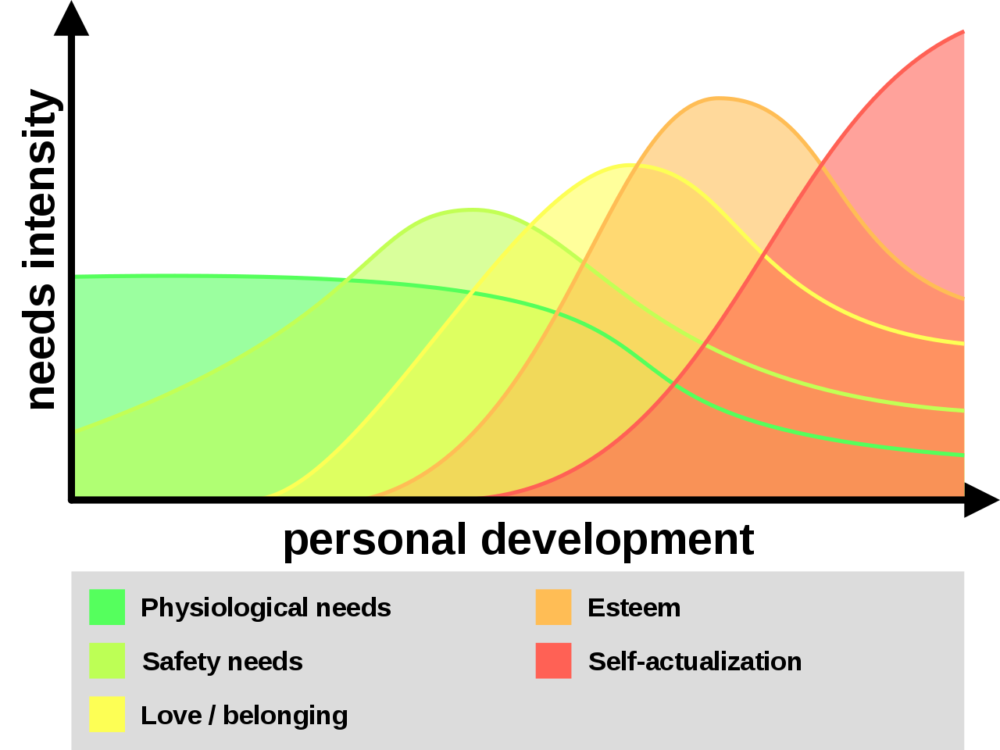
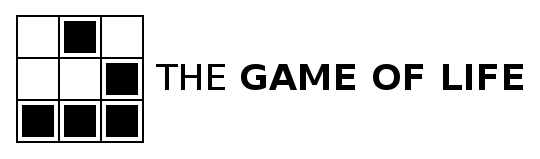

Here is my attempt to answer the question of the meaning of life.

I'm a person who's had a lot of time to think and reflect on life and my experience. I've searched for meaning my whole life. Any talk of meaning has focused my attention.

If you think the answer will bring you peace, tranquility, or happiness, then I will tell you this:

Love. Love yourself, love other people, love your work.

I strongly recommend the book [The Happiness Hypothesis](https://en.wikipedia.org/wiki/The_Happiness_Hypothesis) by Jonathan Haidt. The author compares the findings of modern science with the wisdom of ancient philosophies and cultures.

Accept that you are a human being with needs. Humans are driven by a lack of needs on different levels. [Maslow's hierarchy of needs](https://en.wikipedia.org/wiki/Maslow%27s_hierarchy_of_needs) provides a list.

Which needs dominate our lives depends on our development over the life span.

Reflect on what need is missing from your life and work to satisfy it.

The level beyond a lack of needs is a state of flow.

Haidt proposes the equation for happiness as: H = S + C + V
H = Happiness
S = your biological set point of emotions
C = circumstances
V = voluntary actions

We mostly need to invest work and energy into our voluntary actions to make ourselves as happy as we desire.

If you find this answer satisfying, I suggest you stop now. I wish you a good life.

---

As for the truest, most objective, most accurate description of reality and the meaning of life, before I get into it I would sincerely like you to consider that it may shake you to your core. As I will explain, the average person is full of delusions and lives on the basis of ignorance and lies. They are productive lies, but inaccurate to the most faithful description of reality.

When I speak of reality, I divide our experience into three parts, objective, subjective, and inter-subjective. To explain the divisions, imagine an island in the ocean, small and big enough for one person. However, there are no humans or animals on the island. We can describe and talk about what is there even though we can imagine no humans there to use language to describe it. We can talk of grains of sand, the ocean waves, the plants. Whatever we can discuss without involving a human being existing there is objective reality. I believe the world and universe continues to exist even if we aren't around to experience it. Now the subjective experience is when a human being appears on the island.

Let's imagine one person. One person on the island is another part of objective reality. We are a part of objective reality, a complex part. We also have feelings, memories, thoughts, and all kinds of phenomena when we're awake. There's something it's like to see the color of a ripe mango. There's something it's like to lay on the sand and feel the warmth of the sun. Whatever we imagine and talk about that requires at least one person, that's subjective reality on top of objective reality. However, subjective experience is in the space of minds which apparently have different qualities than most of objective reality. The space of ideas is as diverse as we can feel and communicate.

Whatever phenomena requires two or more people, that is inter-subjective reality. What phenomena are inter-subjective? Well, perhaps if only one human were on an island, that person wouldn't need language. Cats, dogs, and many other animals don't talk to themselves. It seems most of language is about communicating on a complex level about objective and subjective reality with other similarly complex creatures. We talk about what we experience (objective) and what we're feeling (subjective). So complex communication creates a pattern of behavior. A pattern of behavior being an event we experience and predictive with regularity. Two people can agree on an idea, like money. Even on an island, two people can agree blue sea shells are equal in value to one mango. If one gives the other a blue shell, the other agrees to give a mango.

Consider the standard currency of America, the $1 bill. Imagine this bill alone on an island with no people. Does it possess any value or effect on its own? What is the objective description of the money? It is a rectangular piece of rare paper with ink designs bonded to the surface. After sometime it will disintegrate like all wood and paper. What about with the bill and one person on the island? Now something else is happening, the person is perceiving the bill. There's subjective phenomena occurring with whatever the person experiences. Now think of the phenomena when two people on the island exchange the bill for other things. We live in a world where millions and billions of humans agree on a shared experience and perception of reality. Now the rectangular piece of paper with special ink designs can cause so many events, freedom, food, shelter, violence, destruction, and everything money involves. Money is a part of reality, but it is almost a life separate from objective reality. The value of money is in our minds and carried out in our behavior.

As we have described money on an analysis of three levels of reality, we can split our memories and experience into an analysis by three parts. Investigations into the three parts of experience in science are described by:

- Objective reality
  - Physics giving rise to chemistry giving rise to biology

- Subjective reality
  - Psychology arising from biology.

- Inter-subjective
  - Psychology giving rise to mass psychology, sociology, and the social sciences

So we can analyze experience on each level of reality. With gender, there is an objective level at which we can categorize creatures. Let's discuss human beings. Men and women have differently shaped bodies and expressions. Our DNA can be categorized as XX and XY. Many things are independent of what we individually and collectively think or feel. There is also a subjective sense of gender, what we believe we should or should not do. The brain reacts and operates differently depending on the hormone balance in the body, causing a change in its function. How our subjective sense expresses itself is often a function of the social level, inter-subjectivity. There are patterns of behavior accepted as masculine or feminine, and these change across time and cultures. Notice that if we were to compare a woman from 10,000 years ago with a woman of modern times, biologically we will see many similarities in hormone profile, shape, etc. However, the culture has changed dramatically. Even in modern times, one country to another can have great dissimilarity. However, biological sex exists on the objective level, sexual and gender identity exists on the subjective level (on top of the objective level), and gender norms exist on the inter-subjective level.

Looking at money, much of what money is and how it effects change in the world is not on the objective level. The value of money tracks in the beliefs and behaviors of humans.

---

How did objective reality come to be? How did life start? These are difficult questions. For an individual, we are limited by our personal experience and subjectivity. We experience the world through our own senses. If the average human lifetime is 50 years, how can we soundly infer what has happened before us and what will happen after?

To simplify the question, let's start with very basic rules for a "universe."

Imagine the above grid spread out in all directions. Each square represents either a living cell or a dead spot. Let's say the white parts are dead, and the black parts are living cells. The way the grid starts at moment zero, the beginning of the universe, is randomly assigned. Some cells will be alive and some will be dead. Now, [here are the rules of this basic universe](https://en.wikipedia.org/wiki/Conway%27s_Game_of_Life):

1. Any live cell with two or three neighbors survives.
2. Any dead cell with three live neighbors becomes a live cell.
3. All other live cells die in the next generation. Similarly, all other dead cells stay dead.

With every "tick," every moment after the start, the rules are applied to each cell on the grid at the current moment. Please take a moment to apply these rules to the grid above.

Of course, we can get a computer to calculate these rules on a much larger grid. From these three rules, what do you expect to see? Really try to imagine the possibilities. How much will the living cells spread and move? With there be something like groups of cells moving across the grid? Can we make a stable formation that will never change or die? What's a weird looking group that could pop up? Will the grid just be flashing lights of cells popping in and out with no forms?

The answer isn't obvious to me. The easier way to know what will happen is to run the simulation and see what we get. Some people have let the simulation run for days on a vast grid and cataloged what happens.

[Patterns](https://en.wikipedia.org/wiki/Conway%27s_Game_of_Life#Examples_of_patterns)

There was never a specific design for any of these patterns. They occur from the initial state and the rules on that state. The results are fascinating as "creatures," groups of connected cells, interact with each other. There are self-replicating creatures which create new groups of cells which are sent off.

{:refdef: style="text-align: center;"}

 A pattern called Gosper's glider gun.
{: refdef}

Do you think a computer could arise from these three simple rules? In fact, a computer can arise without intervention or design, a Turing machine. Conway's game of life is Turing complete, and can simulate any Turing machine. This means any algorithm can be carried out by a complex enough group of cells in the game. So groups of cells can self-replicate and carry out programs, processing information, all from three simple rules.

A large part of this demonstration is to show what properties can arise from simple operations. I didn't expect to see so many incredible patterns. Consider the universe we inhabit. What are the basic rules that govern this universe? [Here's a list of fundamental physics formulas.](https://en.wikiversity.org/wiki/Fundamental_Physics/Formulas)

Instead of a few basic rules, humans have discovered many laws governing the transfer of energy, heat, motion, etc. We could hardly predict what would come about from three simple rules, so what can we expect from hundreds of laws interacting? Our ideas of cells were extremely simple, alive or dead. Physics gives rise to all the elements on the periodic table with their interactions.

---

To gain an understanding of life and the world, we need an understanding of [thermodynamics](https://en.wikipedia.org/wiki/Thermodynamics). "Thermodynamics is a branch of physics that deals with heat and temperature, and their relation to energy, work, radiation, and properties of matter. The behavior of these quantities is governed by the four laws of thermodynamics which convey a quantitative description using measurable macroscopic physical quantities, but may be explained in terms of microscopic constituents by statistical mechanics," ([https://en.wikipedia.org/wiki/Thermodynamics](https://en.wikipedia.org/wiki/Thermodynamics)).

"The three [laws of thermodynamics](https://en.wikipedia.org/wiki/Laws_of_thermodynamics) define physical quantities (temperature, energy, and entropy) that characterize thermodynamic systems at thermodynamic equilibrium. The laws describe how these quantities behave under various circumstances, and preclude the possibility of certain phenomena (such as perpetual motion)."

"The **first law of thermodynamics** is a version of the law of conservation of energy, adapted for thermodynamic systems.

The law of conservation of energy states that the total energy of an isolated system is constant; energy can be transformed from one form to another, but can be neither created nor destroyed...

The First Law encompasses several principles:

- The law of conservation of energy.
- The concept of internal energy and its relationship to temperature.
- Work is a process of transferring energy to or from a system in ways that can be described by macroscopic mechanical forces exerted by factors in the surroundings, outside the system.
- When matter is transferred into a system, that masses' associated internal energy and potential energy are transferred with it.
- The flow of heat is a form of energy transfer. Heating is a natural process of moving energy to or from a system other than by work or the transfer of matter. Direct passage of heat is only from a hotter to a colder system.

Combining these principles leads to one traditional statement of the first law of thermodynamics: it is not possible to construct a machine which will perpetually output work without an equal amount of energy input to that machine. Or more briefly, a perpetual motion machine of the first kind is impossible."

"The **second law of thermodynamics** indicates the irreversibility of natural processes, and, in many cases, the tendency of natural processes to lead towards spatial homogeneity of matter and energy, and especially of temperature. It can be formulated in a variety of interesting and important ways.

It implies the existence of a quantity called the entropy of a thermodynamic system. In terms of this quantity it implies that

_When two initially isolated systems in separate but nearby regions of space, each in thermodynamic equilibrium with itself but not necessarily with each other, are then allowed to interact, they will eventually reach a mutual thermodynamic equilibrium. The sum of the entropies of the initially isolated systems is less than or equal to the total entropy of the final combination. Equality occurs just when the two original systems have all their respective intensive variables (temperature, pressure) equal; then the final system also has the same values._

The second law is applicable to a wide variety of processes, reversible and irreversible. All natural processes are irreversible. Reversible processes are a useful and convenient theoretical fiction, but do not occur in nature...

Entropy may also be viewed as a physical measure of the lack of physical information about the microscopic details of the motion and configuration of a system, when only the macroscopic states are known. This lack of information is often described as disorder on a microscopic or molecular scale. The law asserts that for two given macroscopically specified states of a system, there is a quantity called the difference of information entropy between them. This information entropy difference defines how much additional microscopic physical information is needed to specify one of the macroscopically specified states, given the macroscopic specification of the other – often a conveniently chosen reference state which may be presupposed to exist rather than explicitly stated. A final condition of a natural process always contains microscopically specifiable effects which are not fully and exactly predictable from the macroscopic specification of the initial condition of the process. This is why entropy increases in natural processes – the increase tells how much extra microscopic information is needed to distinguish the final macroscopically specified state from the initial macroscopically specified state."

"The **third law of thermodynamics** is sometimes stated as follows:

_The entropy of a perfect crystal of any pure substance approaches zero as the temperature approaches absolute zero._

At zero temperature the system must be in a state with the minimum thermal energy. This statement holds true if the perfect crystal has only one state with minimum energy...

_The entropy of a system approaches a constant value as the temperature approaches zero._"

"The zeroth law of thermodynamics may be stated in the following form:

_If two systems are both in thermal equilibrium with a third system then they are in thermal equilibrium with each other._

The law is intended to allow the existence of an empirical parameter, the temperature, as a property of a system such that systems in thermal equilibrium with each other have the same temperature."

Life can be extensively explained from the implications of these laws.

I am strongly influenced by Professor Sid Smith's lecture, [How to Enjoy the End of the World](https://www.youtube.com/watch?v=5WPB2u8EzL8&t=745s) published on Apr 23, 2019.

This lecture had a profound effect on me because of the mathematical and intuitive explanation. He analyzes organisms, societies, and planets based on physics models of energy.

Understanding [entropy](https://en.wikipedia.org/wiki/Entropy) is critical to understanding the world.

"In statistical mechanics, entropy is an extensive property of a thermodynamic system. It is closely related to the number Ω of microscopic configurations (known as microstates) that are consistent with the macroscopic quantities that characterize the system (such as its volume, pressure and temperature). Entropy expresses the number Ω of different configurations that a system defined by macroscopic variables could assume...

The second law of thermodynamics states that the entropy of an isolated system never decreases over time. Isolated systems spontaneously evolve towards thermodynamic equilibrium, the state with maximum entropy. Non-isolated systems, like organisms, may lose entropy, provided their environment's entropy increases by at least that amount so that the total entropy either increases or remains constant. Therefore, total entropy in the Universe does increase. Entropy is a function of the state of the system, so the change in entropy of a system is determined by its initial and final states. In the idealization that a process is reversible, the entropy does not change, while irreversible processes always increase the total entropy.

Because it is determined by the number of random microstates, entropy is related to the amount of additional information needed to specify the exact physical state of a system, given its macroscopic specification. For this reason, it is often said that entropy is an expression of the disorder, or randomness of a system, or of the lack of information about it."

A dissipative structure is embodied energy that takes in exergy (low entropy energy) and expels heat (high entropy energy), according to the arrow of time (tending towards entropy). For instance, a fire is a dissipative structure. The fire uses fuel (exergy) to maintain and grow until the fuel is used. Once the fuel is gone, all exergy has been released as heat. The energy is the same, but the exergy is gone. "One can view the entire universe as a dissipative structure. The big bang released exergy, creating time and space. The feature that is perhaps most characteristic of dissipative structure, including the universe itself, is complexity."

Complexity appears to defy the second law of physics, which is in a closed system entropy will always increase. "Order is never spontaneously produced from disorder. Once a glass breaks, you can't un-break it." Every dissipative structure converts exergy to heat, but it does so based on the rules of energy transfer and the dissipative structure itself.

### We are like fire.

Living creatures are dissipative structures. We are not unlike a fire which consumes all available fuel to expand and maintain itself until there is no more fuel. The fuel needed for life is simply more complex. We require many different kinds of fuel, food, typically other complex dissipative structures like plants and animals, to maintain and grow our own structures, our bodies. The way heat and energy are dissipated from our body is governed by physics and biology, where biology is the study of living dissipative structures. Fire doesn't appear to consciously direct itself just like we don't decide how to sweat or where our blood vessels should grow. Our bodies emerged from a long evolutionary process. Evolutionary processes selected for the rules which govern our bodies, and we need an understanding of evolution to understand life.

Just like how complex patterns emerged in Conway's game of life, so too did life emerge as a complex pattern from an initial state. Do the patterns we see moving across the grid decide which way they would go? No, it's clearly an outcome determined by the rules of the game. The story of our life is similar.

---

### We are like water.

---

Philosophy exists as a reflection on the three levels of reality and how they relate to one another.
