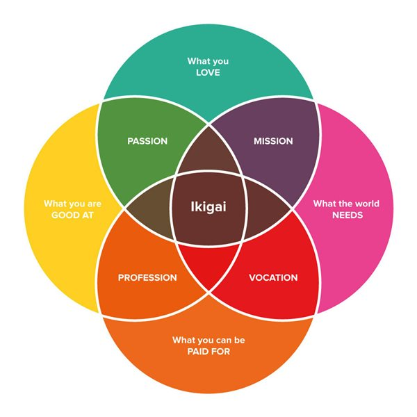

You can watch the video for this page here:

{:refdef: style="text-align: center;"}
<iframe width="680" height="480" src="https://youtube.com/embed/pr_CMTbZhpQ" frameborder="0" allow="accelerometer; autoplay; encrypted-media; gyroscope; picture-in-picture" allowfullscreen></iframe>
{:refdef }

Here is my attempt to answer the question of the meaning of life.

I'm a person who's had a lot of time to think and reflect on life and my experience. I've searched for meaning my entire life. Any talk of meaning has focused my attention.

If you think the answer will bring you peace, tranquility, or happiness, then I will tell you this:

Love. Love yourself, love other people, love your work.

Accept that you are a human being with needs. Humans are driven by a lack of needs on different levels. [Maslow's hierarchy of needs](https://en.wikipedia.org/wiki/Maslow%27s_hierarchy_of_needs) provides a list.

{:refdef: style="text-align: center;"}

{:refdef }

Which needs dominate our lives depends on our development over the life span.

Reflect on what need is missing from your life and work to satisfy it.

If you feel your needs are satisfied you should search for a state of flow.

---

"In positive psychology, a [flow state](https://en.wikipedia.org/wiki/Flow_(psychology)), also known colloquially as being in the zone, is the mental state in which a person performing an activity is fully immersed in a feeling of energized focus, full involvement, and enjoyment in the process of the activity. In essence, flow is characterized by the complete absorption in what one does, and a resulting transformation in one's sense of time."

Components of flow:
- Intense and focused concentration on the present moment
- Merging of action and awareness
- A loss of reflective self-consciousness
- A sense of personal control or agency over the situation or activity
- A distortion of temporal experience, one's subjective experience of time is altered
- Experience of the activity as intrinsically rewarding, also referred to as autotelic experience
- Immediate feedback
- Feeling the potential to succeed
- Feeling so engrossed in the experience, that other needs become negligible

Flow theory postulates three conditions that have to be met to achieve a flow state:

1. One must be involved in an activity with a clear set of goals and progress. This adds direction and structure to the task.
2. The task at hand must have clear and immediate feedback. This helps the person negotiate any changing demands and allows them to adjust their performance to maintain the flow state.
3. One must have a good balance between the perceived challenges of the task at hand and their own perceived skills. One must have confidence in one's ability to complete the task at hand.

Schaffer (2013) proposed seven flow conditions:

1. Knowing what to do
2. Knowing how to do it
3. Knowing how well you are doing
4. Knowing where to go (if navigation is involved)
5. High perceived challenges
6. High perceived skills
7. Freedom from distractions

---

I strongly recommend the book [The Happiness Hypothesis](https://en.wikipedia.org/wiki/The_Happiness_Hypothesis) by Jonathan Haidt. The author compares the findings of modern science with the wisdom of ancient philosophies and cultures. Haidt proposes the equation for happiness as: H = S + C + V

* H = Happiness
* S = your biological set point of emotions
* C = circumstances
* V = voluntary actions

Set point - "The hedonic treadmill, also known as hedonic adaptation, is the observed tendency of humans to quickly return to a relatively stable level of happiness despite major positive or negative events or life changes," [hedonic adaptation - Wikipedia](https://en.wikipedia.org/wiki/Hedonic_treadmill), "Hedonic adaptation is a process or mechanism that reduces the effective impact of emotional events. Generally, hedonic adaptation involves a happiness "set point", whereby humans generally maintain a constant level of happiness throughout their lives, despite events that occur in their environment. The process of hedonic adaptation is often conceptualized as a treadmill, since one must continually work to maintain a certain level of happiness."

Many of the things we think will make us happy will only lead to a fleeting, temporary happiness which we adapt to. Anything you are searching for that will be static and unchanging will eventually not bring you happiness. We evolved this way because content creatures often become stagnant and don't grow.

If you want to know how happy you will be you should reflect on how happy you have been. The average is likely your set point.

_If your average happiness makes you dissatisfied, don't give up yet!_

You may not have reached your true set point. Your set point is heavily influenced by your health. Focus first on [posture](/posture/), breathing, [sleep](/sleep/), [nutrition](/nutrition/), and [exercise](/calisthenics/), in that order. Some will focus on exercise as a priority. Attaching yourself to the highest level helps to prioritize the lower levels. When you exercise well you want to eat and sleep well to support your training. Similarly we can attach ourselves to meaning and purpose which orders our actions on lower level needs.

Your circumstances influence happiness and your ability to maintain your health. Some environments are toxic or don't support growth. We must make a voluntary action to change to a different set of circumstances as best we can.

We mostly need to invest work and energy into our voluntary actions to make ourselves as happy as we desire. We must choose to prioritize our health with a focus on balancing our needs in life.

Recognize and accept that happiness and well-being are not a destination to reach and rest at but you must continually strive for and renew.

Grow to accept all your emotions. There are 5 emotions thought to be like primary colors that mix to give subtler feelings. Most people will have these feelings across cultures. I remember them as "emotion FADES."

- F - Fear
- A - Anger
- D - Disgust
- E - Enjoyment
- S - Sadness

I invite you to explore the [Atlas of Emotions](https://atlasofemotions.org/) to learn more. I recommend associating activities with the 5 basic emotions. What is a healthy outlet for each of your feelings? Once you recognize cues, how can you channel your emotional energy into something positive?

A short story on controlling emotions:

---

A monk asked their master how to control their own emotions. The master told the monk to go to the ocean and stop the waves from crashing. Accustomed to strange challenges, the monk faced the open ocean and tried to stop the waves by punching and kicking. The waves did break in some parts, but the monk was still pushed over and tumbled by the strong waves. Nothing the monk tried stopped the waves.

Emotions are like waves. Sometimes they are pleasant and gentle. Sometimes we can ignore them. Sometimes the waves are so powerful they threaten to destroy us.

We all have different levels of sensitivity. Some of us are in the ocean of emotion with water at our waist. Some are deeper in the ocean with turbulent and frightening currents. Some of us are not even in the water but stand far away.

In all cases we must accept the waves will come. The waves will hit us and they will recede.

With this reflection, the monk sits in the ocean and no longer attempts to break the waves. The waves wash over the monk, each one unique and different from the last. Some waves push the monk out of balance, but the monk in time returns to their position and peace. The monk cannot control the waves, but the monk has the most influence over their reaction.

---

Consider how many of the 5 emotions are positive or negative.

Would you say 4 out of 5 are negative and enjoyment is positive? Many of us will understand that much of life is suffering. A small part, and if we want to give a proportion we can say 1 in 5 events like the [Pareto principle](https://en.wikipedia.org/wiki/Pareto_principle), will be absent of suffering. If you want to be resilient to suffering and grow stronger, you should ask yourself and answer, "_why_ is my suffering worth enduring?"

---

The work of [Shaolin Master Shi Heng Yi](https://www.youtube.com/watch?v=4-079YIasck) provides a guide on self-mastery:

### 5 Hindrances to Self-Mastery

1. Sensual desire (sight/touch/taste/smell/hearing) = Am I distracted or addicted?
2. Ill will/aversion = Am I feeling a negative emotion?
3. Dullness/heaviness = Am I unmotivated?
4. Restlessness = Is my mind jumping from thought to thought?
5. Skeptical doubt = Am I indecisive?

### RAIN

- Recognize which hindrance you're experiencing
- Accept what you're experiencing
- Investigate why you're experiencing the hindrance
- Non-identify with the experience: 'I am not the body, I am not the mind, I am not my emotion'

---

### Your Reason for Being

Some say the question of meaning in life is a privilege, that self-actualization is the highest level in our list of needs. You should reject this line of thinking as if you were fighting for your life, because you are. Those who want you to turn away from meaning want to control you. Meaning is for everyone and offers guidance and clarity. Meaning is a continual questioning where a lack of meaning is no questions at all.

What is your reason for being? What keeps you alive? To find meaning and coherence in your life I recommend the concept _ikigai_. [Ikigai](https://en.wikipedia.org/wiki/Ikigai) roughly translates to "reason for being."

{:refdef: style="text-align: center;"}

{:refdef }

Answer these four questions:

1. What do I love to do?
2. What am I good at?
3. What does the world need?
4. What can I be paid for?

Be excited to answer these questions! If you don't yet have a satisfactory answer, then your goal is to explore and learn more until you can! Your ikigai will change and grow over time, because the answer to each of the questions can change and grow.

#### “_Jumping from failure to failure with undiminished enthusiasm is the big secret to success._” -- Savas Dimopoulos

In your work, always seek at least these 3 components: **autonomy**, **mastery**, and **purpose**. Autonomy to choose how you go about your work, arranging your schedule to match your personal energy. Mastery is a path to a state of flow, constantly improving your craft. Purpose is finding meaning in your activity beyond yourself. These are the intrinsic motivators which propel us greater and more sustainably than external motivators like money. [Dan Pink describes supporting research in his book, _Drive_](https://www.brainpickings.org/2013/05/09/daniel-pink-drive-rsa-motivation/).

---

Another great acronym, PURE, a [model for meaning developed by Paul Wong](https://en.wikipedia.org/wiki/Meaning_of_life#Nature_of_meaning_in_life).

"...Wong has proposed a four-component solution to the question of meaning in life, with the four components purpose, understanding, responsibility, and enjoyment (PURE):

- You need to choose a worthy purpose or a significant life goal.
- You need to have sufficient understanding of who you are, what life demands of you, and how you can play a significant role in life.
- You and you alone are responsible for deciding what kind of life you want to live, and what constitutes a significant and worthwhile life goal.
- You will enjoy a deep sense of significance and satisfaction only when you have exercised your responsibility for self-determination and actively pursue a worthy life-goal."

---

### Loving Yourself and Others

How can you learn to love yourself and others?

The information surrounding relationships is so powerful I hesitate to share it, because it can cause as much harm as it can good. However, the tools of relationships are critical for a full and healthy human life.

I will propose three parts to satisfying relationships based on social engineering which you can use to reflect on your past relationships. Your most cherished relationships will often involve:

1. Trust
2. Empathy
3. Rationality

You must trust the other person. You should be able to accurately predict how they will react. That person should have the ability to understand the emotional content of your experience. You should trust the other person to be rational, to make appropriate choices given enough information. Do your best relationships have these characteristics?

Learning to love yourself is much like building a deep relationship with another person. You should demonstrate your trustworthiness, display empathy, and be rational. Do you trust yourself? Do you keep your personal promises and commitments? Are you consistent in your behavior? Are you empathetic and understanding with your emotions? Do you forgive yourself for past actions? How often do you check in and assess how you are feeling? Are you rational and make the right choices given what you know? Do you fall into impulses and easy routines?

To love yourself, treat yourself as a friend. Invest in yourself. Make a commitment to your emotional health then follow up later. You will build trust and empathy in yourself. Invest in your rationality. Take time to explore all of your options. First determine what is best then assess how able you are to reach the best outcome. Try to be objective and fair. Recognize your judgment of yourself and others is likely at least 10% inaccurate. With doubt cut yourself and others slack for failures, but work towards overcoming those obstacles in the future.

If this is so clear, why is it rare or difficult? Loving yourself and others takes work, energy, and investment. Relationships and selves are highly complex. Forces outside of our control will eventually disrupt our bonds. When that happens we can do our best to repair and reinforce our relationships.

Finally, I highly recommend the work of John Vervaeke on [Awakening from The Meaning Crisis](https://www.youtube.com/user/johnvervaeke). Professor Vervaeke gives a wonderful summary of the history of meaning and likely why you feel a meaning is lacking.

If you find this answer satisfying, I suggest you stop now. I wish you a good life.

***
***

{:refdef: style="text-align: center;"}
[Read the full text on one page](/meaningOfLife/) • [Part 2](/meaningOfLife_1/)
{:refdef }
