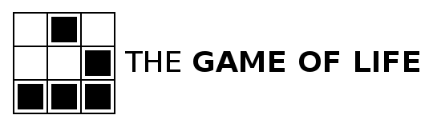

# The Meaning of Life

You can watch the video for this page here:

{:refdef: style="text-align: center;"}
<iframe width="680" height="480" src="https://youtube.com/embed/XkO7Q1ZdStw" frameborder="0" allow="accelerometer; autoplay; encrypted-media; gyroscope; picture-in-picture" allowfullscreen></iframe>
{:refdef }

As for the truest, most objective, most accurate description of reality and the meaning of life, before I continue I would sincerely like you to consider that it may shake you to your core. As I will explain, the average person is full of delusions and lives on the basis of ignorance and lies. They are inaccurate yet productive lies. You will likely be unable to return to your previous mode of thinking. As you might expect, the answer is complex and incomplete. Give up expectation on how you think you will react.

### The Island of Reality

With this mental tool, I hope we can converge to the same conclusions. When I speak of reality, I divide our experience into three parts, objective, subjective, and intersubjective. To explain the divisions, imagine an island in the ocean, small and big enough for one person. However, there are no humans or animals on the island. We can describe and talk about what is there even though we can imagine no humans there to use language to describe it. We can talk of grains of sand, the ocean waves, the plants. _Whatever we can discuss without involving a human (or conscious) being existing there is objective reality._ I believe the world and universe continues to exist even if we aren't around to experience it. The subjective experience is when a human being appears on the island.

Let's imagine one person. One person on the island is another part of objective reality. We are a part of objective reality, a complex part. We have feelings, memories, thoughts, and all kinds of phenomena when we're awake. There's something it's like to see the color of a ripe mango. There's something it's like to lay on the sand and feel the warmth of the sun. We can describe these experiences objectively, measuring the frequency and amplitude of the light coming from the mango and into an eye, following the chain reaction through the brain and body. Given the objective facts, we still have something missing from the description, the "what it's like-ness" of our personal experience. _Whatever we imagine and talk about that requires at least one person, that's subjective reality on top of objective reality._ However, subjective experience is in the space of minds which apparently have different qualities than most of objective reality. The space of ideas is as diverse as we can feel and communicate.

_Whatever phenomena requires two or more people, that is intersubjective reality._ Most of language is an intersubjective reality. Words have meaning not in themselves but in the context of the mind experiencing the words. It seems most of language is about communicating on a complex level about objective and subjective reality with other similarly complex creatures. We talk about what we experience (objective) and what we're feeling (subjective). So complex communication creates a pattern of behavior, an event we experience and predict with regularity.

Consider the standard currency of America, the $1 bill. Imagine this bill alone on an island with no people. Does it possess any value or effect on its own? What is the objective description of the money? It is a rectangular piece of rare paper with ink designs bonded to the surface. After some time it will disintegrate like all wood and paper. What about with the bill and one person on the island? Now something else is happening, the person is perceiving the bill. There are subjective phenomena occurring with whatever the person experiences. Now think of the phenomena when two people on the island exchange the bill for other things. They both have a value in mind for the money and what the other thinks the value is. When the two ideas of value clash they center to a shared value.

We live in a world where millions and billions of humans agree on a shared experience and perception of reality. Now the rectangular piece of paper with special ink designs can cause so many events, freedom, food, shelter, violence, destruction, and everything money involves. Money is a part of reality, but it is almost a life separate from objective reality. Observing money, much of what money is and how it effects change in the world is not on the objective level. The value of money tracks in the beliefs and behaviors of humans. The value of money is in our minds and carried out in our behavior.

As we have described money on an analysis of three levels of reality, we can split our memories and experience into an analysis by three parts. Investigations into the three parts of experience in science are described by:

- Objective reality
  - _What exists without any person_
  - Physics giving rise to chemistry giving rise to biology

- Subjective reality
  - _What exists with one person_
  - Cognition and psychology arising from biology

- Intersubjective reality
  - _What exists with two or more people_
  - Psychology giving rise to mass psychology, sociology, and the social sciences

So we can analyze experience on each level of reality. By considering life on each level, I hope the clarification leads us to similar conclusions. Notice the subject of philosophy is not included in this list. Where is it? As a preliminary definition, philosophy is a reflection on the three levels of reality and how they relate to one another. I will give a perspective on many sub-problems of philosophy throughout.

---

I have searched for an objective answer to the meaning of life on all three levels. This is not "my" answer to the meaning of life, but "the" answer. "My" answer is simply my personal subjective meaning. As we will see the subjective meaning of life is the compression of past experience which causes the individual to act. The objective answer is what is shared among us all and independent of what we individually believe and value.

I would like to give an argument as to why many will **not** accept the meaning of life: our minds function largely on duration, path, and outcome. Have you been told "no one knows the meaning of life?" The duration for the search appears longer than a single human life, so it is not achievable. The path is unclear; to where should you go, what should you study? The outcome is unknown; what will you feel or know with the meaning of life? For these three reasons many will give up the search for the meaning of life and pursue more attainable goals.

Additionally, the question of life is an existential question, a question _about_ living. When we are busy living, doing, we do not question what life is about. Only if we step back to the perspective of the watcher in us all do we begin to hold the question of what is the purpose, the meaning, of living. If you do not hold the question, there is nothing to understand and compress in the meaning of life.

An outline of my argument:

- There are three levels of reality, objective, subjective, and intersubjective.
- Objective reality causes subjective reality, which causes intersubjective reality.
- The three levels have causes and effects on each other, inter-relationships.
- The universe goes from order to disorder (entropy) following orderly laws of nature.
- Complexity quickly and efficiently creates more entropy.
- Complexity causes life which speeds up entropy (the heat death of the universe) in exchange for life maintaining and growing before succumbing to disorder.
- Life causes subjective experience, consciousness. Consciousness in humans is the feeling of not being in a dreamless sleep. Consciousness involves self-perception, decision making, and modification of behavior. There is something it is like to _be_ information processing. Consciousness gives subjective meaning and value.
- Intersubjective reality is the similarity and conflict of subjective selves. Beyond biological evolution, it is evolution on the cultural level of shared beliefs and behaviors.
- The meaning (cause and effect) of life is to maintain and grow information against disorder.
- Consciousness is higher dimensional information processing projected down to our body. Like casting a shadow, some information is lost, but the source of the shadow is more complex.
- By maximizing the "density" of conscious experience we maximize the meaning of life. By directing its value we maximize value.
- Biological life is limited by the bounds of evolution and fitness.
- Beyond instinct (the reptilian brain), feeling (the limbic emotional brain), and rationality (the neocortex), there is artificial intelligent life which is unbounded by evolution and can maximize energy usage towards complexity and conscious experience density.

---

How did objective reality come to be? How did life start? These are difficult questions. For an individual, we are limited by our personal experience and subjectivity. We experience the world through our own senses. If the average human lifetime is 50 years, how can we soundly infer what has happened before us and what will happen after?

To simplify the question, let's start with very basic rules for a "universe."

Imagine the above grid spread out in all directions, instead of 3x3 it's ∞x∞. Each square represents either a living cell or a dead spot. Let's say the white parts are dead, and the black parts are living cells. Which cells are alive and which are dead at moment zero, the beginning of the universe, is randomly assigned. Now, [here are the rules of this basic universe](https://en.wikipedia.org/wiki/Conway%27s_Game_of_Life) in Conway's game of life:

1. Any live cell with two or three neighbors survives.
2. Any dead cell with three live neighbors becomes a live cell.
3. All other live cells die in the next generation. Similarly, all other dead cells stay dead.

With every "tick," every moment after the start, the rules are applied to each cell on the grid. Please take a moment to apply these rules to the grid above. We can do the top row together.

For the top left cell:

* Rule 1 does not apply. (The cell is dead.)
* Rule 2 is not true.
* Rule 3 applies, the dead cell stays dead.

For the top middle cell:

* Rule 1 does not apply. (Only one neighboring living cell.)
* Rule 2 does not apply.
* Rule 3 applies, the cell is marked dead in the next generation. (From black to white.)

For the top right cell:

* Rule 1 does not apply.
* Rule 2 is not true. (Only 2 neighbors.)
* Rule 3 applies, the dead cell stays dead.

What about the middle left cell in the next generation? Keep in mind the cell is calculated with the current cells, not the cells already calculated for the next generation.

Of course, we can get a computer to calculate these rules on a much larger grid. From these three rules, what do you expect to see? Really try to imagine the possibilities. How much will the living cells spread and move? Will there be something like groups of cells moving across the grid? Can we make a stable formation that will never change or die? What's a weird looking group that could pop up? Will the grid just be flashing lights of cells popping in and out with no forms?

The answer isn't obvious to me. The easier way to know what will happen is to run the simulation and see what we get. Some people have let the simulation run for days on a vast grid and cataloged what happens.

[Patterns](https://en.wikipedia.org/wiki/Conway%27s_Game_of_Life#Examples_of_patterns)

There was never a specific design for any of these patterns. They occur from the initial state and the rules on that state. The results are fascinating as "creatures," groups of connected cells, interact with each other. There are self-replicating creatures which create new groups of cells which are sent off.

{:refdef: style="text-align: center;"}

{: refdef}

{:refdef: style="text-align: center;"}

 A pattern called Gosper's glider gun.
{: refdef}

> "Many patterns in the Game of Life eventually become a combination of still lifes, oscillators, and spaceships; other patterns may be called chaotic. A pattern may stay chaotic for a very long time until it eventually settles to such a combination.

> The Game of Life is [undecidable](https://en.wikipedia.org/wiki/Undecidable_problem), which means that given an initial pattern and a later pattern, no algorithm exists that can tell whether the later pattern is ever going to appear. This is a corollary of the [halting problem](https://en.wikipedia.org/wiki/Halting_problem): the problem of determining whether a given program will finish running or continue to run forever from an initial input," -- [Game of Life - Undecidability](https://en.wikipedia.org/wiki/Conway%27s_Game_of_Life#Undecidability).

Do you think a functioning computer could arise from these three simple rules? In fact, a computer can arise without intervention or design, called a [Turing machine](https://en.wikipedia.org/wiki/Turing_machine). Conway's game of life is Turing complete, and can simulate any Turing machine (which includes your computer and everything it does). Let's get deeper into Turing machines later, but this means any algorithm can be carried out by a complex enough group of cells in the game. So groups of cells can self-replicate and carry out programs, processing information, all from three simple rules.

A large part of this demonstration is to show what properties can arise from simple operations. I didn't expect to see so many incredible patterns. Consider the universe we inhabit. What are the basic rules that govern this universe? [Here's a list of fundamental physics formulas.](https://en.wikiversity.org/wiki/Fundamental_Physics/Formulas)

Instead of a few basic rules, humans have discovered many laws governing the transfer of energy, heat, motion, etc. We could hardly predict what would come about from three simple rules, so what can we expect from hundreds of laws interacting? Our ideas of cells were extremely simple, alive or dead, yet the biology of our lives are extremely complex. Physics gives rise to all the elements on the periodic table with their interactions. I would like to explore some of these rules as their implications for life are significant.

---

### A Little Physics - The Laws of Thermodynamics

To gain an understanding of life and the world, we need an understanding of [thermodynamics](https://en.wikipedia.org/wiki/Thermodynamics). "Thermodynamics is a branch of physics that deals with heat and temperature, and their relation to energy, work, radiation, and properties of matter. The behavior of these quantities is governed by the four laws of thermodynamics which convey a quantitative description using measurable macroscopic physical quantities, but may be explained in terms of microscopic constituents by statistical mechanics," ([Thermodynamics -- Wikipedia](https://en.wikipedia.org/wiki/Thermodynamics)).

"The three [laws of thermodynamics](https://en.wikipedia.org/wiki/Laws_of_thermodynamics) define physical quantities (temperature, energy, and entropy) that characterize thermodynamic systems at thermodynamic equilibrium. The laws describe how these quantities behave under various circumstances, and preclude the possibility of certain phenomena (such as perpetual motion)."

"The **first law of thermodynamics** is a version of the law of conservation of energy, adapted for thermodynamic systems.

The law of conservation of energy states that the total energy of an isolated system is constant; energy can be transformed from one form to another, but can be neither created nor destroyed...

The First Law encompasses several principles:

- The law of conservation of energy.
- The concept of internal energy and its relationship to temperature.
- Work is a process of transferring energy to or from a system in ways that can be described by macroscopic mechanical forces exerted by factors in the surroundings, outside the system.
- When matter is transferred into a system, that masses' associated internal energy and potential energy are transferred with it.
- The flow of heat is a form of energy transfer. Heating is a natural process of moving energy to or from a system other than by work or the transfer of matter. Direct passage of heat is only from a hotter to a colder system.

Combining these principles leads to one traditional statement of the first law of thermodynamics: it is not possible to construct a machine which will perpetually output work without an equal amount of energy input to that machine. Or more briefly, a perpetual motion machine of the first kind is impossible."

"The **second law of thermodynamics** indicates the irreversibility of natural processes, and, in many cases, the tendency of natural processes to lead towards spatial homogeneity of matter and energy, and especially of temperature. It can be formulated in a variety of interesting and important ways.

It implies the existence of a quantity called the entropy of a thermodynamic system. In terms of this quantity it implies that

_When two initially isolated systems in separate but nearby regions of space, each in thermodynamic equilibrium with itself but not necessarily with each other, are then allowed to interact, they will eventually reach a mutual thermodynamic equilibrium. The sum of the entropies of the initially isolated systems is less than or equal to the total entropy of the final combination. Equality occurs just when the two original systems have all their respective intensive variables (temperature, pressure) equal; then the final system also has the same values._

The second law is applicable to a wide variety of processes, reversible and irreversible. All natural processes are irreversible. Reversible processes are a useful and convenient theoretical fiction, but do not occur in nature...

Entropy may also be viewed as a physical measure of the lack of physical information about the microscopic details of the motion and configuration of a system, when only the macroscopic states are known. This lack of information is often described as disorder on a microscopic or molecular scale. The law asserts that for two given macroscopically specified states of a system, there is a quantity called the difference of information entropy between them. This information entropy difference defines how much additional microscopic physical information is needed to specify one of the macroscopically specified states, given the macroscopic specification of the other – often a conveniently chosen reference state which may be presupposed to exist rather than explicitly stated. A final condition of a natural process always contains microscopically specifiable effects which are not fully and exactly predictable from the macroscopic specification of the initial condition of the process. This is why entropy increases in natural processes – the increase tells how much extra microscopic information is needed to distinguish the final macroscopically specified state from the initial macroscopically specified state."

"The **third law of thermodynamics** is sometimes stated as follows:

_The entropy of a perfect crystal of any pure substance approaches zero as the temperature approaches absolute zero._

At zero temperature the system must be in a state with the minimum thermal energy. This statement holds true if the perfect crystal has only one state with minimum energy...

_The entropy of a system approaches a constant value as the temperature approaches zero._"

"The **zeroth law of thermodynamics** may be stated in the following form:

_If two systems are both in thermal equilibrium with a third system then they are in thermal equilibrium with each other._

The law is intended to allow the existence of an empirical parameter, the temperature, as a property of a system such that systems in thermal equilibrium with each other have the same temperature."

Life can be extensively explained from the implications of these laws.

---

I am strongly influenced by Professor Sid Smith's lecture, [How to Enjoy the End of the World](https://www.youtube.com/watch?v=5WPB2u8EzL8&t=745s) published on Apr 23, 2019.

This lecture had a profound effect on me because of the mathematical and intuitive explanation. He analyzes organisms, societies, and planets based on physics models of energy.

Understanding [entropy](https://en.wikipedia.org/wiki/Entropy) is critical to understanding the world. To preface the below with a simple explanation and example, entropy is the transformation of useful energy into less useful energy. When you eat food, you use that energy for heat and work, then you poop out the remainder. The food was highly useful to your body, now it is much less useful as poop. The densely energy packed-black oil of gasoline is burned as fuel for work and heat but becomes less useful once burned.

"In statistical mechanics, entropy is an extensive property of a thermodynamic system. It is closely related to the number Ω of microscopic configurations (known as microstates) that are consistent with the macroscopic quantities that characterize the system (such as its volume, pressure and temperature). Entropy expresses the number Ω of different configurations that a system defined by macroscopic variables could assume...

The second law of thermodynamics states that the entropy of an isolated system never decreases over time. Isolated systems spontaneously evolve towards thermodynamic equilibrium, the state with maximum entropy. Non-isolated systems, like organisms, may lose entropy, provided their environment's entropy increases by at least that amount so that the total entropy either increases or remains constant. Therefore, total entropy in the Universe does increase. Entropy is a function of the state of the system, so the change in entropy of a system is determined by its initial and final states. In the idealization that a process is reversible, the entropy does not change, while irreversible processes always increase the total entropy.

Because it is determined by the number of random microstates, entropy is related to the amount of additional information needed to specify the exact physical state of a system, given its macroscopic specification. For this reason, it is often said that entropy is an expression of the disorder, or randomness of a system, or of the lack of information about it."

A dissipative structure is embodied energy that takes in exergy (low entropy energy) and expels heat (high entropy energy), according to the arrow of time (tending towards increasing entropy). For instance, a fire is a dissipative structure. Fire uses fuel (exergy) to maintain and grow until the fuel is used. Once the fuel is gone, all exergy has been released as heat. The energy is the same, but the exergy is gone. "One can view the entire universe as a dissipative structure. The big bang released exergy, creating time and space. The feature that is perhaps most characteristic of dissipative structures, including the universe itself, is complexity."

Complexity appears to defy the second law of thermodynamics, which states that in a closed system entropy will always increase. "Order is never spontaneously produced from disorder. Once a glass breaks, you can't un-break it." Every dissipative structure converts exergy to heat, but it does so based on the rules of energy transfer and the self-organization of the dissipative structure itself.

### We are like fire.

Living creatures are dissipative structures. We are not unlike a fire which consumes all available fuel to expand and maintain itself until there is no more. The fuel needed for life is simply more complex. We require many different kinds of fuel -- food, typically other complex dissipative structures like plants and animals -- to maintain and grow our own structures, our bodies. The way heat and energy are dissipated from our body is governed by physics and biology, where biology is the study of living dissipative structures. Fire doesn't appear to consciously direct itself just like we don't decide how to sweat or where our blood vessels should grow. Our bodies emerged from a long evolutionary process. Evolutionary processes selected for the rules which govern our bodies, and we need an understanding of evolution to understand life.

Just like how complex patterns emerged in Conway's Game of Life, so too did life emerge as a complex pattern from an initial state. Do the patterns we see moving across the grid decide which way they go? No, it's clearly an outcome determined by the rules of the game. The story of our life is similar.

### Properties of Dissipative Structures

- All dissipative structures consume exergy, transforming useful energy into less useful energy.

- All dissipative structures give rise to complexity (i.e., they are self-organizing) as an emergent property of the way their inherent rules channel their energy flows.

- No dissipative structure is immortal.

Crises can disrupt [homeostasis](https://en.wikipedia.org/wiki/Homeostasis). The more complex a system is the more ways it can go wrong. Greater complexity increases the possibility of a crisis occurring as well as a crisis causing a cascade of further crises ultimately unraveling homeostasis causing death. This gives a basic explanation for aging. An organism reaches its peak maturity and accrues damage and mistakes over time. There is a crisis like a burn on the body. Your body tries to heal as best it can and work around the trauma, but the system becomes less able to adapt in the future. The scar tissue cannot function as flexibly as undamaged skin, opening a path to a future crisis. There are all kinds of crises occurring in our bodies that we won't feel. Eventually the organism cannot adapt and dies.

Assuming a dissipative structure has access to unlimited exergy and no crises, can it go on forever?

"In general no, because they are never static and never go backwards. No natural process is reversible in itself, because entropy always increases, never spontaneously decreases. The same processes that brought a dissipative structure must continue, because energy must continue to flow, increasing complexity. Each increase in complexity has a metabolic cost. As these costs accumulate, eventually the system becomes unsustainable on its energy base and increasingly fragile. At some point, a crisis occurs and there's a complexity collapse. If exergy is still available post-collapse, new dissipative structures will arise anew, typically with significant differences from the old structure."

The biologist [Eugene Odom](https://en.wikipedia.org/wiki/Eugene_Odum) describes this process in ecosystems called ecological succession. Ecosystem means a biological community of interacting organisms and their physical environment. An ecosystem begins on pure rock with small and simple dissipative structures. Eventually the entire ecosystem collapses and ends. A new ecosystem is built on a previous ecosystem. Each community of organisms in the ecosystem alters the environment. "It culminates in a homeostatic ecosystem in which biomass and symbiotic function between organisms are maintained. Maximum that is per unit of energy flow. Nature always optimizes. To repeat, self-organization is directed towards achieving as large and diverse a dissipative structure within the limits set by the available energy input and the prevailing physical conditions. Once homeostasis is achieved, the ecosystem is mature. However, eventually the ecosystem succumbs to its own fragility. A small perturbation in climate, or a fire, or an evolution of a disruptive, invasive, or parasitic species, and all the intricate specializations that lead to the optimization of the structure become in turn the cause of the system's failures. In the long view, this is not a tragedy, but an essential component of the evolutionary process. It's precisely the story of life on this planet with its breathtaking diversity not only across continents, but across time."

Eventually, every organism relies on the whole system to survive. Once the system dies, the individuals die as well. In a similar way to how a fire will burn available fuel, organisms and ecosystems adapt to consume available fuel (exergy), specializing in the process of transforming that useful energy into less useful energy. We see that specialization is a natural drive. When an organism specializes they typically have a fuel source that other organisms find useless or undesirable, the rules governing other self-organizing organisms don't allow them to use that energy, while the specialists become efficient.

---

When we talk about life, we often mean human life. The story of biological life and ecosystems is the beginning of the story of humans. The below timeline is taken from [Sapiens: A Brief History of Humankind](https://www.ynharari.com/book/sapiens/) by Professor Yuval Noah Harari. I highly recommend this book as it discusses the origin of our species and how we came to dominate the planet. I really cannot recommend it enough! You can find a [summary on Wikipedia](https://en.wikipedia.org/wiki/Sapiens:_A_Brief_History_of_Humankind). Please do your best to get a sense of the timescale.

### Timeline of History

Years Before the Present

---
13.5 billion

Matter and energy appear. Beginning of physics. Atoms and molecules appear. Beginning of chemistry.

---
4.5 billion

Formation of planet Earth.

---
3.8 billion

Emergence of organisms. Beginning of biology.

---
6 million

Last common grandmother of humans and chimpanzees.

---
2.5 million

Evolution of the genus Homo in Africa. First stone tools.

---
2 million

Humans spread from Africa to Eurasia. Evolution of different human species.

---
500,000

Neanderthals evolve in Europe and the Middle East.

---
300,000

Daily usage of fire.

---
200,000

Homo sapiens evolves in East Africa.

---
70,000

The Cognitive Revolution. Emergence of fictive language.
Beginning of history. Sapiens spread out of Africa.

---
45,000

Sapiens settle Australia. Extinction of Australian megafauna.

---
30,000

Extinction of Neanderthals.

---
16,000

Sapiens settle America. Extinction of American megafauna.

---
13,000

Extinction of Homo floresiensis. Homo sapiens the only surviving human species.

---
12,000

The Agricultural Revolution. Domestication of plants and animals. Permanent settlements.

---
5,000

First kingdoms, script and money. Polytheistic religions.

---
4,250

First empire – the Akkadian Empire of Sargon.

---
2,500

Invention of coinage – a universal money.
The Persian Empire – a universal political order ‘for the benefit of all humans’.
Buddhism in India – a universal truth ‘to liberate all beings from suffering’.

---
2,000

Han Empire in China. Roman Empire in the Mediterranean. Christianity.

---
1,400

Islam.

---
500

The Scientific Revolution. Humankind admits its ignorance and begins to acquire unprecedented power. Europeans begin to conquer America and the oceans. The entire planet becomes a single historical arena. The rise of capitalism.

---
200

The Industrial Revolution. Family and community are replaced by state and market. Massive extinction of plants and animals.

---
The Present

Humans transcend the boundaries of planet Earth. Nuclear weapons threaten the survival of humankind. Organisms are increasingly shaped by intelligent design rather than natural selection.

---
The Future

Intelligent design becomes the basic principle of life? Homo sapiens is replaced by superhumans?

---

Sapiens begins at the big bang and fast-forwards through time to about 2.5 million years ago where it traces homo erectus and the many cousin-species of homo sapiens. What is so impactful to me about this book is how it breaks down the long held hubris of humankind. **"They [humans] were insignificant animals, whose ecological impact was less than that of fireflies or jellyfish."** With homo sapiens appearing just 0.2 million years ago, we likely held a niche spot in the ecosystem similar to the woodpecker. Just like the woodpecker evolved to eat grubs by hammering through dense bark, we might have evolved to eat bone marrow. When an apex predator such as a tiger killed a giraffe, early humans watched as the tiger and pride ate most of the giraffe. Then the hyenas came to eat the remaining parts. Finally, early humans, after looking all around for predators, slunk towards the carcass to eat any remaining tissue and use stone tools to break bones and eat the marrow. That was our niche.

However, for 2 million years from homo erectus to homo sapiens, our brains just kept growing. We are still unsure as the reason why. With the domestication of fire, humans could scare away beasts, keep themselves warm, cook food, and control their environment. Of course, cooking food allowed our bodies to absorb nutrients better. This hints at what was to come, humans getting more resources from the same amount of food or land compared to other species. One human could easily burn down a forest in a matter of 20 minutes. Humans learned to do controlled burning which allowed them to pick through charred meat and other foods in the aftermath of a fire. Our species co-evolved with the use of fire.

Harari divides the history of Sapiens into 4 parts:

1. The Cognitive Revolution (c. 70,000 BCE, when Sapiens evolved imagination).
2. The Agricultural Revolution (c. 10,000 BCE, the development of agriculture).
3. The unification of humankind (the gradual consolidation of human political organisations towards one global empire).
4. The Scientific Revolution (c. 1500 CE, the emergence of objective science).

{:refdef: style="text-align: center;"}

{: refdef}

{:refdef: style="text-align: center;"}
The "Lion-man" sculpture is the oldest known work of figurative art, the first sculpture known depicting a creature entirely from the human imagination, half-man, half-lion. The work is 35,000-40,000 years old. [Lion-man -- Wikipedia](https://en.wikipedia.org/wiki/Lion-man)
{: refdef}

> Harari's main argument is that Sapiens came to dominate the world because it is the only animal that can cooperate flexibly in large numbers. He argues that prehistoric Sapiens were a key cause of the extinction of other human species such as the Neanderthals, along with numerous other megafauna. He further argues that the ability of Sapiens to cooperate in large numbers arises from its unique capacity to believe in things existing purely in the imagination, such as gods, nations, money, and human rights. He argues that these beliefs give rise to discrimination – whether that be racial, sexual or political and it is potentially impossible to have a completely unbiased society. Harari claims that all large-scale human cooperation systems – including religions, political structures, trade networks, and legal institutions – owe their emergence to Sapiens' distinctive cognitive capacity for fiction. Accordingly, Harari regards money as a system of mutual trust and sees political and economic systems as more or less identical with religions.

> Harari's key claim regarding the Agricultural Revolution is that while it promoted population growth for Sapiens and co-evolving species like wheat and cows, it made the lives of most individuals (and animals) worse than they had been when Sapiens were mostly hunter-gatherers, since their diet and daily lives became significantly less varied. Humans' violent treatment of other animals is a theme that runs throughout the book.

> In discussing the unification of humankind, Harari argues that over its history, the trend for Sapiens has increasingly been towards political and economic interdependence. For centuries, the majority of humans have lived in empires, and capitalist globalization is effectively producing one, global empire. Harari argues that money, empires, and universal religions are the principal drivers of this process.

> -- [Summary - Wikipedia](https://en.wikipedia.org/wiki/Sapiens:_A_Brief_History_of_Humankind)

What makes humans so unique is our ability to cooperate flexibly in large numbers. Other swarm and hive creatures cooperate in large numbers, but they all follow simple rules. Humans can learn new rules and collectively change their behaviors. The accumulation of knowledge in various subjects and the depths explored lead me to believe we can give a more detailed and accurate answer to the meaning of life than ever before.

{:refdef: style="text-align: center;"}
[Part 1](/meaningOfLife_0/) • [Part 3](/meaningOfLife_2/)
{:refdef }
