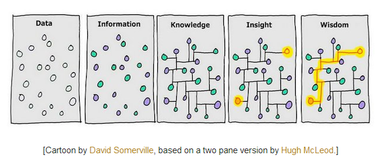
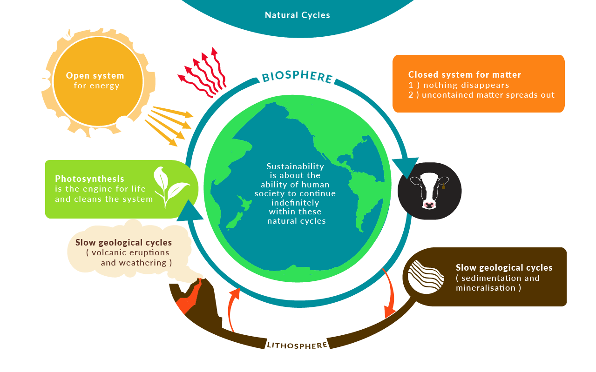
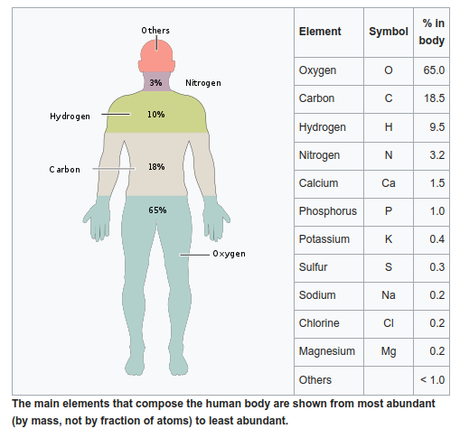

Returning to Professor Smith's lecture:

### What about civilization as dissipative structures?

Energy Return on Investment (EROI)

EROI = (total energy acquired) / energy spent to acquire energy

EROI for most creatures is between 1 and 2. An EROI less than 1 is starvation. An EROI towards 2 means growth.

The EROI of hunter-gatherer societies is roughly 1.5. Just enough to form kinship groups, reproduction, and the fastening of a few tools and decorations. The cultural complexity can be impressive, but the social connections are necessarily limited.

Social connections tend to track closely with EROI. Agricultural settlements tend to have an EROI of 4, allowing specializations within the societies not directly related to energy gathering. Complex tools could be developed. Stored food also helps to preserve energy.

Communities tended to over-exploit an agricultural area resulting in reduced yields over time, reducing EROI. Second, successful communities were an inviting target for raiders. This contributed to a second leap in complexity to agriculture-based empires. These empires tend to have an EROI of 6. Empires tend to have a boost in EROI after conquering other settlements, either over-exploiting them or continuing to slowly extract resources. This created highly complex hierarchies and specializations.

However, after all surrounding settlements are conquered they must be administered and garrisoned, taking energy. Diminishing returns set in with settlements being further apart and EROI declines. To combat a declining EROI, taxes tend to increase on agricultural outputs and inexorably leads to resource depletion. Finally, the weakened empire is conquered or falls to pieces.

Example, Rome. The Ancient Roman Empire was especially good at running an empire. Conquest temporarily increased EROI by a factor of 2, but each attempt they made to maintain increased the cost of homeostasis. Only excessive taxation could maintain the metabolic cost of empire. Resource depletion (including human resources) eventually led to permanently declining EROI and complexity (including economic, social, and political/administrative) collapse.

---

Humans occupy a strange place in the ecosystem. We are creatures that have multiplied our EROI's beyond the standard range of [0,2]. Fossil fuels are like batteries which have been slowly charged by the sun over thousands of years. The EROI of fossil fuels is massive at 1:100. For every one unit of energy we put in, we get the equivalent of one hundred units of power back. We dig and extract the fossil fuel, costing energy, then we burn the fuel in an explosion one hundred times the force of extraction. Fossil fuels used to give a 1:100 ratio of EROI, but we are largely left with crude oil now. The EROI is closer to 1:30 which is still enough to support the advanced society we live in today, something beyond the nature of ecosystems.

### We are like water.

Water is an excellent heat conductor. Since we are a slow but dynamic burning fire, we need a way for our body to expel heat (thermal energy) lest we burn up too quickly and lose homeostasis to maintain our form in working order. Water saps the heat away from our bodies by changing its state. Water can leave our body through sweating. The sweat beads on our skin and eventually absorbs enough thermal energy that the sweat changes from a liquid state into a gaseous state, evaporating on the skin. Water is how we measure temperature in Celsius. [Under normal atmospheric conditions, water is solid (ice) at 0 degrees Celsius, water vapor at 100 degrees Celsius, and liquid in between](https://www.grc.nasa.gov/WWW/K-12/rocket/state.html).

> "In physics, a state of matter is one of the distinct forms in which matter can exist. Four states of matter are observable in everyday life: solid, liquid, gas, and plasma. Many intermediate states are known to exist, such as liquid crystal, and some states only exist under extreme conditions, such as Bose–Einstein condensates, neutron-degenerate matter, and quark–gluon plasma, which only occur, respectively, in situations of extreme cold, extreme density, and extremely high energy. For a complete list of all exotic states of matter, see the [list of states of matter](https://en.wikipedia.org/wiki/List_of_states_of_matter).

> Historically, the distinction is made based on qualitative differences in properties. Matter in the solid state maintains a fixed volume and shape, with component particles (atoms, molecules or ions) close together and fixed into place. Matter in the liquid state maintains a fixed volume, but has a variable shape that adapts to fit its container. Its particles are still close together but move freely. Matter in the gaseous state has both variable volume and shape, adapting both to fit its container. Its particles are neither close together nor fixed in place. Matter in the plasma state has variable volume and shape, and contains neutral atoms as well as a significant number of ions and electrons, both of which can move around freely.

> The term phase is sometimes used as a synonym for state of matter, but a system can contain several immiscible phases of the same state of matter." [State of matter](https://en.wikipedia.org/wiki/State_of_matter)

Every element has a range of temperatures at which it's in a solid state. Passed a melting point, a liquid state. Passed a boiling point, a gas. Finally, a plasma state like the surface of the Sun with electromagnetic properties. There are other states of matter, but these are the ones we typically interact with and categorize as daily reality.

We humans studied these states, but if we think of the island concept to isolate objective reality, what is this constant state of change? On an island with no life, no complex structures, the ocean waves crash against the shore. To describe the location objectively, different elements and molecules in different states of matter are interacting and exchanging energy flows according to the laws of thermodynamics and physics. All living things which we see around us today came from those early times of our planet's life.

### We are an incredibly complex game of life left on for roughly 3.8 billion years.

Our planet Earth exists in perfect distance from the Sun to allow for complex life structures to arise. The energy from the Sun is like cooking over a fire. The heat is hottest closest and coldest farther away. To cook just right you need the right distance. Too cold and we're frozen where there's not enough changes in matter. Too hot and the energy present is so high nothing solid can form. We are in a space that allows for many states and in a time of homeostasis. There are so many qualities of the universe and our solar system which are in a delicate balance to bring about life.

---

{:refdef: style="text-align: center;"}

{:refdef}

I really like this comic for how intuitively it explains data, information, knowledge, insight, and wisdom. Data is objective reality, what exists as it is. Information is _the difference that makes a difference_. With the realization of colors we can see two distinct groups. Knowledge is embodied information about information, connecting information in a meaningful (cause and effect) way. Insight is a previously unknown connection in the data/knowledge. Wisdom is knowledge and understanding of the insight.

The work of [Why Information Grows: The Evolution of Order, from Atoms to Economies by César A. Hidalgo](https://www.goodreads.com/book/show/20763722-why-information-grows) is fascinating. The author argues for a reframing of economics in terms of information and knowledge growth. The growth of information is a necessary by-product of the second law of thermodynamics. The Earth is a system out of equilibrium allowing for the temporary resistance of entropy and disorder. Information is physically embodied in solid matter. The author makes a distinction between two forms of knowledge, explicit and tacit. Explicit knowledge is the knowledge we can communicate and describe. Knowledge unites information in a meaningful way. Tacit knowledge is _know-how_; the skills we are able to perform even if we can't perfectly explain what we're doing, like how to balance while riding a bike.

If the universe tends toward disorder, how does information grow? The author argues that knowledge and information processing power co-evolve. Three things are needed for the growth of information: a system out of equilibrium, the ability for matter to embody information in solid form, and the ability of matter to compute. Physics points to a universe which should disperse into a homogeneous soup, but life fights entropy at every moment. [Systems out of equilibrium](https://en.wikipedia.org/wiki/Non-equilibrium_thermodynamics) have a flux of energy into and out of itself. The author gives the example of a whirlpool of water. Water at rest is a [steady state](https://en.wikipedia.org/wiki/Steady_state). Water flowing down a drain has much more information; the velocity of a water molecule is correlated with the molecules surrounding it.

The ability of matter to embody information in solid form allows the recombination of information to produce new information. If we could freeze the whirlpool we would retain some of the information about the whirlpool in a solid object.

Plants, animals, and life act as a trap which maintains and grows information. Even trees have computational power and stored knowledge. So much _know-how_ is stored in the self-organized structure of our bodies. Sunflowers always face their flower at the sun, tracking its position from morning to night. They are performing some type of information processing to adjust and grow their bodies. However, there are limitations on the ability of organisms to accumulate knowledge and process information.

The amount of knowledge and information processing a single person can amass the author calls a _person-byte_. To break through the limits of knowledge and computation, humans arrange themselves into connected networks. No one person knows how to build a plane, but a connected firm of people with the required cumulative skill can. Knowledge and computation which requires more than one person-byte is called a _firm-byte_. We can begin to find limits to knowledge and skills such as the minimum number of person-bytes needed formed into a network to create a firm-byte to produce a product.

Firms with high trust are flexible and adaptable. More familial firms are stronger but more closed. The products networks of humans produce are _crystallized imagination_. Every product had to first form in the imagination of the human mind, either at the person-byte or firm-byte. The objects of our creation cause a growth of order in the universe. The physically embodied product is information and imagination in solid form until entropy inevitably releases the embodied information into disorder.

---

### [The Earth is an open and closed system](https://course.oeru.org/csf101/learning-pathways/from-the-holocene-to-the-anthropocene/the-earth-is-an-open-and-closed-system/)

#### The Earth is a closed system for matter
> The Earth is made up of chemical elements – think of the periodic table. That is a list of all basic elemental materials on our planet. Because of gravity, matter (comprising all solids, liquids and gases) does not leave the system. It is a closed box.  And, the laws of thermodynamics, long agreed by scientists, tell us that it’s impossible to destroy matter. So the chemical matter we have on Earth will always be here. The important question is, how are those chemicals organised?

#### The Earth is an open system for energy
> It is accepted science that the Earth is an open system for energy. Energy radiates into the Earth’s system, mainly from the sun. Energy is then radiated back into space from the Earth, with the flows being regulated by the Earth’s atmosphere and ozone layer. This delicate balanced transfer of energy maintains the surface temperature at a level that is suited to the forms of life that have evolved and currently exist.

{:refdef: style="text-align: center;"}

{: refdef}

---

Let's analyze us, humans, objectively based on what we are made of. Our bodies evolved to be formed of "Almost 99% of the mass of the human body is made up of six elements: oxygen, carbon, hydrogen, nitrogen, calcium, and phosphorus. Only about 0.85% is composed of another five elements: potassium, sulfur, sodium, chlorine, and magnesium. All 11 are necessary for life. The remaining elements are trace elements, of which more than a dozen are thought on the basis of good evidence to be necessary for life. All of the mass of the trace elements put together (less than 10 grams for a human body) do not add up to the body mass of magnesium, the least common of the 11 non-trace elements...Most of the elements needed for life are relatively common in the Earth's crust," [Composition of the human body](https://en.wikipedia.org/wiki/Composition_of_the_human_body).

{:refdef: style="text-align: center;"}

{: refdef}

> "Carbon is a primary component of all known life on Earth, representing approximately 45–50% of all dry biomass. Carbon compounds occur naturally in great abundance on Earth. Complex biological molecules almost always consist of carbon atoms bonded with other elements, especially oxygen and hydrogen and frequently also nitrogen, phosphorus, and sulfur...Carbon is capable of forming a vast number of compounds, more than any other element, with almost ten million compounds described to date, and yet that number is but a fraction of the number of theoretically possible compounds under standard conditions. For this reason, carbon has often been referred to as the "king of the elements". The enormous diversity of carbon-containing compounds, known as organic compounds, has led to a distinction between them and compounds that do not contain carbon, known as inorganic compounds. The branch of chemistry that studies organic compounds is known as organic chemistry.

> Carbon is the 15th most abundant element in the Earth's crust, and the fourth most abundant element in the universe by mass, after hydrogen, helium, and oxygen. Carbon's widespread abundance, its ability to form stable bonds with numerous other elements, and its unusual ability to form polymers at the temperatures commonly encountered on Earth enables it to serve as a common element of all known living organisms." [Carbon-based life](https://en.wikipedia.org/wiki/Carbon-based_life)

We are roughly 70% water. The next time you hold a glass of water, consider what would be left of you if all the water was separated from your body. You would most certainly stop living. Water is essential to the function of our bodies. We would shrivel up to only 30% of our body weight. You would be a dried husk. Looking at the glass of water, how does it create all the wonder of life we experience? What of the carbon that remains? Does this substance hold the secret of living experience? Carbon by itself doesn't appear to hold the spark of life. The organization and structure of the elements give rise to our conscious experience. The dynamic pattern of the flow of water, matter, and energy through, in, and around our bodies is the spark of life.

### Deeper into the structure and organization of our bodies

An objective view of our bodies is given by [biology](https://en.wikipedia.org/wiki/Biology).

> Biology is the natural science that studies life and living organisms, including their physical structure, chemical processes, molecular interactions, physiological mechanisms, development and evolution. Despite the complexity of the science, certain unifying concepts consolidate it into a single, coherent field. Biology recognizes the cell as the basic unit of life, genes as the basic unit of heredity, and evolution as the engine that propels the creation and extinction of species. Living organisms are open systems that survive by transforming energy and decreasing their local entropy to maintain a stable and vital condition defined as homeostasis.

The [modern interpretation of cell theory](https://en.wikipedia.org/wiki/Cell_theory#Modern_interpretation):

* All known living things are made up of one or more cells.
* All living cells arise from pre-existing cells by division.
* The cell is the fundamental unit of structure and function in all living organisms.
* The activity of an organism depends on the total activity of independent cells.
* Energy flow (metabolism and biochemistry) occurs within cells.
* Cells contain DNA which is found specifically in the chromosome and RNA found in the cell nucleus and cytoplasm.
* All cells are basically the same in chemical composition in organisms of similar species.

Biology tells us we are all multicellular organisms. According to [one estimation for an average human body](https://pubmed.ncbi.nlm.nih.gov/23829164/) we are made up of 37.2 trillion cells, 37,200,000,000,000. In each one of those cells your full genetic information is encoded in DNA. The skin cell on the tip of your finger contains information on how to grow your brain. Your bone cells have the structure of your heart.

I like the analogy of thinking of DNA as a book about you. The alphabet and vocabulary are small. The only letters are ATCG, the four base nucleotides. They pair with each other to form a word. In a long double helix, the pairs form a strand containing all of the base information about how to make you. Your DNA is a code storing information on how to react to different situations. If you're starving, your body reacts by accessing the part of your DNA to deal with these circumstances. Until the situation is called for, the DNA code for that segment should remain inactive, "switched off." DNA is really a memory of what our ancestors dealt with to survive.

Your body can also "take notes" about the current environment to adapt. These notes help to regulate gene expression and activity. Think of them as notes written in the margin of a book. In the section where your body regulates heat, there might be a note like, "we've experienced heat waves every few summers." There is both long term information on your body and short term (your life) information on adaptation. The notes are called [epigenetics](https://en.wikipedia.org/wiki/Epigenetics).

All of this comes down to cells and cellular communication. The book, [The Secret Language of Cells, by Jon Lieff MD](https://jonlieffmd.com/book/the-secret-language-of-cells), describes this topic. Pause to consider that every cell in our body is communicating on four variables.

- Size
- Location
- Age
- Time of day

These four senses are the basis of their shared reality. A cell has a size, a location in the body and relative to other cells. The age of a cell; its moment in its life span. The time of day is useful even to a cell which regulates its function according to the sun and moon. When we see a person we immediately have a sense for their size, distance, and age. Can you look at the sky and have a sense for time in a 24 hour cycle?

Cells are open systems out of equilibrium. Cells take in energy and matter and expel energy and matter. One organelle of the cell, the mitochondria, produces an excess of energy to the cell for movement, function, and growth. Spend some time searching for videos and art of the inner function of a cell. Ask yourself, "why does the cell live?" If you could ask a cell, what do you expect it to say? When studied down to the level of molecular biology, we can see the complex interplay of every part is driven by the laws of physics and chemistry. Molecules bind based on their own and combined properties. The cell is simply functioning by its code.

Somehow by interaction and communication, a multicellular organism gives rise to a person with conscious experience. Cells communicate by chemical signaling with the cells around them. While human cells are of interest, just like the body can't live without water, our bodies can't function without bacteria. Bacterial cells live in and around your body, both helping and hurting. The mitochondria was originally a bacteria cell absorbed by an animal cell. Other bacteria are separate but symbiotic; they co-evolved with us. Bacteria cells most likely communicate with us on levels we don't understand. Some of the most important bacteria we have are gut bacteria which help us break down food. Consider that only 30% of the chemicals (neuro-transmitters) needed for your brain to function are made in the organ. 70% of your neuro-transmitters come from digestion in the gut. The function and signaling of your gut bacteria possibly have the largest impact on your thinking. This knowledge should impact how we view people and all organisms. You are not only your genetic and epigenetic information but the bacteria you have cultivated throughout your life.

All cells are a dissipative structure; they take in energy to maintain their form and generate energy from the molecule adenosine-triphosphate (ATP). The energy flow is crucial. If our body stopped making ATP for only a few seconds we would die. Our body would start to disintegrate immediately.

### Is the meaning of life simply to burn?

Like the universe is a dissipative structure, transforming energy through entropy, are we a miniature version of it? We are like the crackling sparks of a fire, the embers of an exploded star. Our lives are so short in comparison to the sun and cosmos, a brief and fleeting flame. Enough life sparks a new flame for life to persist through time by having children, progeny. Child birth is like a fire whose heat sparks a fire in something near to it, sometimes by touching, sometimes simply by being hot enough. A new flame starts and the original flame dies. No flame burns forever. Even the stars will die.

What is likely to become of the future of our planet, life, and the universe? I highly recommend [TIMELAPSE OF THE FUTURE: A Journey to the End of Time](https://www.youtube.com/watch?v=uD4izuDMUQA). The universe is projected to have [5 eras](https://en.wikipedia.org/wiki/The_Five_Ages_of_the_Universe), the Primordial, Stelliferous, Degenerate, Black Hole, and Dark eras. We currently live in the Stelliferous age, the era of stars. "In addition to explaining current cosmological theory, the authors speculate on what kinds of life might exist in future eras of the universe. The speculation is based on a scaling hypothesis, credited to Freeman Dyson, the idea being, that all other things being equal the rate of metabolism—and therefore rate of consciousness—of an organism should be in direct proportion to the temperature at which that organism thrives," [The Five Ages of the Universe](https://en.wikipedia.org/wiki/The_Five_Ages_of_the_Universe).

For more on what's expected, see the [Timeline of the far future](https://en.wikipedia.org/wiki/Timeline_of_the_far_future):

> "While the future can never be predicted with absolute certainty, present understanding in various scientific fields allows for the prediction of some far-future events, if only in the broadest outline. These fields include astrophysics, which has revealed how planets and stars form, interact, and die; particle physics, which has revealed how matter behaves at the smallest scales; evolutionary biology, which predicts how life will evolve over time; and plate tectonics, which shows how continents shift over millennia.

> All projections of the future of Earth, the Solar System, and the universe must account for the second law of thermodynamics, which states that entropy, or a loss of the energy available to do work, must rise over time. Stars will eventually exhaust their supply of hydrogen fuel and burn out. Close encounters between astronomical objects gravitationally fling planets from their star systems, and star systems from galaxies.

> Physicists expect that matter itself will eventually come under the influence of radioactive decay, as even the most stable materials break apart into subatomic particles. Current data suggest that the universe has a flat geometry (or very close to flat), and thus will not collapse in on itself after a finite time, and the infinite future allows for the occurrence of a number of massively improbable events, such as the formation of Boltzmann brains.

> The timelines displayed here cover events from the beginning of the 11th millennium to the furthest reaches of future time. A number of alternative future events are listed to account for questions still unresolved, such as whether humans will become extinct, whether protons decay, and whether the Earth survives when the Sun expands to become a red giant."

### Returning to the self

We live on the surface of a water planet tuned to just the right energy levels to allow for an extremely complex change in matter and energy resulting in the observable universe. The constant, ongoing change we call life are blips of energy from one state to another.

---

blip

/blip/

noun

1. _an unexpected, minor, and typically temporary deviation from a general trend._
2. _a short high-pitched sound made by an electronic device._

-- Google

---

Renee Descartes was a philosopher who took doubt to an extreme. He searched for knowledge beyond any shred of doubt. He locked himself in a room and systematically questioned his most basic beliefs. He didn't have as advanced physics and explanations for phenomena as we do today, so he believed in a top down approach to an explanation of reality. Like a good tool is created by an intelligent agent, a human with technical skill, Descartes believed as many enlightened people of his time did that an intelligent designer created the observable universe. The complexity of animals, plants, the sky, and everything is so great, the intelligent designer must be greater in complexity still. To craft a boat and paddle takes an experienced human. To craft a universe must be in some proportion greater. God is an intelligent agent who is all good, all knowing, and all powerful. God designed everything.

This is the opposite of the explanation of particle physics which emerges from the most basic units of information up. With the idea of God, Descartes still has doubt about what he can know of his own experience. Things like candles and fire change shape and how they effect the senses. Candles change in shape, color, smell and touch. Change leads to defied expectations and errors. Descartes was in a boat with the paddle in the water. The water refracts light, making the sight of the paddle look distorted and wavy. The paddle looked to be a third of a meter long and flexible but when pulled out of the water is clearly a meter long and solid. If his sense of sight can be so easily distorted under certain conditions, what about all of his senses? What about the times where all of reality can be distorted, a dreaming state? In a dream, structures and changes we never see in waking life appear real to us for a short time. Upon waking, we realize the dream was not a part of our daily experience. In the moment of the dream, our beliefs are completely wrong. We have all kinds of beliefs in a dream, but we should be doubting all of our knowledge.

Although in a dream we should doubt all sensory experience, Descartes believed we didn't have reason to doubt mathematical truths. 2 + 2 = 4 whether you are dreaming or not. However, many parts of dreams gives us false confidence in beliefs. What if God is at least not all good. What if God is malevolent and wants to confuse us. God could create a world or a mind in which we are deceived on the most fundamental levels. God could make us believe God is all good with certainty. We could believe that 2 + 2 = 5 with the feeling of absolute certainty. Is there any claim which we cannot doubt?

The only claim Descartes believed to be beyond doubt is that even if we are being deceived, there is a thinking thing, our mind or soul, which is being deceived. In the original Latin, this is _cogito ergo sum_, I think therefore I am. Descartes was confident that he existed.

A later linguist and philosopher, Friedrich Nietzsche, [cast doubt on the _cogito_ claim](https://en.wikipedia.org/wiki/Cogito,_ergo_sum#Use_of_%22I%22). Consider the statement 'it is raining.' What is the 'it' which is raining? Is 'it' the clouds? In language, subjects are inferred. Rain and rain drops spontaneously appear from the aggregation of water molecules floating freely in the air. The water molecules transform from vapor to liquid. There is no subject that causes or creates the rain, but we speak about an implied subject which does not exist. Analogously, perhaps there is no 'I' in _I think therefore I am_; perhaps there is only thinking like there is only raining.

Thus we arrive at the only claim beyond doubt, the only statement we can be certain of: this experience is at least **a momentary blip of consciousness**.

{:refdef: style="text-align: center;"}
[Part 2](/meaningOfLife_1/) • [Part 4](/meaningOfLife_3/)
{:refdef }
