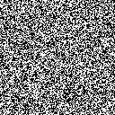
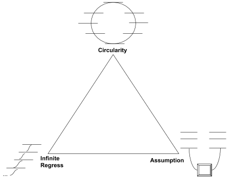
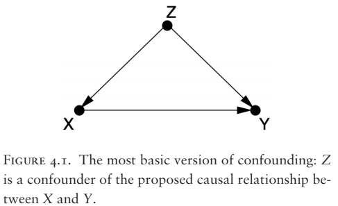
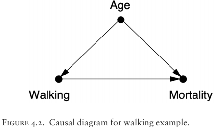

How can we be sure our mind didn't form similar to how a single raindrop forms, aggregating based on random chance? There is some theoretical backing to these ideas of blips of consciousness.

> "The [Boltzmann brain argument](https://en.wikipedia.org/wiki/Boltzmann_brain) suggests that it is more likely for a single brain to spontaneously and briefly form in a void (complete with a false memory of having existed in our universe) than it is for our universe to have come about in the way modern science thinks it actually did. It was first proposed as a reductio ad absurdum response to Ludwig Boltzmann's early explanation for the low-entropy state of our universe.

> In this physics thought experiment, a Boltzmann brain is a fully formed brain, complete with memories of a full human life in our universe, that arises due to extremely rare random fluctuations out of a state of thermodynamic equilibrium. Theoretically over a period of time on the order of hundreds of billions of years, by sheer chance atoms in a void could spontaneously come together in such a way as to assemble a functioning human brain. Like any brain in such circumstances, it would almost immediately stop functioning and begin to deteriorate."

Another way of thinking of randomness is to imagine a small image of 128x128 pixels. For simplicity, the pixels are either white or black, on or off, at random. How long would it take for the number 1 to form in the image? Only the pixels showing the 1 would be white. Of course, there are many images that look like white noise, just random white and black dots with no order, but after some time, the 1 will appear recognizable. Given enough time, every possible image that can be constructed out of those pixels will appear. You can read more about the [Infinite monkey theorem](https://en.wikipedia.org/wiki/Infinite_monkey_theorem).

{:refdef: style="text-align: center;"}

{: refdef}

{:refdef: style="text-align: center;"}
Here are 100 images in sequence in gif form. Each pixel is generated (pseudo)randomly as on or off with 50% likelihood.
{: refdef}

{:refdef: style="text-align: center;"}

{: refdef}

{:refdef: style="text-align: center;"}
I manually created the image of a 1, in this case a simple rectangle, alongside 10 randomly generated images. Notice how much information needs to align to generate this image. A random white dot outside the rectangle is noticeable. For this image to occur randomly is astronomical but not impossible.
{: refdef}

Our universe is far more spacious than a 128x128 image, and only one section of it needs to align to form a brain or a universe.

### "Bertrand Russell wrote, in The Analysis of Mind: "There is no logical impossibility in the hypothesis that the world sprang into being five minutes ago, exactly as it then was, with a population that 'remembered' a wholly unreal past." - [Omphalos hypothesis](https://en.wikipedia.org/wiki/Omphalos_hypothesis#A_deceptive_creator)

How do we know the universe didn't pop into existence in its current form 5 minutes ago? We might have all of the memories, but those popped into existence when we did too. I can think of no way around this idea, because the point of the thought experiment is that all experience and knowledge outside of the present moment is cut off from its justifying weight of experience. If we look to the future to perform some experiment or verify continued existence, the reply is that we were created five minutes ago from now.

So what can we derive, what more can we know with the certain truth that we are a momentary blip of consciousness?

Here lies the problem of removing uncertainty. Descartes attempted to form a foundation for further beliefs. If we can have a fundamental belief that is known to be absolutely true and a set of rules which are guaranteed to result in a justified and true belief, then we can have a set of true and justified beliefs beyond doubt. This is the axiomatic approach.

---
Axiom

/ˈaksēəm/

noun

_a statement or proposition which is regarded as being established, accepted, or self-evidently true._

-- Google

---

What else can you know based on the statement that existence is at least a momentary blip of consciousness?

For a meaning of life, I want to be certain and justified in the meaning.

[Agrippa’s Trilemma](https://en.wikipedia.org/wiki/M%C3%BCnchhausen_trilemma) is the culmination of [ancient skepticism on justification](https://plato.stanford.edu/entries/skepticism-ancient/#AgrFivMod). In order to have certainty and knowledge, we believe some type of justification must be given. Agrippa’s Trilemma aims to show the failure of justification, and therefore that certainty is unachievable.

The position is that justification is based on three main types:
1. **Assumption** - Some premises are assumed to be true (axioms), typically they are accepted to be self-evident. This rests on an assumption, which does not give us certainty.
2. **Infinite regress** - Each claim must be supported by another claim, and that supporting claim must in turn be supported by another claim. The third supporting claim must also be supported, _ad infinitum_. Since we must ultimately stop on an unsupported claim, we can never be certain that we have proper support.
3. **Circularity** - Instead of an infinite regress, we find that claims mutually support each other in some kind of circular fashion. However, this is widely regarded as a fallacious way of reasoning.

{:refdef: style="text-align: center;"}

{: refdef}

This analysis of justification is top-down instead of bottom-up. We are using high level concepts and theory in attempt to describe justification. We should look closer on how justification evolves.

The ancient Greek philosopher Plato wrote that enlightenment of the mind is like quick illumination of the eyes. When entering a brilliant area our eyes hurt and need to adjust. Similarly, illumination of the mind is painful and takes adjustment.

A summary of one of Plato's famous stories, the [allegory of the cave](https://en.wikipedia.org/wiki/Allegory_of_the_cave).

---

#### Imprisonment in the cave
Plato begins by having Socrates ask Glaucon to imagine a cave where people have been imprisoned from childhood (important to note that they were (based on text) imprisoned from childhood but not from birth). These prisoners are chained so that their legs and necks are fixed, forcing them to gaze at the wall in front of them and not look around at the cave, each other, or themselves (514a–b). Behind the prisoners is a fire, and between the fire and the prisoners is a raised walkway with a low wall, behind which people walk carrying objects or puppets "of men and other living things" (514b). The people walk behind the wall so their bodies do not cast shadows for the prisoners to see, but the objects they carry do ("just as puppet showmen have screens in front of them at which they work their puppets" (514a). The prisoners cannot see any of what is happening behind them, they are only able to see the shadows cast upon the cave wall in front of them. The sounds of the people talking echo off the walls, and the prisoners believe these sounds come from the shadows (514c).

Socrates suggests that the shadows are reality for the prisoners because they have never seen anything else; they do not realize that what they see are shadows of objects in front of a fire, much less that these objects are inspired by real things outside the cave which they do not see (514b–515a).

The fire, or human made light, and the puppets, used to make shadows, are done by the artists. This can be compared to how illusions are made with light and sound today, with electronics, videos, movies, and 3D visuals. Plato, however, indicates that the fire is also the political doctrine that is taught in a nation state. The artists use light and shadows to teach the dominant doctrines of a time and place.

Also, few humans will ever escape the cave. This is not some easy task, and only a true philosopher, with decades of preparation, would be able to leave the cave, up the steep incline. Most humans will live at the bottom of the cave, and a small few will be the major artists that project the shadows with the use of human-made light.

#### Departure from the cave
Plato then supposes that one prisoner is freed. This prisoner would look around and see the fire. The light would hurt his eyes and make it difficult for him to see the objects casting the shadows. If he were told that what he is seeing is real instead of the other version of reality he sees on the wall, he would not believe it. In his pain, Plato continues, the freed prisoner would turn away and run back to what he is accustomed to (that is, the shadows of the carried objects). He writes "... it would hurt his eyes, and he would escape by turning away to the things which he was able to look at, and these he would believe to be clearer than what was being shown to him."

Plato continues: "Suppose... that someone should drag him... by force, up the rough ascent, the steep way up, and never stop until he could drag him out into the light of the sun." The prisoner would be angry and in pain, and this would only worsen when the radiant light of the sun overwhelms his eyes and blinds him.

"Slowly, his eyes adjust to the light of the sun. First he can only see shadows. Gradually he can see the reflections of people and things in water and then later see the people and things themselves. Eventually, he is able to look at the stars and moon at night until finally he can look upon the sun itself (516a)." Only after he can look straight at the sun "is he able to reason about it" and what it is (516b). (See also Plato's analogy of the sun, which occurs near the end of The Republic, Book VI.)

####  Return to the cave
Plato continues, saying the freed prisoner would think that the world outside the cave was superior to the world he experienced in the cave and attempt to share this with the prisoners remaining in the cave attempting to bring them onto the journey he had just endured; "he would bless himself for the change, and pity [the other prisoners]" and would want to bring his fellow cave dwellers out of the cave and into the sunlight (516c).

The returning prisoner, whose eyes have become accustomed to the sunlight, would be blind when he re-enters the cave, just as he was when he was first exposed to the sun (516e). The prisoners, according to Plato, would infer from the returning man's blindness that the journey out of the cave had harmed him and that they should not undertake a similar journey. Plato concludes that the prisoners, if they were able, would therefore reach out and kill anyone who attempted to drag them out of the cave (517a).

---

Plato remains relevant more than 2,500 years after his death because his stories by analogy apply to so many ideas. We are all living in a cave, and most of that cave is our skull. Our head encases our brain, the most complex organ or object in the observable universe. There are holes for sense organs to communicate with the brain, our eyes, nose, ears, and mouth. Our sense of touch travels from all over our body and especially through the spinal cord.

Consider hearing:

{:refdef: style="text-align: center;"}

{: refdef}

Sound must travel through a medium, air. The vibrating air moves tiny hairs inside our ears as well as vibrating a small bone in our inner ear, amplifying the sound. Our brain has dedicated areas to make sense of the sound for more information. What is the source of the sound? Where is its potential location? Our brain attempts to understand, predict, and find meaning in the vibration of the air.

The analogy is the brain is like the prisoner fixed in the cave of our skull. We cannot access the world as it is, we can only access the shadows of real objects, the energy that reaches our senses. In fact, the objective universe is forever out of our reach since we must interact with it through our sense organs. Are we justified in assuming our senses are accurate? They are accurate enough to allow us to survive and manipulate the world, but the prisoners had their own system of understanding shadows and sounds. They all agreed on what made sense.

I would like to take a moment to share some facts about our brains. So much of what we consider to be ourselves is actually the function of our nervous system. Humanity learned about brain function over the history of our species. In hospitals and healing centers, people would come with injuries to the head. Unlike injuries to other parts of the body, head trauma often resulted in death or disability. Recovery was slow if at all. Even stranger, a small difference in the type of trauma and location of injury had wildly different effects. For example, [damage to the language centers of the brain effects the generation and understanding of speech](https://www.nidcd.nih.gov/health/aphasia). In Broca's aphasia, people retain their intelligence and ability to understand others, but they have difficulty finding words when they try to speak. They may only get a few words out with effort. Conversely, Wernicke's aphasia causes people to lose track of their error. They speak but use too many words and are unaware of their mistakes; they believe they're speaking clearly. Over lifetimes, we began to piece together the story and function of the brain.

---

[Function of the brain](https://en.wikipedia.org/wiki/Brain#Function)

"Information from the sense organs is collected in the brain. There it is used to determine what actions the organism is to take. The brain processes the raw data to extract information about the structure of the environment. Next it combines the processed information with information about the current needs of the animal and with memory of past circumstances. Finally, on the basis of the results, it generates motor response patterns. These signal-processing tasks require intricate interplay between a variety of functional subsystems.

The function of the brain is to provide coherent control over the actions of an animal. A centralized brain allows groups of muscles to be co-activated in complex patterns; it also allows stimuli impinging on one part of the body to evoke responses in other parts, and it can prevent different parts of the body from acting at cross-purposes to each other."

- Perception
- Motor control
- Arousal
- Homeostasis
- Motivation
- Learning and memory
  - Working memory
  - Episodic memory
  - Semantic memory
  - Instrumental learning
  - Motor learning

---

Let's take a moment to consider how complex a simple act is. Imagine you had a strap tied on your left wrist too tight. You reach over to adjust the strap so it isn't too tight. What's happening? The cells on your left hand are sending signals to each other and to your nervous system that they are losing blood flow and resources (oxygen, water, etc.) and there is too much pressure for normal function (they're saying "help us, save us!"). This information is processed in the brain where it assesses the situation and understands the strap is too tight. Another group of cells, your right hand and all that is required to move it, carryout the complex task of nimbly adjusting the strap to relieve pressure. Consider again how these cells are all separate units cooperating for the good of all.

Our brain receives data, bits of information, about the outside world through its sense organs. We refine our understanding of the world based on incoming data and our interaction. We have a hypothesis generated in our brains to fit the data we store in memory. What's the process for refining our prediction based on past information and new, incoming information? The ideas were formally developed by Thomas Bayes. With [Bayesian inference](https://en.wikipedia.org/wiki/Bayesian_inference), we can describe learning and prediction as calculation. Bayesian inference provides a method for inferring unobserved phenomena by updating beliefs after observing conflicting information. Even if we can't directly experience reality, we can still reason about what is happening.

---

## Epistemology

Epistemology is the study of knowledge. What do we mean when we say we know something? Rather than investigating knowledge, let's investigate questions. A question is a request for information. Can you think of a question that doesn't involve who, what, where, when, how, or why?

[Critical thinking](https://en.wikipedia.org/wiki/Critical_thinking) involves asking these questions. Notice that stories involve who, where, when, and what which is characters, location, time, and action. Questions of how and why are different and more complex than the previous four. A question of how is about the extent or mechanism of what, the action. A question of why is about the causal inputs and outputs of the mechanism of action. Questions of why are about explanation and prediction. An explanation connects a past sequence of events in a causal, coherent way. A prediction connects a future sequence of events. A sequence of events is a pattern. Understanding is explanation or prediction. We hope we can intervene on the mechanism of action to effect and predict a future pattern.

Stepping back from questions, we can ask under what conditions do we ask questions? What happens to generate a question? We want information. Do questions come from lacking information? Actually we lack quite a bit of information, but we don't ask questions about it. Questions don't arise from lacking information but awareness that we lack information. When an event breaks from our explanation of the pattern, we can ask why. When a prediction fails we can ask why. When explanations and predictions succeed we can think of new patterns which relate to our understanding and ask new questions.

Let's pause for a moment to notice and differentiate types of arguments. [Deductive arguments](https://en.wikipedia.org/wiki/Deductive_reasoning) go from general information to information about a specific case (general -> specific). [Inductive arguments](https://en.wikipedia.org/wiki/Inductive_reasoning) go from specific information to the general (specific -> general). Deduction is seen as certain while induction gives evidence for a claim but does not prove it beyond doubt. There is a third type of argument which seeks to find the best explanation among competing arguments, [abduction](https://en.wikipedia.org/wiki/Inductive_reasoning).

> “Critical rationalism is an epistemological philosophy advanced by Karl Popper...Critical rationalism rejects the classical position that knowledge is justified true belief; it instead holds the exact opposite: That, in general, knowledge is unjustified untrue unbelief. It is unjustified because of the non-existence of good reasons. It is untrue, because it usually contains errors that sometimes remain unnoticed for hundreds of years. And it is not belief either, because scientific knowledge, or the knowledge needed to build a plane, is contained in no single person's mind. It is only available as the content of books.” -- [Critical Rationalism](https://en.wikipedia.org/wiki/Critical_rationalism)

“Critical rationalists hold that scientific theories and any other claims to knowledge can and should be rationally criticized, and (if they have empirical content) can and should be subjected to tests which may falsify them.”

“If [claims to knowledge are] retained, further differentiation may be made on the basis of how much subjection to criticism they have received, how severe such criticism has been, and how probable the theory is, with the least probable theory that still withstands attempts to falsify it being the one to be preferred.”

With [verificationism](https://en.wikipedia.org/wiki/Verificationism), our intuition is to have the most probable, most corroborated theory. However, Karl Popper and David Miller propose criticisms of justificationism and positivism.

1 - Critical rationalism doubts the naive empiricism of induction based on the [critical arguments of David Hume](https://en.wikipedia.org/wiki/Problem_of_induction). “According to the critical rationalist, if there is a sense in which humans accrue knowledge positively by experience, it is only by pivoting observations off existing conjectural theories pertinent to the observations, or off underlying cognitive schemas which unconsciously handle perceptions and use them to generate new theories...The myth that we induce theories from particulars is persistent because when we do this we are often successful, but this is due to the advanced state of our evolved tendencies. If we were really "inducting" theories from particulars, it would be inductively logical to claim that the sun sets because I get up in the morning, or that all buses must have drivers in them (if you've never seen an empty bus).”

2 - “Popper and David Miller showed in 1983 that evidence supposed to partly support a hypothesis can, in fact, only be neutral to, or even be counter-supportive of the hypothesis.” - A proof of the impossibility of inductive probability

Consider the claim: “All swans are white.”

To confirm this hypothesis, we can look for swans and each white swan we find confirms the claim, supposedly adding more support. Now consider the [contrapositive](https://en.wikipedia.org/wiki/Contraposition#Intuitive_explanation) of the claim, “All non-white things are not-swans.” These two claims are logically equivalent; they hold the same truth value, supporting or disproving one effects the other equally. Now we can confirm our claim with anything that is not white. Suddenly I can perform confirming experiments immediately with any object near me. A pencil is not white and not a swan, so this should logically support our claim that all swans are white.

3 - Related to the point above, David Miller, attacks the use of "good reasons" in general (including evidence supposed to support the excess content of a hypothesis). He argues that good reasons are neither attainable, nor even desirable. Basically, Miller asserts that all arguments purporting to give valid support for a claim are either circular or question-begging. That is, if one provides a valid deductive argument (an inference from premises to a conclusion) for a given claim, then the content of the claim must already be contained within the premises of the argument (if it is not, then the argument is ampliative and so is invalid). Therefore, the claim is already presupposed by the premises, and is no more "supported" than are the assumptions upon which the claim rests, i.e. begging the question.

{:refdef: style="text-align: center;"}
All squares have 4 sides
{:refdef}

{:refdef: style="text-align: center;"}
This shape is a square
{:refdef}

{:refdef: style="text-align: center;"}
__:. Therefore this shape has 4 sides__
{:refdef}

Notice the conclusion is stated in the premises. The support of the conclusion is equal to the support of the premises.

Many hoped for consistency and completeness in axiomatic systems, that every true statement has a proof even if we don't know it. "The first incompleteness theorem states that no consistent system of axioms whose theorems can be listed by an effective procedure (i.e., an algorithm) is capable of proving all truths about the arithmetic of natural numbers. For any such consistent formal system, there will always be statements about natural numbers that are true, but that are unprovable within the system," [Gödel's incompleteness theorems](https://en.wikipedia.org/wiki/G%C3%B6del%27s_incompleteness_theorems). Gödel demonstrated there will be true statements in axiomatic systems that **cannot** be proven within the system itself. Until we find a higher-order system to support a claim, we should treat such a claim as a _conjecture_.

**Key Principles of Critical Rationalism**:
- Criticize hypotheses/conjectures rationally and empirically (falsify)
- Retain the least probable hypotheses with the highest information content
    - This leaves the hypotheses sensitive to future falsification
- Knowledge and truth are objective
    - But not in the “traditional” sense
    - We can approximate truth

> “Critical rationalism rejects the classical position that knowledge is justified true belief; it instead holds the exact opposite: That, in general, knowledge is unjustified untrue unbelief. It is unjustified because of the non-existence of good reasons. It is untrue, because it usually contains errors that sometimes remain unnoticed for hundreds of years. And it is not belief either, because scientific knowledge, or the knowledge needed to build a plane, is contained in no single person's mind. It is only available as the content of books.”

We can also understand the distribution of knowledge over a human network. No one person has all of the knowledge to build a plane, but together we can.

**Thought Experiment**:

_Consider if everyone lost their engineering knowledge. They might have some beliefs, but there are only untrue beliefs left. Although the knowledge of engineering books does not cohere with the beliefs of people, humans would eventually learn engineering skills through texts. Therefore knowledge can exist independently of belief in books._

“...scientists gain knowledge not by proofs but by refutations of good conjectures and by replacing them with new and better ones. These new conjectures avoid earlier mistakes, explain more, and invite new tests,” [IEP](https://www.iep.utm.edu/cr-ratio/).

Be bold in your hypotheses so you can be wrong! Many points of critical rationalism appeal to me. Scientific theories are almost like evolutionary entities themselves. Theories must survive the challenge of criticisms. Like a beautiful sculpture trapped in stone, we must use our tools to chip away at the excess and retain the stable core leading to incredibly useful knowledge and know-how. Critical rationalism is adaptable by reacting to criticism. If some other method is better, there should be a path of criticisms which guide critical rationalism to the better theory.

**Are you a Critical Rationalist?**

If you believe in a justificationist idea where our ideas should be supported by true evidence, then consider critical rationalism could reach your belief system. If we listed out your beliefs, you would likely have good arguments and some criticisms of other claims. Starting from a _blank slate_, with little to no previous information, we can present a critical rationalist with a set of criticisms leading to your belief system, assuming at least enough good reasons could be alternatively represented as a criticism of another position.

If your belief is true, then the belief should withstand criticism.

A critical rationalist can have your full belief system, so now you should consider _are you a critical rationalist_? If your belief system is intact, then critical rationalism subsumes your belief system.

Quite likely you don't have beliefs which are as rational as can be according to the criteria of critical rationalism. If you accept this epistemology you can update your belief system to be more rational. If this epistemology is wrong, why?

---

## Cause and Effect

According to critical rationalism, our inductive methods of generalization are not rationally supported but due to "our evolved tendencies." We have some mental model, a schema, to successfully determine cause and effect. What is it? How does it work?

If you ask a child who has only seen buses with a bus driver and ask them, "can there be a bus without a bus driver?" they should answer yes. We intuitively know bus drivers are separate from buses even though 100% of buses in observations have bus drivers. How? Are we justified?

In _The Book of Why: the New Science of Cause and Effect_ Judea Pearl and Dana Mackenzie explain the history of cause and effect. Going back to the first paper on linear regression, scientists have long been taught not to infer causation from mere correlation, to observations occurring together with no meaningful relationship. Further back in time, philosophers have many arguments and questions regarding cause and effect relationships. Pearl and Mackenzie argue the topic is confused because of a lack of precise language to formulate cause and effect questions. Pearl describes a three-layered explanation of intelligence up to and including understanding cause and effect, seeing, doing, and imagining. (See figure 1.2 from the book.)

**1. Seeing (Association)**

Activity: seeing, observing

Questions: _What if I see...?_ How are the variables related? How would seeing X change my belief in Y?

Seeing is pure observation. This is the statistical level of correlation. The majority of animals besides humans are at this stage. Does a scary predator jump out from behind a bush? Associate that bush with the predator and avoid it. Do prey congregate around specific trees? Stick near those trees to find prey.

**2. Doing (Intervention)**

Activity: doing, intervening

Questions: _What if I do...? How?_ What would Y be if I do X? How can I make Y happen?

Doing is interacting with the environment. Tool using creatures that plan are on this level. Consider a toddler with a pair of sunglasses. When wearing the sunglasses visual input is distorted, light is dimmer. With no understanding of why, the toddler might infer the world got darker. What toddler's often do is hold the sunglasses over their eyes, lower them, and put them back on, repeating this process several times noticing the change in observations. Of course with this interaction the cause for the change is controlled, occurring when the sunglasses cover the eyes. Through this interaction the toddler comes to learn it is not the world that changes but looking through sunglasses which distorts it.

**3. Imagining (Counterfactuals)**

Activity: imagining, retrospection, understanding

Questions: _What if I had done...? Why?_ Was it X that caused Y? What if X had not occurred? What if I had acted differently?

Imagination is the highest level of understanding. "Counterfactual learners, on the top rung, can imagine worlds that do not exist and infer reasons for observed phenomena."

Pearl once believed as many others that Bayesian rationalism was the highest form of rationality and the basis for all of our reasoning. He worked on Bayesian networks and learned their limitations. Through decades of research in the field of cause and effect, colleagues, scientists, and mathematicians discovered a proof of "do calculus." By applying a cause and effect schema, a model, we can properly account for confounding variables, unknown causes and effects. We can bypass needing to intervene (do) on an observational study (seeing) straight to counterfactual reasoning (imagination and understanding). We can infer cause and effect from observational studies. The key is the causal diagram.

"They [Bayesian networks] are related to causal diagrams in a simple way: a causal diagram is a Bayesian network in which every arrow signifies a direct causal relation, or at least the possibility of one, in the direction of that arrow," page 110, location 1457.

An example of causal diagrams:

{:refdef: style="text-align: center;"}

{: refdef}

{:refdef: style="text-align: center;"}

{: refdef}

With precise language to ask properly formed cause and effect questions we can simulate this reasoning in machines. Machine inference of cause and effect is [developing more each day](/ai/causeEffect/). Other machine learning models such as trees are modified to causal decision trees.

Relating cause and effect to the three levels of reality this connects them. Objective reality is the actual cause and effect sequence of events.

Subjective reality is our representation of cause and effect. Through instinct and experience we build causal diagrams in the mind. When a causal explanation finds causal factors relating to a mind’s causal models it is part of the subjective level of reality. When a causal explanation relates to a causal model of a network of minds it is the intersubjective level of reality.

There is an objective level of how our brains are structured and function, but there is also the informational level of our minds processing information. Of course our causal model can be wildly different from objective reality, but there is a relationship between the two.

{:refdef: style="text-align: center;"}
[Part 3](/meaningOfLife_2/) • [Part 5](/meaningOfLife_4/)
{:refdef }
