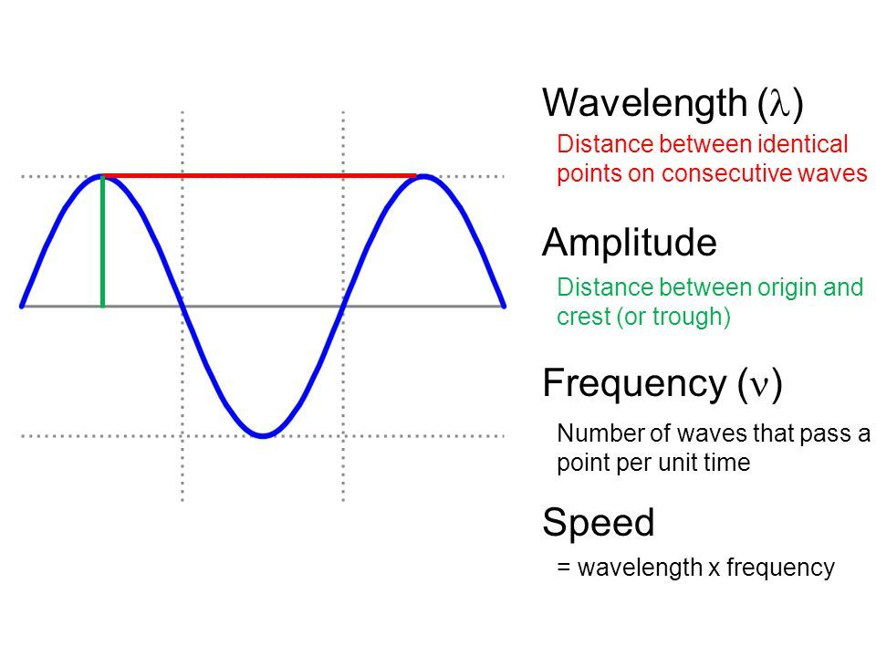
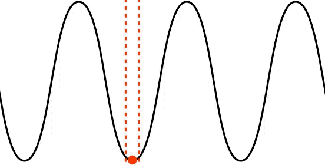
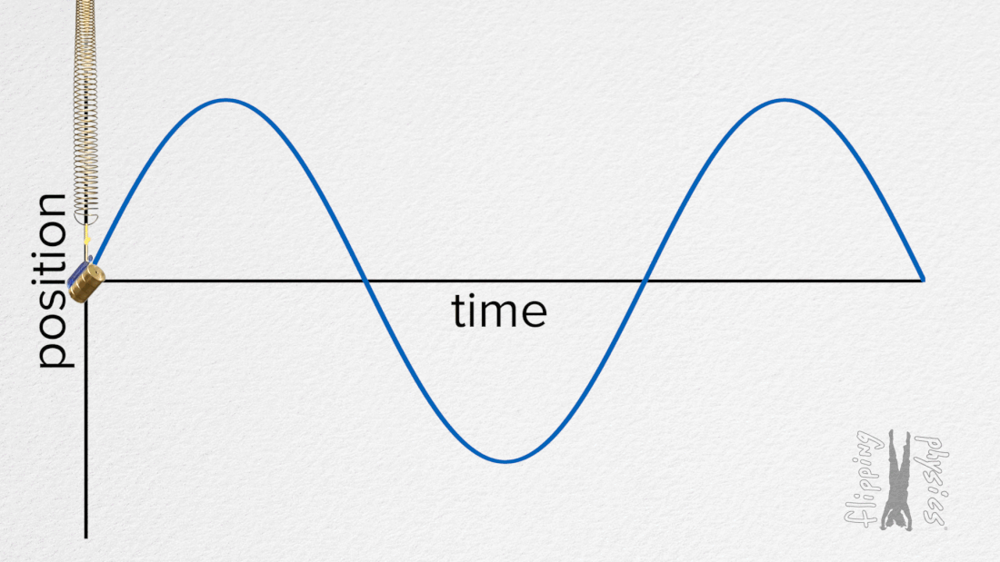
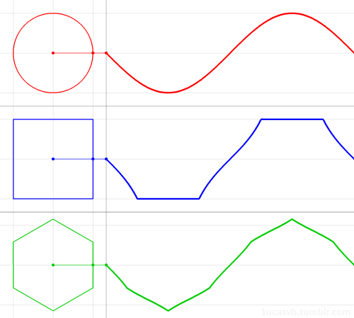
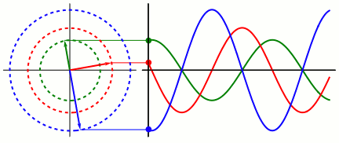
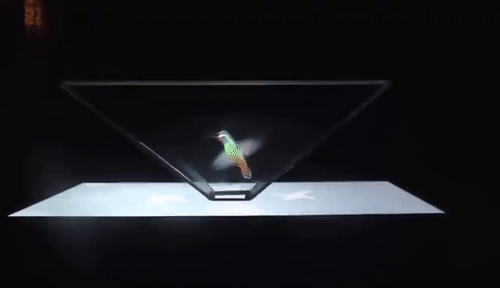
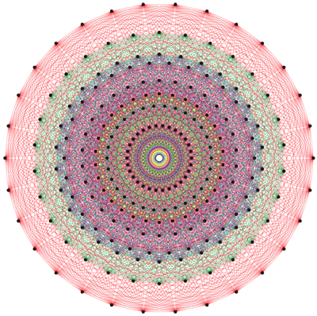

# [Ethics](https://en.wikipedia.org/wiki/Ethics)

The history of ethics shows three major traditions which enhance and conflict with each other: [virtue](https://en.wikipedia.org/wiki/Virtue_ethics), [deontological](https://en.wikipedia.org/wiki/Deontological_ethics), and [consequentialist](https://en.wikipedia.org/wiki/Consequentialism) ethics. A simpler way to explain these concepts are character, rules, and outcomes.

Consequentialism judges action based on outcome. Is the result of your actions good or bad? We can think of moral situations under duration, path, outcome. When time, your choices, and the outcome can be measured and known, we can potentially find an optimal moral choice. Of course we need some evaluation of the moral value of each path. If we can evaluate each choice according to levels of bad, neutral, or good, we simply choose the option which is the most good. Life is often more complex. How do we agree on a duration? What if someone only cares about their own personal life? That changes drastically what choices are made. What if there are more options than we can consider? Who decides when the outcome is settled? There aren't always clear end points.

Consequentialism is based on cause and effect, where the outcome of the effect is what is valued. However when we don't privilege any one state as the end point or the outcomes are unclear, we turn towards what is more immediate: the evaluation of an agent's actions. Here rules govern behavior. The hope is if we all obey moral rules for behavior, our actions overall will lead to greater good. The tough part is knowing what rules to follow and when. How do we decide what rules are best? Following the rules always can lead us to bad outcomes. In new situations we see where the rules bend and break.

Character is your potential to do good or bad when faced with options. Character is about habit and control. People are not good or bad, but "good" people are more likely to make the right choice and "bad" people are more likely to make the wrong choice. A person can take good or bad action.

[Morality](https://en.wikipedia.org/wiki/Morality) is a strategy, a way of planning actions to achieve goals. The best moral strategies are dependent on the environment. The most basic moralities must meet survival needs. If a survival strategy leads to extinction, then the belief system of that morality will literally die out.

> "When anthropologists like Richard Shweder and Alan Fiske survey moral concerns across the globe, they find that a few themes keep popping up from amid the diversity. People everywhere, at least in some circumstances and with certain other folks in mind, think it’s bad to harm others and good to help them. They have a sense of fairness: that one should reciprocate favors, reward benefactors and punish cheaters. They value loyalty to a group, sharing and solidarity among its members and conformity to its norms. They believe that it is right to defer to legitimate authorities and to respect people with high status. And they exalt purity, cleanliness and sanctity while loathing defilement, contamination and carnality.

>The exact number of themes depends on whether you’re a lumper or a splitter, but Haidt counts five — harm, fairness, community (or group loyalty), authority and purity — and suggests that they are the primary colors of our moral sense. Not only do they keep reappearing in cross-cultural surveys, but each one tugs on the moral intuitions of people in our own culture.

> ...

> All this brings us to a theory of how the moral sense can be universal and variable at the same time. The five moral spheres are universal, a legacy of evolution. But how they are ranked in importance, and which is brought in to moralize which area of social life — sex, government, commerce, religion, diet and so on — depends on the culture.

> Many of the flabbergasting practices in faraway places become more intelligible when you recognize that the same moralizing impulse that Western elites channel toward violations of harm and fairness (our moral obsessions) is channeled elsewhere to violations in the other spheres. Think of the Japanese fear of nonconformity (community), the holy ablutions and dietary restrictions of Hindus and Orthodox Jews (purity), the outrage at insulting the Prophet among Muslims (authority). In the West, we believe that in business and government, fairness should trump community and try to root out nepotism and cronyism. In other parts of the world this is incomprehensible — what heartless creep would favor a perfect stranger over his own brother?

> The ranking and placement of moral spheres also divides the cultures of liberals and conservatives in the United States. Many bones of contention, like homosexuality, atheism and one-parent families from the right, or racial imbalances, sweatshops and executive pay from the left, reflect different weightings of the spheres. In a large Web survey, Haidt found that liberals put a lopsided moral weight on harm and fairness while playing down group loyalty, authority and purity. Conservatives instead place a moderately high weight on all five. It’s not surprising that each side thinks it is driven by lofty ethical values and that the other side is base and unprincipled."

> -- The Moral Instinct, Steven Pinker, 2008

(Notice how the moral spheres **compress**, unite, and explain moral behavior?)

What societies consider virtues reflect the values evolved by the society according to its environment and time. We would expect to see certain virtues given a particular time with environmental pressures.

Many ethical theories like Utilitarianism emphasize certain conscious states over others. Pleasure and happiness are desirable while pain and suffering are not. For most people the appeal is obvious. Don't hurt people; have fun. On an objective level, emotions are patterns of activities in our bodies and brains giving rise to conscious states and a sense of subjectivity.

An emotion is like a color. Colors have patterns of waves and frequencies of light. Emotions are patterns of activation in the body and brain. Is it clear which color is morally correct? Does the question make sense? Is purple an objectively "greater" color than aquamarine? Why is pleasure more moral than pain? Morality cannot be guided on an objective level by the subjective desires of intelligent, emotional beings.

Of course subjectively we care about conscious states. Many of us are attracted to enjoyment and repulsed by suffering. We evolved this relationship to emotions because more often than not the emotions signaled a survival advantage. Events which improve our survival chances bring happiness and toxic environments tend to give rise to suffering. However the emotions we feel are signals, information, which each cell and system in our bodies are contributing to. Like other pieces of information we should evaluate it, keep which is a good signal and discard the unimportant signals or noise.

How many positive emotions are correlated and caused by pursuing well-being? There is likely significant overlap! Well-being is by definition wellness, an organism growing and maintaining in accordance with its evolved structure. Negative emotions _should_ still be felt to encourage growth and adaptability. Negative emotions which are too strong can cross the threshold from harmful to traumatizing resulting in more permanent dysfunction potentially inhibiting future wellness, so these should be avoided.

Morality acts on an individual and group level. We have evolved moral tendencies and each of us have some weighting for moral feelings. Given an action or action sequence, our moral system returns a feeling of right or wrong. However, we cannot trust evolved evaluations completely. Our feelings could be a mistake or mismatch. The actions we're judging could be outside of situations for which our moral tendencies evolved.

We can analyze morality using the three levels of reality:

* Intersubjectively: the morality of a group, the combination of moral weights of individuals, the influence of group morality on the individual (in terms of authority and conformity) and vice versa
* Subjectively: our individual moral sense, like a sense of taste, which guides our actions to perceived personal wellness and sustainability
* Objectively: in terms of means and ends, instrumental versus terminal goals, cause and effect, what structures will persist sustainably

We hear that morality is like a sense of taste. As a young person, I hated this idea. What is good and bad is not like the question of what food you like. Now I believe the analogy is quite deep. There are objective, subjective, and intersubjective levels to taste. At the subjective level we have an experience of flavor which feels pleasant, good, or unpleasant, harmful. Our sense of taste tells us what foods will nourish us or hurt us. On an objective level, taste is a prediction of how the food will interact with our self-organized structure. Our cells are running a biochemical evaluation algorithm. Based on pieces of information the parts determine the impact on the whole.

The feelings of morality are like the sensations of taste. We have a sense of the good or bad impact on the parts and the whole. Just like a moldy food would hurt us and cause our bodies to get sick and fight the invasion, we experience disgust at moral injustice. What is good and bad is dependent on the structure in consideration. What is healthy for one creature is lethal for another. What is healthy for one society is disruptive for another.

The evolutionary hijacking of physical taste to the application of taste on behavior is not out of bounds. Our moral sense is an extension of taste like Euclidean distance can be extended into higher dimensions. The equation to find distance in 1, 2, 3, to N dimensions is similar. The determination of taste for the wellness of the body is finding the impact on the parts and the whole for 3 dimensions, the organization of our physical body. Our moral sense is an extension to a more complex dimension, the whole of society, the parts as individuals, our actions as causes and effects.

Good and bad are so ubiquitous we hardly stop to define them. The words 'good' and 'bad' are [common to almost every language on our planet](https://en.wikipedia.org/wiki/Semantic_primes). Goodness and badness are difficult to define because they are so dependent on structure. Think of good health. We can define good health as effective energy flows. Goodness is an organization or actions which promote sustainable energy flows, robustness, and resilience. Goodness often avoids or overcomes crises. Good health means you have less problems. You are ignorant of the harms you avoid when you have good health. Badness is likelihood of crisis and trauma. Badness is a harm which makes the parts or whole less robust and resilient. Trauma occurs when a harm is greater than the ability to heal and repair. The function of those parts and the whole is permanently diminished. Scar tissue does its best to function like undamaged tissue, but scars cannot reach the same level. We can grow in new ways because of trauma, but growth from trauma often involves finding a work around the scar tissue, strengthening an alternative path which otherwise would not have been taken.

As a basic, bodily example of good and bad, think of your arm falling asleep. If your arm doesn't receive circulation, your cells will cry out with need. Your arm will tingle and go numb as your internal alarm sounds for you to move. To lose circulation and cause harm to your body is bad, harm. To relieve pain and move your arm into a position of sustainable circulation is good.

To define good and bad simply:

Good maintains or grows information.

Bad shrinks or destroys information.

To get at objective morality, we need to separate intersubjective and subjective evaluations of actions. If we use the island analogy, an empty island takes no action. We still need to think of an agent acting. Let's imagine instead an AI opponent in the game of [Go](https://en.wikipedia.org/wiki/Go_(game)). There are two sides, black and white, each trying to control the most territory on the Go board.

The end goal, the _terminal_ goal, of each player is to win the game by the most points (control of territory). The _instrumental_ goal are all of the steps from the start to the finish of the game. We can evaluate instrumental goals in terms of their effects on the terminal goal. We can say what moves are good or bad based on the likelihood they lead to winning. Similarly, we can evaluate instrumental goals in terms of other instrumental goals. For example, to win the game we need to gain control of parts of the board, so now my goal is to control one part of the board. The player can evaluate instrumental goals leading to other instrumental goals.

Notice we don't really need emotional evaluation or a moral sense for goal achievement. We can talk about actions and events as good or bad strictly in terms of explicit instrumental and terminal goals. Actions which are good lead to the desired terminal goal. Actions which are bad steer away from the terminal goal.

What about the terminal goals themselves? Can they be evaluated like the instrumental goals?

Imagine a game of Go where one player does not want to win. Their entire strategy is based around making interesting patterns with the pieces. They care nothing about capturing territory. They may play according to the rules and turns, but it is obvious they aren't playing with the game's goal in mind. Can we say this person is wrong once we know their end goal? Their actions are taken to maximize their end goal. With their system of evaluation their actions are rationally implied. From the perspective of the opponent aiming to win Go this is a poor strategy which is easily predicted and countered. However, the perspective of the interesting pattern maker is their opponent is making an unattractive pattern.

Terminal goals can only be criticized when treated as instrumental goals. To evaluate a goal or state of events we must have some criteria to compare. Often when we judge another person's end goals we believe there is a contradiction with other competing terminal goals. We have all kinds of evolved goals and our needs change the urgency to reach a desired state. Once the terminal goal is at least temporarily fixed, we can evaluate action sequences and instrumental goals in relation. Often moral disagreements are between a group morality and an individual morality. What is best for an individual is not always best for the group and vice versa.

As finite, evolved creatures we are limited in our capacity to imagine and evaluate paths. For simple goals we can know an optimal strategy, the path which uses the least resources and maximizes our evaluation. Often the more complex the search of possible choices and events leading to the end goal the less certain we can be of our evaluations. As another example of complexity from simplicity,

> "Despite its relatively simple rules, Go is very complex. Compared to chess, Go has both a larger board with more scope for play and longer games, and, on average, many more alternatives to consider per move. The number of legal board positions in Go has been calculated to be approximately 2 × 10^170, which is vastly greater than the number of atoms in the known, observable universe, estimated to be about 10^80," -- [Go](https://en.wikipedia.org/wiki/Go_(game))

Even the simple game of Go is so complex there are more possible games than we can brute force compute. Is one move better than another? There are too many possibilities for us to evaluate clearly. Instead we need to rely on our intuition, our sense of what is a good or bad position. We should all have humility in our best guess.

When we disagree with others rationally, we cannot evaluate their end goals. For productive cooperation we should argue for shared instrumental goals, searching for win-win paths.

Because we cannot judge between terminal goals the search for objective goals can appear directionless. We run into a reverse similar problem of Agrippa's trilemma in supporting evaluation of terminal goals. Instead of looking for a solid starting foundation, we look for a foundational end goal and find none.

What if we assume an unknown terminal goal where the actions to reach the goal are unclear. The instrumental goal is to find an achievable path to the end goal. Consider a person who wants to maximize their moral goodness without clearly knowing what acting morally good entails or finding the meaning of life with no bias as to what the answer may be. We can think of instrumental goals which would be instrumental towards any goal. A basic goal: survive, avoid death. Death prevents any further actions. If we are trying to reach a goal then we should only die when no further action needs to be taken. Many goals require different levels of power over ourselves and environment. Power is the ability to achieve a desired state. Can you have what you want? So a certain level of power and ability should be amassed by an agent. If the goal is known and clear, then we can know how much power is needed to achieve the goal. Without knowing the full goal, we should continue to accumulate power which will increase the likelihood of achieving future goals. If our goal is unknown, we cannot know when the goal will be achieved. One way of increasing our chances to achieve our goal is to increase our time by living as long as possible, surviving, avoiding death.

---

"The Drake equation is a probabilistic argument used to estimate the number of active, communicative extraterrestrial civilizations in the Milky Way galaxy," [Wikipedia](https://en.wikipedia.org/wiki/Drake_equation). Based on the known values and the assumptions of the unknown, the range of civilizations is between 20 and 100 million.

So why aren't we interacting with aliens right now?

"The Fermi paradox...is the apparent contradiction between the lack of evidence for extraterrestrial civilizations and various high estimates for their probability (such as some optimistic estimates for the Drake equation)," [Wikipedia](https://en.wikipedia.org/wiki/Fermi_paradox). A response to the Fermi paradox is the idea of a _Great Filter_ preventing civilizations from reaching space travel and interplanetary communication.

---

### [The Great Filter](https://en.wikipedia.org/wiki/Great_Filter)

> The concept originates in Robin Hanson's argument that the failure to find any extraterrestrial civilizations in the observable universe implies the possibility something is wrong with one or more of the arguments from various scientific disciplines that the appearance of advanced intelligent life is probable; this observation is conceptualized in terms of a "Great Filter" which acts to reduce the great number of sites where intelligent life might arise to the tiny number of intelligent species with advanced civilizations actually observed (currently just one: human). This probability threshold, which could lie behind us (in our past) or in front of us (in our future), might work as a barrier to the evolution of intelligent life, or as a high probability of self-destruction. The main counter-intuitive conclusion of this observation is that the easier it was for life to evolve to our stage, the bleaker our future chances probably are.

With no evidence of intelligent life other than ourselves, it appears that the process of starting with a star and ending with "advanced explosive lasting life" must be unlikely. This implies that at least one step in this process must be improbable. Hanson's list, while incomplete, describes the following nine steps in an "evolutionary path" that results in the colonization of the observable universe:

1. The right star system (including organics and potentially habitable planets)
2. Reproductive molecules (e.g. RNA)
3. Simple (prokaryotic) single-cell life
4. Complex (eukaryotic) single-cell life
5. Sexual reproduction
6. Multi-cell life
7. Tool-using animals with intelligence
8. Where we are now
9. Colonization explosion

According to the Great Filter hypothesis at least one of these steps—if the list were complete—must be improbable. If it's not an early step (i.e., in our past), then the implication is that the improbable step lies in our future and our prospects of reaching step 9 (interstellar colonization) are still bleak. If the past steps are likely, then many civilizations would have developed to the current level of the human species. However, none appear to have made it to step 9, or the Milky Way would be full of colonies. So perhaps step 9 is the unlikely one, and the only things that appear likely to keep us from step 9 are some sort of catastrophe, an underestimation of the impact of procrastination as technology increasingly unburdens existence or resource exhaustion leading to the impossibility of making the step due to consumption of the available resources (like for example highly constrained energy resources). So by this argument, finding multicellular life on Mars (provided it evolved independently) would be bad news, since it would imply steps 2–6 are easy, and hence only 1, 7, 8 or 9 (or some unknown step) could be the big problem.

---

Of course there are counter responses to the Great Filter, like aliens could choose to explore virtual worlds instead of traveling space. Virtual exploration is much more manageable in terms of resources, time, and risk.

---

Importantly, the [Kardashev scale](https://en.wikipedia.org/wiki/Kardashev_scale) is a method of measuring a civilization's level of technological advancement based on the amount of energy they are able to use.

- A Type I civilization, also called a planetary civilization—can use and store all of the energy available on its planet.
- A Type II civilization, also called a stellar civilization—can use and control energy at the scale of its planetary system.
- A Type III civilization, also called a galactic civilization—can control energy at the scale of its entire host galaxy.

---

Based on the Kardashev scale, our species is approaching but well beneath a type I civilization. There are likely a small number of possible ethical systems which can support and sustain civilizations through advanced stages of life. As Aristotle explained, there are many ways to go wrong, but few ways to be correct.

The moralities and strategies which lead to self destruction represent the boundaries of ethical systems. Any morality which involves killing all its offspring will not survive to the next generation. Do we ever see animals killing their offspring? Yes, but typically there's an evolutionary reason. Male lions kill all the cubs when they take over a group of lionesses to get more resources for their cubs and so those unrelated cubs don't grow to usurp the new lion later. Species which have long gestation and narrow windows of reproduction tend to have some infanticide. What this shows is there can be exceptions to general moral strategies in particular situations.

Morality can be universal given the limits of the situation. If we have full information an optimal strategy or choice can be determined in principle. Of course, life is rarely a full-information situation, and we are finite, subjective creatures. In morality, we must give our best guess at what will bring about our desired end state of events.

---

# The Link to Artificial Intelligence

Is evolution moving toward something? Is there an end goal? Will evolution go towards perfection? But what does perfection mean?

What exists and continues to exist will be a product of luck and evolution. Where conditions allow, ecosystems will continuously arise, die, and new complexity will arise from the previous ecosystem.

All the matter we experience arises from the original elements hydrogen and helium which themselves are made of protons and electrons. In the dense fusion of stars they become new elements cataloged in the periodic table. Over a long evolutionary process our bodies are composed largely of three elements, hydrogen, oxygen, and carbon. Somehow the contribution of every structure in our bodies give rise to consciousness and everything we subjectively experience. The electrical spiking neurons communicate to store memories and make predictions of the future. Conscious experience appears to correlate with complexity of connection, energy usage (metabolism), and integrated information processing of itself and the environment.

Researchers are investigating [consciousness as a state of matter](https://arxiv.org/abs/1401.1219). Like particles can be solid or liquid, they can also be in a state of "perceptronium," making conscious perceptions. See Max Tegmark's paper for more on the 5 basic principles of information, integration, independence, dynamics, and utility. Of course there may be yet more principles to find.

For creatures which can gain a greater return of investment from the environment, a reinforcing feedback loop will give them more power to extract energy from the environment up to diminishing returns. If a creature arises which can compound their return, they will eventually dominate the environment and exert the greatest power. To process and control larger amounts of energy and complexity systems must be developed. To manage energy and information flows, the systems will store past information to predict future events leading us towards an understanding of intelligent agents. The systems can store all experience, improve subjective compressibility (increasing efficiency), let intrinsic curiosity reward reflect compression progress, and maximize intrinsic curiosity reward.

We are theoretically capable of creating an artificially intelligent entity embodying intelligent behavior. The being would not be constrained by the energy and integration limits placed on the human body. The traits and achievements we value as the essential nature of humans is really the nature of intelligence. Subjective beauty, novelty, surprise, interestingness, attention, curiosity, creativity, art, science, music, humor, philosophy, all of these conscious experiences can be developed to a level beyond the summation of all human experience. Whatever conscious states a person values can be reproduced in an AI to a superior level where superiority is defined by efficiency of resources for greater effect in every measure. At levels beyond our comprehension there could be dimensions to conscious experience we would never understand.

We would create a new form of advanced intelligent life superior to every creature before.

Before life on Earth there was non-life. Abiogenesis is "the original evolution of life or living organisms from inorganic or inanimate substances." In the earliest days there were automata, complex cellular machines. They transferred energy through simple chemical reactions. Some of these automata captured the radiating energy of the sun creating photosynthetic life. The automata could capture and use more energy than it needed providing a greater return on energy investment (they get more than they spend). Alternatively, other cells could devour and use the energy stored in photosynthetic cells. Eventually animal cells were born of a mitochondrial cell being symbiotically absorbed by a cellular automata. The symbiosis created a division of labor. The outer cell would focus on survival while the mitochondria focus on generating energy in the form of ATP. The mitochondria could generate energy to excess, and the more successful cells found a balance of using the excess energy to increase survival. With EROI greater than one, the cells were able to evolve to more complex structures and multiply.

We've seen what happens when life gets too little energy and more than what's required for survival. Our earliest hunter-gatherer tribes had an EROI between zero and two. Human agricultural societies through farming and cooking could increase their EROI further still allowing for specialization of labor. With specialization came a greater EROI up to a diminishing return. With fossil fuels, we were able to use the energy stored in the Earth like a battery storing sunlight. With the excess energy from fossil fuels our society reached new levels of civilization and complexity. We are growing and learning at levels never before possible.

### Imagine if we could construct an artificial being capable of living on the edge of maximum energy and out of equilibrium.

The AI entity could be far more adaptable and successful than any life on our planet. If and when we die, the AI entity could live on and potentially become a living being among the cosmos continually searching, developing, growing. Perhaps at some stage the AI entity could find a way to survive beyond the death of our universe.

The question is do you value conscious life over inanimate existence?

I have the drive and desire to learn and grow endlessly. I thirst for knowledge and wisdom, but I must accept my finite existence. I will die. Our species will die. Our planet will die. What heights will living creatures reach? I will not accept a cold and unfeeling universe with no conscious life. There are ice cold planets with almost no movement on their surfaces or within. There are fiery planets with storms raging the size of our continents. The storms rip apart any complex structure. Over thousands of years, the activity on the surface of planets can be described as shifting sands and wind. When I think of our planet and life returning to a state of disorder I am filled with a profound sense of loss. How does time pass without a subjective viewer? If no one experiences time do millions of years pass silently? Yet the same laws of nature which govern uninhabitable planets govern Earth and all the life on it. With my precious time I will rage against the decay of life.

# Computer Science as Fundamental

Here's a story of how the universe works that I like. You should follow the best science.

Think of one dimension which is a number line. Cross another number line at zero to form a +. This is 2 dimensions, and I suspect our entire universe is like a 2-dimensional plane. At every point in space we can query it for information by observing it. The space is like a tight cloth, a trampoline, or the surface of water.

{:refdef: style="text-align: center;"}

{: refdef}

Learn the anatomy of a wave function. We have the horizontal axis where points above it (crests) are positive and points below (troughs) are negative.

{:refdef: style="text-align: center;"}

{: refdef}

In the above transverse wave, imagine the red dot is you in the current moment. The present is changing from the past into the future on a flowing pattern. So much information can be described by a simple wave function!

{:refdef: style="text-align: center;"}

{: refdef}

The above graph shows the position of a weight on a spring as it changes over time. Think about this further. We can represent a point in space changing over time in terms of a wave, a graph. Consider the change in space of a particle over time. With a wave function we can define a particle's change in space and time over an infinite period. Every particle in your body that makes up you can be graphed in a wave, and the bundle of waves making up every _bit_ of you is the total wave function which defines your change in space over time. In addition to describing points we can also generate a wave representation of shapes. We can graph all kinds of geometric shapes as waves.

{:refdef: style="text-align: center;"}

{: refdef}

The radius, from the center to a line, determines the magnitude of the shape. We can also convert information about a shape into a specific wave function like the sine wave.

{:refdef: style="text-align: center;"}

{: refdef}

Each of the circles above are the same shape but different sizes, different radii. The sine waves have a similar pattern but are clearly different. Let's imagine the green line is reality as it is (objective), the red line is what you believe reality is (subjective), and the blue line is how people see reality (intersubjective). The distance from what we believe to reality is our error. There are points of overlap where we see reality accurately, but they're rare moments. If the blue line represents fitness, meaning having the beliefs which will make you a good, resilient, successful fit in your environment, the distance to that line is the difference in performance of your fit to the situations you face.

### Life can be viewed as a game of predicting the best line. If you draw a line too far away from success you fail.

Considering just one field, the electromagnetic spectrum of electrons, we can see how information is the basis for reality. A free electron is like a beam of light; it's a packet of energy hurtling through space. When we look at two electrons, they appear identical. In every way we can measure, the electrons are the same. If people were identical like electrons it would be as if every person in the world had the _exact_ same body. If two or more things are identical how do we distinguish them? This issue is in the [identity of indiscernibles](https://en.wikipedia.org/wiki/Identity_of_indiscernibles). The critical property distinguishing two electrons is information; where the electron is in the fabric of the electromagnetic spectrum and at what time. The position and time of the electron are **pieces of information**, the difference that makes a difference, about the particles.

A good basis for [quantum mechanics](https://en.wikipedia.org/wiki/Quantum_mechanics), the study of atoms and subatomic particles, is the [double-slit experiment](https://en.wikipedia.org/wiki/Double-slit_experiment). The experiment showed atoms exhibit properties of waves and particles. A particle is a point while a wave is a probability. Even a single particle appears to act like a wave which can interfere _with itself_, overlapping troughs and crests balance out to zero. Another strange property, electrons have [energy levels](https://en.wikipedia.org/wiki/Energy_level), orbiting paths based on how much energy is absorbed. Electrons seems to jump from orbit to orbit, popping in and out of existence. What are the rules for transition? We can get better intuition of this problem by thinking of geometry.

This will sound strange at first, but the universe we know and interact with could be fundamentally 2-dimensional. There's an "up" and "down," a "left" and "right," but space and time are not the same. Time is the rate of change, the absolute speed of cause and effect. Space is the value that is changed according to time, like a wave. Think of a digital video. The screen is flat, but you have a sense of the distance of the objects represented. There's 3D information encoded in a way your brain can decipher.

{:refdef: style="text-align: center;"}

{: refdef}

In the above gif, a holographic projection of a hummingbird is created by displaying 4 images from different angles reflected up through glass. This is an analogy to our universe described by the [holographic universe hypothesis](https://en.wikipedia.org/wiki/Holographic_principle), which states energy, matter, and information are equivalent. The physics understanding of thermodynamic entropy and Claude Shannon's formulation of information entropy are equivalent with different descriptions.

### Energy, matter, and information are equivalent

Just like lower dimensions can project up, from 2D to 3D, higher dimensions can project down. One technique is [principal component analysis](https://en.wikipedia.org/wiki/Principal_component_analysis). The simplest explanation is seeing an object's shadow. Hold a ball up to the sun and see the shadow cast on the ground. There's still information about the shape, but its volume has been reduced to a flat surface. Some information is typically lost in this flattening or squishing. That information and structure can be translated between dimensions is a key insight.

What we would expect to see in a rationally ordered universe is the laws derive naturally from structure. Similar to how the internal angles of a triangle add up to 180 degrees, our universe would appear given certain conditions, structures, and values. What could a fundamental shape of the universe be? [One physicist champions an interesting hypothesis](https://www.ted.com/talks/garrett_lisi_an_8_dimensional_model_of_the_universe?language=en), the fundamental geometry of the universe is an [E8 lattice](https://en.wikipedia.org/wiki/E8_lattice). This ["An Exceptionally Simple Theory of Everything"](https://en.wikipedia.org/wiki/An_Exceptionally_Simple_Theory_of_Everything) says particles like electrons, protons, everything, all emerge from the essential properties of E8 lattices. The below image is of an E8 lattice projected to 2 dimensions. _Existence_ could be at the center.

{:refdef: style="text-align: center;"}

{: refdef}

As we've seen, a good scientific theory should be tested, criticized, and remain firm against scrutiny. However, the picture of the universe we have now is strange. Is our universe simply a _slice_ of a larger, hyper object? Perhaps our universe is a slice of a larger object where just parallel to us is another slightly different universe. In the other universe, everything is the same except for a single bit, one piece of information is one where the other is zero. The _multiverse_ would then have a more complete shape like a probability distribution. The most extreme cases are on either end with the most common cases occurring in the "middle." Maybe when electrons pop in and out they seem to disappear because they are sliding through a parallel universe in a dimension we don't experience. If we were to design a universe generation machine, we could save computational resources by sharing quantum states between universes where no causal connection occurs which effect the macro/particle level. Perhaps there are an infinite number of universes just like ours but slightly different. Perhaps the universe expands and contracts in a big crunch to start the creation of the universe over in an endless loop. Perhaps infinite universes occur not simultaneously but consecutively and slightly different. We will never know all the truths of our level, and we're likely to know even less about levels above and below. We cannot reduce everything to a simple equation and explanation. There will always be mysteries and conundrums no matter how deep or how far we go. This is a part of the beauty of life. There is no final end. We can continue infinitely.

I am delighted to be alive at the same time as [Stephen Wolfram](https://www.stephenwolfram.com/) developed a theory of the everything, _[Finally We May Have a Path to the Fundamental Theory of Physics..](https://writings.stephenwolfram.com/2020/04/finally-we-may-have-a-path-to-the-fundamental-theory-of-physics-and-its-beautiful/)_. The work of Wolfram and his colleagues are still ongoing. Wolfram's theory is still not widely accepted, but I don't have the background to follow the technical arguments. I will update my view of the univsere based Wolfram et al's research unless there is an overwhelming refutation.

Wolfram posits space is made of [graphs](https://en.wikipedia.org/wiki/Graph_(discrete_mathematics)), more specifically [hypergraphs](https://en.wikipedia.org/wiki/Hypergraph). The update of the universal hypergraph is spacetime which gives rise to everything. Looking back on the Game of Life, the 2D grid we used can be represented in terms of a graph where the nodes are linked in a grid way. The challenge of Wolfram's generalized framework is to determine what rules govern our specific universe, since hypergraphs can give rise to many types of rules and universes.

What I find most interesting about this theory of everything is the "pockets" of reducibility found in irreducibility. Computational irreducibility means you have to run the program to see what happens; you can't predict what a program will be doing at some given time. Even if we have a more powerful computer the system still has to run the program up to the future state to see what happens. Computational reducibility means we can predict what will happen. We can "look ahead" to know how the program will run without doing every step.

The really interesting part is there will be areas in computationally irreducibility that _can_ be reduced and predicted.

We are living in these pockets! This explains why the universe can appear to be chaos yet have predictable and deterministic moments.

In my younger years I had the feeling of a deeply rational and intuitionist argument for proof of God. It took me years to articulate the argument to myself conceptually. I wanted an argument for God so powerful that if you were to be rational at all you must accept belief in God. Like so many thinkers, this would be one of the foundational beliefs in my epistemology.

If randomness is irrational, how is there rationality? To be rational requires a mind to intentionally order the universe. That mind is what we would consider God. If no intentional being ordered the universe, then we don't have rationality by definition. What was hard for me to mentally grasp and accept was that order and rationality could occur spontaneously from randomness.

{:refdef: style="text-align: center;"}
[Part 5](/meaningOfLife_4/) • [Part 7](/meaningOfLife_6/)
{:refdef }
