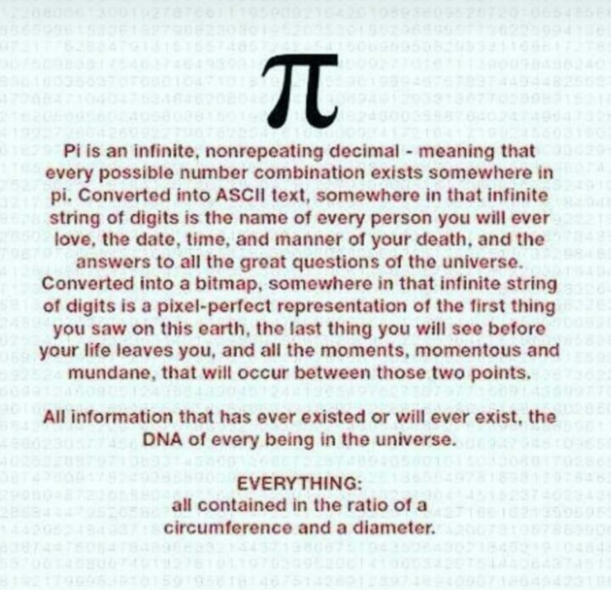
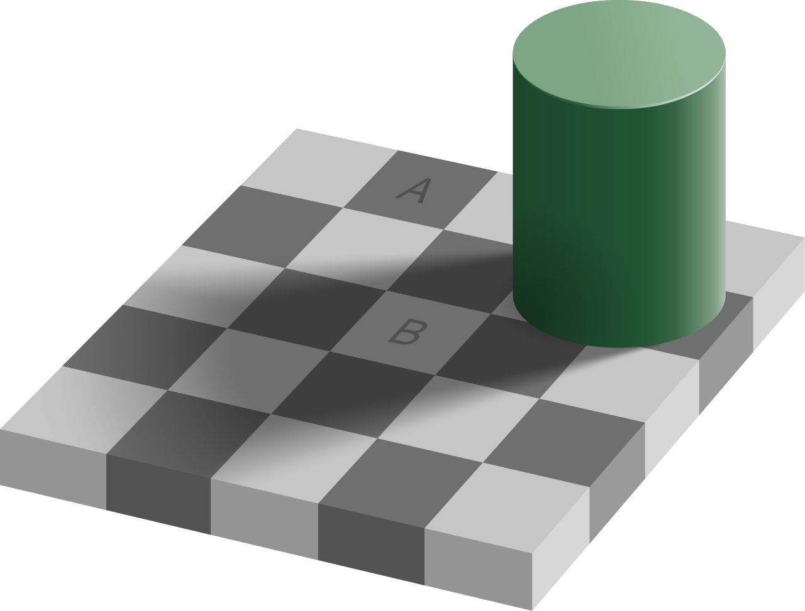
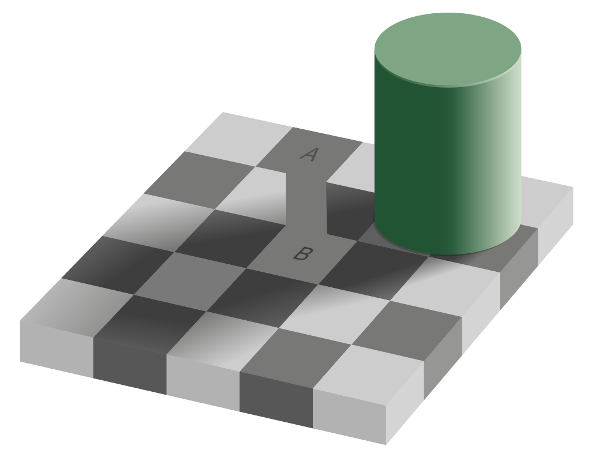

<!-- Google tag (gtag.js) -->

I believe Robert Sapolsky explained [Chaos and Reductionism](https://www.youtube.com/watch?v=_njf8jwEGRo) well. He drew upon the work [Chaos: Making a New Science, by James Gleick](https://en.wikipedia.org/wiki/Chaos:_Making_a_New_Science). There are systems which have [periodicity](https://en.wikipedia.org/wiki/Periodic_function). We can expect at 9am that in 12 hours a clock will return to 9pm. We try to reduce, compress, the phenomenon down to an equation or scientific theory to explain or predict the system. We can describe a line in a graph with the equation y=mx+b. [Reductionism](https://en.wikipedia.org/wiki/Reductionism) attempts to understand systems at lower levels than the whole to reduce variability and noise. Perhaps if we understand all the small parts we can fully predict the whole. Like reducing an organism to its genetic code. However genes give an example against reduction. There are billions of connections in the brain, but there aren't billions of genes coding for each connection. The code gives rules for a pattern, but the pattern can be _perturbed_ by initial conditions. Each time you run the code and generate the pattern it will turn out differently.

We attempt to reduce variability and noise to find that both are features of the system which are scale free. No matter how much we reduce and magnify, no matter how far we zoom out to study the whole, there will always be variability, noise, and mysteries remaining. Like the value of pi, the more resolution of the number we hope to have by finding a new decimal place, we can determine the next digit giving greater precision, but the value doesn't end. We can zoom in for precision endlessly.

[Magnification](https://en.wikipedia.org/wiki/Magnification)

{:refdef: style="text-align: center;"}

{: refdef}

Imagine a person who _just wants to understand one small part_ of the [mandelbrot set](https://en.wikipedia.org/wiki/Mandelbrot_set), just a piece. You can magnify a small space attempting to see the smallest magnification level, but mandelbrot set is defined based on the magnification level you look. We exist on a plane in a size that determines our magnification and level. We can gain local information, but we hit limitations by magnifying.

Such is the search for the meaning of life and understanding the universe. There is always more to learn.

We can magnify ourselves. We can look at people on the whole person level, or we can magnify down to the smallest unit of us, a single cell. At the cellular level we see a different yet familiar world. Cells interact with their environment, reacting to stimulus. Cells are able to self-replicate by dividing. Cells process information about themselves and their surroundings in variables of size, location, age, and time of day. Cells have some form of memory, at least genetically about how to handle different circumstances. Cells self-regulate. Cells go against entropy, exchanging outside energy to maintain internal order. By performing these actions, cells trap and create more information than their surroundings, as we saw in Why Information Grows.

Cells have a code, a program, given in the RNA and DNA of the nucleus (and separately in mitochondria). DNA has symbols and a grammar. There are codes which signal when to stop reading a genetic snippet of information. DNA has jump statements, branching, control flow, essentially like an _if_ statement in programming.

As [Joscha Bach](http://bach.ai/) puts it, cells are a self-replicating Turing machines which exploit entropy gradients created by the laws of physics. By existing we shed bits of information which amounts to information processing.

### Turing Machines

What is a computer? What is computation? Alan Turing set out to formalize these concepts. Computation is the systematic flipping of bits. A problem is computable if you can reduce it to mechanical symbol manipulation. Our universe can be seen as a computer in that the change we see is the change of information. The program the universe follows is according to the laws of nature.

[Examples of Turing Machines](https://en.wikipedia.org/wiki/Turing_machine_gallery)

Computers are a controlled energy flow. They process and recombine information. Built from logic gates up, computers are reasoning made tangible. Binary is represented as zero and one, but can also mean on/off, up/down, true/false. In school, you might raise your hand to signal you have a question. Notice that we can change the context to change the meaning of raising your arm. With one arm we can represent two states, with two arms we can represent four states.

{:refdef: style="text-align: center;"}

{: refdef}

With this binary counter gif you can see how to represent numbers greater than one using binary. The bottom light orange numbers are only zero and one, the binary, to the right of it is the number in base ten, the type of counting you're used to. You can find the number in base ten by adding up the values in the middle column where ever there is a one beneath it. The top row shows the powers of two.

Think about base ten, 952 is really 9 * 100 + 5 * 10 + 2. We can write the same thing as powers of 10, 9 * 10^2 + 5 * 10^1 + 2 * 10^0, because 10^0 is 1 (any number to the power of zero is equal to one), 10^1 = 10, 10^2 = 100. So from the right most digit we see a pattern where each number is 10^(digits from the right starting at 0).

Binary is the same but we change the base, 2^(digits from the right starting at 0). 101 in binary represents 1 * 2^0 + 0 * 2^1 + 1 * 2^2 = 1 + 0 + 4 = 5.

Just like when you add 8+9 and you realize we need a digit in the 10's place to handle the "overflow." 8+9=17, so we can take 2 from 9 and add the 2 to the 8 to get 10, and 9-2=7, so we have 17.

What about binary addition? 5+4=9, 5=101, 4=100, so 101+100=1001.

1001 = 1 * 2^3 + 1 * 2^0 = 9

Anything written in base 10 can be written in binary. Most systems like your computer expect a certain length of binary digits. The term binary digit was compressed to the word 'bit.' A byte is 8 binary numbers (bits) in sequence. Negative numbers can be represented by making the first bit 1, so 4 and -4 would be 00000100 and 10000100. Notice that this changes the range of numbers we can express since the leftmost bit would be 1*2^7 but is now a question of sign (+ or -). We can also use binary to represent letters. Instead of 0100 mapping to 4, we can say 0100 maps to the 4th letter, 'd.' In a similar way we can represent anything written or spoken in terms of an alphabet translated to binary.

### Think about this: if we map one binary string of bits to one number, letter, or other idea, how many items can we represent?

The ability to map is equal to the number of distinct binary sequences that can be made from a given number of binary digits like a byte of 8 bits. Binary represents one of two options, so there are two ways to choose. At two bits, there are two ways to choose the first digit and two ways to choose the second bit, so two times two, four sequences, four possible mappings.

00

01

10

11

And so on for _n_ given bits. We can map _2^n_ binary sequences. With just 32 bit sequences we can have encoding for 4,294,967,296 things!

Using simple binary we can represent more complex concepts. All we need is a system that understands what each bit's 1 or 0 represents an answer to a question. For a computation, the question is based on the rules of how the information is processed. How does information grow from binary? Binary addition as an example gives us a new output sequence from two given binary strings added together, new information generated from given information.

As expressively powerful as Turing machines are, they of course have limitations. They function on deterministic processes, and there are problems which cannot be computed, like the well known [halting problem](https://en.wikipedia.org/wiki/Halting_problem). Other than giving us computers these ideas have spawned entire fields of theory. One such idea is [Algorithmic information theory (AIT)](https://en.wikipedia.org/wiki/Algorithmic_information_theory).

We can differentiate Turing machines based on the rules they follow to flip their sequence of bits. The rules are the program. This allows us to define [Occam's razor](https://en.wikipedia.org/wiki/Occam%27s_razor) in terms of programs. Occam's razor was originally used by scientists to determine which hypothesis to use in explaining observations. We can reframe this in terms of the [minimum description length](https://en.wikipedia.org/wiki/Minimum_description_length), "where the description length of a data sequence is the length of the smallest program that outputs that data set." A program can be a hypothesis, it's how we think the data might be generated. The measure of the smallest program to produce an object (like a string of letters) is [Kolmogorov complexity](https://en.wikipedia.org/wiki/Kolmogorov_complexity).

This is related to [Solomonoff's theory of inductive inference](https://en.wikipedia.org/wiki/Solomonoff%27s_theory_of_inductive_inference). There are multiple competing programs or models that fit the data. When a new observation is not predicted by the model, the model is falsified. We have the remaining programs to choose from which we give the highest weighting to the simplest.

Earlier in my life I focused on the storage of information as the greatest good. To have experience and reflect on it was a good in its own sake. To store information persists its existence and meaning. As I learned more math, I realized the data for a complete mapping of the universe exists infinity times over. Consider the value of [pi](https://en.wikipedia.org/wiki/Pi).

{:refdef: style="text-align: center;"}

{: refdef}

There could be a potential mapping of the digits of pi with meaning to our universe. Finding that mapping would be incredibly difficult but possible in principle. To represent our universe we would likely want a more ordered value series than pi. Notice the digits of pi which are represented in base ten can be represented in base two. Pi can be written in binary, so the universe can be represented in a sequence of 1's and 0's. However, pi is just one transcendental number, and there are an infinity of them. Each sequence would have a unique mapping to our universe. Similarly, the values could map to a possible world, a different world. All we need to do to represent it is change the mapping.

Using [Leibniz' formula to calculate pi we can write a very short program](https://www.geeksforgeeks.org/calculate-pi-with-python/) to output the value of pi. So the Kolmogorov complexity of pi is actually quite small. However the Kolmogorov complexity of the program which maps the values of pi in a meaningful way to our universe would have extremely high complexity.

## The Ladder of Causation in terms of logical statements

The association level is simply and's, _x_0 AND x_1 AND ... x_n_. The interactive level is gaining control over the bit flipping in the form of an if statement, _what if x_0 then y_0_. Imagination is a complicated chain of the second level, _what if x_0 AND x_1 AND ... x_n then y_0 AND y_1 AND ... y_n_. Imagination also allows for counterfactual reasoning, why we would _not_ have an expected outcome.

By chaining together a series of possibilities represented as flipped bits and using our causal model to estimate the outcomes we gain counterfactual reasoning of simulated worlds. We can imagine possible worlds and make inferences.

What if people were twice as tall?! What would be different about the world? We're changing something simple about a feature of our world, take everyone's height and double it. Would doors still be the same size? A child can answer, "no, they would be twice as big for people to get through." We understand doors are made by people, and the size is related to average height. If average human height changes, the average door size changes.

## Sending/Receiving Information and Entropy

Taking a look at information again, a good definition of information is _the difference that makes a difference_. For two pieces of data, how can you tell them apart? In binary, we have the clearest difference, one or zero, yes or no. What if we frame a bit with context, what if each bit is asking a yes or no question?

Imagine we're sending messages to each other through a computer, but one person doesn't have a microphone. That person has to communicate yes or no visually. Given the English alphabet A-Z, how many yes or no questions are required to spell the word 'one'? Let's start with the first letter, _o_. What question would you ask?

Since there are 26 letters in the alphabet, you might think we need to ask a question for every letter up to _o_, is it a? _no_, is it b? _no_, ..., is it o? _yes_. What is the fastest way to determine the correct letter out of all possible letters? Well, let's start with a smaller list of possible letters.

Say we want to send one letter from A-E, five choices. We can ask: is the letter after 'C'? If yes, we know the letter is D or E. Let's say the letter is 'E,' then we can ask if the letter is before 'E', no, the letter is 'E' (if no then the letter must be 'D'). If the answer is no to the question of is the letter after 'C', our new shortened list is A, B, C. We can repeat the process, asking if the middle letter is before the letter meant. So, is the letter before 'B', no, so the only letter after 'B' is 'C', our answer.

By asking this yes or no question about the middle letter we can quickly dismiss half of the answers. If we know the intended letter is on one half of either side of the letter we don't have to bother with the other half. Each time we ask a question, we divide up the possible answers into two groups. Mathematically, dividing up input repeatedly is a [logarithmic](https://en.wikipedia.org/wiki/Logarithm) (log base 2) operation.

A part of this is to explain that how information is stored, shared, and processed has calculable limitations. We can send information very efficiently and accurately or inefficiently with many errors. There are boundaries on how fast we can send a piece of information which is to say how fast a receiver can remove uncertainty.

As an alternative explanation of entropy from a more human perspective, entropy can be a measure of uncertainty. We can define entropy as the minimum number of yes or no questions we need to ask to remove uncertainty from the system. Entropy is the minimum number of questions needed to have full information.

Imagine a box full of 400 H2O molecules. When the H2O is in the state of an ice block, the structure is rigid. How many questions do we need to ask to specify where the H2O molecules are in the box? What about when the box is liquid, just a pool of water at the bottom of the box? The H2O molecules are spread out, looser; their position in the space of the box is less rigid, more variable. When the H2O is gas, where are the molecules? Now they can be just about anywhere in the box. We have an intuitive sense, a model of how the material world works, that the ice and water would be at the bottom of the box while the gas floats. We can divide up the points of space in a 3-dimensional box as the yes or no question of "is an H2O molecule here?" In ice form, we should be able to find the molecules quite fast. In liquid, less fast, but gas would take the longest of all. If we track a specific molecule the rise in uncertainty as to where the molecule is as the H2O molecules change in state from ice to water to vapor is the nature of entropy.

## We are an evolutionary algorithm.

All of life is an [evolutionary algorithm](https://en.wikipedia.org/wiki/Evolutionary_algorithm):

Step One: Generate the initial population of individuals randomly. (First generation)

Step Two: Repeat the following regenerational steps until termination:

1. Evaluate the fitness of each individual in the population (time limit, sufficient fitness achieved, etc.)
2. Select the fittest individuals for reproduction. (Parents)
3. Breed new individuals through crossover and mutation operations to give birth to offspring.
4. Replace the least-fit individuals of the population with new individuals.

Here we are speaking of fitness in the context of evolution. "The term "Darwinian fitness" can be used to make clear the distinction with physical fitness. Fitness does not include a measure of survival or life-span; Herbert Spencer's well-known phrase "survival of the fittest" should be interpreted as: "Survival of the form (phenotypic or genotypic) that will leave the most copies of itself in successive generations."" [Fitness (biology)](https://en.wikipedia.org/wiki/Fitness_(biology)).

---

In their paper, [_Fitness	Beats Truth	in the Evolution of Perception_](https://cogsci.uci.edu/~ddhoff/FBT-7-30-17), the authors present and prove the _Fitness-beats-Truth Theorem_ through evolutionary game theory and Bayesian decision theory. Evolutionary creatures who favor seeing the world truthfully and objectively will fail in comparison to creatures who see the world to maximize fitness.

"Our main message in this paper has been that, contrary to this prevalent view [that we perceive objective reality accurately], attempting to estimate the "true" state of the world corresponding to a given sensory state, confers no evolutionary benefit whatsoever. Rather a strategy that simply seeks to maximize expected-fitness payoff, with no attempt to estimate the "true" world state, does consistently better (in the precise sense articulated in the statement of the "Fitness Beats Truth" Theorem).

"Evolution can fashion perceptual systems	that are, in this	sense, ignorant	of the objective world because natural selection depends only on fitness	and	not	on seeing the “truth.”"

"As human observers, we are prone to imputing structure to the objective world that is properly part of our own perceptual experience. For example, our _perceived_ world is three-dimensional and populated with objects of various shapes, colors, and motions, and so we tend to conclude that the _objective world_ is as well. But if, as the _Fitness-beats-Truth Theorem_ shows, evolutionary pressures do not push perception in the direction of being increasingly reflective of objective reality, then such imputations have no logical basis whatsoever."

Imagine two birds which both have the same diet, blueberries. One of the birds sees the full color spectrum as it is. In the rain forest, everywhere you look pops with vibrant colors beyond the capacity to name. The other bird does not see color but only black and white. Well, it does see one color, blue. The landscape this bird sees is a continuum of black, gray, and white. However, any blue object shines through the background of gray. The blue-seeing-bird can spot anything blue with just a look.

Now which bird will be better at finding blueberries? Which bird will find them faster?

Clearly the bird who only sees blue will notice blueberries immediately while the full color spectrum bird must sift and separate the light pollution of all other colors. This is part of why bees see ultraviolet light and humans don't. If we saw the ultraviolet light it would likely have little use in our day to day lives.

---

# Religion

In the belief of God, there is a question which will determine if you can hear the truth: **do you want to believe or do you want to know?**

If you want to believe you are trying to hold onto the belief in God because it is comforting. If you want to know then you will need answers, rationality, coherence; this is the path to understanding.

While this applies to religion and belief in God generally, I will consider Christianity.

The bible reportedly lists commandments from God. The bible tells us how to poop. We should have a spot outside of our encampment and bury our poop with a tool.

Deuteronomy 23:12-13 ESV

"You shall have a place outside the camp, and you shall go out to it. And you shall have a trowel with your tools, and when you sit down outside, you shall dig a hole with it and turn back and cover up your excrement."

Here are some scriptures that relate to eating and handling shrimp:

Leviticus 11:9-12 ESV

"These you may eat, of all that are in the waters. Everything in the waters that has fins and scales, whether in the seas or in the rivers, you may eat. But anything in the seas or the rivers that has not fins and scales, of the swarming creatures in the waters and of the living creatures that are in the waters, is detestable to you. You shall regard them as detestable; you shall not eat any of their flesh, and you shall detest their carcasses. Everything in the waters that has not fins and scales is detestable to you."

Deuteronomy 14:9 ESV

"Of all that are in the waters you may eat these: whatever has fins and scales you may eat."

As for homosexual activity, the bible has [two main scriptures](https://en.wikipedia.org/wiki/The_Bible_and_homosexuality):

"You shall not lie with a male as with a woman; it is an abomination." Chapter 18 verse 22

"If a man lies with a male as with a woman, both of them have committed an abomination; they shall surely be put to death; their blood is upon them." Chapter 20 verse 13

From a purely objective standpoint, let's think of the evolutionary benefits of each of the commandments. Bury your poop with a dedicated tool keeps humans from contaminating each other. If we don't have waste management, many of us will get sick and die. By burying our poop we solve many of these issues.

Why did God say to only fish with fins? In biblical times thousands of years ago shrimp were genuinely unclean; they gave you food poisoning! We didn't know how to clean them properly to reliably avoid getting sick. By avoiding them as a food source many people lived.

The bible condemns homosexuality for both sexes. Is there an evolutionary benefit? The finer points are complex, but my guess is accepted homosexuality reduces childbirth for the group. In biblical times your success and power were largely determined by the size of your group. Homosexual families have less children, so homosexuality is outlawed increasing the number of sexually reproductive families.

We can see at the time all the scriptures contained a useful strategy for survival which we understand more scientifically now. Groups of people who bury their poop will have less sickness and disease than those who don't. We don't care about burying poop now because the real problem is sanitation. Eating shrimp would have killed you in those days but now we can properly clean them for consumption. Accepted homosexuality likely disrupted expected family planning. We don't need to out-breed neighboring competitive groups, however we still deal with anti-homosexuality today.

The support for a behavior doesn't need to be well justified to get the benefits of the practice. A person who believes in washing their hands of any poop after they touch it get the functional benefits whether they believe the reason is due to germ theory or God says poop is spiritual abomination. From the perspective of the Fitness-beats-Truth theorem and an understanding of evolution we can see how the idea of God arises. The idea of God is a fiction which evolved into our minds. God has been with us in as many forms as our environment takes. When we are close with a thriving nature sapiens believe in many gods and spirits. Hunter and gatherer tribes think the gods are the forces behind everything but care little for human lives. Sapiens which traveled in the desert began to believe in one god, the supreme god of survival. As we formed cities, the far away universal god became a more personal god which cares deeply for all of our personal woes. In cities, our lives depend on other humans, it makes sense that our god would listen to our prayers and understand us.

The idea of god became a powerful force for attracting fictional beliefs and practices with real survival benefits. To this day a Christian person can move to a new country and still have a community of support from a church in their network. Religious people continue breeding at higher rates, and due to the structure of their religious community have more stability. If we look at religion as a belief system which can be viewed a dissipative structure, we see religion is like a living creature like all ideas. If a religion doesn't survive in the minds and actions of believers it ceases to be. For a religion to persist through time it needs to be adopted, solidified, translated, and spread. Religions which change too much don't persist and are absorbed by dominating religions. The most popular religions are the religions which focus on converting non-believers into believers, thus they grow their numbers, winning at the group size game. Religion has constraints based on survival as well.

A major downside to belief in god is what is called "metaphysical baggage." Religion really sounds like something that doesn't exist or make sense. It's not about much cause and effect. We have to accept all of these ideas which don't match reality, like souls, afterlives, creation, etc. You might hold onto the belief that the Earth was formed only 5,000 years ago when all evidence and argument says much longer. Wouldn't this be bad from a fitness perspective? The truth of these claims don't have much impact on day to day life. People can survive believing all kinds of falsehoods. In fact, declaring an absurdity, "Jesus and God are one and the same, a part of a holy trinity" serves a group function. When people say extreme statements they signal their conformity to the group. They're demonstrating loyalty by denying reality and mark themselves as a _true_ believer.

People have long known that religion gives benefits, and they follow the rituals without believing deeply. Some humans may be trapped into believing in some kind of god. For generations we have bred based on the religious teachings, intersubjective beliefs. Perhaps that has changed how some of us are structured. Perhaps God and religion are necessary parts of any intelligent species' evolutionary story, a strategy which boosts the whole species. We do have much to owe religion in its gifts to humanities, but religion served its purpose when our species could not bear the weight of our ignorance. So many of us cannot sit with uncertainty. Life is terrifying, full of suffering, and if we live long enough we will feel empty of meaning. In God, we take all of the fear and uncertainty and ease it with answers or attempts to control outcomes with prayer and ritual. God represents a safety net and the world is based on justice. People don't often pray for daily tasks, but more people pray and perform rituals in chaotic times with risky odds.

Religion codifies morality and passes on preferences. By describing pure and impure, religion shapes our sense of disgust. Religion builds buttons and reactions in us then presses them for control throughout our lives. People in power have used religious people as a tool, steering them by hijacking authority figures.

We should see religion for what it is, once one of the best outlooks to get a person successfully through life that is now obsolete. We should continue religion for what is good in it and abandon the rest to the dark ages.

---

From the Fitness-beats-Truth theorem we would expect to see brains with more internal input than external input, i.e. that incoming sensory input matters less than how our brains transform the incoming data into a useful representation to maximize utility. That is exactly what we see.

---

[Your brain hallucinates your conscious reality -- by Anil Seth (2017)](https://www.ted.com/talks/anil_seth_your_brain_hallucinates_your_conscious_reality)

One example of how the brain amplifies its own perceptual predictions instead of anaylyzing the raw incoming sensory data is the [checker shadow illusion](https://en.wikipedia.org/wiki/Checker_shadow_illusion).

"The image depicts a checkerboard with light and dark squares, partly shadowed by another object. The optical illusion is that the area labeled A appears to be a darker color than the area labeled B. However, within the context of the two-dimensional image, they are of identical brightness, i.e., they would be printed with identical mixtures of ink, or displayed on a screen with pixels of identical colour."

Even with the second image and various ways to verify the color of the two tiles, it's still hard to believe they are the same color. Our brains sense the shadow and adjust the visual sensory input to convince our conscious mind that the colors are different. This applies to all conscious experience shaped by evolution.

> "Instead of perception depending largely on signals coming into the brain from the outside world, it depends as much, if not more, on perceptual predictions flowing in the opposite direction. We don't just passively perceive the world, we actively generate it. The world we experience comes as much, if not more, from the inside out as from the outside in..."

> There's one last thing I want to draw your attention to, which is that experiences of the body from the inside are very different from experiences of the world around us. When I look around me, the world seems full of objects -- tables, chairs, rubber hands, people, you lot -- even my own body in the world, I can perceive it as an object from the outside. But my experiences of the body from within, they're not like that at all. I don't perceive my kidneys here, my liver here, my spleen ... I don't know where my spleen is, but it's somewhere. I don't perceive my insides as objects. In fact, I don't experience them much at all unless they go wrong. And this is important, I think. Perception of the internal state of the body isn't about figuring out what's there, it's about control and regulation -- keeping the physiological variables within the tight bounds that are compatible with survival. When the brain uses predictions to figure out what's there, we perceive objects as the causes of sensations. When the brain uses predictions to control and regulate things, we experience how well or how badly that control is going.

> So our most basic experiences of being a self, of being an embodied organism, are deeply grounded in the biological mechanisms that keep us alive. And when we follow this idea all the way through, we can start to see that all of our conscious experiences, since they all depend on the same mechanisms of predictive perception, all stem from this basic drive to stay alive. We experience the world and ourselves with, through and because of our living bodies.

> Let me bring things together step-by-step. What we consciously see depends on the brain's best guess of what's out there. Our experienced world comes from the inside out, not just the outside in. The rubber hand illusion shows that this applies to our experiences of what is and what is not our body. And these self-related predictions depend critically on sensory signals coming from deep inside the body. And finally, experiences of being an embodied self are more about control and regulation than figuring out what's there. So our experiences of the world around us and ourselves within it -- well, they're kinds of controlled hallucinations that have been shaped over millions of years of evolution to keep us alive in worlds full of danger and opportunity. We predict ourselves into existence.

> Now, I leave you with three implications of all this. First, just as we can misperceive the world, we can misperceive ourselves when the mechanisms of prediction go wrong. Understanding this opens many new opportunities in psychiatry and neurology, because we can finally get at the mechanisms rather than just treating the symptoms in conditions like depression and schizophrenia.

> Second: what it means to be me cannot be reduced to or uploaded to a software program running on a robot, however smart or sophisticated. We are biological, flesh-and-blood animals whose conscious experiences are shaped at all levels by the biological mechanisms that keep us alive. Just making computers smarter is not going to make them sentient.

> Finally, our own individual inner universe, our way of being conscious, is just one possible way of being conscious. And even human consciousness generally -- it's just a tiny region in a vast space of possible consciousnesses. Our individual self and worlds are unique to each of us, but they're all grounded in biological mechanisms shared with many other living creatures." -- Anil Seth

{:refdef: style="text-align: center;"}
[Part 6](/meaningOfLife_5/) • [Part 8](/meaningOfLife_7/)
{:refdef }
