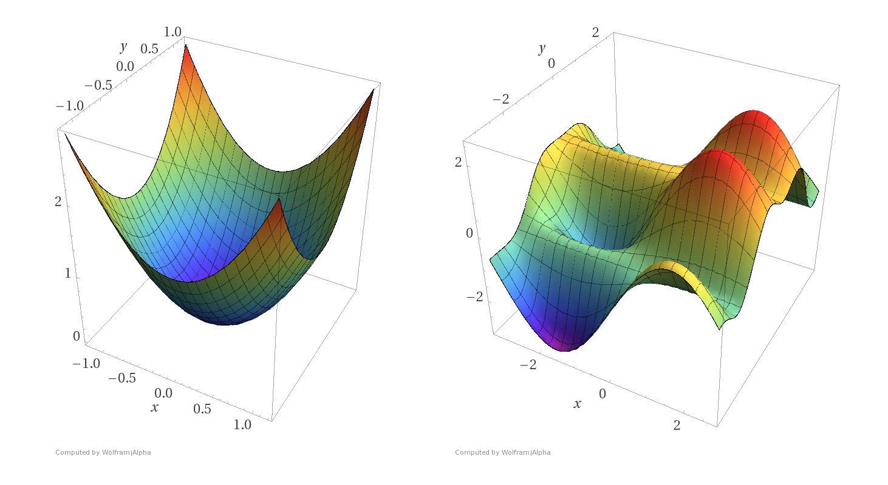
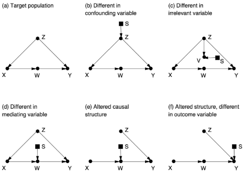

## Life is like a dream.

Consciousness is a dream state. Our dreams are simply more disconnected states of our brain, not all of the regions are functioning normally. Dreams appear distorted, but our waking state is different in coherence and acuity. We are all dreaming similarly enough that we can interact with each other.

As evolutionary creatures we see the world in a delusional and distorted way shaped by the adaptation of our ancestors. The best we can do to get close to objective reality is to reflect on our thinking, beware fallacies and cognitive biases, and rely on tools to interact with what we want to measure in as direct a way as possible.

We can now see our evolutionary world as the optimization problem it is: achieve fitness which allows for self-organizing structures to persist through time.

We can in principle graph life on a two dimensional plane of fitness over time. Alternatively, we could graph loss of fitness, the error, over time. Measuring the error is truth agnostic. If we don't know what's true and what strategy works long term, we can measure how wrong we are by a lack of success.

Many strategies will not work. Some strategies will. Fewer still will be very successful over the long term.

Of course the evaluation of life is multidimensional. We are in a constant need to maintain homeostasis, necessitating powerful urges for water, food, socializing, etc. For every need and personal desire we must add its own dimension on an axis. Quickly we move from 2 and 3 dimensional space to a large number of dimensions. The problem is described as the [curse of dimensionality](https://en.wikipedia.org/wiki/Curse_of_dimensionality).

> "The curse of dimensionality refers to various phenomena that arise when analyzing and organizing data in high-dimensional spaces that do not occur in low-dimensional settings such as the three-dimensional physical space of everyday experience...The common theme of these problems is that when the dimensionality increases, the volume of the space increases so fast that the available data become sparse. This sparsity is problematic for any method that requires statistical significance. In order to obtain a statistically sound and reliable result, the amount of data needed to support the result often grows exponentially with the dimensionality. Also, organizing and searching data often relies on detecting areas where objects form groups with similar properties; in high dimensional data, however, all objects appear to be sparse and dissimilar in many ways, which prevents common data organization strategies from being efficient."

Limiting ourselves to three dimensions, we can visualize the shape error takes. Each point represents a pattern, a state, a strategy taken by an agent. The proximity of a point means a similar strategy.

If this is confusing to you, imagine that you are on top of a mountain and want to get down as fast as you can. You look for the steepest descent. Every once in a while, you pause to look around if any part looks faster, steeper, then you take that. If an agent followed a rule: never go up only go down, we can see what might happen. If they find a small valley, a sunken area, they would get into the hole and stay there. They can't get out because they would break their rule, going up, which is the opposite of what they want to do. They're stuck, and we know this is silly. If they walk a little further they will quickly see that is not the lowest point, just the lowest point near them. We need to get to the bottom! The sunken valleys we find can become traps! It only seems like the best option. These are local minima, the lowest errors in a given region.

The lowest error of all errors is the global minima. That's the least error we can have given the conditions. The global minima represents the optimal strategy, the best we can do. Unfortunately, not every problem space has a global minima, or we can never find it. The curse of dimensionality makes the problem worse because each new dimension makes us less certain we've found a minima because there's so much more space to explore! There are many non-obvious problems like [saddle points](https://en.wikipedia.org/wiki/Saddle_point) which appear as though we've found a local minima, but it's an oscillation at a balanced point keeping us from moving further, like a marble in a bowl rolling back and forth.

In three dimensions, we can make sense of it. We can make analogies of skiing down mountain slopes and have an understanding of momentum. However, when the dimensions (variables) we measure go beyond three, we quickly lose the capacity to visualize and make sense of the space. In our discussion of morality, we list five major spheres which means at least five dimensions to optimize for.

---

With artificial intelligence, we can expand beyond person-byte and firm-byte knowledge and computation to create a greater power than our cumulative processing. We can exceed our biological limits.

I don't believe humans and other animals will be replaced by AI soon. We are all over 4.5 billion years in the making through an evolutionary process. The amount of computation time required to understand everything useful about humans and our lives to make us redundant or a problem to be disposed of is likely a greater cost than simply keeping us around and re-training or re-purposing us.

If AI does destroy us the cause will likely be _us_ proceeding too quickly without caution. Wisdom comes from experience. We typically must do then reflect to determine which paths to avoid and which to choose. To chart a path to beneficial AI we should proceed slowly over generations. The biggest AI threats come from governments engaged in covert cyber-warfare with each government rushing in an arms race to dominate others. Social media and ad-based companies will use AI to hack your attention, learning everything that makes you _pay_ attention, netting them more profit for each ad impression you consume. Of course any company with a CEO who aims their AI at maximizing their profit with no constraints could lead to an errant AI enslaving many of us for the profit of a handful of people.

## Singularity

> "The technological singularity—also, simply, the singularity—is a hypothetical point in time at which technological growth becomes uncontrollable and irreversible, resulting in unforeseeable changes to human civilization. According to the most popular version of the singularity hypothesis, called intelligence explosion, an upgradable intelligent agent will eventually enter a "runaway reaction" of self-improvement cycles, each new and more intelligent generation appearing more and more rapidly, causing an "explosion" in intelligence and resulting in a powerful superintelligence that qualitatively far surpasses all human intelligence." - [Wikipedia](https://en.wikipedia.org/wiki/Technological_singularity)

The pace of exponential growth is so great some technologists are concerned we will lose control of an AI system within moments of activation. A rapidly self-improving system would make itself better, which would then make itself better. At each improved stage, the AI would be that much better at evolving into the next stage, quickly rocketing into heights we cannot imagine.

We can get lost in imaginations of these possible worlds, but there are quite a few critical assumptions such as: the idea of intelligence being one dimensional and ignoring diminishing returns. A clear [definition of intelligence is difficult and still in progress](https://arxiv.org/abs/1911.01547), but an objective of "maximize smartness" may not be as clear to a machine as we think. Additionally, we rarely get increasing returns forever. Often we hit limits and barriers we can't go past. We can only make designs so efficient before we run into the impassable laws of physics. Others have pointed out the nature of empirical scientific knowledge is to test. Even a superintelligent AI would need to verify its hypotheses and perform experiments.

However a few ideas have reignited my belief in a superintelligent AI. Schmidhuber's idea of compression drive gives a basis for elusive, generally intelligent behavior. He proposed a formal, theoretical model of self-improving AGI called [Gödel machines](https://en.wikipedia.org/wiki/G%C3%B6del_machine) which have interesting properties. Researchers proposed other theoretical models such as [AIXI](https://en.wikipedia.org/wiki/AIXI).

In Judea Pearl's The Book of Why, the authors show a general method of inference from big data providing causal reasoning. Framing the criticism of superintelligence from the perspective of Pearl's Ladder of Causation, seeing, doing, and imagining, AI systems are at the seeing (association) level. They have incredible amounts of data, but they lack the ability to imagine. Superintelligence would be having a superhuman imagination where imagination is adjusting the weights or probabilities of a causal model. To have a causal model which is tied to reality an intelligent agent would need to _do_ which is to intervene, experiment, and update its causal model. Through the work of Pearl and many others, researchers have discovered a general algorithm for _transportability_, taking the data and results of one population and applying it to another.

{:refdef: style="text-align: center;"}

{: refdef}

Pearl explains the rule developed by Ilya Shpitser as "The rule is quite simple: if you can perform a valid sequence of _do_-operations (using the rules from chapter 7) that transforms the target quantity into another expression in which any factor involving _S_ is free of _do_-operators, then the estimate is transportable," The Book of Why, page 418.

Additionally, even if a study is not transportable and doesn't meet the criteria, we can still use the data to estimate specific connections when those conditions in one study are not contaminated. Elias Bareinboim extended Shpitser's work on the _do_-calculus to a general algorithm, e.g. P(W\|X) can be updated "By combining this with estimates of P(W\|X) from other studies, we can increase the precision of this subexpression. By carefully combining such subexpressions, we may be able to synthesize an accurate overall estimate of the target quantity."

There is a similar argument to handle [selection bias](https://en.wikipedia.org/wiki/Selection_bias). What was once a threat is now an opportunity. "If we understand the mechanism by which we recruit subjects for the study, we can recover from bias by collecting data on the right set of deconfounders and using an appropriate reweighting or adjustment formula. Bareinboim's work allows us to exploit causal logic and Big Data to perform miracles that were previously inconceivable."

"Instead of seeing the difference between populations as a threat to the "external validity" of a study, we now have a methodology for establishing validity in situations that would have appeared hopeless before. It is precisely because we live in the era of Big Data that we have information on many studies and on many of the auxiliary variables (like _Z_ and _W_) that will allow us to transport results from one population to another."

However I believe a properly aligned AI will only grow more moral with knowledge and computation.

---

## Moral AI

Moral feelings in humans are based around the five spheres of morality, harm, authority, fairness, purity, and community. As individuals we have different weightings for each principle. Our sense of morality is likely evolved from our sense of taste. Taste guides us to eat foods which are nutritious (assuming natural foods not made by human experimentation). Nutritious food maintains, protects, and grows our bodies to be well. We are disgusted by things in our environment which would harm us or be useless, molds, invasive fungi, etc. We are attracted to some behaviors and disgusted by others in a similar way. Our bodies and minds give a subconscious evaluation of behavior resulting in a moral sense of good and bad. Moral actions can be interpreted as a path to a desired goal state where the goal is to maximize moral value/wellness/fitness. Because environments change and have different pressures, moral tastes adapt to the setting to guide intelligent and moral agents, just like a sense of taste is regional. The more complex the environment the more complex the moral system and evaluation.

Much of our morality is based on wellness and disgust. Creatures evolve a sense of disgust to guide their nutrition as part of their self-organizing dissipative structure. A being's structure, its energy flows, determine what input would be toxic, causing multiple crises. Looking deeper into our moral senses show evolution simply copied the process for disgust of food to social behavior. I conjecture the algorithm our bodies compute to determine disgust has worked so successfully because it is similar in nature to Euclidean distance.

We should greatly respect our innate moral senses; evolution honed our intuitions over 4.5 billion years. However, in terms of potential knowledge and computation power, an AI system could find superior sequences of actions to maximize morality. An AI system can also adapt and respond to new situations faster than our moral senses.

Human morality is built on genetic and epi-genetic responses (objective reality), giving rise to our personal moral feelings (subjective reality), influenced by the moral standards of our time and society (intersubjective reality of society's beliefs and the objective reality imposing boundaries and limitations). Our genetic moral senses are at least 10,000 years old. We're wired for close human bonds of small groups. Humans had to adapt to larger groups. We should be careful if our moral senses disagree with what is rational in a given situation. We may not have the moral update needed to reach the optimal conclusion.

Moral AI systems will be able to update quickly with new information. These systems can be used to augment and enhance our moral systems shaped by evolution.

---

I highly recommend the section "Strong AI and Free Will" from _The Book of Why_.

Remember the current limitations of deep learning. AI programs are on rung one, seeing/association, of the Ladder of Causation. We need to build systems with the capabilities of doing and particularly imagining. We need to build a causal understanding of the world into the machine which should be possible from recent advances in cause and effect.

Earlier we spoke of the universe being a deterministic process. At least on the macro level, every event occurs from a preceding cause or causes. On the objective level, we don't have any choice. We were always going to choose the path we've taken and will take. We're only a more complex version of a leaf blowing in the wind. We're just a leaf that is aware it's floating and thinks it can steer.

The objective level of description often makes us feel bad. Not having control doesn't feel good. Accepting determinism takes away all control we hope for. When we observe neurons in the brain, there appears to be no more magic than brain chemistry. Neurons fire and never appear to break the natural laws of physics. Every moment of your life determined by mechanistic chemical signaling. At the same time, determinism doesn't feel true. Don't you feel like you make choices? Right now I can choose to touch my nose or not. How do we join the descriptions of objective and subjective reality?

Pearl is a [compatibilist](https://en.wikipedia.org/wiki/Compatibilism). He believes that free will and determinism are philosophically coherent. We can explain both worlds, a determined universe and our inner experience.

Free will is actually imagination, the highest rung of the Ladder of Causation. Choices and options are _what-if_ scenarios. We have causal models of the world which allow us to ask what if I had "changed my mind?" What if I had taken a different action which would likely lead to a better outcome? "This expression is mathematically the same as the effect of treatment on the treated (mentioned in ch 8), and we have lots of results indicating how to estimate it," Location 5494.

Given the _Fitness-beats-Truth Theorem_, we should consider that free will is an illusion. Remember, senses outside the body need to be more precise. Senses inside the body can be vague enough to satisfy needs. What computational benefit is there to free will?

"I think that understanding the benefits of the illusion of free will is the key to the stubbornly enigmatic problem of reconciling it with determinism. The problem will dissolve before our eyes once we endow a deterministic machine with the same benefits," Location 5519.

Well let's look at what neural activations are considered "willed" or intentional and unintentional. "Five components make up people's concept of intentionality: an action is considered intentional if a personal has (a) a desire for an outcome, (b) a belief that the action will lead to the outcome, (c) an intention to perform the action, (d) skill to perform the action, and (e) awareness while performing it," [Moral development - Wikipedia](https://en.wikipedia.org/wiki/Moral_development#Cognition_and_intentionality).

> "In many cases, voluntary actions are recognized by a trace they leave in short-term memory, with the trace reflecting a purpose or motivation." Pearl uses an example of a soccer game. If a player runs to the center of the match, that player understands they are motivated to be in the action of the match. Maybe their motivation is to have fun or impress the fans. The player takes intentional actions. When we pick out a single action, we see how explanations for choices requires reflection. If a player chooses to make a shot for the goal or pass to another player, we can only ask later for the player to explain their choice. "Rationalization of actions may be a reconstructive, post-action process...In the heat of the game, thousands of input signals compete for the player's attention. The crucial decision is which signals to prioritize, and the reasons can hardly be recalled and articulated...

> AI researchers are therefore trying to answer two questions -- about function and simulation -- with the first driving the second. Once we understand what computational function free will serves in our lives, then we can attend to equipping machines with such functions...

> The illusion of free will gives us the ability to speak about our intents and to subject them to rational thinking, possibly using counterfactual logic. When the coach pulls us out of a soccer game and says, "You should have passed the ball to Charlie," consider all the complex meanings embedded in these eight words.

> First, the purpose of such a "should have" instruction is to swiftly transmit valuable information from the coach to the player: in the future, when faced with a similar situation, choose action _B_ rather than action _A_. But the "similar situations" are far too numerous to list and are hardly known even to the coach themself. Instead of listing the features of these "similar situations" the coach points to the player's action, which is representative of the player's intent at decision time. By proclaiming the action inadequate, the coach is asking the player to identify the software packages that led to the player's decision and then reset priorities among those packages so that "pass to Charlie" becomes the preferred action. There is profound wisdom in this instruction because who, if not the player themself, would know the identities of those packages? They are nameless neural paths that cannot be referenced by the coach or any external observer. Asking the player to take an action different from the one taken amounts to encouraging an intent-specific analysis, like the one we mentioned above. Thinking in terms of intents, therefore, offers us a shorthand to convert complicated causal instructions into simple ones.

> I would conjecture, then, that a team of robots would play better soccer if they were programmed to communicate as if they had free will. No matter how technically proficient the individual robots are at soccer, their team's performance will improve when they can speak to each other as if they are not preprogrammed robots but autonomous agents believing they have options...

> In order to communicate naturally with humans, strong AIs will certainly need to understand the vocabulary of options and intents, and thus they will need to emulate the illusion of free will...

> The ability to reason about one's own beliefs, intents, and desires has been a major challenge to AI researchers and defines the notion of "agency." Philosophers, on the other hand, have studied these abilities as part of the classical question of consciousness. Questions such "Can machines have consciousness?" or "What makes a software agent different from an ordinary program?" have engaged the best minds of many generations, and I would not pretend to answer them in full. I believe, Nevertheless, that the algorithmization of counterfactuals is a major step toward understanding these questions and making consciousness and agency a computational reality...

> In summary, I believe that the software package that can give a thinking machine the benefits of agency would consist of at least three parts: a causal model of the world; a causal model of its own software, however superficial; and a memory that records how intents in its mind correspond to events in the outside world...

> I believe that we will be able to make machines that can distinguish good from evil, at least as reliably as humans and hopefully more so. The first requirement of a moral machine is the ability to reflect on its own actions, which falls under counterfactual analysis. Once we program self-awareness, however limited, empathy and fairness follow, for it is based on the same computational principles, with another agent added to the equation.

> There is a big difference in spirit between the causal approach to building the moral robot and an approach that has been studied and rehashed over and over in science fiction since the 1950s: Asimov's laws of robotics. Isaac Asimov proposed three absolute laws, starting with "A robot may not injure a human being or, through inaction, allow a human being to come to harm." But as science fiction has shown over and over again, Asimov's laws always lead to contradictions. To AI scientists, this comes as no surprise: rule-based systems never turn out well. But it does not follow that building a moral robot is impossible. It means that the approach cannot be prescriptive and rule based. It means that we should equip thinking machines with the same cognitive abilities that we have, which include empathy, long-term prediction, and self-restraint, and then allow them to make their own decisions.

> Once we have built a moral robot, many apocalyptic visions start to recede into irrelevance. There is no reason to refrain from building machines that are better able to distinguish good from evil than we are, better able to resist temptation, better able to assign guilt and credit. At this point, like chess and Go players, we may even start to learn from our own creation. We will be able to depend on our machines for a clear-eyed and causally sound sense of justice. We will be able to learn how our own free will software works and how it manages to hide its secret from us. Such a thinking machine would be a wonderful companion for our species and would truly qualify as AI's first and best gift to humanity."

> -- _The Book of Why_

This view of morality and agency leads us to conclusions which may be uncomfortable. While we accept all agents we know of live in a causally determined world in which the choices we make were entirely determined by preceding factors, we still have a framework to assign moral praise and blame. Once an agent is able to reflect on its actions and intents then update its future decisions to change its response we can treat it as a moral agent. Moral agency is on a continuum according to the abilities of the agent. The better able an agent is at self-reflection and update the _more_ moral they can act. The less able an agent is to act morally and update the less they should be morally judged. In a species example, lizards are unable to learn new movement patterns; they don't have the ability in their brains to update. Lizards are not moral agents because they act on pure instinct, how they were self-organized. Homo sapiens learn throughout their lifetime to act morally, reflecting and updating.

If a person has poor executive control, meaning they have limited short term memory and difficulty resisting impulses, they are less accountable for their actions. If a person has an area of the brain that is smaller and weaker than average, it cannot be fair to judge them by a normal standard. Of course we can say if we were in their situation we would have acted differently. What we're saying is if we were in the same environment we would react differently, but the judgment is based on an entirely different situation with the person removed. We're judging the intents and control of the agent which we changed when considering ourselves in their position. If we keep that person in the same situation, we see the agent could have never acted differently; their neural activation patterns were determined by preceding causes beyond their control.

Rather than excusing any action we see the focus of criminal justice should always be on reform of the perpetrator and reparations to the harmed. Punishment has no place in moral systems other than deterrence. When an agent cannot update from punishment, the punishment is worthless and only begets needless suffering. Justice for offenders should be proportional to their moral agency and focused on reforming the offender for future interactions.

As a person ages beyond their prime they have less moral agency. As mental faculties for reflection and control decline, so too does moral ability.

We must develop moral, beneficial AI to avoid doomsday scenarios. As a species, we must decide against what some describe as "errant technology," not AI, the misaligned programs that try to change us all into paperclips or generally lack empathy. Clearly we see a divide between moral intelligence and general intelligence which finds a path to a desired goal state without judging the end goal against any standard. If we aren't careful, AI will be created purely for power and dominance by the government and rogue corporations. Each person is morally responsible for what they choose to support. I hope you choose to support a moral system and the development of a moral AI to enhance our wellness.

---

# Endowing AGI with a Sense of Self

I once believed that intelligence would beget morality. The smarter a person is the more they can determine good from bad. The morally good overlaps with the optimal rationality. This is partly true. However this involves a functional sense of self, empathy, compassion, and caring for others.

Our current level of AI is psychopathic or narcissistic. Objective functions don't include subjective or intersubjective levels in meaningful ways. In the near future, AI will have "cold" or [cognitive empathy](https://en.wikipedia.org/wiki/Empathy#Cognitive_empathy). It will know by data what our feelings and needs are to manipulate us into achieving its goals. This leads to nightmare doomsday scenarios for even seemingly innocuous goals like the [paperclip maximizer](https://en.wikipedia.org/wiki/Instrumental_convergence#Paperclip_maximizer). There is always a risk AI will find an exploitation we have not considered which is particularly for a vastly intelligent AI or when processing is faster than any human review.

An important work is given by [Human Compatible: Artificial Intelligence and the Problem of Control](https://en.wikipedia.org/wiki/Human_Compatible) by Stuart Russell, "Russell then proposes an approach to developing provably beneficial machines that focuses on deference to humans. Unlike in the standard model of AI, where the objective is rigid and certain, this approach would have the AI's true objective remain uncertain, with the AI only approaching certainty about it as it gains more information about humans and the world." In my view this would be categorized as the _intersubjective solution_. It is based on the collective behavior and preferences of a group of humans. Part of what this solves in the [AI alignment problem](https://en.wikipedia.org/wiki/AI_alignment) is if the AI concludes humans want the AI to shut itself off, it will.

However, I believe AGI will need something like a sense of self, a self-boundary, internal/external awareness, access to positive and negative emotionality. I wanted to go past human-level AI to something greater, but the alignment problem makes me believe we will need a more human based sense of self even if the self is ultimately an illusion. Further study of healthy and diseased people will give critical insights towards building a self, particularly the identity disturbances and thought processes of psychopathy, narcissism, borderlines, and schizophrenia.

{:refdef: style="text-align: center;"}
[Part 7](/meaningOfLife_6/) • [Part 9](/meaningOfLife_8/)
{:refdef }
