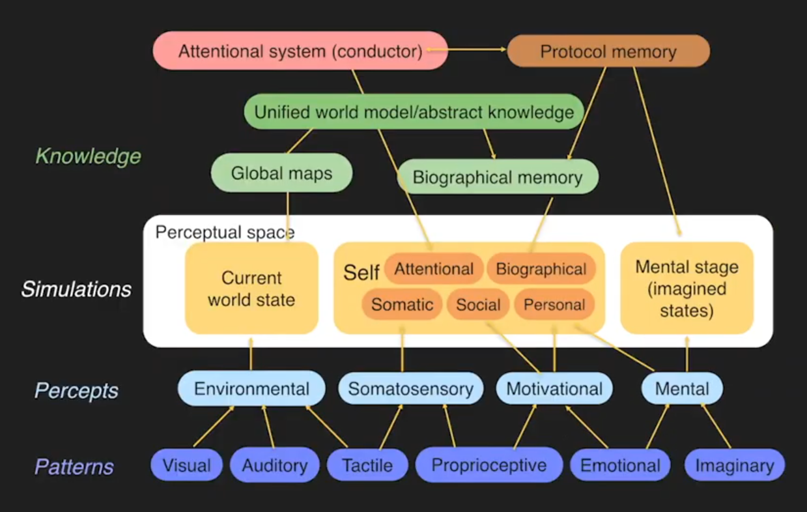
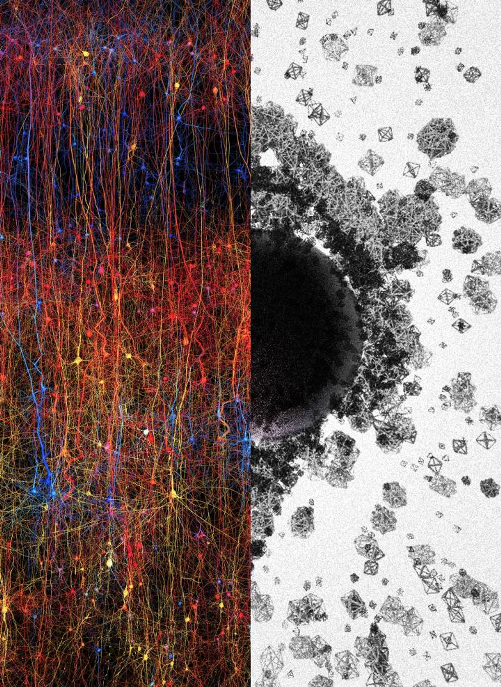
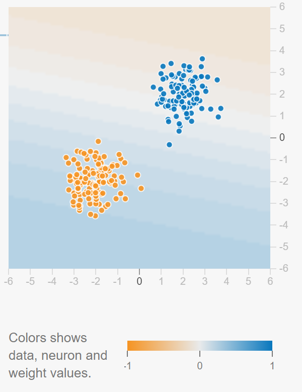
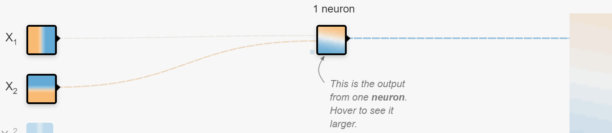
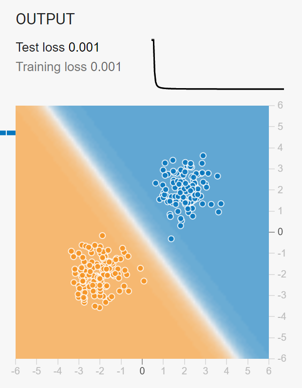
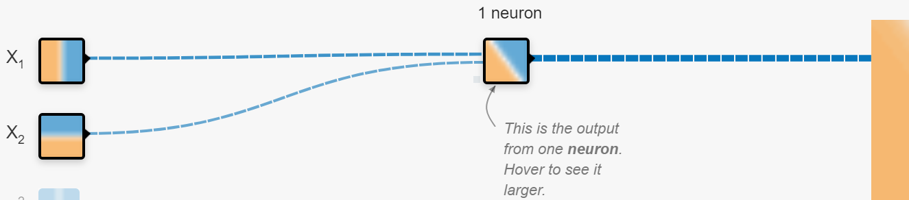
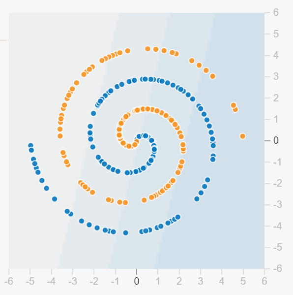
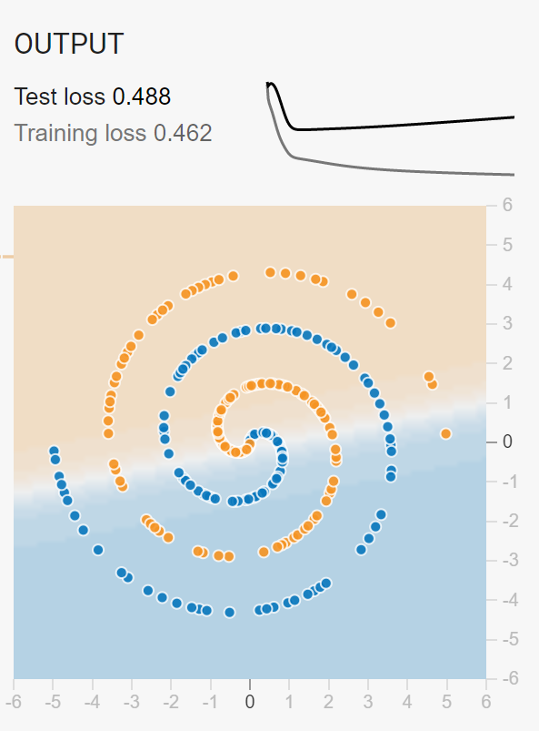

# The End of the Self and Identity

Given the previous information, our picture of the self, who we are, becomes unclear.

**What are you?**

Analyzing personal identity and selfhood on the three levels:

Objectively:

You are a multicellular organism. Each cell of your body is living and replicating for you to continue. Without a stable change of energy in and out of your body you would die. Your body is made up mostly of water, carbon, and air. We are not one entity; we are legion. We are made up of humans cells, but also interact with bacterial gardens in and outside our bodies. There is yet more in the interaction of our bodies with the environment.

Subjectively:

We often most identify with the subjective self most. This is our psychological sense of self, the thinking, feeling, perspectival self which appears to have consistency through time. The mind is dependent on the brain. An extreme difference is an active, aware person compared to a comatose person showing no sign of consciousness. From the comatose, we find connections to [brain structures which generate conscious experience](https://www.ncbi.nlm.nih.gov/pmc/articles/PMC5177681/) and tie our minds to our brains and bodies.

Intersubjectively:

Subjectively we blend with intersubjectivity where we have our internal views of "what people will think if..." It is our view of social norms and values. There is also the outside perspective of ourselves from other people. How we fit into the broader context of society. The definition of [Ubuntu philosophy](https://en.wikipedia.org/wiki/Ubuntu_philosophy) which I like is _I am because we are_. In this way an echo of us lives on as long as we are in the minds of others.

All three have issues of continuity and boundaries. Objectively we have the old question of [the ship of Theseus](https://en.wikipedia.org/wiki/Ship_of_Theseus). Parts of us are exchanged with the environment until none of our original body is the same. Subjectively we lose memories and gain new experiences. There are breaks in consciousness every time we sleep. Intersubjectivity is even more ethereal than the former two.

Our mind is like an ant colony. The colony emerges from the collective simple actions of each ant. No one ant is critical besides the queen, and even she can be replaced. Your neurons die off slowly as we age, but the brain adapts its structure to retain performance. Just like ants follow rules of behavior, so do neurons. By carrying out simple rules swarms of insects can solve complex problems with [swarm intelligence](https://en.wikipedia.org/wiki/Swarm_intelligence). The neurons and neural circuits can compete and cooperate to solve complex problems. Similar theories of mind are proposed by [Society of Mind](https://en.wikipedia.org/wiki/Society_of_Mind) and [The Thousand Brains Theory of Intelligence](https://numenta.com/blog/2019/01/16/the-thousand-brains-theory-of-intelligence/).

The biological make up of who we are conflicts with the common sense intuition of identity. Don't you have a name and a sense of self? Wouldn't you say you are the same person as you were 7 years ago or when you were 7 years old?

What "you" are is an emergent phenomena arising from the activity of your body. The electrical and chemical activity is like a storm in your skull. There are "neural circuits" whose pattern of activity give rise to what we feel and do. What we consider to be the "I" is really a small simulation on top of and separate from most of the activity in your body. The closest we get to who we are is a pattern of activity, our consciousness, which provides us a coherent story of ourselves. The story can change drastically and be forgotten. The most important factor in answering 'yes' to the question 'are you the same you as before' is the feeling of trust and certainty of who we are, not the truth, but the feeling of truth.

Joscha Bach gives many talks on the [computational theory of mind](https://www.youtube.com/watch?v=-rxXoiQyQVc) with a still from his presentation shown below. You are a story the brain tells itself. Your brains holds onto the questions of who, what, where, when, how, why and continually answers them which creates our experience of ourselves. When we can't solve a problem by instinct or past experience it arises to the level of consciousness.

{:refdef: style="text-align: center;"}

[A quick summary](https://deepestturtle.com/2020/12/a-promising-computational-model-of-human-intelligence-and-consciousness/)
{: refdef}

{:refdef: style="text-align: center;"}
[A quick summary](https://deepestturtle.com/2020/12/a-promising-computational-model-of-human-intelligence-and-consciousness/)
{: refdef}

The truth is our sense of self is evolutionarily advantageous. Humans have a unique power within the animal kingdom to identify each other distinctly by our faces. This is one ability which allows us to build complex societies while locally keeping track of who each one of us is.

## Meditation to know thyself

If you want to know yourself, your mind, then I suggest paying attention to the working of your mind. Think about your thinking. Think about your feelings; notice them. The path to enlightenment is as simple as sitting in a corner of a room facing a blank wall. Close your eyes and focus on your breathing from the nose throughout the lungs. Thoughts will inevitably arise; notice them. Where did the thought come from? Where did the thought go? Return to your breath. Focus all of your attention on breathing. _Interrupting thoughts are good!_ Having stray thoughts during meditation/breathing practice is a perfect chance to train your mind and attention. Notice the thought then notice your breathing. Bring yourself back to the breath; every time you do it is one repetition leading to a stronger, more resilient, more focused mind. With 10 minutes a day, over the course of your practice you will gain deeper insight into yourself and the nature of your consciousness.

I believe the long tradition of meditation is a method of deactivating (or at least being highly aware of) the "human" modules of our brain. Meditation techniques are a systematic paths to dispelling our mental illusions. Each meditation practitioner noticed the drives and thoughts of their mind. Through attention and will we can increase or decrease the activity of brain regions. Think of all the drives and thoughts we have, the desire for water, food, safety, comfort, the constant chatter of our ego-driven mind, caught in the past, fear of the future, always thinking of 'I.' What is left when we silence all of this activity? Put another way, what is always there in your mind when we feel and think anything?

We are a swirl of living matter. We came from nothing and will return to nothing. What if we currently are nothing? When we think of ourselves an organic neural network returns a perception. What happens when we deactivate that neural network and look "beyond" it? Much like analyzing an artificial neural network one layer at a time, we can mentally peel back the layers of our mind momentarily. At the core of self, we see _nothing_. The core is an empty space surrounded by structure. We are a hole. We are defined by what surrounds the hole.

Thus far, my deepest insight from meditation is _you are space for the world_.

By observing the world we create a representation of that object in the [timeless, boundless space that we are](https://www.headless.org/). By the constant regulation of our bodily systems we are simulated in our own minds. We create the ego, the idea of ourselves. We are a living creature who dreams who we are.

I will make another claim about our innermost selves: our identification with the self and attention are the same. Attention is necessary for consciousness as we know it. When we stop paying attention to a skill we know automatically we become far less conscious of it. Consider typing on a keyboard when you were first learning versus how you don't _think_ of typing an individual word or letter now. Only by bringing our attention to bare on a skill do we become able to change and experience the activity fully again.

My guess is our conscious selves are an abstracted layer on top of the information processing required to maintain bodily function. We aren't fully conscious of our hormones, digestion, etc. all the time. They come to us in vague impressions. This would make sense if the function of consciousness were to process certain types of information undisturbed from the function of the rest of our body. We likely wouldn't want to be in full control of breathing, heart rate, and everything else. That information would distract us from the thinking our consciousness is doing. Instead, following [Karl Friston's free energy principle](https://en.wikipedia.org/wiki/Free_energy_principle), our mind exists in a markov blanket, the mind can be separated from the other information processing of the body. To isolate the "I" of us from all of the life sustaining functions our bodies and brains carry out might leave us with much less brain power required than we expect.

At the same time, having a body may be essential to consciousness. "[Embodied cognition](https://en.wikipedia.org/wiki/Embodied_cognition) is the theory that many features of cognition, whether human or otherwise, are shaped by aspects of the entire body of the organism."

As D.H. Lawrence puts it in _Psychoanalysis and the Unconscious_

> In the Beginning, before the Word, Was Consciousness
> The primal consciousness in man is pre-mental,
> and has nothing to do with cognition.
> It is the same as in the animals.
> And this pre-mental consciousness remains
> as long as we live the powerful root
> and body of our consciousness.
> The mind is but the last flower, the cul-de-sac.

This is a major challenge if we hope to reproduce only the "flower" of consciousness. Every cell of an organism is displaying intelligence which is making decisions. These decisions could be instinctual or reflexive which do not require simulating itself, the process, and the stimuli. These hosts of decisions integrate to form more complex problems where conflicting pieces of information must be resolved. Perhaps consciousness which can be in conflict with reality relies on this host of decisions. Consciousness could be the awareness of our intelligence.

From the Blue Brain Project, [research suggests](https://bigthink.com/paul-ratner/our-brains-think-in-11-dimensions-discover-scientists) the brain [processes information in up to 11 dimensions.](https://www.frontiersin.org/articles/10.3389/fncom.2017.00048/full) The work is based on [algebraic topology](https://en.wikipedia.org/wiki/Algebraic_topology) which studies multidimensional space.

{:refdef: style="text-align: center;"}

{: refdef}

> "Left: digital copy of a part of the neocortex, the most evolved part of the brain. Right: shapes of different sizes and geometries that represent structures ranging from 1 dimension to 7 dimensions and more. The "black-hole" in the middle symbolizes a complex of multi-dimensional spaces aka cavities." - [Big Think](https://bigthink.com/paul-ratner/our-brains-think-in-11-dimensions-discover-scientists)

### The nature of our mind is truly transcendent.

Is it a coincidence that the brain processes in 11 dimensions and physics describes the universe in the [11 dimensions of](https://www.youtube.com/watch?v=ZS2hJLIN1DM) time (1), gravity (3 dimensions), electromagnetic (1), weak (2), and strong (4)? How do we unite 11 dimensional processing with the very 3 dimensional wet brain? If our bodies and brains evolved to navigate 3 dimensional space with time, why would we have higher dimensional processing at all?

Perhaps evolution and adaptation exploited a greater density of information processing. Like a sphere has volume while a circle has area, higher dimensions allow for greater complexity of problem solving. The solution may be a knot which can only be tied and untied in higher dimensional space.

Why do we feel a spark of life, ineffable qualia, a powerful, feeling subjective sense? That is because we are processing higher dimensional information. There is something it is like to be causally connected and to be aware of that cause and effect. In computing high dimensional problem solving we transcend, but we are a shadow of the full existence of that higher dimensional processing. So we return to problems related to Platonic forms. Do these higher realms exist? Does the feeling of moral justice require 8 dimensional processing or 4?

I won't claim knowledge of higher realms. I leave that to scientists and mathematicians. I don't even know 3 dimensions well. However with this framework we can begin to ask questions like these. We can search for computational limits which can and cannot be exceeded for phenomena to occur. If the universe is fundamentally based on holographic projection, then our minds could be yet a higher level projection. Minds and qualia could be holograms of higher dimensional shapes and processing.

Birds don't need to be lectured on the biomechanics of how they fly, they learn to fly by doing. We don't need to know the mathematical basis for computation to feel our lives. Reflect on your experience to feel the depths of consciousness.

If higher dimensional processing is all that is required for consciousness, the right form, the right shape of processing, then why can't a computer be made to feel conscious? An AI entity could process beyond the barrier of 11 dimensions which may be a biological limit. This is of course based on a [computational theory of mind](https://en.wikipedia.org/wiki/Computational_theory_of_mind) and [artificial consciousness](https://en.wikipedia.org/wiki/Artificial_consciousness).

# More Detail on Neural Networks

Microscopes became good enough [to see individual neurons around 1905](https://en.wikipedia.org/wiki/Neuron_doctrine). The first drawings of neurons shook the neuroscience world and led the pioneers to a Nobel prize. With neurons being the fundamental unit of information processing in the body, AI researchers attempted to create a model of a neuron and neural networks. The first neuron model of the [perceptron](https://en.wikipedia.org/wiki/Perceptron) was formally defined in the 1950's.

We believed the neuron received a chemical and electrical input from other neurons, processed the information in the neuron cell body, the _soma_, then decided to fire or not fire, sending the processed signal to the next neuron. The incoming information is represented as _X_, or you can think of an individual pixel in an image. There is a set of weights, _W_, equal to the number of inputs which the inputs are multiplied by. There is an added bias, _b_, which is sometimes necessary to properly solve a problem. So we can define a perceptron as the function:

f(X) = 1 if X*W+b > 0
f(X) = 0 if X*W+b <= 0

Notice how f(X) = X*W+b is similar to the equation of a line, y=mx+b. [In slope-intercept form](https://en.wikipedia.org/wiki/Line_(geometry)#Slope-intercept_form), y is the output, m is the slope or gradient of the line, x is the input, and b is the y-intercept, the value of y when x = 0.

Let's look at an example problem: identifying cats and dogs. Children struggle at first. They identify dogs, see a cat, and say, "dog!" When they are correct, "no, that's a cat," they learn the difference between the two. Deciding between two categories like cats and dogs can be thought of as drawing a line. We can graph the examples we see, say by size and some value of domestication, and learn a line which separates the two categories correctly. With each new example the line can change to correctly classify.

You can visualize and play with all kinds of neural networks on [Tensorflow Playground](https://playground.tensorflow.org/). Here is a graph on the data we want to classify shown by the colors orange and blue. We can think of these as cats and dogs as well.

{:refdef: style="text-align: center;"}

{: refdef}

Just ask yourself, can you draw a single line to separate the data points into their respective classes? We want a neuron to learn the line.

{:refdef: style="text-align: center;"}

{: refdef}

X1 and X2 on the left are the inputs to a single neuron. That neuron is like the cell body, and the outgoing line is like the axon. After some training, the neuron learn a line. You can see the [decision boundary](https://en.wikipedia.org/wiki/Decision_boundary) by the white line bisecting the data.

{:refdef: style="text-align: center;"}

{: refdef}

So the problem can be defined as: find the W and b which gives

f(X) returns blue if W*X+b > some threshold
f(X) returns orange if W*X+b <= some threshold

Notice how the neuron changes its line once trained. The lines leading to and from the neuron represent the weighted connections.

{:refdef: style="text-align: center;"}

{: refdef}

Finding a decision boundary is the essence of intelligence. Making a decision based on a gradient between two things, yes/no, true/false, move/don't move, etc. The perceptron stops learning when it finds an appropriate line to separate the two classes. Pause to consider there are an infinite number of lines we can find to separate this data. If the data is not linearly separable, then the perceptron will continue to struggle and fail to find the decision boundary.

{:refdef: style="text-align: center;"}

{: refdef}

As an example ask yourself if you can draw a straight line to separate the two classes? It's not possible.

{:refdef: style="text-align: center;"}

{: refdef}

When our simple model tries it finds some line but hits an unsurpassable limit; it can only be so accurate.

<embed src="../../images/MoL/XOR_Problem_NN.pdf" type="application/pdf" height="1000px" width="100%">

The hidden layer of neurons, of which there can be many, learn a representation of the data that allows for better decisions. We can visualize it as emphasizing or diminishing the input which creates an altered topology, like flexing or folding a piece of paper or cloth, to draw a decision boundary. This extends to multiple dimensions, so instead of decision line we have a decision plane.

By mathematical proof, neural networks are [universal approximators of continuous functions](https://en.wikipedia.org/wiki/Universal_approximation_theorem). Anything which can be represented by a continuous function can be learned by a neural network. You could potentially learn any function with enough neurons needed in a single hidden layer. It is also proven for multiple hidden layers where each layer is learning from a slightly modified previous layer. We can see the universality, the generalizability, of neural networks, but this is all based on the most simple models of neurons. We are still only considering neural architectures which feed-forward then send an error signal back. Real neurons are humming with information and have all kinds of connections.

The model we had which is of the input x1, x2...sending a signal of on or off relates to the synaptic connections between neurons. We thought of synaptic connections as sending a charge like a metal transistor wire carries electricity, but [research has shown human dendritic connections can solve the XOR problem](https://pubmed.ncbi.nlm.nih.gov/31896716/). Looking closely, "The dendrites generated local spikes, had their own nonlinear input-output curves and had their own activation thresholds, distinct from those of the neuron as a whole. The dendrites themselves could act as AND gates, or as a host of other computing devices," [Quanta Magazine](https://www.quantamagazine.org/neural-dendrites-reveal-their-computational-power-20200114/). The closer we look the more computational complexity we find.

When a model is too simple for the data it has high bias and low variance; the line the model draws is too rigid. When a model [overfits](https://en.wikipedia.org/wiki/Overfitting) past data it can be too complex for the problem, low bias, high variance, a line that has high or low "squiggles." An overfitting model has a high degree polynomial function which makes it easy for the function to go wildly high or low in its estimates. An overfit model can perfectly fit past data but fails on unseen data because its estimate is far off. Ideally the model will find the optimal function for the problem, the lowest degree polynomial function necessary to predict the true data distribution for past and future events.

Given the high dimensionality of our brains, we can easily overfit some problems while underfitting others. We act on the world (intervention) and imagine possibilities (counterfactual reasoning) to get closer to an optimal function. Applying the DIKIW model:

- Data is reality
- Information is the discernible difference from our predictive function to the data distribution
- Knowledge is the embodiment of the predictive function
- Insight is finding a good gradient or rule which gets us closer to the optimal function
- Wisdom is a shareable insight which can update the predictive function of others

Joscha Bach proposes consciousness arises from a neural network minimizing a loss function, closing the difference between the predictive function and reality. If our conscious experience arises from the activity of a neural network in a markov blanket, a system of self-contained information processing, then other neural networks potentially have a separate conscious experience of their own. The neurons which regulate our gut are called the enteric nervous system.

"The enteric nervous system in humans consists of some 500 million neurons (including the various types of Dogiel cells), 0.5% of the number of neurons in the brain, five times as many as the one hundred million neurons in the human spinal cord, and about ​2⁄3 as many as in the whole nervous system of a cat," -- [Wikipedia](https://en.wikipedia.org/wiki/Enteric_nervous_system)

Our hearts also have neurons: "Dr. Armour, in 1991, discovered that the heart has its "little brain" or "intrinsic cardiac nervous system." This "heart brain" is composed of approximately 40,000 neurons that are alike neurons in the brain, meaning that the heart has its own nervous system. In addition, the heart communicates with the brain in many methods: neurologically, biochemically, biophysically, and energetically. The vagus nerve, which is 80% afferent, carries information from the heart and other internal organs to the brain. Signals from the "heart brain" redirect to the medulla, hypothalamus, thalamus, and amygdala and the cerebral cortex. Thus, the heart sends more signals to the brain than vice versa," [Pain: Is It All in the Brain or the Heart?](https://pubmed.ncbi.nlm.nih.gov/31728781/)

We are even more distributed in processing than we believe. As much as we speak of the brain, we see the embodiment of information processing. Each system communicates with the others in multiple ways, but the separation could make them distinct feeling entities if they have the necessary conditions for conscious experience.

Not only do we have distributed human body systems, but we are bacterial and viral. Mitochondria which are in every cell of your body are thought to have originated as separate bacterial cells. Bacteria in your gut aid your digestion and produce byproducts for the body. It is estimated there are 3 bacterial cells on or around your body for every 1 human cell. Bacteria is at least as old as animal life, and we must be communicating on a cellular level! Hopefully future science can reveal these mysteries. In addition to bacteria, we also contend with viruses.

It is unclear how much of our DNA is viral DNA which serves no purpose other than spreading. Viruses hint at the essential nature of life. Viruses grow information. They take over cells to produce viral information and spread. Our viral DNA impacts us in ways we don't fully understand.

Our consciousness is an evolving pattern of activity embodied in our cellular activity, so what is personal identity? The self is an illusion we generate because fitness beats truth. We are the conscious phenomena at a given moment, but these states changing over time is the closest we can get to a continued self. One pattern of activity changes into another. When we identify a person, we are identifying patterns of activity, beliefs and reactions, which change over time.

_Only a continuous, unbroken stream of consciousness is the self, identity, ego_.

Once the link is broken, we split into different entities with unique yet overlapping patterns of conscious activity. **When we wake, a new consciousness is born. When we sleep, that conscious pattern is broken.** We live and die everyday of our lives, but for most people only two days in their lives will be significantly less than 24 hours, their birth and death. When we sleep our bodies go through a learning and updating process. The experiences of yesterday are encoded in the body, changing your skills and reactions. The pattern of consciousness is subtly different. Over time these changes can be drastic.

## Life is a series of moments.

One moment changing into the next. You can even think of film. Films display frames alongside small snippets of audio combined in sequence to appear as smooth ongoing events. **frame_0, frame_1, frame_2, ...frame_n, frame_n+1...** Each frame packed with a snapshot, a moment-full, of information. Think of digital videos. A screen is a series of pixels displaying light with a combination of the red, green, and blue primary light colors. The values have a given range and as many combinations. All can be encoded as numerical values, therefore in zero (0) and one (1). Binary is the most basic, abstract unit of information.

A simple model of neurons shows how we can store memories. If each synapse transmits a value of 0 or 1, then the cell body as a whole decides whether it will send a 0 or 1, we can determine a fuzzy approximation of how much information is stored in a biological neural network. Our senses are beyond vision and include all conscious experience. We compress experience down in some way to the more important and relevant parts. Like a computer gives the appearance of fluid change on screen our bodies and brains process information resulting in the life we know.

Do not fear death. You know what death will be, and you've died many times before. I assume death is much like a dreamless sleep. You awake and time only appears to pass in the world around you, but you remember a moment ago you were falling asleep. Death is much like before you were born. Do you remember that? No? That's what death will feel like. A peaceful death feels like drifting off to sleep. If you meditate while falling asleep you will gain understanding. Your conscious mind becomes disconnected and dissolves, disperses. The universe will go on for light years in what for you will be less than the blink of an eye. Similarly, coming to life, being born, is like the moments upon waking. We become aware of ourselves and surroundings. Our mind stitches together into a coherent whole as different brain regions gain function and reconnect. The empty center is covered and filled. Our encoded memories stored in our bodily vessel give us the illusion we are the same being who fell asleep.

While we are often only slightly changed from day to day, we are different entities. How should we treat ourselves, our future selves? We can't punish our past selves, the deeds are done. We can only influence the present and the future. The relationship between the you of today and of you and tomorrow is similar to you and any other person: you should have trust, empathy, and rationality. Treat the you of tomorrow as a person you know very well. You likely know yourself better than anyone else. In many ways we can steal happiness from that tomorrow person. If I choose today to have a bad diet and neglect my body in favor of drugs, tomorrow-me will deal with a hangover and be in worse shape than me-today. I've stolen tomorrow's happiness to experience a greater sense of enjoyment now. Tomorrow-me can curse today-me, but they can't change it. All tomorrow-me can do is try to recover.

As long as you're alive, you have to live with yourself. You have to make deals with yourself.

Can you trust yourself?

Earn trust by keeping your personal promises. If you set a goal, work towards it. Be honest with how you are feeling and what your intentions are.

Do you have self-empathy?

For what other person do you know their innermost thoughts and memories besides yourself? Have self-compassion through self-knowledge. Think on everything you've experienced. Be fully aware of what you are feeling and don't distract yourself. Forgive yourself. You aren't alive that long, only until you fall asleep. If you are your own tormentor you cannot escape. Importantly, give the you of tomorrow a better chance than the you of today. You are in the best position to care for that future person.

Are you rational?

Rationality is about picking the best choice from your available options. If you struggle to make the best choice for yourself you should recognize that and limit your available options to the best options by changing your environment. Rationality is not only operating on every rung of the Ladder of Causation but approaching and approximating the optimal path to fulfill your wants and needs with the constraints of yourself and the environment. Try answering questions about your situation which involve, _what if_, _how_, and _why?_

Your mind is like a bird's nest. Birds search all over their environment to find the right material to build their nest. Our mind searches our environment for thoughts and beliefs to build our belief system. We rest in our belief system like a nest. Like a good bird, we must be careful about what we pick up! Like each branch, we should inspect every belief before firmly placing it in the proper place. Your nest changes throughout your life! An old branch may no longer serve you, so toss it out.

You _should_ feel a connection to your ongoing self even if this is ultimately an illusion. You are closer to your ongoing version of self than to anyone else. Have compassion for yourself. We live a short life. Live every day as if it were your last, because it is. Ask yourself how much can be achieved in a given day. How many goals can you reach? Many rewarding goals take more than one day, some take a lifetime. Every human being should invest in themselves at least up to the age of 25 when their bodies and minds are fully biologically mature. At that age you should have as many options as you can. Make a deal with yourself to make healthy, good choices _no matter what you think or feel in the moment_ so your future self can fully evaluate who and what you are at full blossom. Remember that suicide is not simply the ending of your life, today, but the prevention of any future existences by beings much like you. Suicide is taking all options of life and choice from your future selves forever. Suicide is a grave decision.

## Each day should be lived as a full life.

Live your day like you want to live your life. Embody in your actions who and what you want to be. If you want greatness you will need good habits which accumulate over time. Simultaneously you should perform activities with intrinsic subjective meaning. Enjoy what you are doing. Find meaning in your action in the moment. It is unfair to trade lives of toil for some distant reward. Some sacrifice can be made, but have mercy on the living person whose life will end. Some choices we can make today change every day of your life after.

Why is the self an illusion? We have found there is no essential difference in the material stuff used to make us. We are the most common elements on the Earth's crust. Every language has words for day and night because they experience them with steady recurrence. Please reach out and touch something with your finger. Do you feel the pressure on your skin? We feel a boundary between our selves and the object, a separation, distinction. Is there a difference? Be careful, we mistake our oldest concepts as features of objective reality when they are only subjective. We believe there is a boundary, an edge, a line to who and what we are. The boundary of ourselves is an idea we learned from living in a body. We modeled ourselves and the environment, but there is no boundary only illusion. The matter making up our bodies is in constant flux and exchange with our environment.

We are like a flowing river but orders of magnitude more complicated. The definition of a person is in the conscious pattern of change. Our brains are one of the most complex objects in the known universe. We have more connections between our brain cells than there are stars in our galaxy. There is a connection for each and every star you see in the brightest, clearest night sky.

The total number of humans who have ever lived is estimated to be 107 billion, 170,000,000,000, 1.7x10^11. The estimated size of the diameter of the universe is 93 billion light-years, 93,000,000,000, 9.3x10^10. If we spread out every human equally in space and gave one sector, we could find the size of the sector with 1.7x10^11 divided by 9.3x10^10, resulting in 1.7/9.30 and 10^11 - 10^10 => 0.18279569892 x 10^1. We'd each get about 1.8 light-years of space to ourselves.

### [The light-year is a unit of length used to express astronomical distances and measures about 9.46 trillion kilometers (9.46 x 10^12 km) or 5.88 trillion miles (5.88 x 10^12 mi).](https://en.wikipedia.org/wiki/Light-year)

Try to imagine what it would be like to float in the inky darkness of space all alone. If you could survive you might see the light of distant stars, asteroids, planets. You might be inside a gas cloud that rages like a storm. Perhaps you would see next to nothing, just empty space too distant from noticeable energy and matter.

The [circumference of the Earth](https://en.wikipedia.org/wiki/Earth%27s_circumference) is around 24,000 miles. To walk around the world to the opposite side of where you are would take about 12,000 miles. Compared to the trillions of miles in space, this is nothing! Even if you traveled at the speed of light for a year, you would never come across a human spread out in space.

Imagine being alone for a year and finally reaching another human being, a creature who feels and reacts similarly to you. Would you take for granted their intricate structure and minds which have more complex connections and delicate energy flows than anything for light-years of space around you? A human being would be a spark of consciousness and life in a void of matter. Would you cling to them and protect them? Even if you feel nothing, the fact is undeniable that each one of us is an incredible thermodynamic rarity taking billions of years to make. We are all unique.

{:refdef: style="text-align: center;"}
[Part 8](/meaningOfLife_7) • [Part 10](/meaningOfLife_9/)
{:refdef }
