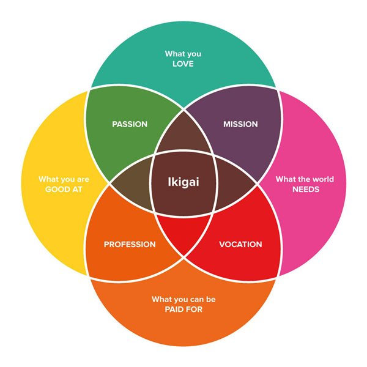

Returning to objective reality, we can define important and meaningful events. The example of water as entropy is again useful. Water as ice is a low entropy configuration where entropy is the number of ways the atoms can be arranged to create the form of ice. Imagine an ice cube melts into a liquid puddle. The more likely configuration of the puddle is an even circle in all directions. If we were able to follow a specific atom of water, H2O, for instance the atom in the top right corner of the cube, its journey to its place in the configuration of the puddle can take multiple paths. All that matters for the configuration is the position at some time. If that atom took an alternate path and another atom took the original atom's path, we would have a puddle with an indistinguishable form. The entropy of both puddles would be the same at that moment. Configurations with high entropy are common or likely events.

Unlikely events are rare configurations with a small number of paths. Some configurations have one path, one sequence of events, that lead to the arrangement. The meaningful and important events limit the number of possible configurations of matter. With an understanding of cause and effect we can determine which events are _necessary_ or the reason for a particular configuration. Our universe is like water in that existence has an incredible number of possible configurations, and we exist in this one.

Physicists say observers within a universe will experience it as infinite though it may be finite. Why do we live in this configuration? Perhaps there are multiple universes all existing at the same time. When the string of an instrument is plucked and vibrates the oscillation creates a wave in the air to create sound. If we could slow time to see the oscillation of the string clearly, the string's position would spend most of its time around the center and moving to the farthest distances the least number of times. There could be an incredible number of universes almost exactly like ours taking on the most likely configurations, vibrations towards the center. There are also those universes with rare configurations which would require an increasingly unlikely chain of events, unlikely but not impossible. In the infinity of time and space, if they are infinite, even the rarest probability will occur.

From the inside, our universe appears to be a deterministic state, each moment an effect dependent on the chain of prior causes. Our configuration is set, and we're living through it. The truth appears to be that we are in no more control of our futures than a single atom. Our path simply has an extremely complex number of configurations. Of course we desire certain arrangements more than others. There are universes with no conscious life. There are universes of conscious lives of intense suffering, greatness, flourishing. We have all evolved with drives and desires. We want some futures more than others. From an objective perspective our goals are all simply states of events no better than another, but subjectively we work towards and hope for events which satisfy our needs and wants.

All we can really do is hope; hope we are in the universe which arranges our lives into a state we want. We can hope our actions and events outside of us are a part of the sequence of events which lead to a desired life, but we are powerless to create change within our universe. The chain of cause and effect from the big bang, the origin of our universe, appears to be unbroken. We are subjective finite beings with imagination. We can understand the moments which will likely lead to desired outcomes, but we can't change what's already in motion. The most random and unknown event already occurred at the big bang. The universe was compressed to a point in space but was not a perfect shape. If the atoms were perfectly aligned the forces of gravity and others would effect each part equally. There would be no swirl to the universe, so no stars, no planets, no life. It is because of imperfection that we exist at all.

Subjectively, we will feel as though we are making choices, but our choices are the result of information processing according to the laws of nature. Life appears to us to be based on probabilities, and we should choose the positions with the highest likelihood of achieving our goals.

## Every moment matters.

Is anything added to an event by it being remembered? What if a day in your life was completely forgotten by everyone including you? Does that change the meaning of the events? We often lose the exact feeling of a moment. Think of living in the moment as your _experiential self_. There is the way a situation feels in the moment and how that moment is stored in our memory. As we see with fitness beats truth, our memories are not accurate and more like vivid reconstructions. There are many moments that will be forgotten even before the end of your day. The only way for a moment to persist through time, to be remembered, is to make the moment meaningful, typically by having a strong emotional reaction. Otherwise the moment is lost in memory.

The more complex an environment, the more entropy it has. The more entropy the more possible sequences of paths lead to a state, the less certain we can be about the actual path. Every moment is meaningful because each moment is the _true path_ leading to the next. Out of all the astronomical possibilities each moment is the _ground truth_ of what happened. We are privileged to observe the moment, to live it. Future observers can only wonder and guess.

---

## Another Look at Epistemology and the Limits of Human Knowledge

In all this work I've yet to say much about the medium of communication itself: language. Linguistics is the study of language and worthy of its own endless field. My understanding of language is through the compression drive. Words are symbols which represent something. Repeated events are compressed in our minds which are attached to words. Where many animals have utterances with direct mapping to objective reality, humans have developed a language system and grammar which can produce infinite meaningful sentences. However, there is an obvious limitation in what can be expressed and understood with human language given that there are limits to our compression of experience as well as human perception of reality. This is a major challenge to any written or spoken answer to the meaning of life.

Many ancient thinkers have said the essence of life and reality is ineffable, indescribable, that we can only gain ultimate truth through direct experience. Direct knowledge as such cannot be shared intersubjectively only felt subjectively. Thus others can only be guided to the ineffable experience but not told explicitly. However, how do we justify or verify these experiences for accuracy? How do we show convergence towards some ultimate truth?

My answer to using language to describe or define the meaning of life is we should expand the scope of expressibility and granularity of our language as far as possible, asymptotically, while acknowledging the fallibility of our limitations. Yet this is another reason to grow artificial intelligence which can go beyond the limits of biological language.

As far as we can tell, even AI will reach limits. There are problems which are [undecidable](https://en.wikipedia.org/wiki/Undecidable_problem). There are statements within a formal system that cannot be proven true ([Gödel's incompleteness theorems](https://en.wikipedia.org/wiki/G%C3%B6del%27s_incompleteness_theorems)). Some computations are so complex they cannot be predicted but only run to see what happens next. This all a part of what makes life and the search so exciting. We continually find mysteries. We can forge ahead.

To which level of reality should we assign the most trust? Which is the most reliable?

The objective level is the essence of reality. It is independent of us. The closest we can get to this ground truth is through our sense organs. The objective level is the input layer to our minds. To give an example of our eyes, the objective level is light hitting the retina. The activation of the retina is the objective cause and effect. To interpret this sense input the brain and body make inferences in connected layers of information processing. Without this interpretation we are left with a base cause and effect, yet the input is the most _real_. As was argued, our systems are not designed to be deeply in touch with reality if we can even guess at the true nature of reality at all. We evolved for fitness. The best method we know of to go beyond our senses is science. We can seek to understand the data generation process of our input.

However one could argue that the prime contact we have is with our consciousness, the subjective level. While we can't be sure we are in touch with reality we can directly experience our minds. The only way we know anything exists at all is through conscious experience. As evolved creatures we cannot trust our senses and our interpretation beyond our senses are distortions of that input which reach our consciousness. We should doubt our most fundamental views and feelings. We can easily be led estray by ideas about information which is not accurate to reality. When our views conflict with the data we should adjust our views to the data. While we should respect our evolved tendencies as the products of billions of years of trial and error we should recognize this as entirely fallible. Our reactions may be optimal in one situation, but they can be wrong in a different context.

Intersubjective reality is the amalgamation of our subjective realities; the accumulation of our truths and falsehoods. Our subjective selves have an interdependence on the intersubjective. Intersubjectivity takes on an evolution of its own. Intersubjective life enables us to evolve at faster rates than our biological evolution would allow largely through unifying myths and stories. Our beliefs and behaviors achieve higher fitness. As we have seen higher fitness nearly implies illusions. Fitness maximization distorts the input.

Subjective minds receive new information which overturns their previous beliefs. Intersubjective beliefs, culture, allow us to access a broader range of data. When learning a new idea, it's almost like accessing an object from a database. The idea is a representation of accumulated empirical knowledge or constructed information. There is an advantage to a diverse culture in its ability to experience reality from multiple perspectives; they are able to solve more problems. The disadvantage is many perspectives can cause a deterioration of group cohesion. A homogeneous culture has the opposite advantages and disadvantages. While we might have a more coherent picture of reality with access to more data through society, there are numerous factors involved such as the reliability of the individuals. We may also be caught in an [evolutionarily stable strategy](https://en.wikipedia.org/wiki/Evolutionarily_stable_strategy). Intersubjective groups almost appear like self-similar [fractals](https://en.wikipedia.org/wiki/Fractal) of subjective individuals.

Certainly all aspects of reality are useful, but to which should we hold prime? With the goal of objectivity and truth, we should assign our levels of trust in reality in this order: objective, subjective, and intersubjective.

---

# Conclusion

The objective meaning of life is to resist entropy, the inevitable dispersal of energy. We are the types of entities which emerge under complex conditions and evolve. We are exactly the type of creatures we would expect to see given enough time and the pressure of selection. Creatures which replicate and maintain their form in opposition to entropy are what survives and continues. Not only does life resist entropy, the tendency of energy to breakdown from order to disorder, but life grows information. Life exists in out of equilibrium systems where solid matter (embodied information) can be recombined to form new information. Following this progression to its end, the objective meaning of life is to maintain and grow order where the optimal achievement would be the out of equilibrium system which allows the greatest manipulation of memory (solid matter) into new forms of information by computation. While humans may be near the biological limits of computation, we can expand beyond ourselves into artificial intelligence with capacities we can only begin to imagine.

The universe we exist in appears to be a chain reaction from a fraction of a moment after the beginning of the universe. The next moment is a function of the current moment. A future moment can likely only be determined by the passage of each moment to that moment, that is, things must play out and cannot be fully predetermined. Our universe may just be one data point in a probability distribution of possible universes, a multi-verse. Perhaps given the infinity of time everything that can happen will happen with the most common chances occurring most often.

The personal meaning of life is for all intelligent beings to compress their experiences, process the present, and predict the future with efficiency. Emerging from the objective meaning of life, we can only hope our lives develop in a way we desire. Our bodies are imbued with incredibly dense information from the structure and function of every cell to DNA. Every cell division is the trapping and growing of energy to information. Whether we are able to influence and control our lives and environment is dependent on varying levels of random luck. However, as finite, subjective creatures we feel as though we have choice. The best action we can take is to put ourselves in probabilistically successful positions. Each intelligent being has an individual meaning of life due to their own unique history of experience and their interaction with their environment. Currently, each individual must find their own meaning in life, because they are each in direct access to their own experiences. Where change is desired, the environment should be altered to enable optimization for a new path. We are what we do. We are the experiences we have. Our brains and bodies change according to our activities. If we want to be something, we must embody it in action.

### Given what we know about the brain as a prediction engine, there is deep insight in the statement: _the meaning of life is to experience what happens next!_

A quote often attributed to Albert Camus, "The literal meaning of life is whatever you're doing that prevents you from killing yourself." The meaning of life is what keeps you going. Life is as full of meaning as we want or make.

The intersubjective meaning of life is to support sustainable flourishing. Just as the previous levels, intersubjective life traps and grows information. The intersubjective level is subject to its own laws of communication and survival. The ideas and values of a society directly impact the society's energy return on investment and the survival of the population. In this way intersubjective ideologies are subject to natural selection. Intersubjective meaning is the least accurate because it is based on subjective experiences which are themselves formed for function instead of truth. Intersubjective reality is a distortion of a distortion of objective reality, but its effects have real consequences.

All of the meanings of life can be enhanced through the proper development of artificial intelligence. An AI entity could grow to surpass us in all areas, maintaining structure, information processing, prediction, correction, conscious experience, etc. If we want to contribute to a living being beyond our biological selves and psychological egos, an AI entity is what we should direct our energy to.

---

AGI researcher [Pei Wang proposes 4 basic questions of AI](https://www.iiim.is/2010/05/questions-about-artificial-intelligence/):

- What is AI?
- Can AI be built?
- How to build AI?
- Should AI be built?

In large part, I hope to answer and give valid or strong arguments for questions 1, 2, and 4. How to build AI is a technical question of active research. We should try multiple approaches. To briefly summarize, intelligence is about making decisions. AI is machines made to decide. AI can be built on this definition and theoretical bases. The most important argument of this work is AI _should_ be built. Are you convinced?

---

### IkigAI

Returning to ikigai, we can provide a framework of how to direct our lives.

{:refdef: style="text-align: center;"}

{:refdef }

We can reformulate these 4 questions in relation to the creation of an artificial superintelligence.

1. What do I love to do _that supports AI_?
2. What am I good at _for growing AI knowledge and know-how_?
3. What does the world need _to be closer to AI_?
4. What can I be paid for _in contributing to AI_?

We can call this _ikigAI_. The more direct relationship your ikigAI is to artificial general intelligence the more aligned you are with the meaning of life. How can you **uniquely** contribute?

---

We come from nothing, and we will return to nothing. From star dust to star dust.

# What will you do with your cosmically brief time? What information will you embody?

For further developments on this foundation, please see [Society 3.0](/society3/)

---

{:refdef: style="text-align: center;"}
[Part 9](/meaningOfLife_8/) • [Read the full text on one page](/meaningOfLife/)
{:refdef }
