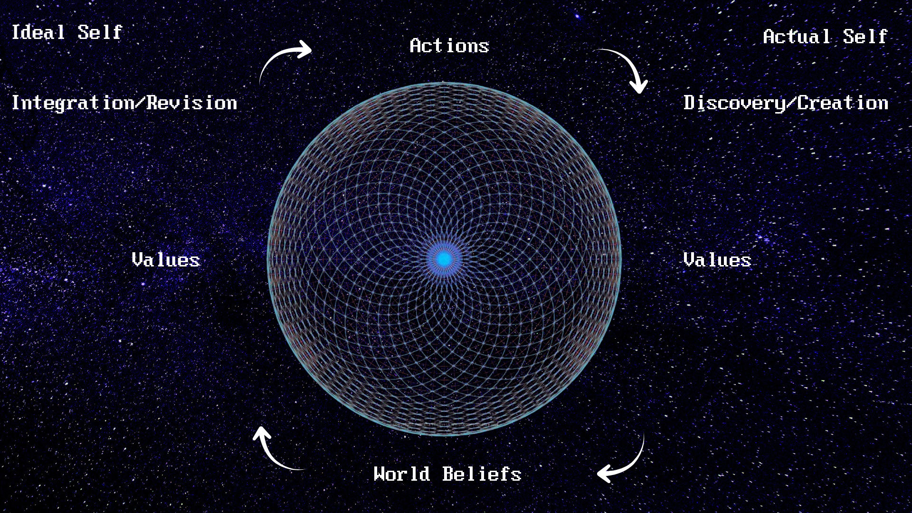

Dr. Paul Musso of Rutgers University developed the concept of a micro-philosophy, the minimum number of questions a person should answer to have their own philosophy to live by. He identifies three main pillars: 

- World beliefs: What the world is like and how you relate to it.
- Values: Which things are valuable in the world.
- Ethics: How you should act with respect to what is valuable.

With just these you can have a personal, practical philosophy to live in alignment with. Naturally we all have these beliefs, but we aren't all aware of it. He designed an online course to bring philosophy to the masses. 

I took this course in the fall of 2025 to clarify my own beliefs. Recently my beliefs have evolved to the point where I deeply questioned my previous philosophy. I wrote about the meaning of life in a way my friends described as a “book” or “thesis.” I like the minimalist philosophy especially as it comes to ideas to get at the essential nature of a view. Dr. Musso says once you have a micro-philosophy you can expand it to a macro-philosophy. 

Not only for these reasons, but I realized this sly dog was monetizing philosophy! Hey, I want to do that! How is he doing it? I also generally like to support philosophers in their endeavors. For the low, low price of $99 I now have lifetime access to the course. I was part of the very first cohort to go through. Paul is only improving the course with feedback. He’s now adding videos to go along with the written lessons in addition to a journal you can complete, your own philosophy book. For me the price was worth it to have the one-on-one chat with the Musso himself. He’s a super nice guy who genuinely cares about his students.

I should say I’m not affiliated with this course or anything. There’s no monetary kickbacks to me so far. I was drawn to Paul by his substack writing. You can view [his articles here](https://substack.com/@paulmusso). He describes the [micro-philosophy framework](https://themicrophilosopher.substack.com/p/micro-philosophy-20-major-update?utm_source=profile&utm_medium=reader2) in detail and you can see how his ideas evolved. This will give you a good idea if the course is for you. He also offers a free course on Stoicism and Marcus Aurelius. The [course cost is changing](https://stan.store/paulmussophilosophy), but it could very well be worth it to you.

Generally the course is structured into four parts. I’ll say it really felt like a philosophy course. I graduated with my bachelor's in philosophy in 2012. Every once in a while I really itch to do some philosophizing. This course scratches that. Your head might hurt with all the thinking and reflecting you will do - mine sure did!

## The birth view analysis

This is the preparation for understanding your world view. It’s essentially the world view you were raised in. To me this was one of the more interesting parts of taking the course with the cohort. Everyone is sharing the background of their lives. There’s a range of people, but many are older which comes with a wealth of experience. You also have to wonder how much your views are inherited or truly your own.

## World beliefs

People need to have beliefs about the world to live and act in it. “A worldview is a collection of someone or some group of people’s fundamental beliefs and assumptions about reality, value, morality, the self, time, space, and other related topics.”

A part of what makes this course so interesting, surprising, and well worth the price is the prompts developed by Dr. Musso. These are some of the best structured prompts I’ve ever seen, let alone for philosophy. The prompts cover a huge range of the ideas of philosophy, often 250+ of terms, actions, etc. The LLM of your choice becomes an interviewer assisting you in thinking and learning about your world view and all of the pillars and assignments. 

What many people who want to get into philosophy might worry about is how daunting the breadth and depth of the field is. Dr. Musso says he sees himself as a cartographer making a map of philosophy for people to navigate. You aren’t just grabbing random perspectives you come across but getting a real sense of the entire territory. Rest assured you will cover a lot of ground and know where your values are.

## Values

“Values take a bland and lifeless description of the world and animate it. Values light up certain things, people, and activities as desirable and worth pursuing…But, knowing or believing that certain things are valuable doesn't yet tell us how to live or what to do.”

I find this to be one of the most important parts of the course. Your values color your world. It’s here I will get into atomic beliefs as presented in the course. This structure provides great detail of your beliefs and also shows your opposition.

Proton: the positive statement of your belief.
Neutron: the clarifying definitions of terms in your proton.
Electron: the opposing beliefs your proton implies you reject.

I really like this style of definition as it not only helps you succinctly clarify your position, give separate space for complex terms, and you can see the opposing perspectives you’re against. This kind of juxtaposition brings greater awareness. You may have felt you disagreed with a view, but you didn’t know exactly why. This helps define your beliefs more.

## Ethics

Ethics are the actions you take to realize those values and principles through act-types and act-tokens. This is actually more of Dr. Musso’s specific background, ethics and action. The goal here is to build the framework that connects your values to the actions you take in the world, your daily life, as supported by your world beliefs. You determine your guiding principles and relate these to things you actually do in your real life. 

Dr. Musso didn’t add this to the course yet, but I’m pushing him to. You can take the micro-philosophy you’ve built and plug that into a LLM as well. It shouldn’t replace your moral reasoning at all, but you immediately have a philosophical sparring partner to discuss any choices you want to make. This partner has read and remembered every word and will help you think through problems and give an analysis.

With all of this said I’ll include a summary of my micro-philosophy along with [a link to my website](/micro-philosophy/) where you can view the whole thing in detail if you wish. My philosophical views are continuing to grow, so be on the lookout for major updates!

## Summary

At the core of my philosophy is consciousness. My world beliefs center around consciousness, free-will, and evolution. The world is made of consciousness which we plug our spirit into. Our spirit interfaces with the world through the soul, a combination of the astral and etheric. This is analogous to a player, a controller, and the game. The spirit is a divine fractal of the creator which gives us the feelings of subjective consciousness. Without spirit I'm unsure if there is "something it is like to be" a living thing. This is our source of qualia. This source of consciousness is outside the universe as we know it, so it is difficult and potentially impossible to define or understand within our context. At the same time we readily have access to it through our awareness.

My current axioms are similar to those put forward by Thomas Campbell who I'm currently heavily influenced by among others like Tom Montalk. The universe tends towards entropy, disorder, but life tends towards syntropy, order. Life increases entropy to increase complexity where that is more parts and more connections between those parts. There are also other factors to consider in complexity and order such as truth, evolutionary fitness, sustainability, values, etc. Evolution is a formal, purpose-driven process directed by the choices of consciousness.

What I was pleasantly surprised to find is how synergistic my world beliefs and values are. My listed five values are conscious experience, wisdom, benevolence, connection, and dignity. The source of value is the subjective feelings of consciousness. Wisdom is overcoming or avoiding problems before you face them. It's also overcoming self-deception and seeing the world clearly. This helps benevolence which is to maximize good and minimize harm. Connection is the foundation for further growth and complexification. Justice is valuing the dignity of another being and acting in moral fairness toward them.

My values lead to an ethical framework to take action. Valuing conscious experiences leads to activities that enrich subjective feeling, awareness, and flourishing. I do breathwork, meditate, learn, practice skills, and contemplate. I actively increase my wisdom and share it with others. Wisdom is worth continuing to investigate. A nice, short way to think of it is the square root of experience. I love John Vervaeke's definition of wisdom which is going towards optimal balance of rational systems and tools to overcome self-deception. Often wisdom is a good for its own sake. Sharing wisdom is one way to increase benevolence. This increases syntropy. I create content, engage in discussion, and act kindly and professionally with my work. Connection with others synergizes with the other values as we can share and increase in conscious experience, being good to each other, meeting each others' needs, and sharing wisdom. Connection is a fundamental need for human beings as well as a value in itself. A focus on justice as an upheld value leads to more benevolent connection and reinforces the primary value placed on conscious experience.

I continue to learn about consciousness. As an operational definition consciousness generates a range of possibilities and is that which actualizes a possibility. From the space of possibilities consciousness chooses and biases the world to bring that choice into existence. As the universe is consciousness which we interact with it is consciousness interacting with consciousness.

Overall this exercise has helped me clarify my beliefs and given me a starting point to develop a macro-philosophy. I enjoy thinking about these fundamental and essential questions to live by. I will likely refine them over the years.
