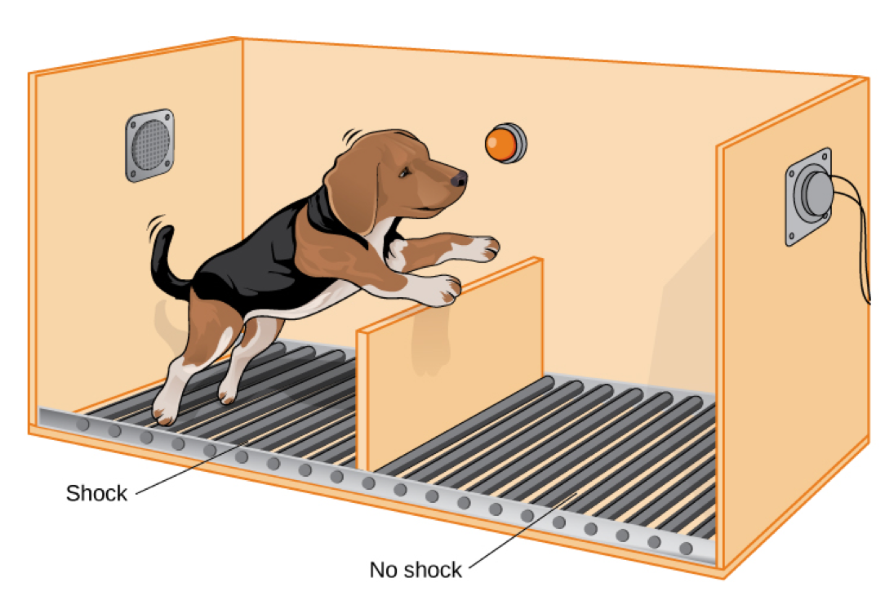

# A collection of rules, strategies, and concepts to lead a successful life.

Things I want to remind myself of and never forget.
---

[Expand your stress management toolkit by mastering these four strategies for coping with stress: avoid, alter, accept and adapt.](https://www.mayoclinic.org/healthy-lifestyle/stress-management/in-depth/stress-relief/art-20044476)

### Avoid
- Take control of your surroundings
- Avoid people who bother you.
- Learn to say no
- Ditch part of your to-do list

However, some problems can't be avoided. For those situations, try another technique.

### Alter
One of the most helpful things you can do during times of stress is to take inventory, then attempt to change your situation for the better.

- Respectfully ask others to change their behavior. And be willing to do the same. Small problems often create larger ones if they aren't resolved. If you're tired of being the target of a friend's jokes at parties, ask him or her to leave you out of the comedy routine. In return, be willing to enjoy his or her other jokes and thank him or her for humoring you.
- Communicate your feelings openly. Remember to use "I" statements, as in, "I feel frustrated by shorter deadlines and a heavier workload. Is there something we can do to balance things out?"
- Manage your time better. Lump together similar tasks — group your phone calls, car errands and computer-related tasks. The reward of increased efficiency will be extra time.
- State limits in advance. Instead of stewing over a colleague's nonstop chatter, politely start the conversation with, "I've got only five minutes to cover this."

### Accept
Sometimes we may have no choice but to accept things the way they are. For those times try to:

- Talk with someone. You may not be able to change a frustrating situation, but that doesn't mean your feelings aren't legitimate.
- Forgive. It takes energy to be angry. Forgiving may take practice, but by doing so you will free yourself from burning more negative energy. Why stew in your anger when you could shrug and move on?
- Practice positive self-talk. It's easy to lose objectivity when you're stressed. One negative thought can lead to another, and soon you've created a mental avalanche. Be positive. Instead of thinking, "I am horrible with money, and I will never be able to control my finances," try this: "I made a mistake with my money, but I'm resilient. I'll get through it."
- Learn from your mistakes. There is value in recognizing a "teachable moment." You can't change the fact that procrastination hurt your performance, but you can make sure you set aside more time in the future.

### Adapt
Thinking you can't cope is one of the greatest stressors. That's why adapting — which often involves changing your standards or expectations — can be most helpful in dealing with stress.

- Adjust your standards. Do you need to vacuum and dust twice a week? Would macaroni and cheese be an unthinkable substitute for homemade lasagna? Redefine success and stop striving for perfection, and you may operate with a little less guilt and frustration.
- Practice thought-stopping. Stop gloomy thoughts immediately. Refuse to replay a stressful situation as negative, and it may cease to be negative.
- Reframe the issue. Try looking at your situation from a new viewpoint.
- Adopt a mantra. Create a saying such as, "I can handle this," and mentally repeat it in tough situations.
- Create an assets column. Imagine all of the things that bring you joy in life, such as vacation, children and pets. Then call on that list when you're stressed. It will put things into perspective and serve as a reminder of life's joys.
- Look at the big picture. Ask yourself, "Will this matter in a year or in five years?" The answer is often no. Realizing this makes a stressful situation seem less overwhelming.

---

# [Learned helplessness](https://en.wikipedia.org/wiki/Learned_helplessness)

{:refdef: style="text-align: center;"}

{: refdef}

"In Part 1 of this study, three groups of dogs were placed in harnesses. Group 1 dogs were simply put in a harnesses for a period of time and were later released. Groups 2 and 3 consisted of "yoked pairs". Dogs in Group 2 were given electric shocks at random times, which the dog could end by pressing a lever. Each dog in Group 3 was paired with a Group 2 dog; whenever a Group 2 dog got a shock, its paired dog in Group 3 got a shock of the same intensity and duration, but its lever did not stop the shock. To a dog in Group 3, it seemed that the shock ended at random, because it was their paired dog in Group 2 that was causing it to stop. Thus, for Group 3 dogs, the shock was "inescapable".

In Part 2 of the experiment the same three groups of dogs were tested in a shuttle-box apparatus (a chamber containing two rectangular compartments divided by a barrier a few inches high). All of the dogs could escape shocks on one side of the box by jumping over a low partition to the other side. The dogs in Groups 1 and 2 quickly learned this task and escaped the shock. Most of the Group 3 dogs – which had previously learned that nothing they did had any effect on shocks – simply lay down passively and whined when they were shocked.

In a second experiment later that year with new groups of dogs, Overmier and Seligman ruled out the possibility that, instead of learned helplessness, the Group 3 dogs failed to avert in the second part of the test because they had learned some behavior that interfered with "escape". To prevent such interfering behavior, Group 3 dogs were immobilized with a paralyzing drug (curare), and underwent a procedure similar to that in Part 1 of the Seligman and Maier experiment. When tested as before in Part 2, these Group 3 dogs exhibited helplessness as before. This result serves as an indicator for the ruling out of the interference hypothesis.

From these experiments, it was thought that there was to be only one cure for helplessness. In Seligman's hypothesis, the dogs do not try to escape because they expect that nothing they do will stop the shock. To change this expectation, experimenters physically picked up the dogs and moved their legs, replicating the actions the dogs would need to take in order to escape from the electrified grid. This had to be done at least twice before the dogs would start willfully jumping over the barrier on their own. In contrast, threats, rewards, and observed demonstrations had no effect on the "helpless" Group 3 dogs.

Later experiments have served to confirm the depressive effect of feeling a lack of control over an aversive stimulus. For example, in one experiment, humans performed mental tasks in the presence of distracting noise. Those who could use a switch to turn off the noise rarely bothered to do so, yet they performed better than those who could not turn off the noise. Simply being aware of this option was enough to substantially counteract the noise effect. In 2011, an animal study found that animals with control over stressful stimuli exhibited changes in the excitability of certain neurons in the prefrontal cortex. Animals that lacked control failed to exhibit this neural effect and showed signs consistent with learned helplessness and social anxiety."

---

[Can you control your own luck? | Richie Etwaru | TEDxMorristown](https://www.youtube.com/watch?v=ncZoNORFDGs&t=329s)

He believes we control 80% of our luck and 20% we don't. We need to put ourselves into positions that maximize our luck.

Good luck = risk + effort

Risk can be an addiction.

The best advice you get is when someone says to you, "you know what your problem is? ____" Lol.

Bad luck = risk + no effort

So:

Good luck:
- Risk & effort
- High % failure
- Success benefits you & others
- Feeds our ambitions

Bad luck:
- Risk & no effort
- Low % failure
- Success benefits only you
- Feeds our sense of invincibility
