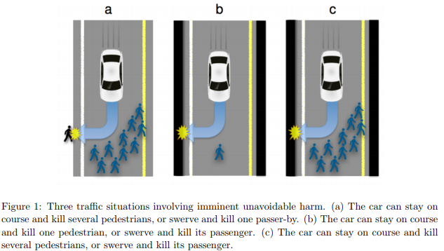

# Two Solutions to the Trolley Problem for Self Driving Cars

Imagine you're standing next to a lever near train tracks. The tracks split, where one side is being built by five workers and the other has just one worker making some final touches. You notice a runaway trolley careening towards the five workers, but all workers are unaware. Here are the things you know with certainty:
- If you pull the lever, the trolley will be diverted to the track with one worker.
- Whichever track the trolley goes down it will kill all workers on that track, either the one or the five.
- There's no time to warn them or anyone else.

Your only choice is whether or not to pull the lever. Do you do nothing and allow the trolley to hit and kill the five workers or do you actively flip the lever, taking part in the death of the one worker on the other track?

Whether or not you've heard this problem before, I invite you to consider it again. Picture your hand around the lever. It's a lever you've pulled many times with a hairline trigger. If you just gently squeeze your fingers the train tracks will switch. You can see the workers focused on the task at hand to the exclusion of their surroundings. What, now, do you do?

This is the trolley problem.

## Not just a thought experiment

Although this is an abstract thought experiment, there are analogous situations in real life. Consider harvesting organs from dying organ donors. Suppose a doctor gets called into the ER for a particularly bad motorcycle accident. The patient is a young person in otherwise good health, but from the description of his injuries, the doctor knows that if he runs across the hospital he can save the person and restore them to perfect health. However, if he simply walks to the patient, the doctor knows he will die from his injuries. At that point, it is a certainty that he could harvest the person's organs, preserve them, and they will be used to save via transplant seven other lives. Should the doctor walk or run? What about a pilot who must perform an emergency landing in a crowded city, but the pilot could steer the plane to a less populated area?

## Autonomous vehicles and the trolley problem

On the precipice of autonomous vehicles, we're facing this problem again, and now we need a programmed solution. [Olivia Goodhill at Quartz](https://qz.com/536738/should-driverless-cars-kill-their-own-passengers-to-save-a-pedestrian/) puts the problem like this, "Imagine you’re in a self-driving car, heading towards a collision with a group of pedestrians. The only other option is to drive off a cliff. What should the car do?" In this case, now it is **you** that needs to be sacrificed!

In the paper ["Autonomous Vehicles Need Experimental Ethics: Are We Ready for Utilitarian Cars?"](https://arxiv.org/pdf/1510.03346v1.pdf), Bonnefon et al described three objectives which "moral algorithms" would need to meet:
- being consistent
- not causing public outrage
- not discouraging buyers

{:refdef: style="text-align: center;"}

{: refdef}

A [utilitarian](https://plato.stanford.edu/entries/utilitarianism-history/) approach would have the car save the most number of people every time. However, utilitarianism doesn't really help us decide in case b where both are single individuals who generically carry the same moral worth. If we choose to favor the driver, we inherently have a classist bias as those people who can afford self driving cars will ultimately be safer. Additionally, the drivers would then be choosing to create a danger for pedestrians for the sake of their transportation. From the [Quartz article](https://qz.com/536738/should-driverless-cars-kill-their-own-passengers-to-save-a-pedestrian/),
>Helen Frowe, a professor of practical philosophy at Stockholm University, who has given a series of lectures on the Trolley Problem, says self-driving car manufactures should program vehicles to protect innocent bystanders, as those in the car have more responsibility for any danger.

>“We have pretty stringent obligations not to kill people,” she tells Quartz. “If you decided to get into a self-driving car, then that’s imposing the risk.”

Of course there are all kinds of tweaks to this problem. What if there are children as pedestrians or in the car with the passengers? What if you have to choose between [a baby and a grandma](https://www.technologyreview.com/s/612341/a-global-ethics-study-aims-to-help-ai-solve-the-self-driving-trolley-problem/)? If only there was some way to assign a value to a person's worth as a human being...

## Enter China's rating system.

Oh wait, there's an app for that. It's called [WeChat](https://qz.com/1167024/all-the-things-you-can-and-cant-do-with-your-wechat-account-in-china/).

WeChat was a simple messaging app that grew into a powerful conglomerate enabling messaging, social media, banking information, direct ties to government databases, and much more. A soon to be added sweet app feature is [The Social Credit System](https://en.wikipedia.org/wiki/Social_Credit_System) which is planned to be mandatory for all Chinese citizens in 2020. The online social credit system will encompass nearly all data generated by citizens and privacy is not a concern.

As [Rachel Botsman from Wired](https://www.wired.co.uk/article/chinese-government-social-credit-score-privacy-invasion) describes,
> What if there was a national trust score that rated the kind of citizen you were?

> Imagine a world where many of your daily activities were constantly monitored and evaluated: what you buy at the shops and online; where you are at any given time; who your friends are and how you interact with them; how many hours you spend watching content or playing video games; and what bills and taxes you pay (or not). It's not hard to picture, because most of that already happens, thanks to all those data-collecting behemoths like Google, Facebook and Instagram or health-tracking apps such as Fitbit. But now imagine a system where all these behaviours are rated as either positive or negative and distilled into a single number, according to rules set by the government. That would create your Citizen Score and it would tell everyone whether or not you were trustworthy. Plus, your rating would be publicly ranked against that of the entire population and used to determine your eligibility for a mortgage or a job, where your children can go to school - or even just your chances of getting a date.

Well, your phone which would be linked to your Citizen Score which could be linked to your self-driving car would now give you a rating of your worth as a citizen, which is really one of the most data-driven ratings we could hope to have...

## Okay, okay. Bear with me here:

Part of why the utilitarian approach is gridlocked in the case of either the passenger or the pedestrian is because we don't know which is the greater good. However, with Citizen Scores we can have a numerical rating which is a direct relation to how good a citizen is for society.

So we can turn this into a simple if-else statement.

If we can know the Citizen Score of the pedestrian, likely through sensor data in a smart, connected city, the self-driving car would be able to compare the two scores and kill whoever has the smaller score, preserving whoever has the better score. Thus, we have a clear and largely objective decision for the problem. It is also robust to groups of pedestrians or passengers - simply add up the Citizen Scores of both groups and compare.

What if we aren't so connected to the pedestrians? In these situations, we might not have the time needed to request the Citizen Score of the pedestrians in the network. Another method to do the most good would be to constantly have the average Citizen Score of that zipcode compared against the known scores of the passengers. For each pedestrian, they're assumed to have the average Citizen Score of that area.

While we would make the wrong decision in some cases due to inaccuracy in the quick scoring of the pedestrians, it will generally be correct. This could have the unintended affect of causing more segregation as lower score citizens could avoid traveling in high scoring areas. Now that I think about it, maybe basing this on a government system which can be terribly exploited to control and dominate the behavior of an entire population of over 1 billion people isn't the best way to assess the moral worth of a person.

And what about when the Citizen Score sums are equal? What do we choose then?

## Second solution: Randomness - One line of code

In the case of scores being equal, I propose we choose randomly. This is easily done by computers all the time using random number generators. We have algorithms which can generate a one or a zero, passengers or pedestrians.

Actually, with competing ethical theories which have raged against each other for hundreds to thousands of years, with decisions being made by the elite in society (the government or private industry titans) or judged by its general acceptability to society, we allow overlooked assumptions and deep biases to be further built into the structure of our world. Whichever system wins creates a privileged and benefiting group.

Maybe we should forego any complex calculations and let machines do what only machines can do, make a choice free from bias.

In the trolley problem, we never expect the human holding the lever to be completely free of a moral lens or able to choose randomly. In machines, we can [quantify randomness](https://en.wikipedia.org/wiki/Randomness_tests). Perhaps we can find solace in this cruel and rare circumstance that the accident was a matter of bad luck and the developers and policy-makers of self-driving cars are humble enough to admit they don't know what the best choice is.

## Solution Conclusion

The trolley problem is not really about investigating human worth, it is largely about the distinction of [doing versus allowing harm](https://plato.stanford.edu/entries/doing-allowing/). Randomness ensures that no one is completely satisfied (except moral chaos theorists who think all moral choices should be random) or privileged. However, these problems are still hypothetical edge cases, and there are many more pressing moral issues that self-driving vehicles force us to reckon with. As [philosophy professor Patrick Lin reports to Quartz](https://qz.com/1204395/self-driving-cars-trolley-problem-philosophers-are-building-ethical-algorithms-to-solve-the-problem/):
> There are concerns about advertising (could cars be programed to drive past certain shops shops?), liability (who is responsible if the car is programmed to put someone at risk?), social issues (drinking could increase once drunk driving isn’t a concern), and privacy (“an autonomous car is basically big brother on wheels,” Lin said.) There may even be negative consequences of otherwise positive results: If autonomous cars increase road safety and fewer people die on the road, will this lead to fewer organ transplants?

The moral focus of our energy should be on the issues which will have the greatest impact. Or as [Ian Bogost](https://www.theatlantic.com/technology/archive/2018/03/got-99-problems-but-a-trolley-aint-one/556805/) puts the obsession with the trolley problem:
> But that scenario is years away, if it ever comes to pass. In the meantime, citizens, governments, automakers, and technology companies must ask harder, more complex questions about the moral consequences of robocars today, and tomorrow. It’s time to put the brakes on the trolley before it runs everyone down.

---

_I am grateful to Sarah Tsou for our fruitful dialogues on this topic._
