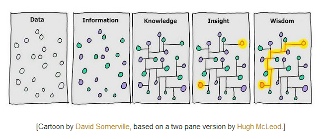

# Wisdom

To define wisdom simply, I suggest wisdom is knowledge that helps you avoid mistakes before you make them. Wisdom helps you choose a better path. It is often hard earned because someone needs to make the mistakes to find insight on what caused problems and how to avoid or overcome them.

---

_Excerpt from the [meaning of life](/meaningOfLife/)_

{:refdef: style="text-align: center;"}

{:refdef}

I really like this comic for how intuitively it explains data, information, knowledge, insight, and wisdom. Data is objective reality, what exists as it is. Information is _the difference that makes a difference_. With the realization of colors we can see two distinct groups. Knowledge is embodied information about information, connecting information in a meaningful (cause and effect) way. Insight is a previously unknown connection in the data/knowledge. Wisdom is knowledge and understanding of the insight.

---

The [Stanford Encyclopedia of Philosophy entry on wisdom](https://plato.stanford.edu/entries/wisdom/) offers 5 approaches to wisdom:  (1) wisdom as epistemic humility, (2) wisdom as epistemic accuracy, (3) wisdom as knowledge, (4) a hybrid theory of wisdom, and (5) wisdom as rationality.

(1) "Humility theories of wisdom are not promising, but they do, perhaps, provide us with some important character traits associated with wise people. Wise people, one might argue, possess epistemic self-confidence, yet lack epistemic arrogance. Wise people tend to acknowledge their fallibility, and wise people are reflective, introspective, and tolerant of uncertainty. Any acceptable theory of wisdom ought to be compatible with such traits. However, those traits are not, in and of themselves, definitive of wisdom."

(2) "Perhaps wise people restrict their confidence to propositions for which they have knowledge or, at least, to propositions for which they have excellent justification...It should be noted, however, that although accuracy theories do not provide an adequate account of wisdom, they reveal an important insight. Perhaps a necessary condition for being wise is that wise people think they have knowledge only when their beliefs are highly justified. Or, even more simply, perhaps wise people have epistemically justified, or rational, beliefs."

(3) "Wisdom as Knowing How To, and Succeeding at, Living Well (KLS):

S is wise iff (i) S knows how to live well, and (ii) S is successful at living well."

"Although giving an account of what it means to know how to live well may prove as difficult a topic as providing an account of wisdom, Nozick provides a very illuminating start.

Wisdom is not just one type of knowledge, but diverse. What a wise person needs to know and understand constitutes a varied list: the most important goals and values of life – the ultimate goal, if there is one; what means will reach these goals without too great a cost; what kinds of dangers threaten the achieving of these goals; how to recognize and avoid or minimize these dangers; what different types of human beings are like in their actions and motives (as this presents dangers or opportunities); what is not possible or feasible to achieve (or avoid); how to tell what is appropriate when; knowing when certain goals are sufficiently achieved; what limitations are unavoidable and how to accept them; how to improve oneself and one's relationships with others or society; knowing what the true and unapparent value of various things is; when to take a long-term view; knowing the variety and obduracy of facts, institutions, and human nature; understanding what one's real motives are; how to cope and deal with the major tragedies and dilemmas of life, and with the major good things too."

(4) "One way to try to accommodate the various insights from the theories considered thus far is in the form of a hybrid theory. One such idea is:

S is wise iff

S has extensive factual and theoretical knowledge.

S knows how to live well.

S is successful at living well.

S has very few unjustified beliefs.

...

There is, however, a very serious problem with the Hybrid Theory. Since so much of what was long ago considered knowledge has been abandoned, or has evolved, a theory that requires truth (through a knowledge condition) would exclude almost all people who are now long dead..."

(5) "Deep Rationality Theory (DRT):

S is wise iff

S has a wide variety of epistemically justified beliefs on a wide variety of valuable academic subjects.

S has a wide variety of justified beliefs on how to live rationally (epistemically, morally, and practically).

S is committed to living rationally.

S has very few unjustified beliefs and is sensitive to her limitations."
